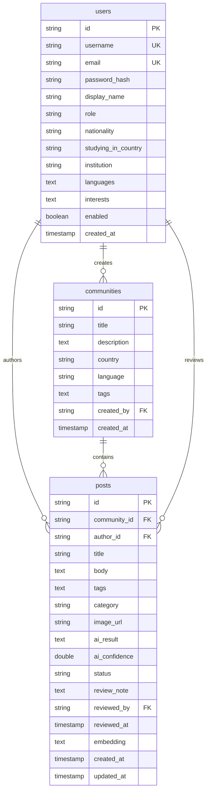

# Global Buddy 数据库结构

## 1. 用户表 (users)

| 字段名 | 类型 | 约束 | 描述 |
|--------|------|------|------|
| id | VARCHAR(36) | PRIMARY KEY | 用户唯一标识符 |
| username | VARCHAR(255) | UNIQUE, NOT NULL | 用户名 |
| email | VARCHAR(255) | UNIQUE, NOT NULL | 邮箱地址 |
| password_hash | VARCHAR(255) | NOT NULL | 密码哈希值 |
| display_name | VARCHAR(255) | NOT NULL | 显示名称 |
| role | ENUM('USER', 'ADMIN') | NOT NULL, DEFAULT 'USER' | 用户角色 |
| nationality | VARCHAR(255) | NOT NULL, DEFAULT '' | 国籍 |
| studying_in_country | VARCHAR(255) | NOT NULL, DEFAULT '' | 留学国家 |
| institution | VARCHAR(255) | | 所在学校 |
| languages | TEXT | | 语言列表 (JSON 格式) |
| interests | TEXT | | 兴趣爱好 (JSON 格式) |
| enabled | BOOLEAN | NOT NULL, DEFAULT TRUE | 账户是否启用 |
| created_at | TIMESTAMP | | 创建时间 |

## 2. 社区表 (communities)

| 字段名 | 类型 | 约束 | 描述 |
|--------|------|------|------|
| id | VARCHAR(36) | PRIMARY KEY | 社区唯一标识符 |
| title | VARCHAR(255) | NOT NULL | 社区标题 |
| description | TEXT | | 社区描述 |
| country | VARCHAR(255) | NOT NULL | 国家 |
| language | VARCHAR(255) | | 语言 |
| tags | TEXT | | 标签列表 (JSON 格式) |
| created_by | VARCHAR(36) | FOREIGN KEY (users.id) | 创建者 |
| created_at | TIMESTAMP | | 创建时间 |

## 3. 帖子表 (posts)

| 字段名 | 类型 | 约束 | 描述 |
|--------|------|------|------|
| id | VARCHAR(36) | PRIMARY KEY | 帖子唯一标识符 |
| community_id | VARCHAR(36) | FOREIGN KEY (communities.id) | 所属社区 |
| author_id | VARCHAR(36) | NOT NULL, FOREIGN KEY (users.id) | 作者 |
| title | VARCHAR(255) | NOT NULL | 标题 |
| body | TEXT | NOT NULL | 内容 |
| tags | TEXT | | 标签列表 (JSON 格式) |
| category | VARCHAR(255) | | 分类 |
| image_url | VARCHAR(255) | | 图片 URL |
| ai_result | TEXT | | AI 审核结果 |
| ai_confidence | DOUBLE | | AI 置信度 (0.0 - 1.0) |
| status | ENUM('PENDING_REVIEW', 'APPROVED', 'REJECTED') | NOT NULL, DEFAULT 'PENDING_REVIEW' | 审核状态 |
| review_note | TEXT | | 审核备注 |
| reviewed_by | VARCHAR(36) | | 审核人 |
| reviewed_at | TIMESTAMP | | 审核时间 |
| embedding | TEXT | | 向量嵌入 |
| created_at | TIMESTAMP | | 创建时间 |
| updated_at | TIMESTAMP | | 更新时间 |

## 4. 关系图

