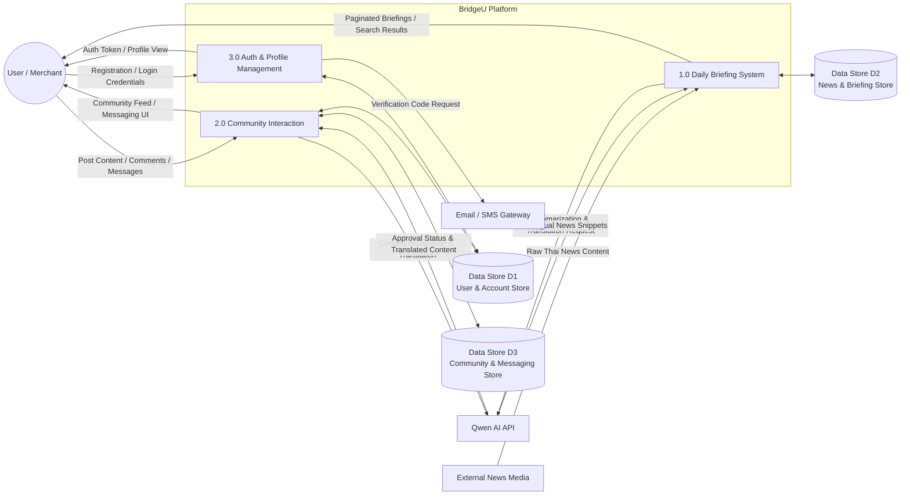
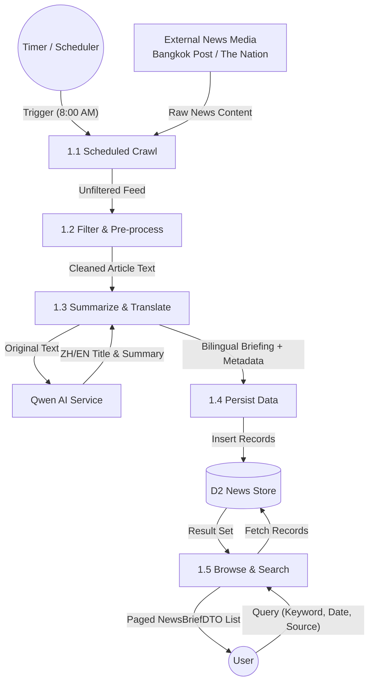
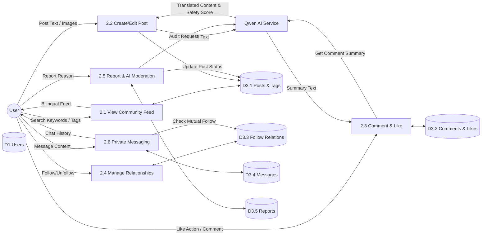
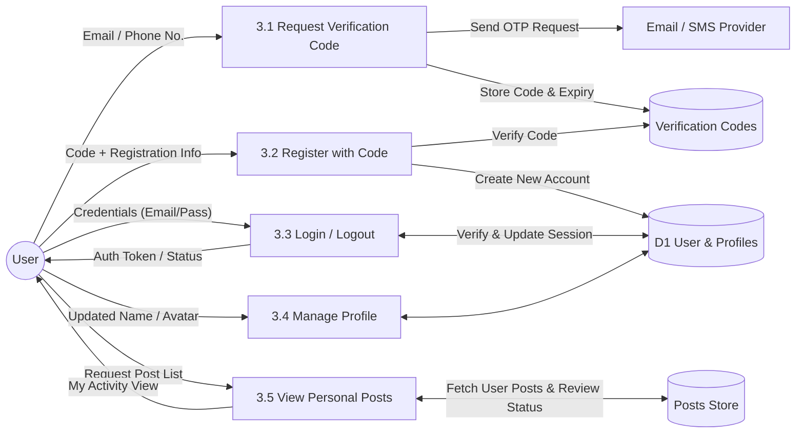
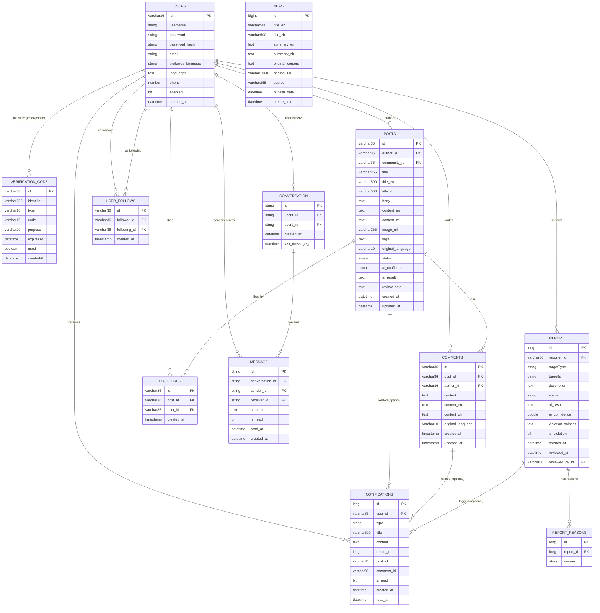

## BridgeU - Software Design Document (SDD) v2.0

**Version**: v2.0  
**Date**: 2026-02-06  

---

### 1. Introduction

#### 1.1 Purpose

This Software Design Document  summarizes how major features (Daily Briefing, Community, Private Messaging and Authentication) are realized in terms of architecture, data flow and database design, and serves as a bridge between the SRS and the implementation.

#### 1.2 System Overview

BridgeU is a bilingual web platform that helps international students in Thailand connect with each other and with local merchants.  
The platform provides three main capabilities:

- **Daily Briefing System** – automatically crawls Thai news from Google News, summarizes it using Qwen AI, and provides bilingual (Chinese / English) briefings.  
- **Community Interaction Platform** – a bilingual forum where users can create posts, comment, like, follow others and exchange private messages.  
- **Authentication & Profile Management** – secure user registration and login via email or phone, with profile and preference management for students, merchants and administrators.  

Internally the system is a standard web application: a Vue.js frontend communicates with a Spring Boot backend via REST APIs; data is stored in a MySQL 8 database; Qwen AI are used for translation, summarization and content moderation.

---

### 2. System Architecture

#### 2.1 Logical Architecture

- **Client (Web Frontend)**  
  - Built with Vue 3 and Element UI/Plus.  
  - Provides pages for login/registration, Daily Briefing, Community feed and details, messaging and user profiles.  
  - Uses `axios` to call backend REST APIs over HTTP/HTTPS.  

- **Application Server (Spring Boot Backend)**  
  - **Authentication & Authorization**: implemented with Spring Security and the `AppUser` entity; issues JWT tokens to authenticated users.  
  - **News Module**: crawls Thai news from Google News RSS, stores it in the `News` table, generates summaries and translations via Qwen AI, and exposes read‑only Daily Briefing APIs.  
  - **Community Module**: manages communities, posts, comments, likes, user‑follow relations and user reports, with AI‑assisted translation and moderation.  
  - **Messaging Module**: supports one‑to‑one private conversations between mutually following users.  
  - **Verification Module**: manages email / SMS verification codes for registration and password reset.  

- **Data Storage Layer (MySQL 8)**  
  - Stores all persistent data as normalized relational tables.  
  - Accessed via Spring Data JPA repositories.  

- **External Services**  
  - **Qwen AI** for summarization, translation and content safety review.  
  - **Email / SMS providers** for sending verification codes.  
  - **Google News RSS** as the primary news source for the Daily Briefing System.  

#### 2.2 Data Flow Diagram (DFD)

##### 2.2.1 Level 0 DFD – Overall System

This context diagram presents BridgeU at the highest level and shows how the three main processes interact with
external entities and **data stores**. External news content enters the system through **External News Media** and is
processed by **1.0 Daily Briefing System**. User‑generated content and messaging are handled by **2.0 Community Interaction**,
while registration, login and profile operations are handled by **3.0 Auth & Profile Management**.
The diagram also highlights the main data stores: **Data Store D1 (User & Account Store)**, **Data Store D2 (News & Briefing Store)**,
and **Data Store D3 (Community & Messaging Store)**, as well as external services such as **Qwen AI API** and the **Email/SMS Gateway**.

##### 2.2.2 Level 1 DFD – 1.0 Daily Briefing System

This diagram decomposes the **Daily Briefing System** into the internal pipeline implemented in the codebase.  
At **8:00 AM**, a scheduler triggers **1.1 Scheduled Crawl** to fetch raw news from external media sources.  
The system then runs **1.2 Filter & Pre‑process** to clean content and keep relevant items, and calls **Qwen AI** in  
**1.3 Summarize & Translate** to produce bilingual (ZH/EN) titles and summaries. The processed records are persisted by  
**1.4 Persist Data** into **D2 (News Store / `news` table)**. Finally, users query and browse results via **1.5 Browse & Search**  
(implemented by `NewsController`), which reads from the same data store and returns paginated `NewsBriefDTO` results.

##### 2.2.3 Level 1 DFD – 2.0 Community Interaction

This diagram describes how the **Community Interaction** module handles the full lifecycle of user‑generated content  
and how each process reads/writes different data stores.  
- **2.1 View Community Feed** queries **D3.1 Posts & Tags** and returns a bilingual feed to the user.  
- **2.2 Create/Edit Post** submits post text/images, calls **Qwen AI** for translation and safety scoring, and stores results in **D3.1**.  
- **2.3 Comment & Like** records likes/comments in **D3.2 Comments & Likes** and can request an AI comment summary from **Qwen AI**.  
- **2.4 Manage Relationships** maintains follow/unfollow operations in **D3.3 Follow Relations**.  
- **2.5 Report & AI Moderation** stores report reasons in **D3.5 Reports**, calls **Qwen AI** for review, and updates post status in **D3.1**.  
- **2.6 Private Messaging** checks mutual follow via **D3.3**, stores chat sessions/messages in **D3.4 Messages**, and returns chat history to the user.  
User identity resolution is supported by **D1 (Users)**, which is referenced by community actions when needed.

##### 2.2.4 Level 1 DFD – 3.0 Auth & Profile

This diagram focuses on the **Auth & Profile** subsystem (primarily `AuthController` and `UserController`).  
Users first request a verification code (**3.1**), which is sent via the **Email/SMS Provider** and stored with expiry  
in **DV (Verification Codes / `verification_codes` table)**. During registration (**3.2**), the system validates the code  
against DV and creates the new account in **D1 (User & Profiles / `users` table)**.  
For login/logout (**3.3**), credentials are verified against D1 and the system issues authentication status/token back  
to the user. Profile updates (**3.4**) read/write D1. Finally, “View Personal Posts” (**3.5**) reads the user’s posts and  
review status from **DP (Posts Store / `posts` table)** and returns the personal activity view.

---

### 3. Database Design

#### 3.1 Entity Relationship Diagram (ERD)

##### 3.1.1 Overall System ERD

The following diagram gives a **system‑wide view** of all key entities in BridgeU and how they relate to each other.  
It mirrors the physical database schema used by the Spring Boot backend and can be read as follows:

- **USERS** – Core identity table for all roles (students, merchants, admins). Stores login credentials (`username`, `password_hash`),
  contact info (`email`, `phone`), profile preferences (`preferred_language`, `languages`) and status flags (`enabled`, `created_at`).  
- **VERIFICATION_CODE** – Stores email/phone‑based OTP codes for registration and password reset. `identifier` links logically to
  a user’s email or phone, and each record includes the 6‑digit `code`, type (`EMAIL`/`SMS`), purpose (`REGISTER`/`RESET_PASSWORD`),
  expiration time (`expiresAt`) and usage flag (`used`).  
- **POSTS / COMMENTS / POST_LIKES** – Represent community content and interactions. `POSTS` contains multilingual content and
  AI‑moderation fields (`status`, `ai_confidence`, `ai_result`, `review_note`); `COMMENTS` and `POST_LIKES` reference `POSTS`
  and `USERS` to record who commented/liked what and when.  
- **USER_FOLLOWS** – Many‑to‑many relation capturing who follows whom; used both for community features (mutual follow list)
  and as a permission gate for private messaging.  
- **CONVERSATION / MESSAGE** – Model one‑to‑one private chats. `CONVERSATION` stores the pair of users and latest activity time,
 while `MESSAGE` stores individual messages, including sender/receiver, content, read flag and timestamps.  
- **REPORT / REPORT_REASONS** – `REPORT` stores user reports against posts or comments (`targetType`, `targetId`), including
  the selected reasons, free‑text description, AI moderation output (`ai_result`, `ai_confidence`, `violation_snippet`, `is_violation`),
  status and review timestamps; `REPORT_REASONS` stores the normalized list of selected reasons per report.  
- **NOTIFICATIONS** – Stores user‑facing notifications triggered by report processing and other events (e.g. report success/failure,
  content penalties, restorations), including bilingual `title`/`content`, related `report_id`/`post_id`/`comment_id`, and read/unread
  timestamps.  
- **NEWS** – Stores crawled Thai news and their bilingual titles/summaries, as used by the Daily Briefing feature
  (`title_en/zh`, `summary_en/zh`, `original_url`, `source`, `publish_date`, `create_time`).  

Together these entities support authentication, community interactions, messaging, content safety and the daily news briefing.

#### 3.2 Data Dictionary (Key Tables)

> The following data dictionary is regenerated to match the **Overall System ERD** in Section 3.1.1.  
> Table and field names follow the ERD notation (e.g., `USERS`, `POSTS`, `MESSAGE`).  

##### 3.2.1 USERS

| Field | Data Type | Key | Description |
|------|-----------|-----|-------------|
| id | varchar(36) | PK | Unique identifier for each user |
| username | string |  | Login username |
| password | string |  | (Legacy/compatibility) plaintext password field if present |
| password_hash | string |  | Hashed password used for authentication |
| email | string |  | Email address |
| preferred_language | string |  | UI language preference (zh/en) |

| phone | number |  | Phone number |
| enabled | bit |  | Whether the account is enabled |
| created_at | datetime |  | Account creation timestamp |

##### 3.2.2 VERIFICATION_CODE

| Field | Data Type | Key | Description |
|------|-----------|-----|-------------|
| id | varchar(36) | PK | Unique ID of the verification code record (UUID) |
| identifier | varchar(255) |  | Identifier to verify, e.g. email address or phone number |
| type | varchar(10) |  | Channel type: `EMAIL` or `SMS` |
| code | varchar(10) |  | Verification code value (6 digits) |
| purpose | varchar(20) |  | Business purpose, e.g. `REGISTER`, `RESET_PASSWORD` |
| expiresAt | datetime |  | Expiration time of the verification code |
| used | boolean |  | Whether the code has already been used (default `false`) |
| createdAt | datetime |  | Creation time of the verification code record |

##### 3.2.3 POSTS

| Field | Data Type | Key | Description |
|------|-----------|-----|-------------|
| id | varchar(36) | PK | Post ID |
| author_id | varchar(36) | FK | References `USERS.id` (post author) |

| title | varchar(255) |  | Original title |
| title_en | varchar(500) |  | English title |
| title_zh | varchar(500) |  | Chinese title |
| body | text |  | Original body content |
| content_en | text |  | English body content |
| content_zh | text |  | Chinese body content |
| image_url | varchar(255) |  | Optional image URL |
| tags | text |  | Tag list (serialized) |
| original_language | varchar(10) |  | Detected original language (zh/en/th) |
| status | enum |  | Moderation status (e.g., PENDING_REVIEW/APPROVED/REJECTED) |
| ai_confidence | double |  | AI moderation confidence score |
| ai_result | text |  | AI moderation result payload |
| review_note | text |  | Human review note (admin) |
| created_at | datetime |  | Creation time |
| updated_at | datetime |  | Update time |

##### 3.2.4 COMMENTS

| Field | Data Type | Key | Description |
|------|-----------|-----|-------------|
| id | varchar(36) | PK | Comment ID |
| post_id | varchar(36) | FK | References `POSTS.id` |
| author_id | varchar(36) | FK | References `USERS.id` |
| content | text |  | Original comment content |
| content_en | text |  | English comment content |
| content_zh | text |  | Chinese comment content |
| original_language | varchar(10) |  | Detected original language |
| created_at | timestamp |  | Creation time |
| updated_at | timestamp |  | Update time |

##### 3.2.5 POST_LIKES

| Field | Data Type | Key | Description |
|------|-----------|-----|-------------|
| id | varchar(36) | PK | Like record ID |
| post_id | varchar(36) | FK | References `POSTS.id` |
| user_id | varchar(36) | FK | References `USERS.id` |
| created_at | timestamp |  | Like time |

##### 3.2.6 USER_FOLLOWS

| Field | Data Type | Key | Description |
|------|-----------|-----|-------------|
| id | varchar(36) | PK | Follow relationship ID |
| follower_id | varchar(36) | FK | References `USERS.id` (follower) |
| following_id | varchar(36) | FK | References `USERS.id` (followed user) |
| created_at | timestamp |  | Follow time |

##### 3.2.7 CONVERSATION

| Field | Data Type | Key | Description |
|------|-----------|-----|-------------|
| id | string | PK | Conversation ID |
| user1_id | string | FK | References `USERS.id` (participant 1) |
| user2_id | string | FK | References `USERS.id` (participant 2) |
| created_at | datetime |  | Conversation creation time |
| last_message_at | datetime |  | Timestamp of the latest message |

##### 3.2.8 MESSAGE

| Field | Data Type | Key | Description |
|------|-----------|-----|-------------|
| id | string | PK | Message ID |
| conversation_id | string | FK | References `CONVERSATION.id` |
| sender_id | string | FK | References `USERS.id` |
| receiver_id | string | FK | References `USERS.id` |
| content | text |  | Message content |
| is_read | bit |  | Read flag |
| read_at | datetime |  | Read time |
| created_at | datetime |  | Created time |

##### 3.2.9 REPORT

| Field | Data Type | Key | Description |
|------|-----------|-----|-------------|
| id | long | PK | Report ID |
| reporter_id | varchar(36) | FK | References `USERS.id` (user who submitted the report) |
| targetType | string |  | Target type: `POST` or `COMMENT` |
| targetId | string |  | Target entity ID (post ID or comment ID) |
| status | string |  | Report status (`PENDING`, `REVIEWED`, `RESOLVED`, `DISMISSED`) |
| description | text |  | Optional free text description from the reporter |
| ai_result | text |  | Raw JSON string returned by the AI moderation model |
| ai_confidence | double |  | AI confidence score in the range [0.0, 1.0] |
| violation_snippet | text |  | Concrete snippet that violates the guidelines (as extracted by AI) |
| is_violation | bit |  | Whether the reported content is considered a violation (true/false) |
| created_at | datetime |  | Timestamp when the report was created |
| reviewed_at | datetime |  | Timestamp when the report was reviewed (AI or admin) |
| reviewed_by_id | varchar(36) | FK | References `USERS.id` (admin who performed the final review, if any) |
| reviewNotes | text |  | Optional review notes from the admin or moderation system |

##### 3.2.10 NEWS

| Field | Data Type | Key | Description |
|------|-----------|-----|-------------|
| id | bigint | PK | News ID |
| title_en | varchar(500) |  | English title |
| title_zh | varchar(500) |  | Chinese title |
| summary_en | text |  | English summary |
| summary_zh | text |  | Chinese summary |
| original_content | text |  | Original article content |
| original_url | varchar(1000) |  | Original URL |
| source | varchar(255) |  | Source website name |
| publish_date | datetime |  | Publication time |
| create_time | datetime |  | Insert time (when stored) |

##### 3.2.11 REPORT_REASONS

| Field | Data Type | Key | Description |
|------|-----------|-----|-------------|
| id | long | PK | Internal identifier of a single report reason entry |
| report_id | long | FK | References `REPORT.id` (owning report) |
| reason | string |  | One of the predefined reasons (Spam, Fraud or Scam, Abusive Language, etc.) |

##### 3.2.12 NOTIFICATIONS

| Field | Data Type | Key | Description |
|------|-----------|-----|-------------|
| id | long | PK | Notification ID |
| user_id | varchar(36) | FK | References `USERS.id` (receiver of the notification) |
| type | string |  | Type (`REPORT_SUCCESS`, `REPORT_FAILED`, `POST_VIOLATION_PENALTY`, `POST_RESTORED`, `COMMENT_VIOLATION_PENALTY`, `COMMENT_RESTORED`, etc.) |
| title | varchar(500) |  | Notification title (often stored as bilingual text) |
| content | text |  | Notification body content (often stored as bilingual text) |
| report_id | long |  | Related report ID when applicable (logical link to `REPORT.id`) |
| post_id | varchar(36) |  | Related post ID when applicable (logical link to `POSTS.id`) |
| comment_id | varchar(36) |  | Related comment ID when applicable (logical link to `COMMENTS.id`) |
| is_read | bit |  | Whether the notification has been read by the user |
| created_at | datetime |  | Creation time of the notification |
| read_at | datetime |  | Timestamp when the notification was marked as read |

---

### 4. Detailed Design

#### 4.1 Class Diagram (High Level)

The detailed class diagrams for the Daily Briefing feature are documented in the original `BridgeU-SDD.md` and remain valid in v2.0.  
They include frontend view models (`DailyBriefing`, `DailyBriefingDetail`) and backend classes such as `NewsController`, `NewsRepository`, `News`, `NewsBriefDTO`, `NewsScheduler` and `LanguageDetectionService`.  
Community and messaging modules follow a similar layered structure (Controller → Service → Repository → Entity/DTO) and map directly onto the ERD described in Section 3.1.

#### 4.2 Component Design

- **Component A: Daily Briefing & News Pipeline**  
  - **Responsibility**: Implements the end‑to‑end pipeline for the Daily Briefing feature – from external news ingestion to AI processing and final delivery to the frontend.  
  - **Main Classes**: `NewsScheduler`, `NewsCrawlerService`, `NewsRelevanceService`, `AiSummaryService`, `TranslationService`, `LanguageDetectionService`, `NewsController`, `NewsRepository`, `News`, `NewsBriefDTO`.  
  - **Behavior**:  
    - Periodically crawls Thai news from Google News RSS and other sources (`NewsScheduler` + crawler services).  
    - Filters and normalizes raw articles, then calls Qwen AI to generate bilingual titles and summaries, and to detect language (`AiSummaryService`, `TranslationService`, `LanguageDetectionService`).  
    - Persists processed records into the `news` table (entity `News`) and exposes REST APIs (`/api/news/daily-briefing`, `/api/news/daily-briefing/{id}`, `/api/news/sources`) via `NewsController` for list, detail and filter/search operations.  

- **Component B: Community, Recommendation & Moderation**  
  - **Responsibility**: Provides the bilingual community experience, including post feed, post creation/editing, comments, likes, follow relationships, reporting and AI‑assisted moderation.  
  - **Main Classes**: `CommunityController`, `PostController`, `ReportController`, `ContentModerationService`, `TranslationService`, `LanguageDetectionService`, repositories for `CommunityPost`, `Comment`, `PostLike`, `UserFollow`, `Report`.  
  - **Behavior**:  
    - Manages community feeds and tag‑based views by reading from `posts`, `comments`, `post_likes` and related entities, returning localized content according to the user’s preferred language.  
    - Handles post creation/editing; automatically detects the original language, calls Qwen AI to translate content into Chinese/English, and saves both original and translated texts in `POSTS`/`COMMENTS`.  
    - Performs content safety checks using `ContentModerationService` (AI + optional human review), updates moderation status/notes on posts, and records user reports in the `REPORT` table.  
    - Maintains follow/unfollow relations in `USER_FOLLOWS`, which are reused by the messaging component to enforce “mutual follow” rules.  

- **Component C: Authentication, Profile & Private Messaging**  
  - **Responsibility**: Manages user onboarding (verification code, registration, login), profile data, and one‑to‑one messaging between users.  
  - **Main Classes**: `AuthController`, `UserController`, `JwtService`, `VerificationCodeService`, `MessageController`, `ConversationRepository`, `MessageRepository`, entities `AppUser`/`VerificationCode`/`Conversation`/`Message`.  
  - **Behavior**:  
    - Sends and validates email/SMS verification codes, creates new users with hashed passwords, and issues JWT tokens on successful login; persists account and code data in `USERS` and `VERIFICATION_CODE`.  
    - Exposes profile APIs for updating display name, avatar and preferred language, and for listing a user’s own posts and their review status.  
    - Implements private messaging: creates or reuses `Conversation` records between two users, saves `Message` entities with read/unread state, enforces “one‑message‑only before mutual follow” rules, and returns ordered message histories to the frontend.  

---

### 5. Interface Design

#### 5.1 Main Screens (Wireframe‑Level Description)

- **Authentication Screens** – Registration (email / phone + verification code), Login, and Password reset screens.  
- **Daily Briefing Screens** –  
  - Briefing list page with pagination, keyword search, date filter and source filter.  
  - Briefing detail page showing full summary, metadata and a button to open the original article.  
- **Community Screens** –  
  - Community feed (infinite scroll) showing post cards with title, snippet, tags, likes and comment counts.  
  - Post detail page with full content, images, comments, like button, report form and AI comment summary button.  
  - Post creation / edit form with bilingual content fields, tag selection and image upload.  
- **Messaging Screens** –  
  - Conversation list showing mutual follows, last message and unread counts.  
  - Conversation detail page displaying message history and input box for new messages.  
- **Profile Screens** –  
  - Profile overview (avatar, display name, preferred language, basic info).  
  - “My Community Posts” list with each post’s title, created time and review status.  

Each screen is designed to match the system architecture and data structures defined in the preceding sections, ensuring a consistent mapping between UI elements, APIs and database entities.

