# Software Requirement Specification

## BridgeU

**Author**: Zhiyi Pan 652115558

**Degree**: Bachelor of Science

**Program**: Software Engineering Program

**Department**: College of Arts, Media, and Technology

Chiang Mai University

**Date**: December 2025

**Project Advisor**: Asst. Prof. Pattama Longani, Ph.D.

---

## Document Control

| Document Name | Version | History | Status | Date | Editable | Reviewer |
|--------------|---------|---------|--------|------|----------|-----------|
| BridgeU-SRS | BridgeU-SRS V.0.1 | Add Chapter 1<br>• 1.1 Purpose and Scope<br>• 1.2 User Characteristics<br>• 1.3 Acronyms and Definitions<br><br>Add Chapter 2<br>Progress 1<br>• Use Case Diagram<br>• Use Case Description | Draft | 12/12/2025 | ZHIYI PAN | Asst. Prof. Pattama Longani, Ph.D. |

---

## Table of Contents

1. [Chapter 1 Introduction](#chapter-1-introduction)
   - 1.1 Purpose and Scope
   - 1.2 Scope
   - 1.3 User Characteristics
   - 1.4 Acronyms and Definitions

2. [Chapter 2 Overall Description](#chapter-2-overall-description)
   - 2.1 Product Perspective
   - 2.2 User Characteristics

3. [Chapter 3 Specification Requirement](#chapter-3-specification-requirement)
   - 3.1 Use Case Scenario
     - 3.1.1 Feature 1
     - 3.1.2 Feature 2
     - 3.2.3 Feature 3
   - 3.2 User Requirement Specification
   - 3.3 Use Case Description and Activity Diagram

---

## Chapter 1 Introduction

### 1.1 Purpose and Scope

The purpose of the software design development is to present a complete software design of the BridgeU project. This document contains the outline of the software architecture, functions used, and activity diagrams with the user interface for this project. BridgeU aims to eliminate language barriers through AI technology and establish a bilingual mutual assistance ecosystem connecting international students studying in Thailand, global students, and local Thai merchants.

BridgeU is a web-based bilingual platform designed to support international students in Thailand by providing three main features:

1. **Daily Briefing System**: An automated news aggregation system that captures and summarizes Thai news from approved government and mainstream media sources via Google News RSS (primarily including Bangkok Post, The Nation Thailand and other major Thai media) at 8:00 AM daily, providing bilingual (Chinese/English) access to daily news briefings.

2. **Community Interaction Platform**: A bilingual community where users can create, browse, and interact with posts through likes, comments, and private messaging, with Qwen AI-powered automatic translation, content moderation, and comment summarization to ensure safe and accessible communication in both Chinese and English.

3. **Authentication and Profile Management**: A secure user registration and authentication system supporting email and phone registration methods, with profile management capabilities for international students, merchants, and administrators.

The scope of this document covers the functional requirements, use cases, user requirements specifications, and system architecture for the BridgeU platform.

### 1.2 Scope

This Software Requirement Specification (SRS) document defines the requirements included in the BridgeU platform, including:

- **Use Case Diagrams**: Visual representations of system interactions between users and the platform, covering all major features and their relationships.
- **User Requirements**: Functional and non-functional requirements from the perspective of end users (international students, merchants, and administrators).
- **System Requirements**: Technical specifications, system constraints, performance requirements, and integration requirements for the platform infrastructure.

**Key Features:**

- **Feature #1: Daily Briefing System**
  
  The Daily Briefing System automatically captures and summarizes Thai news from Google News RSS feeds and NewsAPI, providing bilingual (Chinese/English) access to daily news briefings for users. The system uses scheduled tasks to crawl news and saves each article as a Daily Briefing record, including original title, AI-generated summary (via Qwen AI), source website name, original URL, cover image, and publication time. The system generates both Chinese (titleZh, summaryZh) and English (titleEn, summaryEn) versions, and the interface displays content in the user's current language preference. The system implements strict language filtering to ensure Thai content is never displayed directly - only translated versions are shown. When users open the Daily Briefing page, the system returns a paginated list of Daily Briefing records ordered by publication time (newest first). The list displays: title, summary, source, publication time, and cover image in the current interface language. Users can view news details, search by keywords (searches both Chinese and English versions), filter by date range (startDate and endDate in yyyy-MM-dd format), and filter by source. The system provides a "View Original" button to open the original news URL. API endpoints: `GET /api/news/daily-briefing` (with pagination, keyword, source, startDate, endDate, lang parameters), `GET /api/news/daily-briefing/{id}`, and `GET /api/news/sources` (returns list of available news sources for filtering).

- **Feature #2: Community Interaction Platform**
  
  This community interaction platform allows users to create, browse, and interact with posts through likes, comments, private messaging, and reporting, with Qwen AI-powered automatic translation, content moderation, and comment summarization. The system supports five predefined tags (Study, Housing, Travel, Part-time Job, Life Services). Users can browse the community feed with posts ordered from newest to oldest, showing title, preview, tags, like count, and comment count. The system only displays approved posts (status = APPROVED) and filters out rejected posts, reported posts, and system-generated news posts. Users can search posts by keyword using semantic search that searches across both Chinese and English versions of titles and body texts. Users can create posts with Chinese/English titles and content, upload images, and select tags. When submitting, the system automatically detects the language, translates content to both Chinese and English using Qwen AI, and performs AI content moderation. Posts go through an approval workflow: PENDING_REVIEW → APPROVED/REJECTED. Users can view their own posts with moderation status (pending, approved, rejected) in the "My Community Posts" page. On post detail pages, users can view full content, images, tags, like count, comment count, and author profile. Users can like/unlike posts, add comments (automatically translated), delete their own comments, and report posts/comments with predefined reasons (Spam, Fraud or Scam, Illegal Service Promotion, Abusive Language, Other). The system provides AI-generated comment summaries. Users can follow/unfollow other users, view mutual follow lists, and send private messages. Private messaging requires following the recipient (mutual follow allows unlimited messages; one-way follow allows one initial message). Users can manage conversations: mark as read/unread, delete conversations. API endpoints: `GET /api/posts` (with pagination, keyword search, lang parameter), `GET /api/posts/{id}`, `POST /api/posts`, `POST /api/posts/{postId}/like`, `POST /api/posts/{postId}/comments`, `DELETE /api/posts/{postId}/comments/{commentId}`, `GET /api/posts/{postId}/comments/summary`, `POST /api/reports`, `GET /api/users/mutual-follows`, `GET /api/messages/conversations`, `POST /api/messages/conversations`, `GET /api/messages/conversations/{conversationId}`, `POST /api/messages/conversations/{conversationId}/messages`.

- **Feature #3: Authentication and Profile System**
  
  The authentication and profile system provides secure user registration and authentication supporting email and phone registration methods, with comprehensive profile management. Users can register via email or phone number with verification codes. The registration process includes: (1) Send verification code (`POST /api/auth/send-verification-code` with identifier and type: "email" or "phone"), (2) Verify code (`POST /api/auth/verify-code`), (3) Register with verified code (`POST /api/auth/register` with username, password, displayName, preferredLanguage, identifier, code, type). The system also supports phone registration via Firebase (`POST /api/auth/register/phone`) and merchant registration (`POST /api/auth/register/merchant`). Users log in using username/email and password (`POST /api/auth/login`), receiving a JWT token for authentication. The system supports password reset via verification codes (`POST /api/auth/forgot-password/send-code`, `POST /api/auth/forgot-password/reset`). Users can view their profile (`GET /api/users/me`), update profile information (`PUT /api/users/me` with displayName, avatar, preferredLanguage; when the user changes the displayName in the My Profile page, the backend also synchronizes the username/login name to this new displayName after trimming and checks for uniqueness, rejecting the update if the username is already taken), and upload avatar images (`POST /api/users/me/avatar`). Users can view their own posts with all statuses including pending, approved, and rejected (`GET /api/users/me/posts`). The system supports user search (`GET /api/users/search?q=keyword`), viewing user profiles (`GET /api/users/{userId}`), following/unfollowing users (`POST /api/users/{userId}/follow`, `DELETE /api/users/{userId}/follow`), and viewing followers and mutual follows. Users can view all reports they have submitted from their profile page, including report status (PENDING, REVIEWED, RESOLVED, DISMISSED), target type (POST or COMMENT), reasons, description, review notes from administrators, AI analysis results, and timestamps (`GET /api/reports/my`). The system provides notification management (`GET /api/notifications`, `GET /api/notifications/unread-count`, `PUT /api/notifications/{id}/read`, `PUT /api/notifications/read-all`).

### 1.3 User Characteristics

**Users:**

- All people who can log in.

**Description:**

The target users of our software are international students studying in Thailand, merchants providing services to the international student community, they share the common goal of creating a supportive bilingual community that facilitates adaptation to life in Thailand and enables seamless information sharing and communication.

### 1.4 Acronyms and Definitions

**Acronyms:**

| Acronym | Full Form |
|---------|-----------|
| SRS | Software Requirement Specification |
| URS | User Requirement Specification |
| UTC | Unit Test Case |
| STC | System Test Case |
| UC | Use Case |
| SRC | Software Requirements Specification |
| RSS | Really Simple Syndication |
| JWT | JSON Web Token |
| AI | Artificial Intelligence |
| LLM | Large Language Model |
| API | Application Programming Interface |
| REST | Representational State Transfer |
| HTTP | Hypertext Transfer Protocol |
| JSON | JavaScript Object Notation |

**Definitions:**

| Name | Definition |
|------|------------|
| IEEE | Institute for Electrical and Electronics Engineers. Biggest global interest group for engineers of different branches and computer scientists. |
| Plan | A document series of tasks requires meeting an objective, typically including the associated schedule, budget, resources, organizational description and work breakdown structure. |
| Feature | Feature Transformation of input parameters to output parameters based on a specified algorithm. It describes the functionality of the product in the language of the product. Used for requirements analysis, design, coding, testing or maintenance. |
| Project Management | The application of knowledge, skills, tools, and techniques to project activities in order to meet or exceed stakeholder needs and expectations from a project. |
| Project Plan | A formal, approved document used to guide both project execution and project control. The primary uses of the project plan are to document planning assumptions and the decision, to facilitate communication among stakeholders, and to document approved scope, cost, and schedule baseline. |
| Risk | An uncertain event or condition that, if it occurs, has a positive or negative effect on a project's objectives. It is a function of the probability of occurrence of a given threat's occurrence. |
| Risk Management | The systematic application of management policies, procedures and practices to the tasks of identifying, analyzing, evaluating, treating and monitoring risk. |
| System Testing | Testing conducted on a complete and integrated system for evaluate the system's compliance with its specified requirements. |
| Unit Test | A test of individual programs or modules in order to remove a design or programming errors. |
| Traceability | The ability to trace the history, application or location of an item or activity, or work products or activities, by means of recorded identification. The establishment and maintenance of relationships between such items. Horizontal traceability describes the relationship between work products of the same type (e.g. Customer requirements). Vertical traceability describes the relationship between work products, which build or derived from each other (e.g., from customer requirements to qualification test cases). Bidirectional traceability allows to directly following relationships in both directions. |
| Use Case | A use case is a description of a specific interaction between a system and its users to accomplish a particular goal or task. It outlines the sequence of steps or actions that a user performs in the system and describes the system's responses to those actions. Use cases help to identify and define the functional requirements of a system from the perspective of its users. |
| Activity Diagram | Activity diagram is another important behavioral diagram in UML diagram to describe dynamic aspects of the system. Activity diagram is essentially an advanced version of flow chart that modeling the flow from one activity to another activity. |
| Daily Briefing | A news aggregation feature that automatically captures and summarizes Thai news from approved media sources, providing bilingual access to daily news briefings for international students. |
| Content Moderation | The process of reviewing and filtering user-generated content to ensure it complies with platform policies, Thai laws, and university regulations using AI-powered screening and human review. |
| Mutual Follow | A relationship between two users where both users follow each other, enabling private messaging and enhanced interaction features. |
| Qwen AI | The AI service used for automatic translation, content summarization, and content security review in the BridgeU platform. |
| HTTP Status Code (5xx) | HTTP status codes in the 500-599 range indicate server errors (服务器错误). Common examples include: 500 (Internal Server Error), 502 (Bad Gateway), 503 (Service Unavailable), 504 (Gateway Timeout). These errors indicate that the server encountered an issue while processing the request, as opposed to client-side errors (4xx) which indicate problems with the request itself. |

---

## Chapter 2 Overall Description

### 2.1 Product Perspective

BridgeU is a web-based application accessible from any device supporting a modern web browser. The platform is designed to run on standard web browsers (Chrome, Firefox, Safari, Edge) and is responsive to different screen sizes, supporting desktop computers, tablets, and mobile devices. The system operates as a client-server architecture where:

- **Client Side**: Users interact with the platform through a web browser, which displays the user interface built with Vue.js and Element UI/Plus components. The frontend communicates with the backend through RESTful API calls using HTTP/HTTPS protocols.

- **Server Side**: The backend is built with Spring Boot framework, handling business logic, data processing, authentication, and database operations. The system integrates with external services including:
  - Qwen AI service for translation, summarization, and content moderation
  - Email service for sending verification codes
  - SMS service for phone verification (if applicable)
  - Google News RSS feeds for news aggregation

- **Database**: MySQL 8 database stores all persistent data including user accounts, posts, comments, messages, news articles, and system configurations.

The platform does not require any additional software installation on the user's device, as it is fully accessible through web browsers. Users can access the platform from anywhere with an internet connection, making it convenient for international students who may be using various devices and network environments.

### 2.2 User Characteristics

The BridgeU platform supports two primary user roles:

| Role | Definition |
|------|------------|
| **User** | A person who has an account in the system. Users can register using email or phone number, log in to access all platform features including Daily Briefing, Community interactions, private messaging, and profile management. Users can create posts, comment, like, follow other users, and send private messages. |


---

## Chapter 3 Specification Requirement

### 3.1 Use Case Scenario

#### 3.1.1 Feature 1: Daily Briefing System

##### 3.1.1.1 Actor

- **User**: The only actor of the system. The user can browse daily briefings, view details, search/filter news, and (if permitted) manage or manually trigger crawling tasks.

##### 3.1.1.2 Use Case Diagram

**Feature 1: Automated Information Aggregation Bot**

This use case diagram describes the core interactive functions of the automated information aggregation bot. The user, as the main participant, can access the system to browse the Daily Briefing. During browsing, the user can choose to extend operations such as View News Details, Search News, Filter News and Jump to the original text. If enabled, a user with elevated permissions can manage or manually trigger crawler tasks in the background (Manage/Trigger Crawling) to ensure the real-time nature of the data.

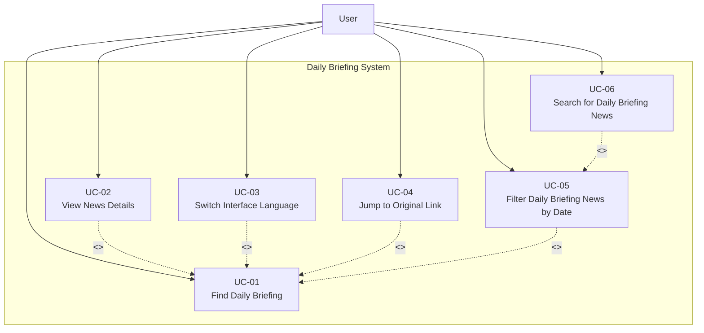

**Use Cases:**
- UC-01: Find Daily Briefing
- UC-02: View News Details (<<extend>> UC-01)
- UC-03: Switch Interface Language (<<extend>> UC-01)
- UC-04: Jump to Original Link (<<extend>> UC-01)
- UC-05: Filter Daily Briefing News by Date (<<extend>> UC-01)
- UC-06: Search for Daily Briefing News (<<extend>> UC-05)

#### 3.1.2 Feature 2: Community Interaction Platform

##### 3.1.2.1 Actor

- **User**: The only actor of the system. The user can browse the community feed, create and interact with posts (like/comment/report), and search and filter content. From the community interface, the user can also trigger follow/unfollow actions or open entry points to the Profile & Messaging features (friends list and private messages) described under the Authentication and Profile System. (Administrative actions, if applicable, are performed by a user with elevated permissions.)

##### 3.1.2.2 Use Case Diagram

**Feature 2: Community Interaction Platform – Use Case Overview**

The Community Interaction Platform has a single actor (**User**). The user can browse the community feed, create and edit posts, like and comment on posts, and search and filter content. From post and profile entry points in the community, the user can access follow/unfollow and messaging functions, but the underlying management of followers/friends lists and private conversations is specified in the Authentication and Profile System (Feature 3). (If administrative moderation is enabled, it is performed by a user with elevated permissions.)

Qwen AI provides **automatic translation** and **AI comment summarization** capabilities that are reused across multiple use cases rather than exposed as a separate user-facing feature. When users create or edit posts (UC-08), the backend automatically generates bilingual (ZH/EN) content. When viewing post details (UC-11) or posting comments (UC-13), the system reuses the stored bilingual content and allows users to view content in their selected interface language. UC-15 (AI Summary Comment) allows the user to request an AI-generated summary of all comments under a post. These AI behaviors are implemented in the codebase via Qwen-based services and are reflected in the detailed UCD and activity diagrams in Section 3.3.7–3.3.18.

**用例图描述（中文）**：

该用例图描述社区交互平台（Community Interaction Platform）中用户与系统的核心交互。主要参与者为 **User**，外部参与者 **Qwen AI** 为发帖内容处理与评论摘要等能力提供支持。整体以 **UC-07 浏览公开帖子（Browse Public Post）** 为主线，用例之间通过 `<<extend>>` 表示“在基础流程中可选触发的扩展行为”。

- **UC-07 Browse Public Post**：用户浏览公开帖子列表（入口用例）。在浏览过程中，用户可选择扩展：
  - **UC-10 Filter by Tag (<<extend>> UC-07)**：按标签筛选帖子。
  - **UC-14 Search Posts (<<extend>> UC-07)**：按关键词搜索帖子。
  - **UC-11 View Post Details (<<extend>> UC-07)**：从列表进入帖子详情页查看完整内容。
- **围绕 UC-11 View Post Details 的交互扩展**：用户在帖子详情中可进一步执行：
  - **UC-09 Like Post (<<extend>> UC-11)**：点赞/取消点赞帖子。
  - **UC-13 Post Comment (<<extend>> UC-11)**：发表评论参与讨论。
  - **UC-12 Report (<<extend>> UC-11)**：对不当内容发起举报；该用例可细分为：
    - **UC-12.1 Report Post**：举报帖子。
    - **UC-12.2 Report comment / Report common**：举报评论（或举报公共流程复用部分）。
- **UC-015 AI summary comment**：当用户需要快速了解评论区内容时，系统调用 **Qwen AI** 生成评论摘要并展示。
- **UC-08 Create Publish Post**：用户创建并发布帖子；系统在发布过程中可调用 **Qwen AI** 提供内容处理能力（例如自动翻译/内容审核等）。
- **UC-16 Manage private messages with other users**：用户与其他用户进行私信沟通（会话查看/发送消息等）。
  - **UC-17 Manage Message Status (<<extend>> UC-16)**：在私信场景中管理消息状态（如已读/未读）。

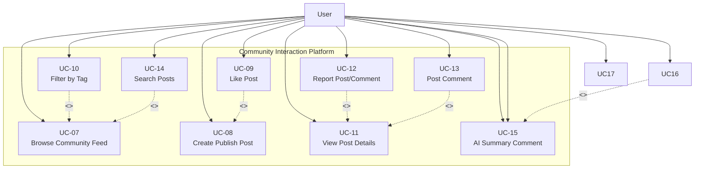

**Use Cases (aligned with Section 3.3):**
- UC-07: View Community Feed
- UC-08: Create Publish Post
- UC-09: Like Post (<<extend>> UC-08)
- UC-10: Filter by Tag (<<extend>> UC-07)
- UC-11: View Post Details
- UC-12: Report Post/Comment (<<extend>> UC-11)
- UC-13: Post Comment (<<extend>> UC-11)
- UC-14: Search Posts (<<extend>> UC-07)
- UC-15: AI Summary Comment (<<extend>> UC-11)

##### 3.1.2.3 Use Case Summary Table

| Use Case ID | Use Case Name | Actor | Description | Extends |
|-------------|---------------|-------|-------------|---------|
| UC-07 | Browse Community Feed | User | User opens the community feed and browses posts ordered from newest to oldest, showing title, preview, tags, like count, and comment count. | - |
| UC-08 | Create Publish Post | User | User can create or edit posts in their preferred language (Chinese, English), upload images, select a tag from predefined categories, and have the system automatically generate bilingual content using Qwen AI. | - |
| UC-09 | Like Post | User | User can like or unlike posts to express feedback, and the like count updates immediately in the interface. | UC-08 |
| UC-10 | Filter by Tag | User | User can filter posts in the community feed by selecting tags from the predefined list (Study, Housing, Travel, Part-time Job, Life Services). | UC-07 |
| UC-11 | View Post Details | User | User can view post details including full text, images, tags, engagement metrics (likes, comments), and author profile when clicking on a post, in their current interface language. | - |
| UC-12 | Report Post/Comment | User | User can report posts/comments with structured reasons (Spam, Fraud or Scam, Illegal Service Promotion, Abusive Language, Other) and provide explanatory text. | UC-11 |
| UC-13 | Post Comment | User | User can post comments to interact with other users, which will be automatically translated by the system into Chinese and English; users can delete their own comments. | UC-11 |
| UC-14 | Search Posts | User | User can search posts by keyword across bilingual content (titles and body texts in both Chinese and English). | UC-07 |
| UC-15 | AI Summary Comment | User | User can view AI-generated summaries of all comments under a post in their chosen language. | UC-11 |

#### 3.1.3 Feature 3: AI-Powered Content Moderation

##### 3.1.3.1 Actor

- **User**: The only actor of the system. The user submits content (posts/comments) that undergoes AI screening, and (if permitted) performs human review actions on pending content.

##### 3.1.3.2 Use Case Diagram

**Feature 3: AI-Powered Hybrid Content Moderation (AI + Human Loop)**

When the user submits content, it triggers the UC-19 AI real-time screening: the AI automatically makes decisions based on the confidence level - if the score is less than 60, it directly rejects and provides the reason. A score of 60≤score<80 is marked as pending review. A score of 80 or above will automatically pass. The content to be reviewed enters the UC-22 review list, and is manually reviewed in UC-20 by a user with elevated permissions. The final approval/rejection is made through UC-21 (the reasons for rejection need to be filled in and fed back to the user). The rejected content will present the reasons for rejection to users in UC-23. Users can modify it and resubmit it, entering the same review process again to achieve a closed loop of "AI efficient filtering + manual fallback decision-making + users checking the reasons and resubmitting".

**Use Cases:**
- UC-19: AI Real-time Screening
- UC-20: Human Review (Administrator)
- UC-21: Approve/Reject Content
- UC-22: View Pending Review List
- UC-23: View Rejection Reason and Resubmit

#### 3.1.4 Feature 3: Authentication and Profile System

##### 3.1.4.1 Actor

- **User**: The only actor of the system. The user can register accounts, log in/out, manage their profile, view their community posts, view followers/friends list, and view their submitted reports.

##### 3.1.4.2 Use Case Diagram

**Feature 3: Authentication and Profile System – Use Case Overview**

This use case diagram describes the authentication and profile management functions. Users can register accounts, log in/out, and manage their profile information. After logging in, users can access profile-related features including viewing their community posts, managing followers/friends list, and viewing their submitted reports.

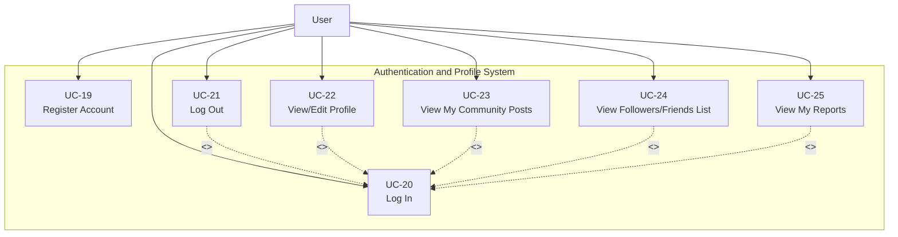

**Use Cases (aligned with Section 3.3):**
- UC-19: Register Account
- UC-20: Log In
- UC-21: Log Out (<<include>> UC-20)
- UC-22: View/Edit Profile (<<include>> UC-20)
- UC-23: View My Community Posts (<<include>> UC-20)
- UC-24: View Followers/Friends List (<<include>> UC-20)
- UC-25: View My Reports (<<include>> UC-20)

##### 3.1.4.3 Use Case Summary Table

| Use Case ID | Use Case Name | Actor | Description | Extends |
|-------------|---------------|-------|-------------|---------|
| UC-19 | Register Account | User | User can register a new account using email or phone number with verification codes. | - |
| UC-20 | Log In | User | User can log in using username/email and password, receiving a JWT token for authentication. | - |
| UC-21 | Log Out | User | User can log out to end the current session and clear authentication tokens. | UC-20 |
| UC-22 | View/Edit Profile | User | User can view and update their profile information including display name, avatar, and preferred language. | UC-20 |
| UC-23 | View My Community Posts | User | User can view all their own community posts with moderation status (pending, approved, rejected). | UC-20 |
| UC-24 | View Followers/Friends List | User | User can view their followers list and mutual follows list, and manage follow relationships. | UC-20 |
| UC-25 | View My Reports | User | User can view all reports they have submitted, including status, target type, reasons, description, review notes, and timestamps. | UC-20 |

### 3.2 User Requirement Specification

#### Feature 1: Daily Briefing System

URS01 – View Daily Briefings 
User can open the Daily Briefing page and browse a paginated list of recent Daily Briefing items ordered from newest to oldest by publication time in their current interface language.
URS02 – View Daily Briefing news details 
User can select a Daily Briefing item from the list and view a news detail page that shows the complete information (title, AI generated summary of News, publication time,View Original button, "Back" button) for that item in their current interface language (English/Chinese).
URS‑03 – Switch Interface Language
User can click a language switch button at any time to change the interface language between Chinese and English and continue browsing Daily Briefing items in the newly selected language.
URS‑04 – Jump to the original link
User can click an “Open original article” button on a Daily Briefing item and read the full original news article on the external official website in a new browser tab.
URS‑05 – Filter Daily Briefings News by Date
The User can filter news based on specific criteria (start date and end date) while browsing.
URS06 – Search for Daily Briefing News 
User can type Chinese or English keywords into a search box on the Daily Briefing page and view only Daily Briefing items that match the entered keywords.


#### Feature 2: Community Interaction Platform

**URS-07 (UC-07 – View Community Feed)**: The User can browse the community feed with posts ordered from newest to oldest, showing title, preview, tags, like count, and comment count.

**URS-08 (UC-08 – Create Publish Post)**: The User can create or edit posts in their preferred language (Chinese, English), upload images, select a tag from predefined categories (Study, Housing, Travel, Part-time Job, Life Services), and have the system automatically generate bilingual (Chinese/English) content using Qwen AI for later display.

**URS-09 (UC-09 – Like Post)**: The User can like or unlike posts to express feedback, and the like count updates immediately in the interface.

**URS-10 (UC-10 – Filter by Tag)**: The User can filter posts in the community feed by selecting tags from the predefined list (Study, Housing, Travel, Part-time Job, Life Services).

**URS-11 (UC-11 – View Post Details)**: The User can view post details including full text, images, tags, engagement metrics (likes, comments), and author profile when clicking on a post, in their current interface language.

**URS-12 (UC-12 – Report Post/Comment)**: The User can report posts/comments with structured reasons (Spam, Fraud or Scam, Illegal Service Promotion, Abusive Language, Other) and provide explanatory text.

**URS-13 (UC-13 – Post Comment)**: The User can post comments to interact with other users, which will be automatically translated by the system into Chinese and English; users can delete their own comments.

**URS-14 (UC-14 – Search Posts)**: The User can search posts by keyword across bilingual content (titles and body texts in both Chinese and English).

**URS-15 (UC-15 – Communicate with others)**: Users who follow each other mutually can send and receive private messages and view message history.

**URS-16 (UC-16 – Manage Message Status)**: The User can manage message status in conversations, including marking messages as read and deleting messages for themselves.

**URS-17 (UC-17 – View and Manage the mutual follow list)**: The User can manage mutual follow relationships: search for users, view profiles, follow/unfollow users, and view mutual follow lists. UC-17 is a specialization of UC-24 (View Followers/Friends List) focusing on the Friends (mutual follows) view from the Profile page and the ability to start private chats with Friends under the messaging rules in Section 5.3 (Private Messaging Rules).

**URS-18 (UC-18 – AI Summary Comment)**: The User can view AI-generated summaries of all comments under a post in their chosen language.


#### Feature 3: AI-Powered Content Moderation

**URS-21**: The User can submit content (posts, comments), which triggers an automatic AI Real-time Screening process using Qwen AI (UC-19).

**URS-22**: The User receives immediate processing results based on the AI confidence score: Auto-Approve (score 80-100), Pending Human Review (score 60-79), or Auto-Reject (score 0-59).

**URS-23**: The User can view the specific rejection reason and edit the post to resubmit it if the content is rejected, entering the same review process again.

**URS-24**: A user with elevated permissions can access the "Pending Review List" to view items that scored between 60 and 79 and require human verification.

**URS-25**: A user with elevated permissions can perform a human review on pending posts and execute an approve or reject operation (UC-20/UC-21).

**URS-26**: A user with elevated permissions must provide a specific rejection reason when rejecting a post, which is then sent to the user for feedback.

**URS-27**: The User can view their own posts with moderation status (published, pending review, or rejected) in their profile.

#### Feature 3: Authentication and Profile System

**URS-28 (UC-19 – Register Account)**: The User can register a new account using email or phone number with verification codes.

**URS-29 (UC-20 – Log In)**: The User can log in using username/email and password, receiving a JWT token for authentication.

**URS-30 (UC-21 – Log Out)**: The User can log out to end the current session and clear authentication tokens.

**URS-31 (UC-22 – View/Edit Profile)**: The User can view and update their profile information including display name, avatar, and preferred language.

**URS-32 (UC-23 – View My Community Posts)**: The User can view all their own community posts with moderation status (pending, approved, rejected).

**URS-33 (UC-24 – View Followers/Friends List)**: The User can view lists of mutual Friends (mutual follows) and Followers (users who follow the current User). From either list, the User can click a user’s avatar to navigate to that user’s profile page.

**URS-34 (UC-25 – View My Reports)**: The User can view all reports they have submitted from their profile page, including report status (PENDING, REVIEWED, RESOLVED, DISMISSED), target type (POST or COMMENT), reasons, description, review notes from administrators, AI analysis results, and timestamps.

### 3.3 Use Case Description and Activity Diagram

#### 3.3.1 UCD-01: Find Daily Briefing

##### 2.3.1.1 User Requirement Specification (URS) and System Requirement Specification (SRS)

**URS-01**: The User can open the Daily Briefing page and browse a paginated list of recent Daily Briefing items ordered from newest to oldest by publication time in their current interface language.

**SRS-01**: The system shall display the "Briefing" navigation item in the sidebar navigation menu on every page.

**SRS-02**: The system shall display the Daily Briefing page [UI-01] when the "Briefing" navigation item is clicked, showing a paginated list of Daily Briefing items.

**SRS-03**: The system shall order Daily Briefing items from newest to oldest based on publication time from the source website.

**SRS-04**: The system shall display Daily Briefing items in the user's current interface language (Chinese or English), showing only the title and summary in the selected language.

**SRS-05**: Each Daily Briefing card on the list shall display: title, AI-generated summary, source website name (original or localized name), and publication time (formatted according to the current interface language).

**SRS-06**: The system shall implement pagination to display Daily Briefing items, providing pagination controls (page number, previous/next buttons) for users to navigate through pages.

**SRS-07**: The system shall provide a "View Detail" button on each Daily Briefing card to navigate to the news detail page.

##### 2.3.1.2 Use Case Description

| Use Case ID | UC-01 |
|------------|------|
| Use Case Name | Find Daily Briefing |
| Created By | ZhiYi Pan |
| Date Created | 04/01/2026 |
| Last Update By | |
| Last Revision Date | |
| Actors | User |
| Description | User can open the Daily Briefing page and browse a paginated list of recent Daily Briefing items ordered from newest to oldest by publication time in their current interface language. |
| Trigger | User are in the "Briefing page" (UI-01: Briefing page) |
| Preconditions | 1. User is logged into the BridgeU platform.<br>2. User has an active internet connection.<br>3. The Daily Briefing system has successfully crawled news from approved sources via Google News RSS and direct crawlers (e.g., Bangkok Post). |

**Use Case Input Specification**

| Input | type | Constraint | Example |
|-------|------|------------|---------|
| Current Interface Language | String | Must be "zh" (Chinese) or "en" (English) | "en" |

**Post conditions**:
- User are in "Daily Briefing page" (UI-01: Daily Briefing page)

**Normal Flows**

| User (Actions) | System (Responses) |
|----------------|-------------------|
| 1. User clicks on the "Briefing" navigation item in the sidebar | 2. System checks if the user is logged in and the login session is valid (verifies authentication token)<br>   • `[E2: User session expired]` |
| | 3. System retrieves the user's current interface language preference (Chinese or English) |
| | 4. System queries the database for the first page of Daily Briefing items, ordered by publication time (newest first)<br>   • `[E1: Cannot connect to database]`<br>   • `[E3: Network timeout]` |
| | 5. System retrieves the corresponding language version (Chinese or English) for each Daily Briefing item's title and summary |
| | 6. System displays the Daily Briefing page (UI-01) with paginated list of news items<br>   • `[A1: No news items available]` |
| | 7. Each news card displays: title, summary, source (original or localized name), publication time (formatted according to current interface language), and "View Detail" button |

**Alternative Flow**

**`[A1: No news items available]`**
- A1.1 System show "No news available at this time" message
- A1.2 Use case end.

**Exception Flow**

**`[E1: Cannot connect to database]`**
- E1.1 System show "Unable to load news. Please try again later." message
- E1.2 System logs the error for administrator review
- E1.3 Use case end.

**`[E2: User session expired]`**
- E2.1 System redirect the user to the login page
- E2.2 System show "Your session has expired. Please log in again." message
- E2.3 Use case end.

**`[E3: Network timeout]`**
- E3.1 System show "Request timeout. Please check your internet connection and try again." message
- E3.2 User can retry the operation
- E3.3 Go to Step 4

**Note**:
- There is only one type of user of the system.

##### 2.3.1.3 Activity Diagram

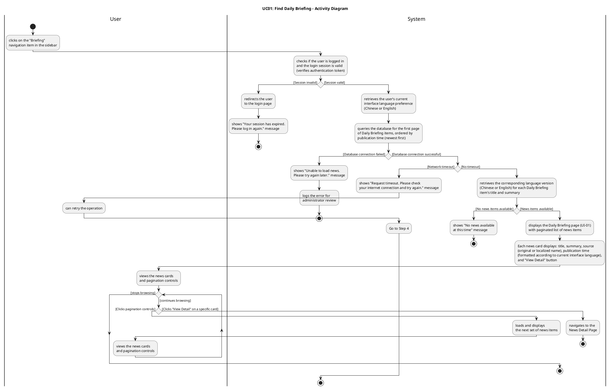

#### 3.3.2 UCD-02: View Daily Briefing News Details

##### 2.3.2.1 User Requirement Specification (URS) and System Requirement Specification (SRS)

**URS-02**: The User can select a Daily Briefing item from the list and view a news detail page that shows the complete information (title, summary, publication time, crawl time, View Original button) for that item in their current interface language (English/Chinese).

**SRS-08**: The system shall provide a "View Detail" button on each Daily Briefing card in the list page (UI-01) to navigate to the news detail page (UI-02).

**SRS-09**: The system shall display the News Detail page (UI-02) when a user clicks the "View Detail" button on a Daily Briefing card.

**SRS-10**: The system shall retrieve the selected Daily Briefing item from the database using the news item ID passed from the list page.

**SRS-11**: The system shall display the news detail page content in the user's current interface language (Chinese or English), showing the title and summary in the selected language.

**SRS-12**: The News Detail page (UI-02) shall display the following information in the user's current interface language:
- News title
- AI-generated summary
- Source website name
- Publication time (formatted)

**SRS-13**: The system shall provide a "Back" button on the News Detail page to return to the Daily Briefing list page.

**SRS-14**: The system shall provide a "View Original" button that triggers the browser to open the original news article URL in a new tab when clicked. If the original URL is missing or invalid, the button shall be disabled.

##### 2.3.2.2 Use Case Description

| Use Case ID | UC-02 |
|------------|------|
| Use Case Name | View Daily Briefing News Details |
| Created By | ZhiYi Pan |
| Date Created | 04/01/2026 |
| Last Update By | |
| Last Revision Date | |
| Actors | User |
| Description | User can select a Daily Briefing item from the list and view a news detail page that shows the complete information (title, summary, publication time, crawl time, View Original button) for that item in their current interface language (English/Chinese). |
| Trigger | User clicks the "View Detail" button on a Daily Briefing card in the Daily Briefing list page (UI-01) |
| Preconditions | 1. User has an active internet connection.<br>2. User is viewing the Daily Briefing list page (UI-01).<br>3. At least one Daily Briefing item exists in the list. |

**Use Case Input Specification**

| Input | type | Constraint | Example |
|-------|------|------------|---------|
| News Item ID | Integer | Must be a valid news item ID that exists in the database | 12345 |
| Current Interface Language | String | Must be "zh" (Chinese) or "en" (English) | "en" |

**Post conditions**:
- User is viewing the News Detail page (UI-02) displaying the complete information for the selected Daily Briefing item

**Normal Flows**

| User (Actions) | System (Responses) |
|----------------|-------------------|
| 1. User clicks the "View Detail" button on a Daily Briefing card in the list page | 2. System retrieves the news item ID from the clicked card |
| | 3. System retrieves the user's current interface language preference (Chinese or English) |
| | 4. Frontend sends HTTP request to backend API with news item ID and language parameter |
| | 5. Backend receives request (authentication not required for this endpoint) |
| | 6. Backend queries the database for the Daily Briefing item using the news item ID<br>   • `[E1: Database error or server error]`<br>   • `[E4: News item not found]` |
| | 7. Backend retrieves the corresponding language version (Chinese or English) for the news item's title and summary |
| | 8. Backend returns response with success status and news detail data |
| | 9. Frontend receives HTTP response from backend<br>   • `[E2: Authentication token invalid or expired]`<br>   • `[E3: Network timeout or connection error]` |
| | 10. Frontend checks if response.status is 200 and response.data.success is true |
| | 11. System displays the News Detail page (UI-02) with the complete information:<br>   - News title (in current interface language)<br>   - AI-generated summary (in current interface language)<br>   - Source website name<br>   - Publication time (formatted according to current interface language)<br>   - Crawl timestamp (formatted according to current interface language)<br>   - "View Original" button (disabled if originalUrl is invalid or missing)<br>   - "Back" button |
| 12. User views the news details | |
| 13. User switches the interface language (Chinese/English) using the language switcher (optional) | 14. Frontend triggers a language change event and updates the current language preference<br>15. System re-fetches the news detail data from the API with the new language parameter<br>16. System updates the News Detail page display with content in the new language (title, summary, formatted dates)<br>17. Use case continues from Step 12 |
| 18. User clicks the "View Original" button (optional) | 19. System triggers the browser to open the original URL in a new tab<br>   • `[E5: Original URL invalid or missing]` |
| 20. User clicks the "Back" button (optional) | 21. System navigates the user back to the Daily Briefing list page (UI-01) |

**Exception Flow**

**`[E1: Database error or server error]`**
- E1.1 Backend catches an exception while processing the request
- E1.2 Backend returns a 500 Internal Server Error response with message "Failed to fetch news detail: [error details]"
- E1.3 Backend logs the error with full details for administrator review
- E1.4 Frontend receives the 500 error response in catch block
- E1.5 Frontend checks if error.response.status === 500
- E1.6 Frontend displays the error message from error.response.data.message or default localized message 'dailyBriefingDetail.networkError'
- E1.7 Use case end.

**`[E2: Authentication token invalid or expired]`**
- E2.1 Backend returns a 401 Unauthorized response (if authentication is required for this operation)
- E2.2 Frontend detects the 401 error and clears the invalid token from localStorage
- E2.3 Frontend triggers an authentication error event and displays "登录已过期，请重新登录" / "Login expired, please log in again" message
- E2.4 System redirects the user to the login page
- E2.5 Use case ends.

**`[E3: Network timeout or connection error]`**
- E3.1 Request exceeds the configured timeout or network connection fails
- E3.2 Frontend catches the network error or timeout in catch block
- E3.3 Frontend checks if error.response exists (defensive check per code implementation)
- E3.4 If error.response exists and error.response.data.message exists, frontend displays that message
- E3.5 Otherwise, frontend displays localized error message using i18n key 'dailyBriefingDetail.networkError' or error.message
- E3.6 Use case end.

**`[E4: News item not found]`**
- E4.1 System queries the database but cannot find a news item with the provided ID
- E4.2 System returns a 404 Not Found response with message "News not found with id: [id]"
- E4.3 Frontend receives the 404 error response in catch block
- E4.4 Frontend checks if error.response.status === 404
- E4.5 Frontend displays the localized error message using i18n key 'dailyBriefingDetail.notFound'
- E4.6 System provides a "Back" button to return to the Daily Briefing list page (always displayed at top)
- E4.7 Use case end.

**`[E5: Original URL invalid or missing]`**
- E5.1 System disables the "View Original" button (rendered with `:disabled="!news.originalUrl"`). The button is visually distinct (grayed out) and non-clickable.
- E5.2 Use case continues (user can still view other details)

**Note**:
- The news detail page displays information in the user's current interface language preference.
- If the user switches language while viewing details, the page content should update accordingly.
- The "View Original" button triggers the browser to open the original article in a new tab to preserve the user's current browsing context.
- The frontend implements defensive programming checks in the error handling catch block, including handling of edge cases such as 200 status codes in catch blocks (which should not normally occur but are handled for safety).
- Error handling follows the activity diagram specification, with detailed checks for HTTP response status codes and error message availability.

##### 2.3.2.3 Activity Diagram

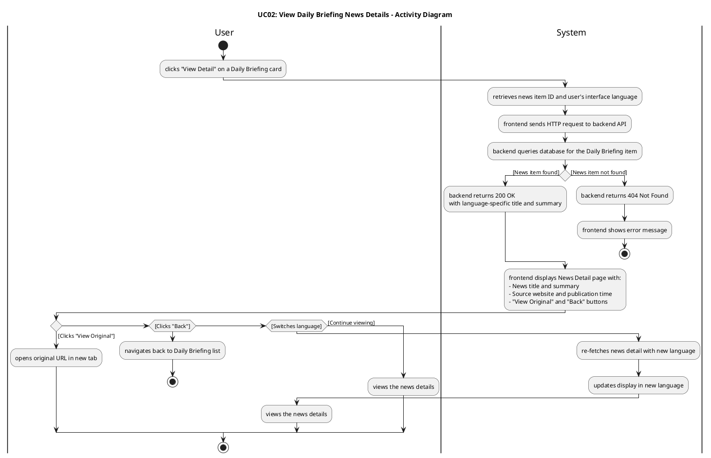

#### 3.3.3 UCD-03: Switch Interface Language

##### 2.3.3.1 User Requirement Specification (URS) and System Requirement Specification (SRS)

**URS-03**: The User can click a language switch button at any time to change the interface language between Chinese and English and continue browsing Daily Briefing items in the newly selected language.

**SRS-15**: The system shall provide a language switch button (or language selector) on every page of the application, accessible from the sidebar (for logged-in users) or login page (for non-logged-in users). The sidebar displays two separate buttons: "🇨🇳 中文" (Chinese) and "🇺🇸 EN" (English), while the login page displays a single toggle button showing "EN/中文".

**SRS-16**: The system shall display the current interface language (Chinese or English) in the language switch control, allowing users to toggle between "中文" (Chinese) and "English" (English). The active language button is visually highlighted (e.g., with a darker background and bold text).

**SRS-17**: When the user clicks the language switch button, the system shall immediately update the user's interface language preference and persist it in localStorage with the key 'userLanguage'. Note: The user profile's preferredLanguage field is only updated when the user explicitly saves their profile in the My Profile page. Language switching via the sidebar buttons only updates localStorage for the current session.

**SRS-18**: The system shall refresh the current page content immediately after the language switch, displaying all interface text, labels, buttons, and content in the newly selected language.

**SRS-19**: The system shall re-fetch any displayed content (e.g., Daily Briefing items, news details) from the backend API with the new language parameter (lang="zh" or lang="en") to ensure content is displayed in the selected language. The system triggers a 'languageChanged' custom event with detail { lang: newLang } to notify all components to refresh their content.

**SRS-20**: The system shall maintain the user's current page context (e.g., current page number, selected news item ID, filter parameters) when switching languages, so the user can continue browsing without losing their place. For example, if the user is on page 3 of the Daily Briefing list, switching language will reload page 3 in the new language.

**SRS-21**: The system shall format dates and times in the format "DD-MM-YYYY HH:mm" (day-month-year hour:minute) for both Chinese and English interfaces. The date format remains consistent across languages, but all interface labels and content text are translated according to the selected language.

#### 3.3.4 UCD-04: Jump to Original Link

##### 2.3.4.1 User Requirement Specification (URS) and System Requirement Specification (SRS)

**URS-05**: The User can jump to the original text link to read the full report from the source website when viewing news details.

**SRS22**: The system shall display a "Read Original" button on both the Daily Briefing list page and the News Detail page. 
**SRS23**: The system shall display the "Read Original" button to indicate that clicking it will open an external website in a new browser tab.


##### 2.3.4.2 Use Case Description

##### 2.3.4.2 Use Case Description

| Use Case ID | UC-04 |
|------------|-------|
| Use Case Name | Indicate External Original Link |
| Created By | ZhiYi Pan |
| Date Created | 05/01/2026 |
| Last Update By | |
| Last Revision Date | |
| Actors | User |
| Description | When viewing a news item, the user can see a "Read Original" button with an external link icon, clearly indicating that clicking it will open the original article on an external website in a new browser tab. |
| Trigger | User is viewing a Daily Briefing item on the list page or News Detail page where a "Read Original" action is available. |
| Preconditions | 1. User is viewing the Daily Briefing list page (UI-01) or the News Detail page (UI-02).<br>2. The UI has been rendered for the current interface language (Chinese or English).<br>3. The system has determined that the news item can provide a "Read Original" entry. |

**Use Case Input Specification**

| Input | type | Constraint | Example |
|-------|------|------------|---------|
| Interface Language | String | Must be "zh" or "en" | "en" |
| Original Link Availability Flag | Boolean | Indicates whether the "Read Original" button should be shown for this item | true |

**Post conditions**:
- The "Read Original" button is displayed with an external link icon.
- The user understands that clicking the button will open an external website in a new browser tab.

**Normal Flows**

| User (Actions) | System (Responses) |
|----------------|-------------------|
| 1. User views a Daily Briefing item on the list page or the News Detail page. | 2. System checks whether a "Read Original" action is available for the current news item. |
| | 3. System renders the "Read Original" button in the current interface language ("Read Original" in English, "阅读原文" in Chinese). |
| | 4. System displays an external link icon next to the button label to visually indicate that the action will open an external website in a new browser tab. |
| 5. User sees the button text and external link icon. | 6. System keeps the visual style of the button and icon consistent across list and detail pages so that users can easily recognize it as an external link action. |

**Alternative Flows**

**`[A1: No "Read Original" action available for this item]`**
- A1.1 System determines that the current news item does not provide a "Read Original" action.
- A1.2 System does not display the "Read Original" button or external link icon for this item.
- A1.3 Use case end.

##### 2.3.4.3 Activity Diagram
uml
@startuml UC04_Activity_Diagram
title UC04: Indicate External Original Link - Activity Diagram

|User|
start
:views Daily Briefing item\non list page or News Detail page;

|System|
:checks whether a "Read Original"\naction is available for this item;

if () then ([No "Read Original" action])
  :does not display "Read Original"\nbutton or external link icon;
  stop
else ([Action available])
  :renders "Read Original" button\nin current interface language\n("Read Original" / "阅读原文");
  :displays external link icon\nnext to button label to indicate\nit opens an external website\nin a new browser tab;
endif

|User|
:sees the "Read Original" button\nwith external link icon;
note right
  The user can understand from the
  text label and icon that clicking
  the button will open an external
  website in a new browser tab.
end note

stop
@enduml##### 2.3.4.4 Activity Diagram Description

**The Activity Diagram for Indicate External Original Link** illustrates how the system visually communicates the external nature of the "Read Original" action to the user:

- **User** views a Daily Briefing item on the list page or the News Detail page.
- **System** decides whether a "Read Original" action is available for this item; if not, no button or icon is shown and the flow ends.
- When the action is available, **System** renders a localized "Read Original" button with an external link icon next to the label, indicating that it opens an external website in a new browser tab.
- **User** sees the button and icon and can understand, before clicking, that this action will navigate to an external site in a new tab while keeping the current BridgeU page available.

##### 2.3.4.4 Activity Diagram Description

**The Activity Diagram for Jump to Original Link** illustrates the interaction between the **User** and the **System** when the user wants to read the original news article from the source website:

- **User** views a Daily Briefing item on the list page or News Detail page and identifies the "Read Original" button (displayed with an external link icon, e.g., "el-icon-top-right").
- **System** checks if the news item has a valid originalUrl field. If the originalUrl is null, undefined, or empty, the system disables the button (rendered with `:disabled="!news.originalUrl"`), making it visually distinct (grayed out) and non-clickable, and the use case ends (see `[A1: News item does not have a valid originalUrl field]`). If the originalUrl is valid, the system enables the button and displays it as clickable, and the normal flow continues.
- **User** clicks the enabled "Read Original" button (normal flow assumes the button is enabled). Note: If the user clicks the button multiple times in quick succession, each click triggers a new `window.open()` call, which may result in multiple tabs being opened (one tab per click). Browser settings may control whether multiple tabs are opened or if the existing tab is reused (see `[A2: User clicks "Read Original" button multiple times in quick succession]`).
- **System** calls the `openOriginalUrl(url)` method with the news item's originalUrl value. Inside the method, the system checks if the url parameter is valid using `if (url)` as a defensive check. Since the Preconditions guarantee a valid originalUrl and the button is only enabled when originalUrl is valid, the url parameter should be valid at this point. The system executes `window.open(url, '_blank')` to open the original URL in a new browser tab. The new tab opens in the background or foreground (depending on browser settings), and the BridgeU application tab remains active and unchanged. Note: If the url parameter is somehow invalid (edge case), the method returns without executing `window.open()`, and no new tab is opened (see `[E1: URL parameter is invalid]`). If the browser's popup blocker prevents the new tab from opening, the browser may display a notification to the user (e.g., "Pop-up blocked" message), and no new tab is opened (see `[E2: Browser blocks popup]`).
- If the new tab opens successfully, **System** attempts to load the original URL. If the URL fails to load (e.g., website is down, URL is invalid, network error), the browser displays its native error message (e.g., "This site can't be reached", "404 Not Found"), and the BridgeU application does not display additional error messages (see `[E3: URL fails to load]`).
- If the original news article loads successfully, **User** can view the original news article in the new browser tab, read the full report from the source website, and switch between tabs to return to the BridgeU application.
- **System** maintains the user's current browsing context in the BridgeU application (user remains on the same page, same scroll position, same language setting), allowing seamless navigation between the BridgeU application and the external source website.

##### 2.3.3.4 Activity Diagram Description

**The Activity Diagram for Switch Interface Language** illustrates the interaction between the **User** and the **System** when the user changes the interface language:

- **User** clicks the language switch button (e.g., "🇨🇳 中文" or "🇺🇸 EN" buttons in sidebar, or "EN/中文" toggle on login page) on any page of the application.
- **System** calls the setLanguage(newLang) function, which validates the language code ("zh" or "en"), updates the current language state, and stores the preference in localStorage (key: 'userLanguage'). Note: The user profile's preferredLanguage field is not automatically updated during language switching; it is only updated when the user explicitly saves their profile in the My Profile page.
- **System** triggers a 'languageChanged' custom event with detail { lang: newLang } to notify all components.
- **System** retrieves the current page context (page number, selected item ID, filter parameters) from component state to maintain the user's browsing position.
- **System** components (e.g., DailyBriefing, DailyBriefingDetail) that are listening to 'languageChanged' events receive the notification and automatically re-fetch their content from the backend API with the new language parameter (params.lang = newLang).
- If the request succeeds, **System** refreshes the current page display with all interface text (via i18n translation system), content (from API response), and formatted dates (format: "DD-MM-YYYY HH:mm") in the newly selected language, while maintaining the current page context (same page number, same selected item ID, same filter parameters).
- **User** continues browsing in the newly selected language without losing their place.

If a **network timeout or connection error** occurs, the system displays a localized timeout message, and the user can retry the language switch operation. If an **API request fails** (e.g., 500 error), the system displays an error message to the user, but keeps the new language setting (localStorage and UI language have already been updated). The user can retry by refreshing the page or switching language again.

##### 2.3.5 UCD-05: Filter Daily Briefing News by Date

###### 2.3.5.1 User Requirement Specification (URS) and System Requirement Specification (SRS)

**URS-06**: The User can filter news based on specific criteria (start date and end date) while browsing.

> Note: In some course materials this requirement is referenced as **URS‑05 – Filter Daily Briefings News**; in this SRS it is recorded as **URS‑06**.

**SRS-27**: The system shall provide a filter panel on the Daily Briefing list page (UI-01) containing:
- A **Start Date** picker (optional).
- An **End Date** picker (optional).
- A **"Filter"** action button.
- A **"Reset"** action button that clears both date fields.

**SRS-28**: When the user clicks the "Filter" button, the system shall validate that:
- If both dates are provided, **Start Date ≤ End Date**.
If validation fails, the system shall display an appropriate error message and shall not send a filter request to the backend.

**SRS-29**: When validation succeeds, the system shall send a filter request to the backend including the provided filter parameters:
- `startDate` (optional)
- `endDate` (optional)
> Note: The frontend also includes `lang` (interface language) in the request. These parameters do not change the date filtering rules defined in this use case.

**SRS-30**: The backend shall query the Daily Briefing data such that:
- If `startDate` and/or `endDate` is provided, only news items whose **publication date** (`publishDate`) falls within the date range (inclusive) are returned.
  - If only `startDate` is provided, the backend shall set `endDate` to **today**.
  - If only `endDate` is provided, the backend shall set `startDate` to **30 days before** the provided end date.
- Results shall be **paginated** and ordered from newest to oldest by **publication date** (`publishDate` descending).

**SRS-31**: The system shall update the Daily Briefing list page (UI-01) to display only the filtered news items, **resetting the results view to the first page** while preserving pagination controls for navigating through multiple result pages. When no filter conditions are provided (no Start Date, no End Date, and no keyword), the system shall show all news items with pagination (no implicit default date window).

**SRS-32**: If no news items match the filter conditions, the system shall display an empty list and a user-friendly message "No news data available" (zh: "暂无新闻数据") while keeping the filter panel visible so that the user can adjust conditions and retry.

###### 2.3.5.2 Use Case Description

| Use Case ID | UC-05 |
|------------|------|
| Use Case Name | Filter Daily Briefing News by Date |
| Created By | ZhiYi Pan |
| Date Created | 08/01/2026 |
| Last Update By | |
| Last Revision Date | |
| Actors | User |
| Description | User can filter Daily Briefing items by choosing an optional start date and an optional end date, and then browse only the items that meet these filter conditions. |
| Trigger | User is on the Daily Briefing list page (UI-01) and interacts with the filter panel (selects dates, then clicks the "Filter" button). |
| Preconditions | 1. User is logged into the BridgeU platform.<br>2. User has an active internet connection.<br>3. The Daily Briefing system has successfully crawled news from approved sources and stored publication dates.<br>4. The filter panel (date pickers) is visible on the Daily Briefing list page (UI-01). |

**Use Case Input Specification**

| Input | type | Constraint | Example |
|-------|------|------------|---------|
| Start Date | Date | Must be a valid calendar date; must not be later than End Date | 01-01-2026 |
| End Date | Date | Must be a valid calendar date; must not be earlier than Start Date | 03-01-2026 |
<!-- Source selection for filtering has been removed; filtering is now based only on date range. -->

**Post conditions**:
- The Daily Briefing list page (UI-01) displays only news items that match the provided date conditions (if any), ordered from newest to oldest by publication date, with pagination.

**Normal Flows**

| User (Actions) | System (Responses) |
|----------------|-------------------|
| 1. User opens the Daily Briefing list page (UI-01) and sees the filter panel with date pickers. | 2. System displays the filter panel with empty (optional) fields and shows the current news list (unfiltered), with pagination controls when multiple pages exist. |
| 3. User sets filter criteria (**Start Date** and/or **End Date**). | 4. System updates the filter model accordingly. |
| 5. (Optional) User clicks the **"Reset"** button. | 6. System clears Start Date and End Date and refreshes the list as unfiltered (page reset to 1). |
| 7. User clicks the **"Filter"** button. | 8. System validates the filter inputs (if both dates are provided, Start Date ≤ End Date).<br>   • `[E1: Invalid date range]` |
| | 9. If validation passes, the system sends a filter request to the backend API including any provided parameters (`startDate`, `endDate`) and the current UI language (`lang`).<br>   • `[E2: Authentication token invalid or expired]`<br>   • `[E3: Network timeout or connection error]` |
| | 10. Backend queries the database for Daily Briefing items matching the provided conditions (date range on `publishDate`), orders results from newest to oldest by `publishDate`, and applies pagination.<br>   • `[E4: Database error or server error]` |
| | 11. Backend returns the filtered news list (with pagination data) to the frontend. |
| | 12. System updates the Daily Briefing list on UI-01 to show only filtered items (page reset to 1) and updates pagination controls accordingly.<br>   • `[A1: No news match filter conditions]` |
| 13. User browses the filtered news list and can navigate between pages using pagination controls. | 14. System loads and displays the corresponding page of filtered results while preserving the current filter conditions. |
| 15. User may adjust filter criteria and click "Filter" again (or reset). | 16. System repeats the validation-and-query flow with the new conditions. |

**Alternative Flow**

**`[A1: No news match filter conditions]`**
- A1.1 Backend returns an empty result set for the specified Filter (no records match date range conditions).
- A1.2 System displays an empty list on the Daily Briefing page and shows a message "No news data available" (zh: "暂无新闻数据").
- A1.3 Filter panel remains visible and retains the user's selected dates (if any) so that the user can easily adjust them.
- A1.4 Use case ends or continues when the user modifies filter conditions and clicks "Filter" again.

**Exception Flows**

**`[E1: Invalid date range]`**
- E1.1 System detects that Start Date is later than End Date during validation.
- E1.2 System displays an inline validation error message (e.g., "Start date cannot be later than end date") near the date fields.
- E1.3 System does not send a request to the backend.
- E1.4 User can correct the dates and click "Filter" again (return to step 7).

**`[E2: Authentication token invalid or expired]`**
- E2.1 System returns a 401 Unauthorized response (if authentication is required for this operation).
- E2.2 Frontend detects the 401 error and clears the invalid token from localStorage.
- E2.3 Frontend triggers an authentication error event and displays "登录已过期，请重新登录" / "Login expired, please log in again" message.
- E2.4 System redirects the user to the login page.
- E2.5 Use case ends.

**`[E3: Network timeout or connection error]`**
- E3.1 The request to the backend times out or fails due to network issues.
- E3.2 System displays an error message "Network request failed, please try again later" (zh: "网络请求失败，请稍后重试").
- E3.3 User may retry the operation by clicking a "Retry" button or by clicking "Filter" again; the system re-sends the request with the same filter parameters (return to step 9).

**`[E4: Database error or server error]`**
- E4.1 Backend encounters an error while querying the database and returns a 500 Internal Server Error.
- E4.2 Frontend displays an error message "Failed to fetch news" (zh: "获取新闻失败").
- E4.3 Backend logs the error details for administrator review.
- E4.4 User may retry by clicking "Filter" again after adjusting conditions, or retry later.

**Note**:
- The filter panel allows users to set optional Start Date and/or End Date. When only one date is provided, the backend applies default date range logic (if only Start Date is provided, End Date defaults to today; if only End Date is provided, Start Date defaults to 30 days before the End Date).
- Filtered results are displayed in chronological order (newest to oldest by publication date) and reset to page 1 when filter conditions are applied.
- The filter panel remains visible after filtering, allowing users to adjust conditions and re-filter without losing their filter settings.
- When the user clicks "Reset", all filter fields are cleared and the list is refreshed to show unfiltered results, resetting pagination to page 1.

###### 2.3.5.3 Activity Diagram
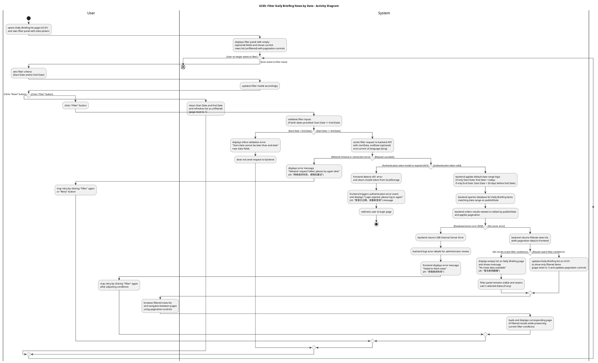
##### 2.3.5.4 Activity Diagram Description
**The Activity Diagram for Filter Daily Briefing News by Date** illustrates the interaction between the **User** and the **System** when the user filters Daily Briefing items by date range:

- The activity diagram starts when the **User** opens the Daily Briefing list page (UI-01) and sees the filter panel with date pickers. The **System** displays the filter panel with empty (optional) fields and shows the current news list (unfiltered), with pagination controls when multiple pages exist.
- **User** sets filter criteria (**Start Date** and/or **End Date**), and the **System** updates the filter model accordingly.
- The diagram includes an optional **"Reset"** action: when the user clicks the **"Reset"** button, the system clears Start Date and End Date and refreshes the list as unfiltered (page reset to 1), allowing the user to start over.
- When the **User** clicks the **"Filter"** button, the **System** first performs **client-side validation** on the input values. If both dates are provided and the start date is later than the end date, the system shows an inline validation error message (e.g., "Start date cannot be later than end date") near the date fields and does not send any request to the backend. The user can then correct the dates and click "Filter" again.
- When validation passes, the **System** sends a filter request to the backend API, including any provided parameters (`startDate`, `endDate`) and the current UI language (`lang`). If a **network timeout or connection error** occurs, the system displays an error message "Network request failed, please try again later" (zh: "网络请求失败，请稍后重试"). The user may retry the operation by clicking a "Retry" button or by clicking "Filter" again; the system re-sends the request with the same filter parameters. If the **authentication token is invalid or expired** (401 Unauthorized), the frontend detects the 401 error, clears the invalid token from localStorage, triggers an authentication error event, displays "登录已过期，请重新登录" / "Login expired, please log in again" message, and redirects the user to the login page, ending the use case.
- On the backend, the system first applies **default date range logic** when only one date is provided: if only `startDate` is provided, the backend sets `endDate` to today; if only `endDate` is provided, the backend sets `startDate` to 30 days before the provided end date. The system then queries the database for Daily Briefing items matching the provided conditions (date range on `publishDate`), orders results from newest to oldest by `publishDate`, and applies pagination. If a **database/server error** occurs, the backend encounters an error while querying the database and returns a 500 Internal Server Error. The frontend displays an error message "Failed to fetch news" (zh: "获取新闻失败"), while the backend logs the error details for administrator review. The user may retry by clicking "Filter" again after adjusting conditions, or retry later.
- If the query succeeds, the **Backend** returns the filtered news list (with pagination data) to the frontend. **System** receives either an empty result set or a list of matching news items. When no items match the filter conditions, the system displays an empty list on the Daily Briefing page and shows a message "No news data available" (zh: "暂无新闻数据"). The filter panel remains visible and retains the user's selected dates (if any) so that the user can easily adjust them. When items are found, the system updates the Daily Briefing list on UI-01 to show only filtered items (page reset to 1) and updates pagination controls accordingly.
- **User** can then browse the filtered news list and navigate between pages using pagination controls. The **System** loads and displays the corresponding page of filtered results while preserving the current filter conditions. The user may adjust filter criteria and click "Filter" again (or reset), which causes the system to repeat the validation-and-query flow with the new conditions, as shown in the activity diagram's repeat loop.

##### 2.3.6 UCD-06: Search for Daily Briefing News

###### 2.3.6.1 User Requirement Specification (URS) and System Requirement Specification (SRS)

**URS-06**: User can type Chinese or English keywords into a search box on the Daily Briefing page and view only Daily Briefing items that match the entered keywords.

**SRS-33**: The system shall provide a search box on the Daily Briefing list page (UI-01) that allows users to enter keywords in Chinese or English. The search box shall have (as implemented in `DailyBriefing.vue`):
- A text input field with placeholder text "Search by keywords (Chinese/English)..." (zh: "输入关键词搜索（中英文）...").
- A search button (icon: "el-icon-search") that triggers the search when clicked.
- Support for triggering search by pressing the Enter key.
- A clear button that appears when the search box contains text, allowing users to clear the search keyword and trigger a new search.

**SRS-34**: When the user enters keywords and triggers the search (by clicking the search button or pressing Enter), the system shall:
- Trim whitespace from the keyword input.
- Reset the current page to page 1.
- Send a search request to the backend API including the keyword parameter (`keyword`) and the current UI language (`lang`).
- If the user has also set date filter conditions (Start Date and/or End Date), the system shall include those parameters in the same request, allowing combined search and date filtering.

**SRS-35**: The backend shall search for Daily Briefing items where the keyword matches any of the following fields (case-insensitive partial match):
- `title` (original title)
- `originalContent` (original content)
- `summary` (AI-generated summary)
- `titleZh` (Chinese translated title)
- `titleEn` (English translated title)
- `summaryZh` (Chinese translated summary)
- `summaryEn` (English translated summary)

**SRS-36**: The backend shall apply the search logic as follows:
- If only a keyword is provided (no date filter), the system shall search across **all historical news** in the database.
- If both keyword and date range are provided, the system shall search only within news items whose publication date (`publishDate`) falls within the specified date range (inclusive).
- Results shall be **paginated** and ordered from newest to oldest by **publication date** (`publishDate` descending).

**SRS-37**: The system shall update the Daily Briefing list page (UI-01) to display only the news items that match the search keyword, **resetting the results view to the first page** while preserving pagination controls for navigating through multiple result pages.

**SRS-38**: If no news items match the search keyword (and any date filter conditions), the system shall display an empty list and a user-friendly message "No news data available" (zh: "暂无新闻数据") while keeping the search box visible and retaining the entered keyword so that the user can modify it and retry.

**SRS-39**: When the user clears the search keyword (by clicking the clear button), the system shall:
- Clear the search keyword from the input field.
- Reset the current page to page 1.
- Send a new request to the backend without the keyword parameter, effectively showing all news (or filtered by date range if date filters are active).

###### 2.3.6.2 Use Case Description

| Use Case ID | UC-06 |
|------------|------|
| Use Case Name | Search for Daily Briefing News |
| Created By | ZhiYi Pan |
| Date Created | 14/01/2026 |
| Last Update By | |
| Last Revision Date | |
| Actors | User |
| Description | User can type Chinese or English keywords into a search box on the Daily Briefing page and view only Daily Briefing items that match the entered keywords. The search can be combined with date filtering to narrow down results. |
| Trigger | User is on the Daily Briefing list page (UI-01) and enters keywords into the search box, then clicks the search button or presses Enter. |
| Preconditions | 1. User is logged into the BridgeU platform.<br>2. User has an active internet connection.<br>3. The Daily Briefing system has successfully crawled news from approved sources and stored publication dates and content.<br>4. The search box is visible on the Daily Briefing list page (UI-01). |

**Use Case Input Specification**

| Input | type | Constraint | Example |
|-------|------|------------|---------|
| Keyword | String | Can be Chinese or English characters; can contain spaces; will be trimmed of leading/trailing whitespace | "泰国" or "Thailand" or "travel" |

**Post conditions**:
- The Daily Briefing list page (UI-01) displays only news items that match the entered keyword (and any date filter conditions if set), ordered from newest to oldest by publication date, with pagination.

**Normal Flows**

| User (Actions) | System (Responses) |
|----------------|-------------------|
| 1. User opens the Daily Briefing list page (UI-01) and sees the search box. | 2. System displays the search box with placeholder text and shows the current news list (unfiltered), with pagination controls when multiple pages exist. |
| 3. User types keywords (Chinese or English) into the search box. | 4. System updates the search keyword model accordingly. |
| 5. User clicks the **"Search"** button or presses **Enter**. | 6. System trims whitespace from the keyword input.<br>   • `[E1: Invalid keyword input]`<br>7. System resets the current page to page 1.<br>8. System sends a search request to the backend API including the keyword parameter (`keyword`), any date filter parameters (if set), and the current UI language (`lang`).<br>   • `[E2: Authentication token invalid or expired]`<br>   • `[E3: Network timeout or connection error]` |
| | 9. Backend searches the database for Daily Briefing items where the keyword matches any of the searchable fields (title, originalContent, summary, and all translation fields). If date filters are provided, the search is limited to items within the date range. Results are ordered from newest to oldest by `publishDate` and paginated.<br>   • `[E4: Database error or server error]` |
| | 10. Backend returns the search results (with pagination data) to the frontend. |
| | 11. System updates the Daily Briefing list on UI-01 to show only matching items (page reset to 1) and updates pagination controls accordingly.<br>   • `[A1: No news match search keyword]` |
| 12. User browses the search results and can navigate between pages using pagination controls. | 13. System loads and displays the corresponding page of search results while preserving the current search keyword and any date filter conditions. |
| 14. User may modify the search keyword and click "Search" again (or clear the keyword). | 15. System repeats the search flow with the new keyword. |
| 16. (Optional) User clicks the **clear button** in the search box. | 17. System clears the search keyword, resets the current page to page 1, and sends a new request without the keyword parameter (showing all news or filtered by date range if date filters are active). |

**Alternative Flow**

**`[A1: No news match search keyword]`**
- A1.1 Backend returns an empty result set for the specified search keyword (and any date filter conditions).
- A1.2 System displays an empty list on the Daily Briefing page and shows a message "No news data available" (zh: "暂无新闻数据").
- A1.3 Search box remains visible and retains the user's entered keyword so that the user can easily modify it and retry.
- A1.4 Use case ends or continues when the user modifies the keyword and clicks "Search" again.

**Exception Flows**

**`[E1: Invalid keyword input]`**
- E1.1 System detects that the keyword input exceeds the maximum allowed length (e.g., more than 200 characters) or contains invalid characters after trimming whitespace.
- E1.2 System displays an inline validation error message near the search box (e.g., "Keyword is too long" or "Invalid characters in keyword").
- E1.3 System does not send a request to the backend.
- E1.4 User can correct the keyword and click "Search" again (return to step 5).

**`[E2: Authentication token invalid or expired]`**
- E2.1 System returns a 401 Unauthorized response (if authentication is required for this operation).
- E2.2 Frontend detects the 401 error and clears the invalid token from localStorage.
- E2.3 Frontend triggers an authentication error event and displays "登录已过期，请重新登录" / "Login expired, please log in again" message.
- E2.4 System redirects the user to the login page.
- E2.5 Use case ends.

**`[E3: Network timeout or connection error]`**
- E3.1 The request to the backend times out or fails due to network issues.
- E3.2 System displays an error message "Network request failed, please try again later" (zh: "网络请求失败，请稍后重试").
- E3.3 User may retry the operation by clicking the "Search" button again; the system re-sends the request with the same search parameters (return to step 8).

**`[E4: Database error or server error]`**
- E4.1 Backend encounters an error while querying the database and returns a 500 Internal Server Error.
- E4.2 Frontend displays an error message "Failed to fetch news" (zh: "获取新闻失败").
- E4.3 Backend logs the error details for administrator review.
- E4.4 User may retry by clicking "Search" again after modifying the keyword, or retry later.

**Note**:
- The search functionality can be combined with date filtering. When both keyword and date filters are provided, the system searches only within news items that match both the keyword and the date range.
- If only a keyword is provided (no date filter), the system searches across all historical news in the database.
- Search results are displayed in chronological order (newest to oldest by publication date) and reset to page 1 when a new search is performed.
- The search box remains visible after searching, allowing users to modify keywords and re-search without losing their search context.
- When the user clears the search keyword, the system removes the keyword filter and shows all news (or filtered by date range if date filters are active), resetting pagination to page 1.

###### 2.3.6.3 Activity Diagram
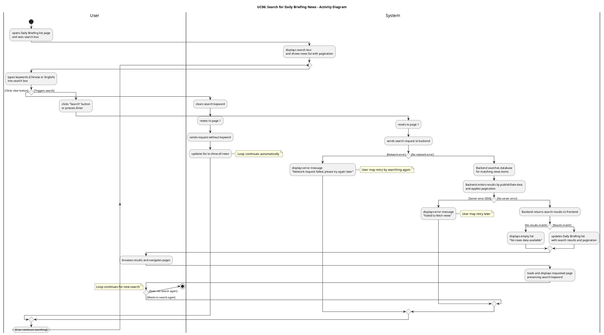
##### 2.3.6.4 Activity Diagram Description

**The Activity Diagram for Search for Daily Briefing News** illustrates the interaction between the **User** and the **System** when the user searches for Daily Briefing items by entering keywords:

- The activity diagram starts when the **User** opens the Daily Briefing list page (UI-01) and sees the search box. The **System** displays the search box with placeholder text "Search by keywords (Chinese/English)..." (zh: "输入关键词搜索（中英文）...") and shows the current news list (unfiltered), with pagination controls when multiple pages exist.
- **User** types keywords (Chinese or English) into the search box, and the **System** updates the search keyword model accordingly.
- The diagram includes a **clear button** action: when the user clicks the clear button in the search box, Element UI's `clearable` feature automatically clears the search keyword from the input field and triggers the `@clear` event, which calls the `handleSearch()` method. The `handleSearch()` method resets the current page to page 1 and calls `fetchDailyBriefing()`. Inside `fetchDailyBriefing()`, the system builds request parameters. Since the keyword is now empty (cleared by Element UI), it is not included in the request parameters. The system then sends a new request to the backend without the keyword parameter, effectively showing all news (or filtered by date range if date filters are active). The system updates the Daily Briefing list to show all news (or date-filtered results).
- When the **User** clicks the **"Search"** button or presses **Enter**, the **System** calls the `handleSearch()` method, which resets the current page to page 1 and calls `fetchDailyBriefing()`. Inside `fetchDailyBriefing()`, the system trims whitespace from the keyword input (if the keyword exists) and builds request parameters. The request includes the following parameters: `page` (0-based page index), `size` (page size), `keyword` (only included if not empty after trimming), `startDate` and `endDate` (if date filters are set), and `lang` (current UI language). The system then sends the search request to the backend API. If a **network timeout or connection error** occurs, the system displays an error message "Network request failed, please try again later" (zh: "网络请求失败，请稍后重试"). The user may retry the operation by clicking the "Search" button again; the system re-sends the request with the same search parameters. If the **authentication token is invalid or expired** (401 Unauthorized), the axios response interceptor in `api.js` detects the 401 error, clears the invalid token from localStorage, dispatches an `auth:unauthorized` custom event, which is handled by `App.vue` to log out the user, displays "登录已过期，请重新登录" / "Login expired, please log in again" message, and redirects the user to the login page, ending the use case.
- On the backend, the system searches the database for Daily Briefing items where the keyword matches any of the searchable fields: `title`, `originalContent`, `summary`, `titleZh`, `titleEn`, `summaryZh`, and `summaryEn` (case-insensitive partial match). If date filters are provided, the backend limits the search to items within the specified date range on `publishDate`. If no date filters are provided, the backend searches across all historical news in the database (no date restriction). The system then orders results from newest to oldest by `publishDate` and applies pagination. If a **database/server error** occurs, the backend encounters an error while querying the database and returns a 500 Internal Server Error. The frontend displays an error message "Failed to fetch news" (zh: "获取新闻失败"), while the backend logs the error details for administrator review. The user may retry by clicking "Search" again after modifying the keyword, or retry later.
- If the query succeeds, the **Backend** returns the search results (with pagination data) to the frontend. **System** receives either an empty result set or a list of matching news items. When no items match the search keyword (and any date filter conditions), the system displays an empty list on the Daily Briefing page and shows a message "No news data available" (zh: "暂无新闻数据"). The search box remains visible and retains the user's entered keyword so that the user can easily modify it and retry. When items are found, the system updates the Daily Briefing list on UI-01 to show only matching items (page reset to 1) and updates pagination controls accordingly.
- **User** can then browse the search results and navigate between pages using pagination controls. The **System** loads and displays the corresponding page of search results while preserving the current search keyword and any date filter conditions. The user may modify the search keyword and click "Search" again (or clear the keyword), which causes the system to repeat the search flow with the new keyword, as shown in the activity diagram's repeat loop.

#### 3.3.7 UCD-07: View Community Feed

##### 2.3.7.1 User Requirement Specification (URS) and System Requirement Specification (SRS)

**URS-07**: The User can browse the community feed with posts ordered from newest to oldest, showing title, preview, tags, like count, and comment count.

**SRS-40**: The system shall provide a Community Feed page (UI-Community-Feed) that lists posts ordered from newest to oldest by creation time.

**SRS-41**: Each post card on UI-Community-Feed shall display: author name/avatar, post title, a short preview, tags, like count, comment count, and publish time (localized by current interface language).

**SRS-42**: The system shall support pagination or infinite scrolling on UI-Community-Feed. In the implemented version, the feed uses **infinite scrolling** with a search box (`PostList.vue`), where scrolling loads additional posts based on the current search keyword (keyword-based matching) and language; there is no separate page number selector in the UI.

##### 2.3.7.2 Use Case Description

| Use Case ID | UC-07 |
|------------|------|
| Use Case Name | View Community Feed |
| Created By | ZhiYi Pan |
| Date Created | 23/01/2026 |
| Last Update By | |
| Last Revision Date | |
| Actors | User |
| Description | User opens the community feed and browses posts ordered from newest to oldest. |
| Trigger | User clicks "Community" entry in navigation. |
| Preconditions | 1. User is logged into the platform.<br>2. Network connection is available. |

**Use Case Input Specification**

| Input | type | Constraint | Example |
|-------|------|------------|---------|
| Page Number | Integer | Optional, default: 0 | 0 |
| Page Size | Integer | Optional, default: 20 | 20 |
| Language | String | Optional, "zh" or "en" | "en" |

**Post conditions**:
- User is viewing UI-Community-Feed with a list of posts (or an empty-state message).

**Normal Flows**

| User (Actions) | System (Responses) |
|----------------|-------------------|
| 1. User clicks "Community" in navigation. | 2. System opens UI-Community-Feed and requests latest posts (page 1).<br>   • `[E1: Network timeout or connection error]` |
| | 3. Backend returns post list (newest to oldest) with pagination metadata.<br>   • `[A1: No posts data]`<br>   • `[E2: Server error]` |
| 4. User browses posts and changes page/scrolls. | 5. System loads corresponding page and renders post cards. |

**Alternative Flow**

**`[A1: No posts data]`**
- A1.1 Backend returns an empty list.
- A1.2 System displays an empty-state message on UI-Community-Feed.
- A1.3 Use case end.

**Exception Flows**

**`[E1: Network timeout or connection error]`**
- E1.1 Request fails due to network issues.
- E1.2 System displays a localized error message and provides a retry action.
- E1.3 Use case end.

**`[E2: Server error]`**
- E2.1 Backend returns 5xx (服务器错误) due to internal error.
- E2.2 System displays an error message and provides a retry action.
- E2.3 Use case end.

**Note**:
- The community feed uses infinite scrolling with a search box (`PostList.vue`), where scrolling loads additional posts based on the current search keyword and language preference.
- Posts are ordered from newest to oldest by creation time, and each post card displays author information, title preview, tags, engagement metrics (like count, comment count), and publish time localized by the current interface language.
- The feed supports pagination on the backend (page-based), but the frontend implements infinite scrolling for better user experience.
- When no posts are available, the system displays an empty-state message to guide the user.

##### 2.3.7.3 Activity Diagram

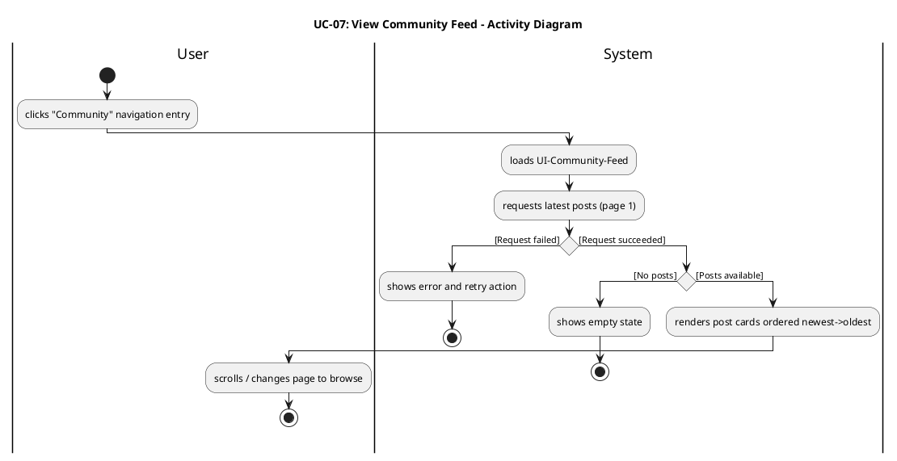

#### 3.3.8 UCD-08: Create Publish Post

##### 2.3.8.1 User Requirement Specification (URS) and System Requirement Specification (SRS)

**URS-08**: The User can create or edit posts in their preferred language (Chinese, English), upload images, select a tag from predefined categories (Study, Housing, Travel, Part-time Job, Life Services), and have the system automatically generate bilingual (Chinese/English) content using Qwen AI for later display.

**SRS-43**: The system shall provide a "Create Post" entry on UI-Community-Feed that opens a post editor (UI-Community-PostEditor). This is implemented as the `NewPostForm.vue` component, which can be opened from the sidebar or community feed.

**SRS-44**: UI-Community-PostEditor shall support entering title/body text, selecting **exactly one** predefined tag from the list (Study, Housing, Travel, Part-time Job, Life Services), and uploading **at most one** image; these are implemented as a single-select tag pill group and a single-image upload with preview in `NewPostForm.vue`.

**SRS-45**: When the user submits a post, the backend shall persist the post, run AI moderation and generate bilingual copies (ZH/EN) via Qwen AI translation, storing both language versions for retrieval. Only posts with status `APPROVED` are returned in the community feed (`PostController.listPosts`).

##### 2.3.8.2 Use Case Description

| Use Case ID | UC-08 |
|------------|------|
| Use Case Name | Create Publish Post |
| Created By | ZhiYi Pan |
| Date Created | 23/01/2026 |
| Last Update By | |
| Last Revision Date | |
| Actors | User |
| Description | User creates a post with text/tags/images and publishes it to the community feed; the system stores bilingual content. |
| Trigger | User clicks "Create Post". |
| Preconditions | 1. User is logged in.<br>2. Network connection is available. |

**Use Case Input Specification**

| Input | type | Constraint | Example |
|-------|------|------------|---------|
| Title | String | Required, not empty | "Looking for housing" |
| Body | String | Required, not empty | "I need a room near CMU" |
| Tag | String | Required, must be one of: Study, Housing, Travel, Part-time Job, Life Services | "Housing" |
| Image | File | Optional, image file (JPEG, PNG, GIF, WebP) | image.jpg |

**Post conditions**:
- A new post is published and visible in the feed (and/or Post Detail page) in the selected language, with bilingual content stored on backend.

**Normal Flows**

| User (Actions) | System (Responses) |
|----------------|-------------------|
| 1. User opens UI-Community-PostEditor. | 2. System displays editor with title/body/tag/image inputs. |
| 3. User fills title/body, selects tag(s), uploads images. | 4. System updates editor model and shows previews. |
| 5. User clicks "Publish". | 6. System validates required fields and, if validation passes, frontend sends create-post request.<br>   • `[A1: Validation failed]`<br>   • `[E1: Network timeout or connection error]` |
| | 7. Backend saves post and invokes Qwen AI translation to generate ZH/EN fields.<br>   • `[E2: Translation/Server error]` |
| | 8. Backend returns success with created post ID. |
| 9. User views created post. | 10. System navigates to feed or Post Detail and renders the post. |

**Alternative Flow**

**`[A1: Validation failed]`**
- A1.1 System validates required fields (e.g., title/body not empty).
- A1.2 System shows validation errors; user edits and resubmits.

**Exception Flows**

**`[E1: Network timeout or connection error]`**
- E1.1 Create-post request fails due to network issues.
- E1.2 System displays a localized error message and allows retry.
- E1.3 Use case end.

**`[E2: Translation/Server error]`**
- E2.1 Backend returns 5xx (服务器错误) due to AI service failure or internal error.
- E2.2 System displays an error message and allows retry.
- E2.3 Use case end.

**Note**:
- Users can create posts in their preferred language (Chinese or English), and the system automatically generates bilingual content (ZH/EN) using Qwen AI translation service.
- The post creation form supports image uploads, tag selection from predefined categories (Study, Housing, Travel, Part-time Job, Life Services), and title/body text input.
- After successful post creation, the system navigates to the community feed or post detail page, and the new post appears in the feed with bilingual content available for all users.
- Posts are subject to moderation (PENDING_REVIEW status initially) and will only appear in the public feed after approval by administrators.

##### 2.3.8.3 Activity Diagram

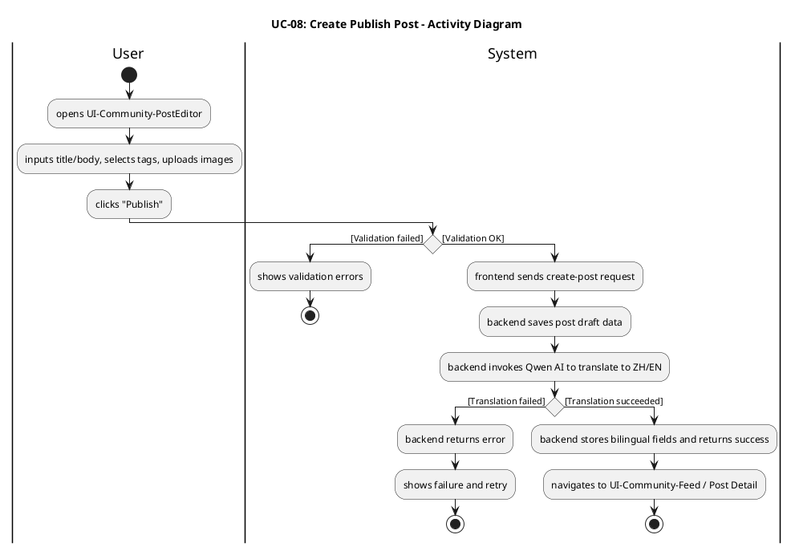

#### 3.3.9 UCD-09: Like Post

##### 2.3.9.1 User Requirement Specification (URS) and System Requirement Specification (SRS)

**URS-09**: The User can like posts to express positive feedback, and the like count updates immediately.

**SRS-52**: The system shall allow a user to like/unlike a post from UI-Community-Feed and UI-Community-PostDetail.

**SRS-53**: The system shall update the like state and like count optimistically in the UI, and reconcile with backend response.

**SRS-54**: The backend shall prevent duplicate likes by the same user for the same post (idempotent like).

##### 2.3.9.2 Use Case Description

| Use Case ID | UC-09 |
|------------|------|
| Use Case Name | Like Post |
| Created By | ZhiYi Pan |
| Date Created | 23/01/2026 |
| Last Update By | |
| Last Revision Date | |
| Actors | User |
| Description | User likes (or unlikes) a post and sees the like count update. |
| Trigger | User clicks the like icon/button on a post. |
| Preconditions | 1. User is logged in.<br>2. Post is visible in feed or post detail. |

**Use Case Input Specification**

| Input | type | Constraint | Example |
|-------|------|------------|---------|
| Post ID | String/Number | Must be a valid post ID | "123" |

**Post conditions**:
- The post like state is updated for the user, and the like count is updated in UI.

**Normal Flows**

| User (Actions) | System (Responses) |
|----------------|-------------------|
| 1. User clicks Like on a post. | 2. System toggles like state and updates like count optimistically.<br>   • `[A1: Unlike a liked post]` |
| | 3. Frontend sends like/unlike request to backend.<br>   • `[E1: Network timeout or connection error]` |
| | 4. Backend records like/unlike (idempotent) and returns updated counts/state.<br>   • `[E2: Server error]` |
| 5. User continues browsing. | 6. System reconciles UI with backend response. |

**Alternative Flow**

**`[A1: Unlike a liked post]`**
- A1.1 User clicks Like again on an already-liked post.
- A1.2 System toggles to unlike state and sends unlike request.
- A1.3 Backend removes like (or toggles state) and returns updated counts.

**Exception Flows**

**`[E1: Network timeout or connection error]`**
- E1.1 Like/unlike request fails due to network issues.
- E1.2 System rolls back optimistic UI and shows error message.
- E1.3 Use case end.

**`[E2: Server error]`**
- E2.1 Backend returns an error response (e.g., 500 Internal Server Error, 503 Service Unavailable).
- E2.2 System rolls back optimistic UI and shows error message to the user.
- E2.3 Use case end.

**Note**:
- The like/unlike action uses optimistic UI updates to provide immediate feedback to the user, then reconciles with the backend response to ensure accuracy.
- The backend prevents duplicate likes by the same user for the same post (idempotent like operation), ensuring data consistency.
- Like counts are updated in real-time across all views where the post is displayed (feed and post detail pages).
- Users can like posts from both the community feed and post detail pages, with the like state synchronized across all views.

##### 2.3.9.3 Activity Diagram

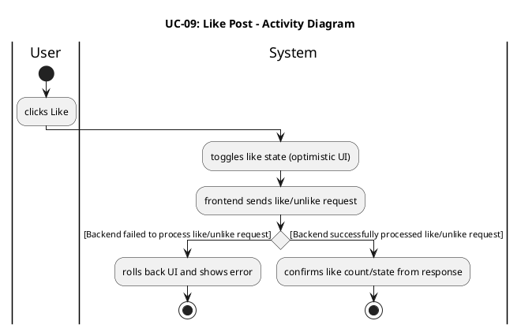

#### 3.3.10 UCD-10: Filter by Tag

##### 2.3.10.1 User Requirement Specification (URS) and System Requirement Specification (SRS)

**URS-10**: The User can filter posts by selecting tags from the predefined list (Study, Housing, Travel, Part-time Job, Life Services).

**SRS-55**: UI-Community-Feed shall provide a tag filter control with the predefined tag list.

**SRS-56**: When a user applies a tag filter, the system shall reload the feed results limited to the selected tag(s), and reset pagination to the first page.

##### 2.3.10.2 Use Case Description

| Use Case ID | UC-10 |
|------------|------|
| Use Case Name | Filter by Tag |
| Created By | ZhiYi Pan |
| Date Created | 23/01/2026 |
| Last Update By | |
| Last Revision Date | |
| Actors | User |
| Description | User filters the community feed by tag(s). |
| Trigger | User selects one or more tags and applies filter. |
| Preconditions | 1. User is on UI-Community-Feed. |

**Use Case Input Specification**

| Input | type | Constraint | Example |
|-------|------|------------|---------|
| Selected Tag(s) | String[] | Must be one or more predefined tags: Study, Housing, Travel, Part-time Job, Life Services | ["Housing", "Travel"] |

**Post conditions**:
- Feed displays only posts matching selected tag(s) (or an empty-state message).

**Normal Flows**

| User (Actions) | System (Responses) |
|----------------|-------------------|
| 1. User selects tag(s) in tag filter. | 2. System updates selected tag filter state. |
| 3. User applies filter. | 4. System resets page to 1 and requests filtered posts.<br>   • `[E1: Network timeout or connection error]` |
| | 5. Backend returns filtered post list ordered newest->oldest.<br>   • `[A1: No posts match the tag filter]`<br>   • `[E2: Server error]` |
| 6. User browses filtered results. | 7. System renders filtered feed and pagination. |

**Alternative Flow**

**`[A1: No posts match the tag filter]`**
- A1.1 Backend returns an empty list.
- A1.2 System shows empty-state message and keeps tag filter visible.
- A1.3 Use case end.

**Exception Flows**

**`[E1: Network timeout or connection error]`**
- E1.1 Filter request fails due to network issues.
- E1.2 System shows error and retry action; selected tag(s) remain.
- E1.3 Use case end.

**`[E2: Server error]`**
- E2.1 Backend returns 5xx (服务器错误).
- E2.2 System shows error and retry action.
- E2.3 Use case end.

**Note**:
- Tag filtering can be combined with search functionality; when both tag filter and search keyword are applied, the system returns posts that match both conditions.
- The predefined tag categories are: Study (学习), Housing (住房), Travel (旅行), Part-time Job (兼职), and Life Services (生活服务).
- When a tag filter is applied, pagination is reset to page 1, and the feed displays only posts matching the selected tag(s).
- Users can select multiple tags simultaneously to filter posts by any of the selected tags (OR logic).

##### 2.3.10.3 Activity Diagram

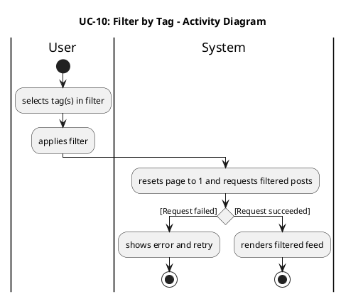

#### 3.3.11 UCD-11: View Post Details

##### 2.3.11.1 User Requirement Specification (URS) and System Requirement Specification (SRS)

**URS-11**: The User can view post details including full text, images, tags, engagement metrics (likes, comments), and author profile when clicking on a post, with content displayed in the current interface language using the stored bilingual fields.

**SRS-57**: When a user clicks a post card on UI-Community-Feed, the system shall navigate to UI-Community-PostDetail for that post ID.

**SRS-58**: UI-Community-PostDetail shall display post content in the current interface language, loading the corresponding bilingual field (ZH/EN).

**SRS-59**: UI-Community-PostDetail shall display: full body text, images, tags, like count, comment count, and author profile entry.

##### 2.3.11.2 Use Case Description

| Use Case ID | UC-11 |
|------------|------|
| Use Case Name | View Post Details |
| Created By | ZhiYi Pan |
| Date Created | 23/01/2026 |
| Last Update By | |
| Last Revision Date | |
| Actors | User |
| Description | User opens a post detail page and reads the post and its comments in selected language. |
| Trigger | User clicks a post card from feed/search results. |
| Preconditions | 1. User is logged in.<br>2. Post exists and is accessible. |

**Use Case Input Specification**

| Input | type | Constraint | Example |
|-------|------|------------|---------|
| Post ID | String/Number | Must be a valid post ID | "123" |
| Language | String | Optional, "zh" or "en" | "en" |

**Post conditions**:
- User is viewing UI-Community-PostDetail with post content and comment list displayed in current interface language.

**Normal Flows**

| User (Actions) | System (Responses) |
|----------------|-------------------|
| 1. User clicks a post card. | 2. System navigates to UI-Community-PostDetail and requests post details + comments.<br>   • `[E1: Network timeout or connection error]` |
| | 3. Backend returns post data (ZH/EN fields), images/tags/metrics, and comment list.<br>   • `[A1: Post has no comments]`<br>   • `[E2: Post not found / access denied]` |
| 4. User reads post and scrolls comments. | 5. System renders post body in selected language and displays comments/metrics. |

**Alternative Flow**

**`[A1: Post has no comments]`**
- A1.1 Backend returns empty comment list.
- A1.2 System displays "No comments yet" empty state in comments section.
- A1.3 Use case end.

**Exception Flows**

**`[E1: Network timeout or connection error]`**
- E1.1 Request fails due to network issues.
- E1.2 System shows error and retry action.
- E1.3 Use case end.

**`[E2: Post not found / access denied]`**
- E2.1 Backend returns 404 (not found) or 403 (forbidden).
- E2.2 System shows a user-friendly message and navigates back to feed.
- E2.3 Use case end.

**Note**:
- Post details are displayed in the user's current interface language preference, loading the corresponding bilingual field (titleZh/titleEn, bodyZh/bodyEn) based on the `lang` parameter.
- The post detail page displays full body text, images, tags, engagement metrics (like count, comment count), author profile entry, and the complete comment list.
- Users can perform extended actions from the post detail page, such as liking the post, posting comments, reporting the post/comment, and viewing AI-generated comment summaries.
- If a post has no comments, the system displays an empty state message in the comments section, but the post content remains fully accessible.

##### 2.3.11.3 Activity Diagram

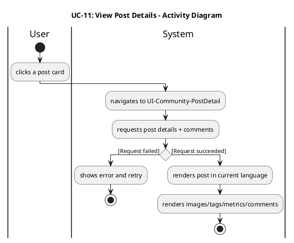

#### 3.3.12 UCD-12: Report Post/Comment

##### 2.3.12.1 User Requirement Specification (URS) and System Requirement Specification (SRS)

**URS-12**: The User can report posts/comments with structured reasons (Spam, Fraud or Scam, Illegal Service Promotion, Abusive Language, Other) and provide explanatory text.

**SRS-60**: The system shall provide a "Report" action for posts and comments on UI-Community-Feed and UI-Community-PostDetail.

**SRS-61**: The system shall show a report dialog that requires selecting a reason and optionally entering additional description text.

**SRS-62**: The backend shall store the report record with reporter ID, target type (post/comment), target ID, reason, description, and timestamp.

##### 2.3.12.2 Use Case Description

| Use Case ID | UC-12 |
|------------|------|
| Use Case Name | Report Post/Comment |
| Created By | ZhiYi Pan |
| Last Update By | ZhiYi Pan |
| Date Created | 23/01/2026 |
| Last Revision Date | |
| Actors | User |
| Description | User reports inappropriate content with a structured reason and optional description. |
| Trigger | User clicks "Report" on a post or comment. |
| Preconditions | 1. User is logged in.<br>2. Target post/comment is visible. |

**Use Case Input Specification**

| Input | type | Constraint | Example |
|-------|------|------------|---------|
| Target Type | String | Must be "post" or "comment" | "comment" |
| Target ID | String/Number | Must be a valid ID | "321" |
| Reason | String | Must be one of predefined reasons | "Spam" |
| Description (optional) | String | Max length (implementation-defined) | "Repeated ads" |

**Post conditions**:
- A report record is created, and user sees confirmation feedback.

**Normal Flows**

| User (Actions) | System (Responses) |
|----------------|-------------------|
| 1. User clicks "Report" on a post/comment. | 2. System opens report dialog.<br>   • `[A1: User cancels reporting]` |
| 3. User selects a reason and enters optional description. | 4. System validates inputs.<br>   • `[E1: Validation failed]` |
| 5. User submits report. | 6. Frontend sends report request to backend.<br>   • `[E2: Network/server error]` |
| | 7. Backend stores report record and returns success. |
| 8. User sees confirmation. | 9. System shows "Report submitted" message and closes dialog. |

**Alternative Flow**

**`[A1: User cancels reporting]`**
- A1.1 User closes the report dialog without submitting.
- A1.2 System discards input and returns to previous view.
- A1.3 Use case end.

**Exception Flows**

**`[E1: Validation failed]`**
- E1.1 Reason is not selected (or required fields missing).
- E1.2 System shows validation提示 and prevents submit.
- E1.3 Use case end.

**`[E2: Network/server error]`**
- E2.1 Request fails due to network issues or backend returns 5xx (服务器错误).
- E2.2 System shows error message and allows retry.
- E2.3 Use case end.

**Note**:
- Users can report both posts and comments with structured reasons: Spam (垃圾信息), Fraud or Scam (欺诈或诈骗), Illegal Service Promotion (非法服务推广), Abusive Language (辱骂语言), and Other (其他).
- The report dialog requires selecting at least one reason, and users can optionally provide additional descriptive text to explain the report.
- Report records are stored with reporter ID, target type (post/comment), target ID, reason(s), description, and timestamp for administrative review.
- After submission, users receive confirmation feedback, and the reported content may be subject to moderation workflow based on the report reason and AI analysis.

##### 2.3.12.3 Activity Diagram

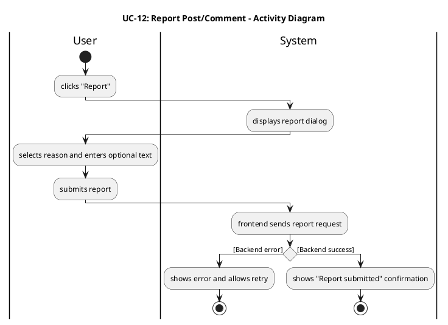

#### 3.3.13 UCD-13: Post Comment

##### 2.3.13.1 User Requirement Specification (URS) and System Requirement Specification (SRS)

**URS-13**: The User can post comments to interact with other users, which will be automatically translated by the system into Chinese and English; users can delete their own comments.

**SRS-63**: UI-Community-PostDetail shall provide a comment input box for logged-in users to post a comment.

**SRS-64**: When a comment is submitted, the backend shall store the comment and generate bilingual copies (ZH/EN) via Qwen AI translation.

**SRS-65**: The system shall allow the comment author to delete their own comment; deleting shall remove it from display and update comment count.

##### 2.3.13.2 Use Case Description

| Use Case ID | UC-13 |
|------------|------|
| Use Case Name | Post Comment |
| Created By | ZhiYi Pan |
| Date Created | 23/01/2026 |
| Last Update By | |
| Last Revision Date | |
| Actors | User |
| Description | User posts a comment under a post; the system translates and displays it. |
| Trigger | User submits comment on Post Detail page. |
| Preconditions | 1. User is logged in.<br>2. Post Detail page is loaded. |

**Use Case Input Specification**

| Input | type | Constraint | Example |
|-------|------|------------|---------|
| Post ID | String/Number | Must be a valid post ID | "123" |
| Comment Text | String | Required, not empty after trimming | "Great post!" |

**Post conditions**:
- A new comment is displayed under the post in current interface language, and backend stores bilingual comment content.

**Normal Flows**

| User (Actions) | System (Responses) |
|----------------|-------------------|
| 1. User enters comment text. | 2. System updates comment input model. |
| 3. User clicks "Submit". | 4. System validates the comment and, if valid, frontend sends create-comment request.<br>   • `[E1: Network timeout or connection error]` |
| | 5. Backend stores comment and invokes Qwen AI translation to generate ZH/EN fields.<br>   • `[E2: Translation/Server error]` |
| | 6. Backend returns success with new comment. |
| 7. User views the new comment. | 8. System appends comment to list and updates comment count. |

**Exception Flows**

**`[E1: Network timeout or connection error]`**
- E1.1 Create-comment request fails due to network issues.
- E1.2 System shows error message and allows retry.
- E1.3 Use case end.

**`[E2: Translation/Server error]`**
- E2.1 Backend returns 5xx (服务器错误) due to AI service failure or internal error.
- E2.2 System shows error message and allows retry.
- E2.3 Use case end.

**Note**:
- Comments are automatically translated by the system into both Chinese and English using Qwen AI translation service, ensuring bilingual content availability for all users.
- When a user posts a comment, the backend stores the original comment text and generates bilingual copies (commentZh, commentEn) before saving to the database.
- Users can delete their own comments, which removes the comment from display and updates the comment count on the post.
- Comments are displayed in the user's current interface language preference, and the comment list is ordered by creation time (newest first).

##### 2.3.13.3 Activity Diagram

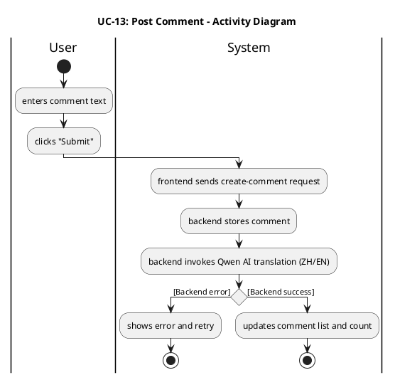

#### 3.3.14 UCD-14: Search Posts

##### 2.3.14.1 User Requirement Specification (URS) and System Requirement Specification (SRS)

**URS-14**: The User can search posts by keyword across bilingual content (titles and body texts in both Chinese and English), and view posts ordered by relevance score (highest match score first) in the search results.

**SRS-66**: UI-Community-Feed shall provide a search box for post search. In the implemented version (`PostList.vue`), the search box sends the query as `q` to the `/api/posts` endpoint when the user presses Enter or clicks the search button.

**SRS-67**: When a keyword is provided, the backend shall perform **keyword-based matching** using `SemanticService.calculateScore()` on the bilingual post fields (title and body in Chinese and English). The service uses tokenization, synonym expansion, and match score calculation. Posts with a positive match score (> 0) are returned, **ordered by descending match score** (highest relevance first), not by creation time.

**SRS-68**: When no keyword is provided, the backend shall return posts ordered from newest to oldest by creation time, filtered to only `APPROVED` posts and excluding system-generated news posts; the frontend shall display a user-friendly empty-state when no results match the search keyword or when there are no posts.

##### 2.3.14.2 Use Case Description

| Use Case ID | UC-14 |
|------------|------|
| Use Case Name | Search Posts |
| Created By | ZhiYi Pan |
| Last Update By | ZhiYi Pan |
| Date Created | 23/01/2026 |
| Last Revision Date | |
| Actors | User |
| Description | User searches posts by keyword across bilingual content. |
| Trigger | User submits keyword in search box. |
| Preconditions | 1. User is on UI-Community-Feed. |

**Use Case Input Specification**

| Input | type | Constraint | Example |
|-------|------|------------|---------|
| Keyword | String | Not empty after trimming | "housing" |
| Selected Tag(s) (optional) | String[] | Must be predefined tags | ["Housing"] |

**Post conditions**:
- Feed shows search result posts ordered by relevance score (highest match score first, or empty-state).

**Normal Flows**

| User (Actions) | System (Responses) |
|----------------|-------------------|
| 1. User enters keyword and triggers search (Enter/Search). | 2. System trims keyword, resets page to 1, and requests search results (keyword + tag filter).<br>   • `[E1: Network timeout or connection error]` |
| | 3. Backend performs keyword-based matching using SemanticService on bilingual titles/bodies and returns results ordered by descending match score (highest relevance first).<br>   • `[A1: No results]`<br>   • `[E2: Server error]` |
| 4. User browses results. | 5. System renders results list and pagination; keyword remains in search box. |

**Alternative Flow**

**`[A1: No results]`**
- A1.1 Backend returns empty list.
- A1.2 System shows empty-state message and keeps search box visible.
- A1.3 Use case end.

**Exception Flows**

**`[E1: Network timeout or connection error]`**
- E1.1 Search request fails due to network issues.
- E1.2 System shows error and retry action; keyword remains.
- E1.3 Use case end.

**`[E2: Server error]`**
- E2.1 Backend returns 5xx (服务器错误).
- E2.2 System shows error and retry action.
- E2.3 Use case end.

**Note**:
- Post search uses keyword-based matching with semantic scoring via `SemanticService.calculateScore()` on bilingual post fields (title and body in both Chinese and English).
- Search results are ordered by descending match score (highest relevance first), not by creation time, to prioritize the most relevant posts for the user's query.
- The search functionality can be combined with tag filtering; when both keyword and tag filters are provided, the system searches only within posts that match both conditions.
- When no keyword is provided, the system returns posts ordered from newest to oldest by creation time, filtered to only `APPROVED` posts and excluding system-generated news posts.

##### 2.3.14.3 Activity Diagram

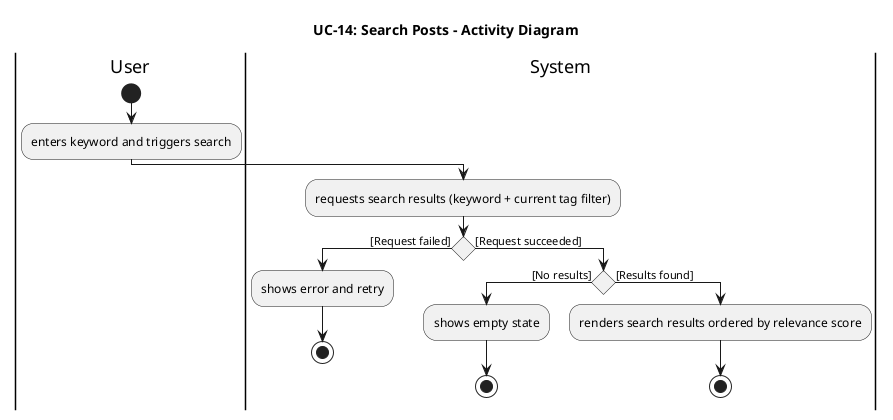

#### 3.3.15 UCD-15: Communicate with others

##### 2.3.15.1 User Requirement Specification (URS) and System Requirement Specification (SRS)

**URS-15**: Users who follow each other mutually can send and receive private messages, view message history, and (when allowed) send an initial invite message even before mutual follow is established.

**SRS-69**: The system shall allow mutually-following users to start a private chat from a user profile or mutual-follow list. In the implemented version (`UserProfile.vue`, `MutualFollowList.vue`, `ChatWindow.vue`), opening a chat loads history via `/api/messages/conversations/{conversationId}` and shows whether the relationship is mutual follow (`isMutualFollow`) and whether the user can send more messages (`canSendMore`).

**SRS-70**: The system shall display message history ordered by time and allow sending new messages in the current interface language. When the users are not mutually following, the backend (`MessageController`) enforces a **single-message limit** per conversation, returning an error with code `"SINGLE_MESSAGE_LIMIT"` and setting `canSendMore = false` once the limit is reached; the frontend disables further sending accordingly.

**SRS-71**: The backend shall persist messages with sender/receiver IDs, content, timestamps, and status flags (read/unread); marking as read is supported at both single-message and per-conversation level (`/api/messages/{messageId}/read`, `/api/messages/conversations/{conversationId}/read`), and the frontend updates read indicators (✓✓) in `ChatWindow.vue`.

##### 2.3.15.2 Use Case Description

| Use Case ID | UC-15 |
|------------|------|
| Use Case Name | Communicate with others |
| Created By | ZhiYi Pan |
| Date Created | 23/01/2026 |
| Last Update By | |
| Last Revision Date | |
| Actors | User |
| Description | Mutually-following users start a chat, view history, and send messages. |
| Trigger | User opens a chat with another user. |
| Preconditions | 1. Users are mutually following.<br>2. User is logged in. |

**Use Case Input Specification**

| Input | type | Constraint | Example |
|-------|------|------------|---------|
| Peer User ID | String/Number | Must be a valid user ID and mutually following | "88" |
| Message Content | String | Not empty after trimming | "Hi!" |

**Post conditions**:
- User can view message history and newly sent messages appear in the conversation.

**Normal Flows**

| User (Actions) | System (Responses) |
|----------------|-------------------|
| 1. User opens a chat with a mutually-following user. | 2. System loads chat UI and requests message history.<br>   • `[E1: Not mutually following]`<br>   • `[E2: Network/server error]` |
| | 3. Backend returns ordered message history.<br>   • `[A1: No message history]` |
| 4. User types a message and clicks send. | 5. Frontend sends message to backend.<br>   • `[E1: Not mutually following]`<br>   • `[E2: Network/server error]` |
| | 6. Backend persists message and returns success. |
| 7. User sees message delivered. | 8. System appends the message to chat view. |

**Alternative Flow**

**`[A1: No message history]`**
- A1.1 Backend returns empty history for a new conversation.
- A1.2 System displays empty chat state.
- A1.3 Use case continues (user can still send new messages).

**Exception Flows**

**`[E1: Not mutually following]`**
- E1.1 Backend rejects the chat open/send request (403).
- E1.2 System shows a user-friendly message and prevents sending.
- E1.3 Use case end.

**`[E2: Network/server error]`**
- E2.1 Load/send request fails due to network issues or backend returns 5xx (服务器错误).
- E2.2 System shows error message and allows retry.
- E2.3 Use case end.

**Note**:
- Private messaging is restricted to users who follow each other mutually; the backend enforces this relationship requirement before allowing message exchange.
- When users are not mutually following, the backend enforces a single-message limit per conversation, returning an error with code `"SINGLE_MESSAGE_LIMIT"` once the limit is reached.
- Messages are persisted with sender/receiver IDs, content, timestamps, and status flags (read/unread), and the system supports marking messages as read at both single-message and per-conversation levels.
- Message history is displayed ordered by time, and users can send new messages in their current interface language preference.

##### 2.3.15.3 Activity Diagram

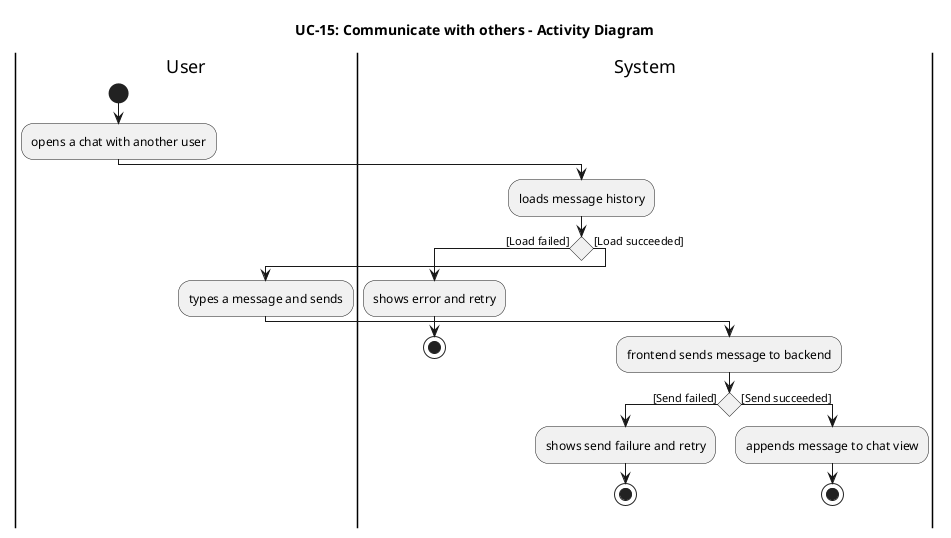

#### 3.3.16 UCD-16: Manage Message Status

##### 2.3.16.1 User Requirement Specification (URS) and System Requirement Specification (SRS)

**URS-16**: Users can manage message status (read/unread/delete).

**SRS-72**: The system shall allow a user to mark messages as read when opening a conversation, and show read/unread indicators in the conversation list.

**SRS-73**: The system shall allow a user to delete a message (soft-delete per user) without deleting it for the other participant.

##### 2.3.16.2 Use Case Description

| Use Case ID | UC-16 |
|------------|------|
| Use Case Name | Manage Message Status |
| Created By | ZhiYi Pan |
| Date Created | 23/01/2026 |
| Last Update By | |
| Last Revision Date | |
| Actors | User |
| Description | User marks messages as read and deletes messages for themselves. |
| Trigger | User opens a conversation or uses delete action on a message. |
| Preconditions | 1. User is logged in.<br>2. Conversation exists. |

**Use Case Input Specification**

| Input | type | Constraint | Example |
|-------|------|------------|---------|
| Conversation ID | String/Number | Must be a valid conversation ID | "456" |
| Message ID | String/Number | Optional, for marking specific message as read | "789" |

**Post conditions**:
- Messages are marked read when appropriate; deleted messages are removed from the user's view; unread indicators update accordingly.

**Normal Flows**

| User (Actions) | System (Responses) |
|----------------|-------------------|
| 1. User opens a conversation. | 2. System marks incoming messages as read and updates unread indicators. |
| 3. User clicks delete on a message. | 4. System asks for confirmation (optional) and, if confirmed, sends delete request.<br>   • `[A1: User cancels delete]` |
| | 5. Backend soft-deletes the message for the user and returns success.<br>   • `[E1: Network/server error]` |
| 6. User continues chatting. | 7. System removes deleted message from view and refreshes status badges. |

**Alternative Flow**

**`[A1: User cancels delete]`**
- A1.1 User cancels delete confirmation.
- A1.2 System keeps the message visible and does not send request.
- A1.3 Use case end.

**Exception Flows**

**`[E1: Network/server error]`**
- E1.1 Delete/status update request fails due to network issues or backend returns 5xx (服务器错误).
- E1.2 System shows error message and keeps UI unchanged.
- E1.3 Use case end.

**Note**:
- When a user opens a conversation, the system automatically marks incoming messages as read and updates unread indicators in the conversation list.
- Message deletion is implemented as soft-delete per user, meaning deleting a message removes it only from the deleting user's view, not from the other participant's view.
- The system supports marking messages as read at both single-message level (`/api/messages/{messageId}/read`) and per-conversation level (`/api/messages/conversations/{conversationId}/read`).
- Read indicators (✓✓) are displayed in the chat window (`ChatWindow.vue`) to show message delivery and read status.

##### 2.3.16.3 Activity Diagram

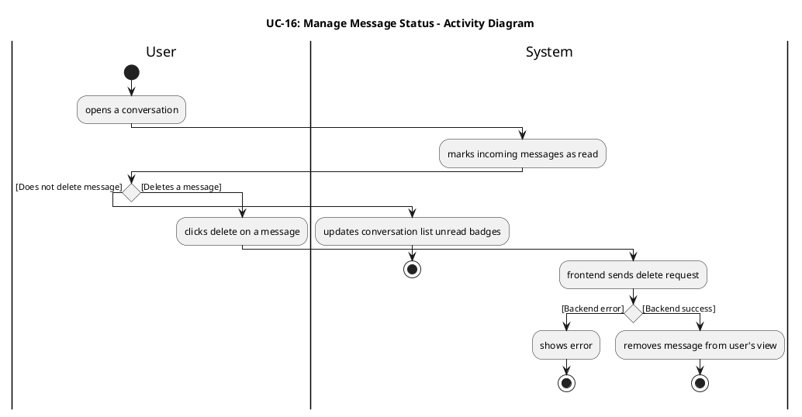

#### 3.3.17 UCD-17: View and Manage the mutual follow list

##### 2.3.17.1 User Requirement Specification (URS) and System Requirement Specification (SRS)

**URS-17**: The User can search all registered users by username, view their profiles, and manage follow relationships. A **Friend** is defined as a user who has a mutual follow relationship with the current User (both sides follow each other). When the User only follows another user one-way, they may send at most one private message to that user; when they are **Friends** (mutual follows), they may exchange multiple private messages as an ongoing conversation. The Friends list shows only mutual follows; one-way followers who do not mutually follow the User are counted as **Followers** but are not shown in this Friends list. This use case builds on UC-24 (View Followers/Friends List) and focuses on the Friends (mutual follows) view and chat entry from the Profile page.

**SRS-74**: The system shall provide a Mutual Follow (Friends) list section on the Profile page (UI-Profile) showing users who are **Friends** with the current user, i.e., users who mutually follow the current user as defined in URS-17. In the implemented version (`MutualFollowList.vue` within the Profile page), this list is loaded from `/api/users/mutual-follows` and can be filtered by a search keyword (`q`), with an empty-state when there are no mutual follows.

**SRS-75**: The system shall support follow/unfollow actions from user profile and update mutual-follow (Friend) status accordingly, and shall enforce private-messaging permissions based on the follow relationship as specified in URS-17: when the current user only follows another user one-way, the system shall allow at most **one** private message to be sent to that user; when the users are **Friends** (mutual follows), the system shall allow them to exchange multiple messages as an ongoing conversation. In the implemented version, the mutual follow list supports **unfollow** via `DELETE /api/users/{userId}/follow`, and provides a "Send Message" action to open a chat for Friends; follow operations are primarily triggered from `UserProfile.vue` using `/api/posts/users/{userId}/follow`.

##### 2.3.17.2 Use Case Description

| Use Case ID | UC-17 |
|------------|------|
| Use Case Name | View and Manage the Friends (mutual follow) list |
| Created By | ZhiYi Pan |
| Date Created | 23/01/2026 |
| Last Update By | |
| Last Revision Date | |
| Actors | User |
| Description | User views the Friends (mutual follow) list, searches within it, navigates profiles, performs follow/unfollow actions, and starts or continues private chats with Friends under the messaging rules defined in URS-17. |
| Trigger | User opens their Profile page and views the Friends (mutual follow) section. |
| Preconditions | 1. User is logged in. |

**Use Case Input Specification**

| Input | type | Constraint | Example |
|-------|------|------------|---------|
| Search Query | String | Optional, for filtering mutual follows | "john" |
| User ID | String/Number | Optional, for viewing another user's mutual follows | "user123" |

**Post conditions**:
- Mutual follow (Friends) list is displayed; follow/unfollow actions update relationship status in UI, and private messaging entry points for Friends respect the rule that mutual follows can have ongoing conversations while one-way follows (not shown in this list) are limited to a single initial message.

**Normal Flows**

| User (Actions) | System (Responses) |
|----------------|-------------------|
| 1. User opens Profile page (UI-Profile) and navigates to the Friends (mutual follow) section. | 2. System requests mutual follow list from backend.<br>   • `[E1: Network timeout or connection error]`<br>   • `[E2: Server error]` |
| | 3. Backend returns mutual follow user list.<br>   • `[A1: No mutual follows]` |
| 4. User selects a user to view profile. | 5. System navigates to user profile page. |
| 6. User clicks follow/unfollow. | 7. System sends follow/unfollow request and updates UI on success.<br>   • `[E1: Network timeout or connection error]`<br>   • `[E2: Server error]` |

**Alternative Flow**

**`[A1: No mutual follows]`**
- A1.1 Backend returns empty list.
- A1.2 System shows empty-state message in the Friends (mutual follow) section of the Profile page (UI-Profile).
- A1.3 Use case end.

**Exception Flows**

**`[E1: Network timeout or connection error]`**
- E1.1 List/follow request fails due to network issues.
- E1.2 System shows error and retry action.
- E1.3 Use case end.

**`[E2: Server error]`**
- E2.1 Backend returns 5xx (服务器错误).
- E2.2 System shows error and retry action.
- E2.3 Use case end.

**Note**:
- The mutual follow list shows users who mutually follow the current user, loaded from `/api/users/mutual-follows` with optional search filtering via the `q` parameter.
- Users can perform follow/unfollow actions from the mutual follow list, and the relationship status updates in real-time across all views.
- The mutual follow list supports search functionality to filter users by keyword, making it easier to find specific users in a large list.
- From the mutual follow (Friends) list, users can navigate to user profiles or open a chat window to send private messages to Friends; the messaging service enforces that Friends can exchange multiple messages as an ongoing conversation, while users who are only one-way followed (not shown in this list) are restricted to at most one initial private message as defined in URS-17.

##### 2.3.17.3 Activity Diagram

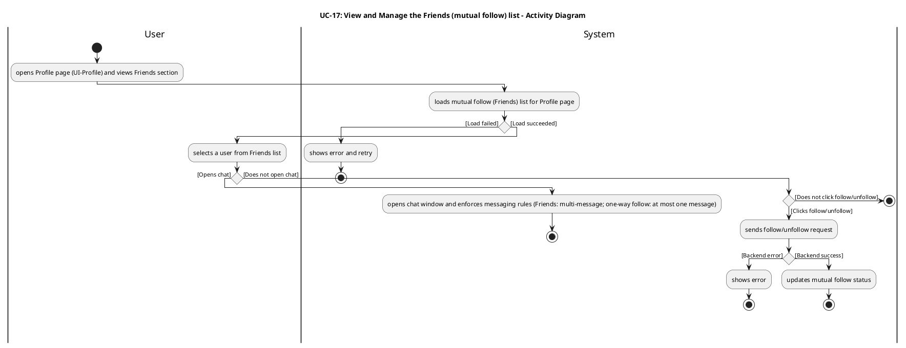

#### 3.3.18 UCD-18: AI Summary Comment

##### 2.3.18.1 User Requirement Specification (URS) and System Requirement Specification (SRS)

**URS-18**: The User can view AI-generated summaries of all comments under a post in their chosen language.

**SRS-76**: The system shall provide an entry point on the Post Detail page (UI-Community-PostDetail) to request/view an AI-generated comment summary (e.g., a "Summarize Comments" button).

**SRS-77**: When the user triggers comment summarization, the system shall send a request to the backend comment summary API for the current post, including the current interface language (`lang`).

**SRS-78**: The backend shall generate (or retrieve cached) AI summary text for the post's comments using Qwen AI and return the summary in the requested language.

**SRS-79**: The system shall display the returned summary text in the Post Detail page, and clearly indicate it is AI-generated content.

**SRS-80**: If there are no comments under the post, the system shall disable the summarization action or show a user-friendly message indicating there is nothing to summarize.

**SRS-81**: If the summarization request fails (network/server/timeout), the system shall display a localized error message and allow the user to retry.

##### 2.3.18.2 Use Case Description

| Use Case ID | UC-18 |
|------------|------|
| Use Case Name | AI Summary Comment |
| Created By | ZhiYi Pan |
| Date Created | 23/01/2026 |
| Last Update By | |
| Last Revision Date | |
| Actors | User |
| Description | User requests an AI-generated summary of all comments under a post and views the summary in their current interface language. |
| Trigger | User clicks the "Summarize Comments" action on the Post Detail page. |
| Preconditions | 1. User is viewing a Post Detail page.<br>2. Post data is loaded successfully.<br>3. There is at least one comment under the post (otherwise see Alternative Flow [A1]).<br>4. User has an active internet connection. |

**Use Case Input Specification**

| Input | type | Constraint | Example |
|-------|------|------------|---------|
| Post ID | String/Number | Must be a valid post ID | "123" |
| Current Interface Language | String | Must be "zh" (Chinese) or "en" (English) | "zh" |

**Post conditions**:
- A comment summary is displayed on the Post Detail page in the user's selected language.

**Normal Flows**

| User (Actions) | System (Responses) |
|----------------|-------------------|
| 1. User opens the Post Detail page and scrolls to the comments section. | 2. System shows the comment list and a "Summarize Comments" action.<br>   • `[A1: No comments to summarize]` |
| 3. User clicks "Summarize Comments". | 4. Frontend sends HTTP request to backend comment summary API with Post ID and `lang`.<br>   • `[E1: Network timeout or connection error]` |
| | 5. Backend collects comments of the post and invokes Qwen AI summarization (or returns cached summary).<br>   • `[E2: Server error]` |
| | 6. Backend returns 200 OK with summary text. |
| 7. User views the summary. | 8. Frontend renders the summary in the UI and marks it as AI-generated. |

**Alternative Flow**

**`[A1: No comments to summarize]`**
- A1.1 System detects comment count is 0.
- A1.2 System disables the "Summarize Comments" action or shows message "No comments to summarize" (zh: "暂无评论可总结").
- A1.3 Use case end.

**Exception Flows**

**`[E1: Network timeout or connection error]`**
- E1.1 Request times out or fails due to network issues.
- E1.2 Frontend displays a localized error message and provides a retry action.
- E1.3 Use case end.

**`[E2: Server error]`**
- E2.1 Backend returns 5xx (服务器错误) error due to AI service failure or internal error.
- E2.2 Frontend displays an error message and provides a retry action.
- E2.3 Use case end.

**Note**:
- The AI comment summary feature uses Qwen AI to generate summaries of all comments under a post, providing users with a quick overview of the discussion.
- Summaries are generated (or retrieved from cache) in the user's current interface language preference (Chinese or English), ensuring accessibility for all users.
- The summarization action is only available when there is at least one comment under the post; if no comments exist, the system disables the action or shows a user-friendly message.
- The generated summary is clearly marked as AI-generated content to maintain transparency with users about the source of the information.

##### 2.3.18.3 Activity Diagram

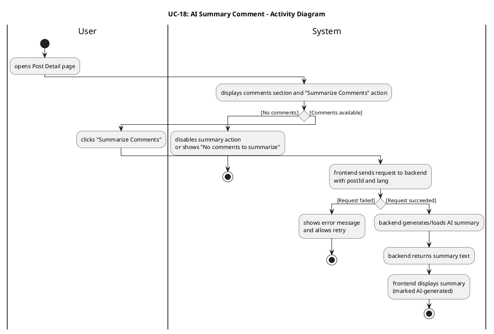

#### 3.3.19 UCD-19: Register Account

##### 2.3.19.1 User Requirement Specification (URS) and System Requirement Specification (SRS)

**URS-19**: The User can register a new account using email or phone number with verification codes.

**SRS-82**: The system shall provide a registration page (UI-Register) that allows users to choose between email or phone number registration methods.

**SRS-83**: The system shall provide a "Send Verification Code" action that sends a 6-digit verification code to the user's email address or phone number via `POST /api/auth/send-verification-code` with `identifier` and `type` ("email" or "phone").

**SRS-84**: The system shall validate the verification code via `POST /api/auth/verify-code` before allowing the user to proceed with registration.

**SRS-85**: The system shall provide a registration form that collects: username (unique, alphanumeric), password (must contain both uppercase and lowercase letters), display name (allows English characters), preferred language (Chinese "zh" or English "en"), identifier (email or phone), verification code, and type ("email" or "phone").

**SRS-86**: The backend shall register the user via `POST /api/auth/register` with all collected information, verify the code, check for duplicate username/email/phone, and create the user account with hashed password.

**SRS-87**: Upon successful registration, the system shall automatically log in the user and redirect to the main application, or display a success message and redirect to the login page.

**SRS-88**: If registration fails (duplicate username/email/phone, invalid verification code, validation errors), the system shall display a localized error message indicating the specific failure reason.

##### 2.3.19.2 Use Case Description

| Use Case ID | UC-19 |
|------------|------|
| Use Case Name | Register Account |
| Created By | ZhiYi Pan |
| Date Created | 23/01/2026 |
| Last Update By | |
| Last Revision Date | |
| Actors | User |
| Description | User registers a new account using email or phone number with verification code validation. |
| Trigger | User clicks "Register" or navigates to the registration page. |
| Preconditions | 1. User is not logged in.<br>2. User has access to their email or phone number for verification code.<br>3. Network connection is available. |

**Use Case Input Specification**

| Input | type | Constraint | Example |
|-------|------|------------|---------|
| Registration Method | String | Must be "email" or "phone" | "email" |
| Email/Phone | String | Valid email format or phone number | "user@example.com" |
| Verification Code | String | 6-digit numeric code | "123456" |
| Username | String | Unique, alphanumeric, not empty | "john_doe" |
| Password | String | Must contain both uppercase and lowercase letters | "Password123" |
| Display Name | String | Allows English characters | "John Doe" |
| Preferred Language | String | Must be "zh" or "en" | "en" |

**Post conditions**:
- A new user account is created in the system.
- User is logged in automatically (or redirected to login page).

**Normal Flows**

| User (Actions) | System (Responses) |
|----------------|-------------------|
| 1. User opens registration page and selects registration method (email or phone). | 2. System displays registration form with method-specific fields. |
| 3. User enters email/phone and clicks "Send Verification Code". | 4. System validates identifier format and sends verification code via email/SMS.<br>   • `[E1: Network timeout or connection error]`<br>   • `[E2: Invalid identifier format]` |
| | 5. System displays success message: "Verification code sent" (zh: "验证码已发送"). |
| 6. User receives verification code and enters it in the form. | 7. System validates the code format (6 digits). |
| 8. User clicks "Verify Code". | 9. System sends verification request to backend.<br>   • `[A1: Invalid or expired code]` |
| | 10. Backend validates code and marks it as verified. |
| 11. User fills in username, password, display name, and selects preferred language. | 12. System validates form fields (username format, password strength, etc.).<br>   • `[A2: Validation failed]` |
| 13. User clicks "Register". | 14. System sends registration request to backend with all information.<br>   • `[E1: Network timeout or connection error]` |
| | 15. Backend verifies code again, checks for duplicate username/email/phone, creates user account, and returns success.<br>   • `[E3: Duplicate username/email/phone]`<br>   • `[E4: Server error]` |
| 16. User views success message. | 17. System automatically logs in the user (or redirects to login page) and displays welcome message. |

**Alternative Flow**

**`[A1: Invalid or expired code]`**
- A1.1 Backend returns error: code is invalid, expired, or already used.
- A1.2 System displays error message: "Invalid or expired verification code" (zh: "验证码无效或已过期").
- A1.3 User can request a new code and retry.

**`[A2: Validation failed]`**
- A2.1 System validates form fields and detects errors (e.g., password doesn't contain uppercase/lowercase, username already taken on frontend check).
- A2.2 System displays validation errors next to relevant fields.
- A2.3 User corrects errors and resubmits.

**Exception Flows**

**`[E1: Network timeout or connection error]`**
- E1.1 Request fails due to network issues.
- E1.2 System displays a localized error message and allows retry.
- E1.3 Use case end.

**`[E2: Invalid identifier format]`**
- E2.1 System detects invalid email format or phone number format.
- E2.2 System displays error message: "Invalid email/phone format" (zh: "邮箱/手机号格式无效").
- E2.3 User corrects identifier and retries.

**`[E3: Duplicate username/email/phone]`**
- E3.1 Backend detects that username, email, or phone number already exists.
- E3.2 Backend returns error with specific field information.
- E3.3 System displays error message: "Username/Email/Phone already registered" (zh: "用户名/邮箱/手机号已被注册").
- E3.4 User chooses a different username/email/phone and retries.

**`[E4: Server error]`**
- E4.1 Backend returns 5xx (服务器错误) error due to internal error.
- E4.2 System displays error message and allows retry.
- E4.3 Use case end.

**Note**:
- Registration supports both email and phone number methods, with verification code validation required before account creation.
- Verification codes are 6-digit numeric codes sent via email or SMS, with expiration time and single-use validation to ensure security.
- The registration form collects: username (unique, alphanumeric), password (must contain both uppercase and lowercase letters), display name (allows English characters), preferred language (Chinese "zh" or English "en"), and identifier (email or phone).
- Upon successful registration, the system automatically logs in the user and redirects to the main application, or displays a success message and redirects to the login page depending on implementation.

##### 2.3.19.3 Activity Diagram

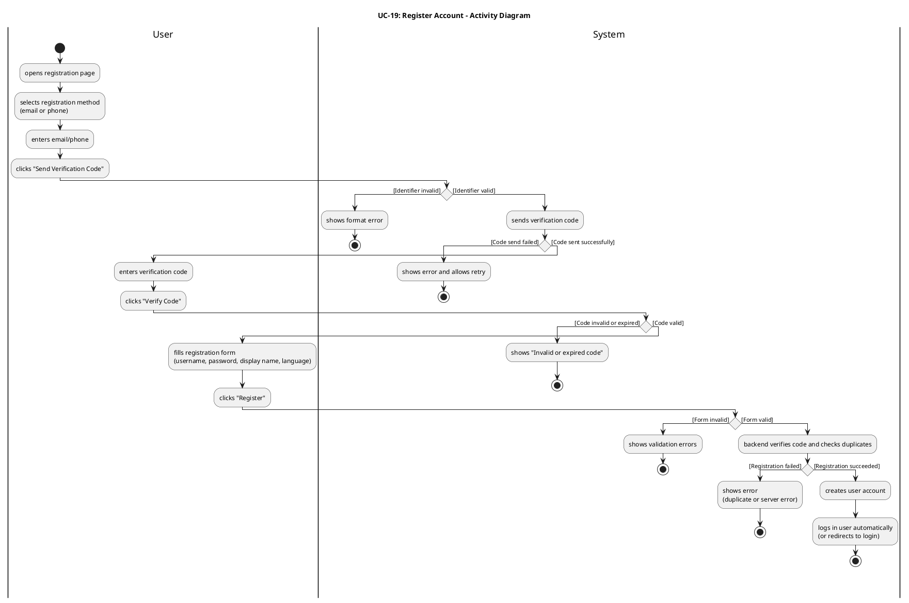

#### 3.3.20 UCD-20: Log In

##### 2.3.20.1 User Requirement Specification (URS) and System Requirement Specification (SRS)

**URS-20**: The User can log in using username/email and password, receiving a JWT token for authentication.

**SRS-89**: The system shall provide a login page (UI-Login) with fields for username/email and password, and a "Forgot Password" link.

**SRS-90**: The system shall send login request to `POST /api/auth/login` with username (or email) and password.

**SRS-91**: The backend shall authenticate the user credentials, generate a JWT token, and return the token along with user information (user ID, username, display name, email, avatar, preferred language).

**SRS-92**: Upon successful login, the system shall store the JWT token (in localStorage or sessionStorage) and redirect the user to the main application (or previously requested page).

**SRS-93**: The system shall include the JWT token in the `Authorization: Bearer <token>` header for all subsequent authenticated API requests.

**SRS-94**: If login fails (invalid credentials), the system shall display a localized error message: "Invalid username or password" (zh: "用户名或密码错误") and allow retry.

**SRS-95**: The system shall provide a "Forgot Password" link on the login page that allows users to reset their password via email or phone verification code.

**SRS-96**: When user clicks "Forgot Password", the system shall display a password reset form where user can enter email/phone, receive a verification code, verify the code, and set a new password.

**SRS-97**: The system shall send password reset verification code via `POST /api/auth/forgot-password/send-code` with identifier (email or phone) and type ("email" or "phone").

**SRS-98**: The system shall reset password via `POST /api/auth/forgot-password/reset` (for email) or `POST /api/auth/forgot-password/reset/phone` (for phone) with identifier, verification code, and new password.

##### 2.3.20.2 Use Case Description

| Use Case ID | UC-20 |
|------------|------|
| Use Case Name | Log In |
| Created By | ZhiYi Pan |
| Date Created | 23/01/2026 |
| Last Update By | |
| Last Revision Date | |
| Actors | User |
| Description | User logs in using username/email and password, receiving a JWT token for authenticated access. |
| Trigger | User clicks "Log In" or navigates to the login page. |
| Preconditions | 1. User has a registered account.<br>2. User knows their username/email and password.<br>3. Network connection is available. |

**Use Case Input Specification**

| Input | type | Constraint | Example |
|-------|------|------------|---------|
| Username/Email | String | Valid username or email address | "john_doe" or "user@example.com" |
| Password | String | Not empty | "Password123" |

**Post conditions**:
- User is authenticated and receives a JWT token.
- User is redirected to the main application.
- JWT token is stored for subsequent API requests.

**Normal Flows**

| User (Actions) | System (Responses) |
|----------------|-------------------|
| 1. User opens login page. | 2. System displays login form with username/email and password fields, and a "Forgot Password" link. |
| 3. User enters username/email and password. | 4. System validates form fields (not empty).<br>   • `[A1: Validation failed]`<br>   • `[A2: User clicks "Forgot Password"]` |
| 5. User clicks "Log In". | 6. System sends login request to backend with credentials.<br>   • `[E1: Network timeout or connection error]` |
| | 7. Backend authenticates credentials and generates JWT token.<br>   • `[E2: Invalid credentials]`<br>   • `[E3: Server error]` |
| | 8. Backend returns 200 OK with JWT token and user information. |
| 9. User views main application. | 10. System stores JWT token, updates user state, and redirects to main application (or previously requested page). |

**Alternative Flows**

**`[A1: Validation failed]`**
- A1.1 System detects empty username/email or password fields.
- A1.2 System displays validation error: "Please enter username/email and password" (zh: "请输入用户名/邮箱和密码").
- A1.3 User fills in missing fields and retries.

**`[A2: User clicks "Forgot Password"]`**
- A2.1 User clicks "Forgot Password" link on the login page.
- A2.2 System displays password reset form with fields for email/phone selection, identifier input, verification code input, new password, and confirm password.
- A2.3 User selects reset method (email or phone) and enters email/phone.
- A2.4 User clicks "Send Code" button.
- A2.5 System sends verification code request to `POST /api/auth/forgot-password/send-code` with identifier and type. `[E4: Send code failed]` may occur here.
- A2.6 System displays success message: "Verification code sent" (zh: "验证码已发送") and enables code input field.
- A2.7 User enters verification code.
- A2.8 For email method, user clicks "Verify Code" button; system verifies code via `POST /api/auth/verify-code`. `[E5: Verification code invalid]` may occur here.
- A2.9 User enters new password and confirms password.
- A2.10 User clicks "Reset Password" button.
- A2.11 System validates password (must contain uppercase and lowercase letters) and password match. If validation fails, `[A3: Password validation failed]` is triggered.
- A2.12 System sends password reset request to `POST /api/auth/forgot-password/reset` (email) or `POST /api/auth/forgot-password/reset/phone` (phone) with identifier, code, and new password. `[E6: Reset password failed]` may occur here.
- A2.13 System displays success message: "Password reset successfully" (zh: "密码重置成功") and redirects user back to login page.
- A2.14 Use case continues with login flow.

**`[A3: Password validation failed]`**
- A3.1 System detects password does not meet requirements (must contain uppercase and lowercase) or passwords do not match.
- A3.2 System displays validation error: "Password must contain uppercase and lowercase letters" (zh: "密码必须包含大写和小写字母") or "Passwords do not match" (zh: "密码不匹配").
- A3.3 User corrects password and retries from A2.10.

**Exception Flows**

**`[E1: Network timeout or connection error]`**
- E1.1 Login request fails due to network issues.
- E1.2 System displays a localized error message and allows retry.
- E1.3 Use case end.

**`[E2: Invalid credentials]`**
- E2.1 Backend returns 401 Unauthorized: username/email or password is incorrect.
- E2.2 System displays error message: "Invalid username or password" (zh: "用户名或密码错误").
- E2.3 User can retry with correct credentials or use "Forgot Password" link.

**`[E3: Server error]`**
- E3.1 Backend returns 5xx (服务器错误) error due to internal error.
- E3.2 System displays error message and allows retry.
- E3.3 Use case end.

**`[E4: Send code failed]`**
- E4.1 Backend returns error when sending verification code.
- E4.2 System displays error message: "Failed to send verification code, please try again" (zh: "发送验证码失败，请稍后重试").
- E4.3 User can retry from A2.4.

**`[E5: Verification code invalid]`**
- E5.1 Backend returns error: verification code is incorrect or expired.
- E5.2 System displays error message: "Invalid or expired verification code" (zh: "验证码错误或已过期").
- E5.3 User can request a new code or retry from A2.7.

**`[E6: Reset password failed]`**
- E6.1 Backend returns error when resetting password (e.g., invalid code, user not found).
- E6.2 System displays error message: "Failed to reset password" (zh: "重置密码失败").
- E6.3 User can retry from A2.10 or go back to login page.

**Note**:
- Login supports both username and email address as credentials, providing flexibility for users who may prefer either method.
- The username used for login is the same as the username shown on the profile page; when the user changes their display name in the profile and the update succeeds, the backend synchronizes the username to this new display name so that subsequent logins use the updated name.
- Upon successful authentication, the backend generates a JWT token that is stored in localStorage or sessionStorage and included in the `Authorization: Bearer <token>` header for all subsequent authenticated API requests.
- After successful login, the system redirects the user to the main application or to a previously requested page if the user was redirected to login from a protected route.
- The login page includes a "Forgot Password" link that allows users to reset their password through email or phone verification. The password reset process requires: (1) entering email/phone and receiving a verification code, (2) verifying the code (for email method), (3) entering and confirming a new password that meets requirements (must contain uppercase and lowercase letters), and (4) submitting the reset request. After successful password reset, the user is redirected back to the login page to log in with the new password.

##### 2.3.20.3 Activity Diagram

```plantuml
@startuml UC20_Activity_Diagram
title UC-20: Log In - Activity Diagram

|User|
start
:opens login page;
:enters username/email and password;
:clicks "Log In";

|System|
if () then ([Form invalid])
  :shows validation errors;
  stop
else ([Form valid])
  :frontend sends login request;
  
  if () then ([Request failed])
    :shows network error\nand allows retry;
    stop
  else ([Request succeeded])
    :backend authenticates credentials;
    
    if () then ([Credentials invalid])
      :shows "Invalid username or password";
      stop
    else ([Credentials valid])
      :backend generates JWT token;
      :backend returns token and user info;
      :stores token and user info;
      :redirects to main application;
      stop
    endif
  endif
endif

@enduml
```

#### 3.3.21 UCD-21: Log Out

##### 2.3.21.1 User Requirement Specification (URS) and System Requirement Specification (SRS)

**URS-21**: The User can log out to end the current session and clear authentication tokens.

**SRS-99**: The system shall provide a "Log Out" action (button or menu item) accessible from the user profile menu or navigation bar.

**SRS-100**: When the user clicks "Log Out", the system shall clear the stored JWT token (from localStorage/sessionStorage) and user session data.

**SRS-101**: The system shall redirect the user to the login page or home page (if public access is allowed).

**SRS-102**: After logout, all subsequent API requests that require authentication shall fail with 401 Unauthorized, and the system shall redirect to login if needed.

**SRS-103**: The system may optionally send a logout request to the backend (`POST /api/auth/logout`) to invalidate the token on the server side (if token blacklisting is implemented).

##### 2.3.21.2 Use Case Description

| Use Case ID | UC-21 |
|------------|------|
| Use Case Name | Log Out |
| Created By | ZhiYi Pan |
| Date Created | 23/01/2026 |
| Last Update By | |
| Last Revision Date | |
| Actors | User |
| Description | User logs out to end the current session and clear authentication tokens. |
| Trigger | User clicks "Log Out" button or menu item. |
| Preconditions | 1. User is logged in (has valid JWT token).<br>2. User is viewing the application. |

**Use Case Input Specification**

| Input | type | Constraint | Example |
|-------|------|------------|---------|
| None | - | - | - |

**Post conditions**:
- User session is ended.
- JWT token is cleared from client storage.
- User is redirected to login page or home page.
- User cannot access authenticated features until logging in again.

**Normal Flows**

| User (Actions) | System (Responses) |
|----------------|-------------------|
| 1. User clicks "Log Out" button or menu item. | 2. System displays confirmation dialog (optional) or immediately proceeds with logout.<br>   • `[A1: User cancels logout]` |
| | 3. System clears JWT token from localStorage/sessionStorage. |
| | 4. System clears user state and session data. |
| | 5. System optionally sends logout request to backend (if implemented). |
| | 6. System redirects user to login page (or home page). |
| 7. User views login page. | 8. System displays login form; user must log in again to access authenticated features. |

**Alternative Flow**

**`[A1: User cancels logout]`**
- A1.1 User clicks "Cancel" in the logout confirmation dialog.
- A1.2 System keeps the user logged in and closes the dialog.
- A1.3 Use case end.

**Exception Flows**

None (logout is a client-side operation that always succeeds).

**Note**:
- Logout is primarily a client-side operation that clears the stored JWT token from localStorage/sessionStorage and user session data.
- The system may optionally send a logout request to the backend (`POST /api/auth/logout`) to invalidate the token on the server side if token blacklisting is implemented.
- After logout, all subsequent API requests that require authentication will fail with 401 Unauthorized, and the system will redirect to the login page if needed.
- The system redirects the user to the login page or home page (if public access is allowed) after logout is completed.

##### 2.3.21.3 Activity Diagram

```plantuml
@startuml UC21_Activity_Diagram
title UC-21: Log Out - Activity Diagram

|User|
start
:clicks "Log Out";

|System|
if () then ([Confirmation required])
  :shows confirmation dialog;
  
  |User|
  if () then ([User cancels])
    |System|
    :cancels logout;
    stop
  else ([User confirms])
    |System|
    :clears JWT token;
    :clears user session data;
    :redirects to login page;
    stop
  endif
else ([No confirmation required])
  :clears JWT token;
  :clears user session data;
  :redirects to login page;
  stop
endif

@enduml
```

#### 3.3.22 UCD-22: View/Edit Profile

##### 2.3.22.1 User Requirement Specification (URS) and System Requirement Specification (SRS)

**URS-22**: The User can view and update their profile information including display name, avatar, and preferred language; when the User updates their display name in the profile, the system keeps the username used for login synchronized with this display name (subject to username uniqueness constraints).

**SRS-104**: The system shall provide a profile page (UI-Profile) accessible from the user menu or navigation, showing current user information: username, display name, avatar, email, preferred language, and account creation date.

**SRS-105**: The system shall load current user profile via `GET /api/users/me` (requires authentication via JWT token).

**SRS-106**: The system shall provide an "Edit Profile" action that allows users to update: display name (allows English characters), avatar (image upload), and preferred language (Chinese "zh" or English "en"); when the display name is changed and is non-empty after trimming, the system shall also treat this new display name as the candidate username/login name.

**SRS-107**: The system shall support avatar image upload via `POST /api/users/me/avatar` (accepts image files: JPEG, PNG, GIF, WebP) and returns the avatar URL.

**SRS-108**: The system shall update profile information via `PUT /api/users/me` with updated fields (displayName, avatar URL, preferredLanguage). When the request contains a non-blank displayName, the backend shall also update the username to the trimmed displayName so that the new name becomes the login username. Before updating the username, the backend shall verify that no other user is using the same username; if a duplicate is found, it shall reject the update and return an appropriate error, and the frontend shall display a localized error message (e.g., "Username already taken", zh: "用户名已被使用").

**SRS-109**: Upon successful update, the system shall refresh the profile display and update the user state throughout the application.

**SRS-110**: If the preferred language is changed, the system shall immediately update the interface language and persist the preference.

**SRS-111**: If profile update fails (network/server error, validation error), the system shall display a localized error message and allow retry.

##### 2.3.22.2 Use Case Description

| Use Case ID | UC-22 |
|------------|------|
| Use Case Name | View/Edit Profile |
| Created By | ZhiYi Pan |
| Date Created | 23/01/2026 |
| Last Update By | |
| Last Revision Date | |
| Actors | User |
| Description | User views and updates their profile information including display name, avatar, and preferred language. |
| Trigger | User opens profile page or clicks "Edit Profile". |
| Preconditions | 1. User is logged in (has valid JWT token).<br>2. User has access to profile page. |

**Use Case Input Specification**

| Input | type | Constraint | Example |
|-------|------|------------|---------|
| Display Name | String | Optional, allows English characters | "John Doe" |
| Avatar Image | File | Optional, image file (JPEG, PNG, GIF, WebP), max size limit | image.jpg |
| Preferred Language | String | Must be "zh" or "en" | "en" |

**Post conditions**:
- Profile information is updated in the system.
- Updated profile is displayed to the user.
- User state is updated throughout the application.
- Interface language is updated if preferred language changed.

**Normal Flows**

| User (Actions) | System (Responses) |
|----------------|-------------------|
| 1. User opens profile page. | 2. System sends request to `GET /api/users/me` with JWT token.<br>   • `[E1: Network timeout or connection error]`<br>   • `[E2: Unauthorized]` |
| | 3. Backend returns user profile information. |
| 4. User views profile information. | 5. System displays profile: username, display name, avatar, email, preferred language, account creation date. |
| 6. User clicks "Edit Profile". | 7. System displays edit form with current values pre-filled. |
| 8. User updates display name, selects new avatar image (optional), or changes preferred language. | 9. System validates inputs (display name format, image file type/size, language value).<br>   • `[A1: Validation failed]` |
| 10. User clicks "Save". | 11. If avatar image is selected, system uploads image via `POST /api/users/me/avatar` and receives avatar URL.<br>   • `[E3: Avatar upload failed]` |
| | 12. System sends update request via `PUT /api/users/me` with updated fields.<br>   • `[E1: Network timeout or connection error]` |
| | 13. Backend updates user profile and returns updated user information.<br>   • `[E4: Server error]` |
| 14. User views updated profile. | 15. System refreshes profile display, updates user state, and if preferred language changed, updates interface language immediately. |

**Alternative Flow**

**`[A1: Validation failed]`**
- A1.1 System detects invalid input (e.g., image file too large, invalid file type, display name contains invalid characters).
- A1.2 System displays validation errors next to relevant fields.
- A1.3 User corrects errors and resubmits.

**Exception Flows**

**`[E1: Network timeout or connection error]`**
- E1.1 Request fails due to network issues.
- E1.2 System displays a localized error message and allows retry.
- E1.3 Use case end.

**`[E2: Unauthorized]`**
- E2.1 JWT token is invalid or expired.
- E2.2 System redirects user to login page.
- E2.3 Use case end.

**`[E3: Avatar upload failed]`**
- E3.1 Avatar upload request fails (network error, file too large, invalid format).
- E3.2 System displays error message: "Avatar upload failed" (zh: "头像上传失败").
- E3.3 User can retry upload or skip avatar update.

**`[E4: Server error]`**
- E4.1 Backend returns 5xx (服务器错误) error due to internal error.
- E4.2 System displays error message and allows retry.
- E4.3 Use case end.

**Note**:
- Profile information includes: username (login name, displayed as read-only in the UI but automatically kept in sync with the display name when the user saves profile changes), display name (editable, allows English characters), avatar (image upload), email (read-only), preferred language (editable, "zh" or "en"), and account creation date (read-only).
- Avatar image upload supports JPEG, PNG, GIF, and WebP formats, with a maximum file size limit enforced by the backend.
- When the preferred language is changed, the system immediately updates the interface language throughout the application and persists the preference for future sessions.
- Profile updates are performed via `PUT /api/users/me`, and upon successful update, the system refreshes the profile display and updates the user state throughout the application.

##### 2.3.22.3 Activity Diagram

```plantuml
@startuml UC22_Activity_Diagram
title UC-22: View/Edit Profile - Activity Diagram

|User|
start
:opens profile page;

|System|
:loads profile via GET /api/users/me;

if () then ([Load failed])
  :shows error and allows retry;
  stop
else ([Load succeeded])
  :displays profile information;
  
  |User|
  if () then ([Does not click "Edit Profile"])
    stop
  else ([Clicks "Edit Profile"])
    :updates display name, avatar, or language;
    
    |System|
    if () then ([Validation failed])
      :shows validation errors;
      stop
    else ([Validation OK])
      if () then ([Avatar selected])
        :uploads avatar image;
        
        if () then ([Upload failed])
          :shows upload error;
          stop
        else ([Upload succeeded])
          :sends PUT /api/users/me\nwith updated fields;
        endif
      else ([No avatar selected])
        :sends PUT /api/users/me\nwith updated fields;
      endif
      
      if () then ([Update failed])
        :shows error and allows retry;
        stop
      else ([Update succeeded])
        :refreshes profile display;
        
        if () then ([Language changed])
          :updates interface language;
        endif
        stop
      endif
    endif
  endif
endif

@enduml
```

#### 3.3.23 UCD-23: View My Community Posts

##### 2.3.23.1 User Requirement Specification (URS) and System Requirement Specification (SRS)

**URS-23**: The User can view all their own community posts with moderation status (pending, approved, rejected).

**SRS-112**: The system shall provide a "View My Community Posts" link or button on the profile page (UI-Profile) that navigates to a dedicated posts list page (UI-MyPosts).

**SRS-113**: The system shall load user's posts via `GET /api/users/me/posts` (requires authentication), which returns all posts created by the current user including all moderation statuses: PENDING_REVIEW, APPROVED, and REJECTED.

**SRS-114**: UI-MyPosts shall display posts ordered by creation time (newest first), showing: post ID, title, body preview, tags, creation timestamp, moderation status badge (PENDING_REVIEW, APPROVED, REJECTED), and review note (if rejected).

**SRS-115**: The system shall display posts with appropriate status badges for easy identification: "Pending Review" (zh: "待审核"), "Approved" (zh: "已通过"), "Rejected" (zh: "已拒绝").

**SRS-116**: If a post is rejected, the system shall display the review note (rejection reason) provided by administrators.

**SRS-117**: If the user has not created any posts, the system shall display an empty state message: "No posts" (zh: "暂无帖子").

**SRS-118**: If the request to fetch posts fails (network/server error), the system shall display a localized error message and provide a retry action.

##### 2.3.23.2 Use Case Description

| Use Case ID | UC-23 |
|------------|------|
| Use Case Name | View My Community Posts |
| Created By | ZhiYi Pan |
| Date Created | 23/01/2026 |
| Last Update By | |
| Last Revision Date | |
| Actors | User |
| Description | User views all their own community posts with moderation status (pending, approved, rejected). |
| Trigger | User clicks "View My Community Posts" on the profile page. |
| Preconditions | 1. User is logged in (has valid JWT token).<br>2. User is viewing their profile page. |

**Use Case Input Specification**

| Input | type | Constraint | Example |
|-------|------|------------|---------|
| Language | String | Optional, "zh" or "en" for content language | "en" |

**Post conditions**:
- User views a list of all their submitted posts with complete details including moderation status and review notes.

**Normal Flows**

| User (Actions) | System (Responses) |
|----------------|-------------------|
| 1. User opens their profile page. | 2. System displays profile information and action buttons including "View My Community Posts". |
| 3. User clicks "View My Community Posts". | 4. System navigates to UI-MyPosts page and sends a request to the backend to load the current user's community posts based on the user's authenticated session.<br>   • `[E1: Network timeout or connection error]`<br>   • `[E2: Unauthorized]` |
| | 5. Backend retrieves all posts created by the current user (including all statuses) and returns post list.<br>   • `[E3: Server error]` |
| 6. User views the posts list. | 7. System displays posts ordered by creation time (newest first), showing:<br>   - Post ID<br>   - Title and body preview<br>   - Tags<br>   - Creation timestamp<br>   - Status badge (PENDING_REVIEW, APPROVED, REJECTED)<br>   - Review note (if rejected)<br>   • `[A1: No posts created]` |
| 8. User can click on a post to view details or scroll through the list. | 9. System continues to display post cards with all available information. |

**Alternative Flow**

**`[A1: No posts created]`**
- A1.1 System detects that the user has not created any posts.
- A1.2 System displays an empty state message: "No posts" (zh: "暂无帖子").
- A1.3 Use case end.

**Exception Flows**

**`[E1: Network timeout or connection error]`**
- E1.1 Request to fetch posts fails due to network issues.
- E1.2 System displays a localized error message and provides a retry action.
- E1.3 Use case end.

**`[E2: Unauthorized]`**
- E2.1 JWT token is invalid or expired.
- E2.2 System redirects user to login page.
- E2.3 Use case end.

**`[E3: Server error]`**
- E3.1 Backend returns 5xx (服务器错误) error due to internal error.
- E3.2 System displays an error message and provides a retry action.
- E3.3 Use case end.

**Note**:
- The "View My Community Posts" page displays all posts created by the current user, including all moderation statuses: PENDING_REVIEW (待审核), APPROVED (已通过), and REJECTED (已拒绝).
- Posts are ordered by creation time (newest first), and each post card displays: post ID, title, body preview, tags, creation timestamp, moderation status badge, and review note (if rejected).
- Status badges are color-coded for easy identification: PENDING_REVIEW (yellow/orange), APPROVED (green), and REJECTED (red).
- If a post is rejected, the system displays the review note (rejection reason) provided by administrators, helping users understand why their post was not approved.

##### 2.3.23.3 Activity Diagram

```plantuml
@startuml UC23_Activity_Diagram
title UC-23: View My Community Posts - Activity Diagram

|User|
start
:opens profile page;
:clicks "View My Community Posts";

|System|
:frontend navigates to UI-MyPosts;
:frontend sends a request to the backend to load the current user's community posts;

if () then ([Request failed])
  :shows error message\nand allows retry;
  stop
else ([Request succeeded])
  :backend retrieves user's posts\n(all statuses);
  
  if () then ([No posts])
    :shows empty state\n"No posts";
    stop
  else ([Posts available])
    :displays posts list\nordered by creation time (newest first);
    :shows status badges\n(PENDING_REVIEW, APPROVED, REJECTED);
    :shows review notes\n(if rejected);
    
    |User|
    :views post details;
    stop
  endif
endif

@enduml
```

#### 3.3.24 UCD-24: View Followers/Friends List

##### 2.3.24.1 User Requirement Specification (URS) and System Requirement Specification (SRS)

**URS-33**: The User can view lists of mutual Friends (mutual follows) and Followers (users who follow the current User). From either list, the User can click a user’s avatar to navigate to that user’s profile page.

**SRS-119**: The system shall provide entry points on the profile page (UI-Profile) to open the Followers list and the Friends (mutual follows) list (e.g., clicking the follower/friend count), implemented as a modal list UI.

**SRS-120**: The system shall load the Followers list via `GET /api/users/{userId}/followers` (returns users who follow the specified user).

**SRS-121**: The system shall load the Friends (mutual follows) list via `GET /api/users/{userId}/mutual-follows` (returns users who mutually follow the specified user).

**SRS-122**: The Followers/Friends list UI shall display each user with at least: avatar, username, and display name (when available). Clicking a user avatar (or user row) shall navigate to that user’s profile page and close the list UI.

**SRS-123**: If the followers/friends list is empty, the system shall show an empty-state message ("No followers" / "No mutual follows"); if loading fails (network/server error), the system shall display a localized error message and provide a retry action.

##### 2.3.24.2 Use Case Description

| Use Case ID | UC-24 |
|------------|------|
| Use Case Name | View Followers/Friends List |
| Created By | ZhiYi Pan |
| Date Created | 23/01/2026 |
| Last Update By | |
| Last Revision Date | |
| Actors | User |
| Description | User opens the Followers list or Friends (mutual follows) list from a profile page and can navigate to a listed user's profile by clicking their avatar. |
| Trigger | User clicks the Followers count or Friends (mutual follows) count on a profile page. |
| Preconditions | 1. User is logged in (has valid JWT token).<br>2. User is viewing their profile page or another user's profile page. |

**Use Case Input Specification**

| Input | type | Constraint | Example |
|-------|------|------------|---------|
| Profile User ID | String/Number | Must be a valid user ID | "user123" |
| List Type | String | Must be "followers" or "mutual-follows" | "followers" |

**Post conditions**:
- The selected list (Followers or Friends) is displayed, or an empty/error state is shown.
- When the user selects a listed user, the system navigates to that user's profile page.

**Normal Flows**

| User (Actions) | System (Responses) |
|----------------|-------------------|
| 1. User opens profile page (own or another user's). | 2. System displays profile information and action buttons including "View Followers" and "View Mutual Follows". |
| 3. User clicks Followers count or Friends (mutual follows) count. | 4. System opens the corresponding list modal and sends request to the appropriate endpoint (`GET /api/users/{userId}/followers` or `GET /api/users/{userId}/mutual-follows`).<br>   • `[E1: Network timeout or connection error]`<br>   • `[E2: Unauthorized]` |
| | 5. Backend returns the corresponding user list.<br>   • `[E3: Server error]`<br>   • `[A1: No users in list]` |
| 6. User clicks a listed user's avatar (or user row). | 7. System closes the modal and navigates to the selected user's profile page. |

**Alternative Flow**

**`[A1: No users in list]`**
- A1.1 Backend returns an empty list.
- A1.2 System displays an empty state message: "No followers" (zh: "暂无关注者") or "No mutual follows" (zh: "暂无互相关注").
- A1.3 Use case end.

**Exception Flows**

**`[E1: Network timeout or connection error]`**
- E1.1 Request to fetch followers/mutual follows fails due to network issues.
- E1.2 System displays a localized error message and provides a retry action.
- E1.3 Use case end.

**`[E2: Unauthorized]`**
- E2.1 JWT token is invalid or expired.
- E2.2 System redirects user to login page.
- E2.3 Use case end.

**`[E3: Server error]`**
- E3.1 Backend returns 5xx (服务器错误) error due to internal error.
- E3.2 System displays an error message and provides a retry action.
- E3.3 Use case end.

**Note**:
- The system provides separate views for Followers (users who follow the selected profile) and Friends (mutual follows of the selected profile).
- In the implemented frontend (`MyProfile.vue`, `UserProfile.vue`, `UserListModal.vue`), these lists are opened as modals from the profile stats area; clicking a listed user navigates to that user's profile and closes the modal.
- Backend APIs used by the frontend for list loading are `GET /api/users/{userId}/followers` and `GET /api/users/{userId}/mutual-follows`.

##### 2.3.24.3 Activity Diagram

```plantuml
@startuml UC24_Activity_Diagram
title UC-24: View Followers/Friends List (Navigate to Profile) - Activity Diagram

|User|
start
:opens profile page;
:clicks Followers count\nor Friends (mutual follows) count;

|System|
:frontend opens list modal;
:frontend sends request to\nGET /api/users/{userId}/followers\nor GET /api/users/{userId}/mutual-follows;

if () then ([Request failed])
  :shows error message\nand allows retry;
  stop
else ([Request succeeded])
  :backend returns Followers\nor Friends list;
  
  if () then ([No users])
    :shows empty state\n"No followers" or "No mutual follows";
    stop
  else ([Users available])
    :displays user cards\nwith user info;
    
    |User|
    :clicks a user avatar\n(or user row);
    
    |System|
    :closes the modal;
    :navigates to selected user's profile page;
    stop
  endif
endif

@enduml
```

#### 3.3.25 UCD-25: View My Reports

##### 2.3.25.1 User Requirement Specification (URS) and System Requirement Specification (SRS)

**URS-25**: The User can view all reports they have submitted from their profile page, including report status (PENDING, REVIEWED, RESOLVED, DISMISSED), target type (POST or COMMENT), reasons, description, review notes from administrators, AI analysis results, and timestamps.

**SRS-124**: The system shall provide a "View My Reports" button on the user profile page (UI-Profile) that navigates to a dedicated reports list page (UI-MyReports).

**SRS-125**: UI-MyReports shall display all reports submitted by the current user, ordered by creation time (newest first), showing report ID, target type, target ID, reasons, description, status, creation timestamp, review timestamp (if reviewed), review notes (if available), AI analysis results, and violation snippets.

**SRS-126**: The backend shall provide functionality to retrieve all reports submitted by the authenticated user, including all report details and status information.

**SRS-127**: The system shall display reports with appropriate status badges (PENDING, REVIEWED, RESOLVED, DISMISSED) and target type indicators (POST/COMMENT) for easy identification.

**SRS-128**: If the user has not submitted any reports, the system shall display an empty state message: "No reports" (zh: "暂无举报").

**SRS-129**: If the request to fetch reports fails (network/server error), the system shall display a localized error message and provide a retry action.

##### 2.3.25.2 Use Case Description

| Use Case ID | UC-25 |
|------------|------|
| Use Case Name | View My Reports |
| Created By | ZhiYi Pan |
| Date Created | 23/01/2026 |
| Last Update By | |
| Last Revision Date | |
| Actors | User |
| Description | User views all reports they have submitted, including status, target type, reasons, description, review notes, and timestamps. |
| Trigger | User clicks "View My Reports" on the profile page. |
| Preconditions | 1. User is logged in.<br>2. User is viewing their profile page. |

**Use Case Input Specification**

| Input | type | Constraint | Example |
|-------|------|------------|---------|
| None (retrieves all reports for current user) | - | - | - |

**Post conditions**:
- User views a list of all their submitted reports with complete details including status and review information.

**Normal Flows**

| User (Actions) | System (Responses) |
|----------------|-------------------|
| 1. User opens their profile page. | 2. System displays profile information and action buttons including "View My Reports". |
| 3. User clicks "View My Reports". | 4. System navigates to UI-MyReports page and sends request to backend to retrieve current user's reports.<br>   • `[E1: Network timeout or connection error]` |
| | 5. Backend retrieves all reports submitted by the current user and returns report list.<br>   • `[E2: Server error]` |
| 6. User views the reports list. | 7. System displays reports ordered by creation time (newest first), showing:<br>   - Report ID<br>   - Target type (POST/COMMENT) badge<br>   - Target ID<br>   - Status badge (PENDING, REVIEWED, RESOLVED, DISMISSED)<br>   - Reasons (list of selected reasons)<br>   - Description (if provided)<br>   - Creation timestamp<br>   - Review timestamp (if reviewed)<br>   - Review notes (if available)<br>   - AI analysis results (if available)<br>   - Violation snippet (if available)<br>   • `[A1: No reports submitted]` |
| 8. User can scroll through the list and view details of each report. | 9. System continues to display report cards with all available information. |

**Alternative Flow**

**`[A1: No reports submitted]`**
- A1.1 System detects that the user has not submitted any reports.
- A1.2 System displays an empty state message: "No reports" (zh: "暂无举报").
- A1.3 Use case end.

**Exception Flows**

**`[E1: Network timeout or connection error]`**
- E1.1 Request to fetch reports fails due to network issues.
- E1.2 System displays a localized error message and provides a retry action.
- E1.3 Use case end.

**`[E2: Server error]`**
- E2.1 Backend returns 5xx (服务器错误) error due to internal error.
- E2.2 System displays an error message and provides a retry action.
- E2.3 Use case end.

**Note**:
- The "View My Reports" page displays all reports submitted by the current user, including complete details: report ID, target type (POST/COMMENT), target ID, reasons, description, status, creation timestamp, review timestamp, review notes, AI analysis results, and violation snippets.
- Reports are ordered by creation time (newest first), and status badges indicate: PENDING (待处理), REVIEWED (已审核), RESOLVED (已解决), and DISMISSED (已驳回).
- The system displays review notes from administrators when available, providing transparency about the moderation decision and helping users understand the outcome of their reports.
- AI analysis results and violation snippets (if available) are displayed to show the automated content analysis that may have influenced the moderation decision.

##### 2.3.25.3 Activity Diagram

```plantuml
@startuml UC25_Activity_Diagram
title UC-25: View My Reports - Activity Diagram

|User|
start
:opens profile page;
:clicks "View My Reports";

|System|
:frontend navigates to UI-MyReports;
:frontend sends GET /api/reports/my request;

if () then ([Request failed])
  :shows error message\nand allows retry;
  stop
else ([Request succeeded])
  :backend retrieves user's reports;
  
  if () then ([No reports])
    :shows empty state\n"No reports";
    stop
  else ([Reports available])
    :displays reports list\nordered by creation time (newest first);
    
    |User|
    :views report details\n(status, reasons, review notes, etc.);
    stop
  endif
endif

@enduml
```

---

## Chapter 4 API Endpoints Reference

This chapter documents all API endpoints implemented in the BridgeU system based on the actual codebase.

### 4.1 Authentication Endpoints (`/api/auth`)

| Method | Endpoint | Description | Authentication Required |
|--------|----------|-------------|------------------------|
| POST | `/api/auth/send-verification-code` | Send verification code to email or phone | No |
| POST | `/api/auth/verify-code` | Verify verification code | No |
| POST | `/api/auth/register` | Register new user with verification code | No |
| POST | `/api/auth/register/phone` | Register with phone (Firebase verified) | No |
| POST | `/api/auth/register/old` | Legacy registration endpoint | No |
| POST | `/api/auth/register/merchant` | Register merchant account | No |
| POST | `/api/auth/login` | User login | No |
| GET | `/api/auth/me` | Get current user info | Yes |
| POST | `/api/auth/verify` | Verify JWT token validity | Yes |
| POST | `/api/auth/forgot-password/send-code` | Send password reset verification code | No |
| POST | `/api/auth/forgot-password/reset` | Reset password with verification code | No |
| POST | `/api/auth/forgot-password/reset/phone` | Reset password with phone (Firebase) | No |

### 4.2 News Endpoints (`/api/news`)

| Method | Endpoint | Description | Authentication Required |
|--------|----------|-------------|------------------------|
| GET | `/api/news/daily-briefing` | Get paginated news list with filters | No |
| GET | `/api/news/daily-briefing/{id}` | Get news detail by ID | No |
| GET | `/api/news/sources` | Get list of available news sources | No |

**Query Parameters for `/api/news/daily-briefing`:**
- `page` (int, default: 0): Page number
- `size` (int, default: 10): Page size
- `lang` (string, default: "en"): Language preference ("zh" or "en")
- `source` (string, optional): Filter by source name
- `startDate` (string, optional): Start date (yyyy-MM-dd)
- `endDate` (string, optional): End date (yyyy-MM-dd)
- `keyword` (string, optional): Search keyword

### 4.3 Post Endpoints (`/api/posts`)

| Method | Endpoint | Description | Authentication Required |
|--------|----------|-------------|------------------------|
| GET | `/api/posts` | Get paginated post list with search | No |
| GET | `/api/posts/my/rejected` | Get current user's rejected posts | Yes |
| GET | `/api/posts/{id}` | Get post detail by ID | No |
| POST | `/api/posts` | Create new post | Yes |
| POST | `/api/posts/{postId}/comments` | Add comment to post | Yes |
| DELETE | `/api/posts/{postId}/comments/{commentId}` | Delete own comment | Yes |
| GET | `/api/posts/{postId}/comments/summary` | Get AI-generated comment summary | No |
| POST | `/api/posts/{postId}/like` | Toggle like on post | Yes |
| POST | `/api/posts/users/{userId}/follow` | Follow/unfollow user | Yes |
| POST | `/api/posts/upload-image` | Upload post image | Yes |

**Query Parameters for `/api/posts`:**
- `q` (string, optional): Search keyword (semantic search)
- `lang` (string, default: "en"): Language preference
- `page` (int, default: 0): Page number
- `size` (int, default: 20): Page size

### 4.4 User Endpoints (`/api/users`)

| Method | Endpoint | Description | Authentication Required |
|--------|----------|-------------|------------------------|
| GET | `/api/users/{userId}` | Get user profile by ID | No |
| GET | `/api/users/{userId}/posts` | Get user's posts | No |
| GET | `/api/users/mutual-follows` | Get current user's mutual follows | Yes |
| GET | `/api/users/{userId}/followers` | Get user's followers | Yes |
| GET | `/api/users/{userId}/mutual-follows` | Get user's mutual follows | Yes |
| GET | `/api/users/search` | Search users by username/display name | Yes |
| POST | `/api/users/{userId}/follow` | Follow user | Yes |
| DELETE | `/api/users/{userId}/follow` | Unfollow user | Yes |
| GET | `/api/users/me/posts` | Get current user's posts (all statuses) | Yes |
| GET | `/api/users/me` | Get current user's profile | Yes |
| PUT | `/api/users/me` | Update current user's profile | Yes |
| POST | `/api/users/me/avatar` | Upload avatar image | Yes |

### 4.5 Message Endpoints (`/api/messages`)

| Method | Endpoint | Description | Authentication Required |
|--------|----------|-------------|------------------------|
| GET | `/api/messages/conversations` | Get all conversations for current user | Yes |
| POST | `/api/messages/conversations` | Create or get conversation with user | Yes |
| GET | `/api/messages/conversations/{conversationId}` | Get messages in conversation | Yes |
| POST | `/api/messages/conversations/{conversationId}/messages` | Send message in conversation | Yes |
| PUT | `/api/messages/{messageId}/read` | Mark message as read | Yes |
| PUT | `/api/messages/conversations/{conversationId}/read` | Mark all messages in conversation as read | Yes |
| DELETE | `/api/messages/conversations/{conversationId}` | Delete conversation (soft delete) | Yes |

### 4.6 Report Endpoints (`/api/reports`)

| Method | Endpoint | Description | Authentication Required |
|--------|----------|-------------|------------------------|
| POST | `/api/reports` | Submit report for post/comment | Yes |
| GET | `/api/reports/my` | Get current user's reports | Yes |
| GET | `/api/reports/pending` | Get pending reports (admin only) | Yes (Admin) |
| POST | `/api/reports/{reportId}/retry` | Retry processing report (admin only) | Yes (Admin) |
| POST | `/api/reports/retry-stuck` | Retry all stuck reports (admin only) | Yes (Admin) |

### 4.7 Notification Endpoints (`/api/notifications`)

| Method | Endpoint | Description | Authentication Required |
|--------|----------|-------------|------------------------|
| GET | `/api/notifications` | Get notifications for current user | Yes |
| GET | `/api/notifications/unread-count` | Get unread notification count | Yes |
| PUT | `/api/notifications/{id}/read` | Mark notification as read | Yes |
| PUT | `/api/notifications/read-all` | Mark all notifications as read | Yes |

**Query Parameters for `/api/notifications`:**
- `unreadOnly` (boolean, default: false): Filter to unread only

### 4.8 Search Endpoints (`/api/search`)

| Method | Endpoint | Description | Authentication Required |
|--------|----------|-------------|------------------------|
| GET | `/api/search` | Semantic search for communities and posts | No |

**Query Parameters:**
- `q` (string, required): Search query

### 4.9 Admin Endpoints (`/api/admin`)

All admin endpoints require ADMIN role authentication.

| Method | Endpoint | Description |
|--------|----------|-------------|
| GET | `/api/admin/users` | Get all users (paginated) |
| GET | `/api/admin/users/{userId}` | Get user details |
| PATCH | `/api/admin/users/{userId}/role` | Update user role |
| PATCH | `/api/admin/users/{userId}/status` | Enable/disable user |
| GET | `/api/admin/posts/pending` | Get pending posts for review |
| GET | `/api/admin/posts` | Get all posts (with status filter) |
| POST | `/api/admin/posts/{postId}/approve` | Approve post |
| POST | `/api/admin/posts/{postId}/reject` | Reject post |
| DELETE | `/api/admin/posts/{postId}` | Delete post |
| DELETE | `/api/admin/posts/delete-untranslated` | Batch delete untranslated posts |
| POST | `/api/admin/posts/{postId}/translate` | Re-translate post |
| GET | `/api/admin/dashboard` | Get dashboard statistics |

### 4.10 Community Endpoints (`/api/communities`)

| Method | Endpoint | Description | Authentication Required |
|--------|----------|-------------|------------------------|
| GET | `/api/communities` | Get all communities | No |
| POST | `/api/communities` | Create community | Yes |
| GET | `/api/communities/{id}` | Get community by ID | No |
| GET | `/api/communities/{id}/posts` | Get posts in community | No |
| POST | `/api/communities/{id}/posts` | Create post in community | Yes |

---

## Chapter 5 Implementation Notes

### 5.1 Language Handling

The system implements strict language filtering to ensure Thai content is never displayed directly on the website. All Thai content must be translated to Chinese or English before display. The system uses language detection to identify Thai content and falls back to placeholders if translations are unavailable.

### 5.2 Content Moderation Workflow

Posts go through an AI-powered moderation workflow:
1. **Auto-approve**: AI confidence score ≥ 80 → Status: APPROVED
2. **Pending review**: AI confidence score 60-79 → Status: PENDING_REVIEW
3. **Auto-reject**: AI confidence score < 60 → Status: REJECTED

Admins can manually review pending posts and approve or reject them with notes.

### 5.3 Private Messaging Rules

- Users must follow the recipient to start a conversation
- Mutual follow: Unlimited messages allowed
- One-way follow: Sender can send only one initial message until recipient follows back

### 5.4 Post Status

- **PENDING_REVIEW**: Post submitted, awaiting AI/human review
- **APPROVED**: Post approved and visible to all users
- **REJECTED**: Post rejected, visible only to author in "My Posts" page

### 5.5 Authentication

The system uses JWT (JSON Web Token) for authentication. Tokens are included in the `Authorization` header as `Bearer <token>`. Token expiration is configurable and defaults to a standard session duration.

---


