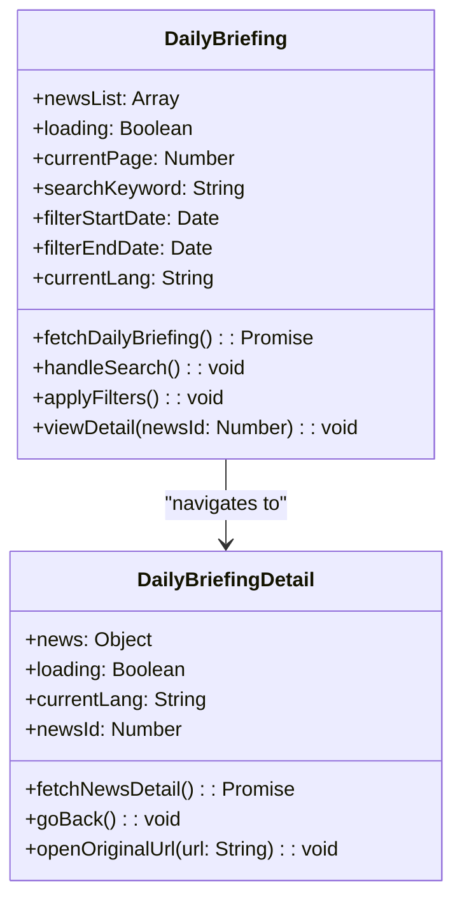
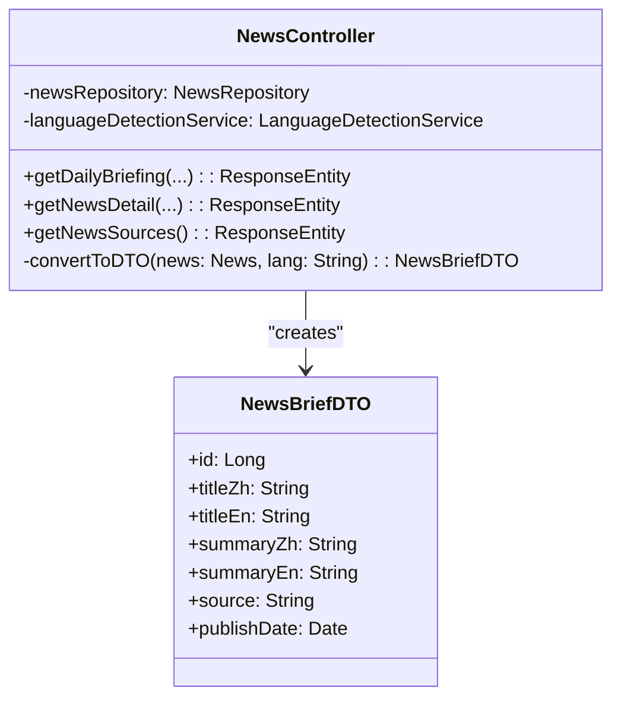
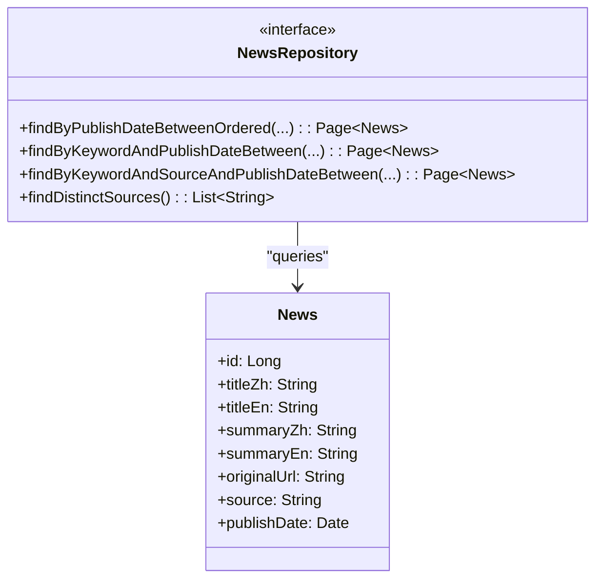
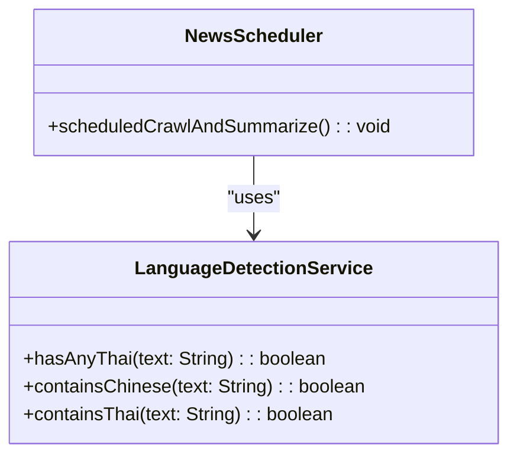
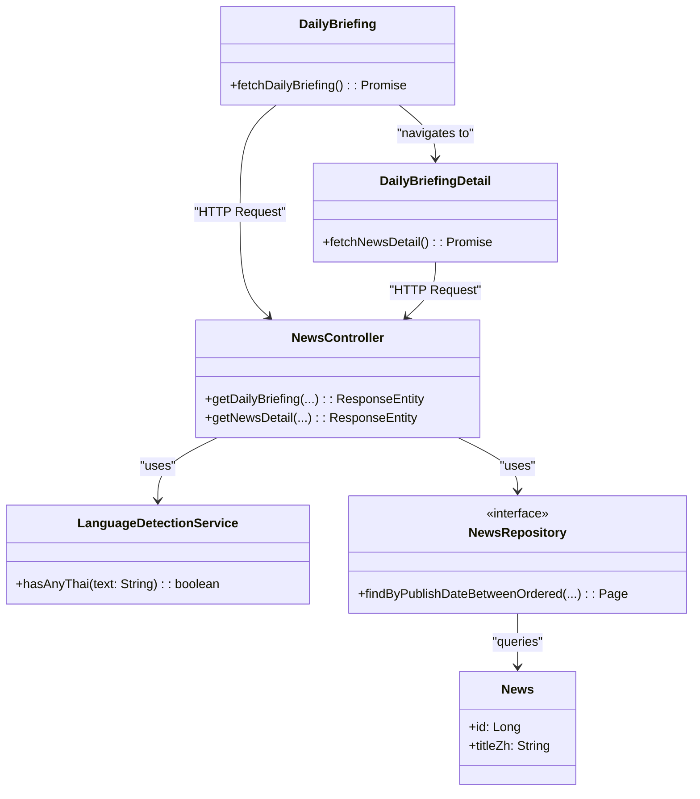

# Feature 1 类图拆分方案（参考图一图二风格）

## 拆分原则
- 按照**分层架构**拆分：前端视图层 → 控制器层 → 数据访问层 → 数据模型层
- 每个子图只展示 **2-4 个相关类**，保持简洁清晰
- 每个子图都有明确的**职责说明**和**关系描述**

---

## 子图 1：前端视图层（Views）

**标题**：Figure X: Views - Daily Briefing Frontend Components  
**位置**：BridgeU-SDD Page XX

**说明**：
- `DailyBriefing`：新闻列表页组件，负责分页、搜索、过滤
- `DailyBriefingDetail`：新闻详情页组件，负责展示单条新闻详情
- 两者通过路由导航关联

---

## 子图 2：控制器层（Controller）

**标题**：Figure X+1: Controller - NewsController  
**位置**：BridgeU-SDD Page XX+1

**说明**：
- `NewsController`：处理 HTTP 请求，协调数据获取和转换
- `NewsBriefDTO`：数据传输对象，用于前后端数据交换
- Controller 负责将 `News` 实体转换为 `NewsBriefDTO`

---

## 子图 3：数据访问层（Repository）

**标题**：Figure X+2: Repository - NewsRepository Interface  
**位置**：BridgeU-SDD Page XX+2

**说明**：
- `NewsRepository`：数据访问接口，定义查询方法
- `News`：新闻实体类，对应数据库表
- Repository 通过 JPA 查询 `News` 实体

---

## 子图 4：服务层（Services）

**标题**：Figure X+3: Services - Language Detection & Scheduling  
**位置**：BridgeU-SDD Page XX+3

**说明**：
- `LanguageDetectionService`：语言检测服务，用于识别文本语言
- `NewsScheduler`：定时任务调度器，每天 8:00 执行爬虫和摘要任务
- Scheduler 使用 LanguageDetectionService 进行内容过滤

---

## 子图 5：整体关系图（可选，简化版）

**标题**：Figure X+4: Overall Architecture - Feature 1 Component Relationships  
**位置**：BridgeU-SDD Page XX+4

**说明**：
- 展示从前端到数据库的**完整数据流向**和**架构层次**
- 包含前端视图层（DailyBriefing + DailyBriefingDetail）、控制器层（NewsController）、服务层（LanguageDetectionService）、数据访问层（NewsRepository）和数据模型层（News）
- 展示主要类之间的依赖关系和使用关系
- 用于说明整体架构层次和各层之间的交互

---

## PPT 页面组织建议

### 第 15 页：类图概览（可选）
- 标题：Feature 1 - Class Diagram Overview
- 内容：一句话说明“类图按分层架构拆分为 4 个子图展示”
- 列出 4 个子图的标题

### 第 16 页：前端视图层类图
- 标题：Figure X: Views - Daily Briefing Frontend Components
- 展示：DailyBriefing + DailyBriefingDetail
- 说明：前端组件负责用户交互和数据展示

### 第 17 页：控制器层类图
- 标题：Figure X+1: Controller - NewsController
- 展示：NewsController + NewsBriefDTO
- 说明：控制器处理 HTTP 请求，DTO 用于数据传输

### 第 18 页：数据访问层类图
- 标题：Figure X+2: Repository - NewsRepository Interface
- 展示：NewsRepository + News
- 说明：Repository 定义数据访问契约，News 是实体模型

### 第 19 页：服务层类图
- 标题：Figure X+3: Services - Language Detection & Scheduling
- 展示：LanguageDetectionService + NewsScheduler
- 说明：服务层提供语言检测和定时任务功能

### 第 20 页：整体架构关系（可选）
- 标题：Figure X+4: Overall Architecture - Component Relationships
- 展示：简化的整体关系图（4 个核心类）
- 说明：展示从前端到数据库的完整数据流

---

## 优势

1. **符合参考风格**：每个子图只有 2-4 个类，简洁清晰
2. **层次分明**：按架构层次拆分，便于理解
3. **易于讲解**：每页聚焦一个层次，讲解更有针对性
4. **专业规范**：符合 UML 类图展示的最佳实践

