## BridgeU

**Software Design Development**

Zhiyi Pan 652115558
Bachelor of Science, Software Engineering Program  
College of Arts, Media, and Technology, Chiang Mai University  
December 2025  
Project Advisor: Asst. Prof. Pattama Longani, Ph.D.

---

### Table of Contents

- **Chapter 1 Introduction**  
  - 1.1 Purpose and Scope  
  - 1.2 Acronyms and Definitions  
- **Chapter 2 System Architecture**  
- **Chapter 3 Detail Design**  
  - 3.1 Feature 1  
    - 3.1.1 Class Diagram  
    - 3.1.2 Class Diagram Description  
    - 3.1.3 Sequence Diagram  
  - 3.2 Feature 2  
    - 3.2.1 Class Diagram  
    - 3.2.2 Class Diagram Description  
    - 3.2.3 Sequence Diagram
  - 3.3 Feature 3  
    - 3.3.1 Class Diagram  
    - 3.3.2 Class Diagram Description  
    - 3.3.3 Sequence Diagram  

---

## Chapter 1 Introduction

### 1.1 Purpose and Scope

The purpose of the Software Design Development (SDD) document is to present a complete software design of the BridgeU project.  
This document contains the outline of the software architecture, functions used, and diagrams (class, sequence, and activity) with the user interface for this project.  
BridgeU aims to eliminate language barriers through AI technology and establish a bilingual mutual assistance ecosystem connecting Chinese students, global students, and local Thai merchants.

### 1.2 Acronyms and Definitions

**Acronyms**

- **SRS**: Software Requirement Specification  
- **UI**: User Interface  
- **SDD**: Software Design Document  
- **FD**: Function Description  

**Definitions**

- **IEEE**: Institute for Electrical and Electronics Engineers. The largest global interest group for engineers of different branches and computer scientists.  
- **Plan**: A document or series of tasks required to meet an objective, typically including the associated schedule, budget, resources, organizational description and work breakdown structure.  
- **Feature**: Transformation of input parameters to output parameters based on a specified algorithm. It describes the functionality of the product in the language of the product, and is used for requirements analysis, design, coding, testing or maintenance.  
- **Project Management**: The application of knowledge, skills, tools, and techniques to project activities in order to meet or exceed stakeholder needs and expectations from a project.  
- **Project Plan**: A formal, approved document used to guide both project execution and project control. It documents planning assumptions and decisions, facilitates communication among stakeholders, and records approved scope, cost, and schedule baseline.  
- **Risk**: An uncertain event or condition that, if it occurs, has a positive or negative effect on a project’s objectives. It is a function of the probability of occurrence of a given threat’s occurrence.  
- **Risk Management**: The systematic application of management policies, procedures and practices to the tasks of identifying, analyzing, evaluating, treating and monitoring risk.  
- **System Testing**: Testing conducted on a complete and integrated system to evaluate the system’s compliance with its specified requirements.  
- **Unit Test**: A test of individual programs or modules in order to remove design or programming errors.  
- **Traceability**: The ability to trace the history, application or location of an item or activity, or work products or activities, by means of recorded identification. Horizontal traceability describes the relationship between work products of the same type (e.g., customer requirements). Vertical traceability describes the relationship between work products which build or are derived from each other (e.g., from customer requirements to qualification test cases). Bidirectional traceability allows following relationships in both directions.  
- **Use Case**: A description of a specific interaction between a system and its users to accomplish a particular goal or task. It outlines the sequence of steps or actions that a user performs in the system and describes the system's responses to those actions.  
- **Crawler**: A program that systematically browses the World Wide Web in order to create an index of data.  
- **Qwen AI**: The Large Language Model provided by Alibaba Cloud used for translation and summarization in this project.  

---

## Chapter 2 System Architecture

**Description**:  
The system architecture consists of a front-end built using Vue.js and a component library (Element UI / Element Plus), which provides a responsive user interface.  
The back-end is built with Spring Boot, a robust Java framework, handling business logic and RESTful API requests.  
MySQL 8 is used as the primary database for storing structured user and post data.  
Elasticsearch (or other search mechanisms) can be integrated to provide high-performance keyword / full-text search capabilities.  
Additionally, the system connects to the Aliyun Qwen API to perform natural language processing tasks such as summarization and translation.  
Axios is used for communication between the front-end and back-end.

---

## Chapter 3 Detail Design

### 3.1 Feature 1: Daily Briefing System

The Daily Briefing System allows users to:

- Find Daily Briefing.  
- View Daily Briefing News Details.  
- Switch Interface Language.  
- Jump to Original Link.  
- Filter Daily Briefing News by Date.  
- Search for Daily Briefing News.

All descriptions below are based on the current codebase.

---

### 3.1.1 Class Diagram

The overall class diagram for Feature 1 (Daily Briefing) is shown below.

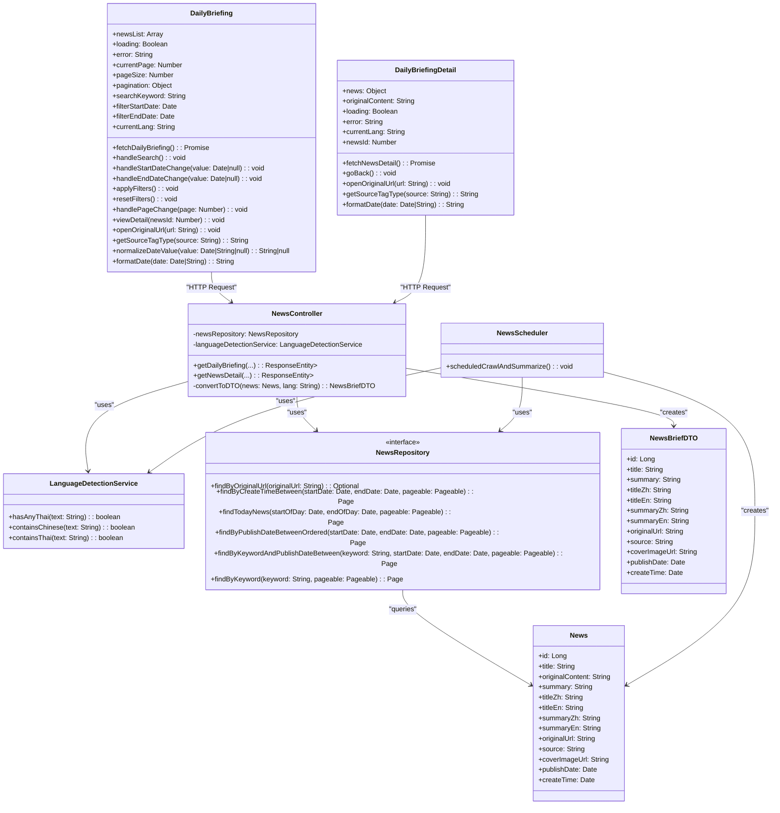
```mermaid
classDiagram
  class DailyBriefing {
    +newsList: Array
    +loading: Boolean
    +error: String
    +currentPage: Number
    +pageSize: Number
    +pagination: Object
    +searchKeyword: String
    +filterStartDate: Date
    +filterEndDate: Date
    +currentLang: String
    +fetchDailyBriefing(): Promise<void>
    +handleSearch(): void
    +handleStartDateChange(value: Date|null): void
    +handleEndDateChange(value: Date|null): void
    +applyFilters(): void
    +resetFilters(): void
    +handlePageChange(page: Number): void
    +viewDetail(newsId: Number): void
    +openOriginalUrl(url: String): void
    +getSourceTagType(source: String): String
    +normalizeDateValue(value: Date|String|null): String|null
    +formatDate(date: Date|String): String
  }

  class DailyBriefingDetail {
    +news: Object
    +originalContent: String
    +loading: Boolean
    +error: String
    +currentLang: String
    +newsId: Number
    +fetchNewsDetail(): Promise<void>
    +goBack(): void
    +openOriginalUrl(url: String): void
    +getSourceTagType(source: String): String
    +formatDate(date: Date|String): String
  }

  class LanguageDetectionService {
    +hasAnyThai(text: String): boolean
    +containsChinese(text: String): boolean
    +containsThai(text: String): boolean
  }

  class NewsController {
    -newsRepository: NewsRepository
    -languageDetectionService: LanguageDetectionService
    +getDailyBriefing(...): ResponseEntity<Map<String,Object>>
    +getNewsDetail(...): ResponseEntity<Map<String,Object>>
    -convertToDTO(news: News, lang: String): NewsBriefDTO
  }

  class NewsRepository {
    <<interface>>
    +findByOriginalUrl(originalUrl: String): Optional<News>
    +findByCreateTimeBetween(startDate: Date, endDate: Date, pageable: Pageable): Page<News>
    +findTodayNews(startOfDay: Date, endOfDay: Date, pageable: Pageable): Page<News>
    +findByPublishDateBetweenOrdered(startDate: Date, endDate: Date, pageable: Pageable): Page<News>
    +findByKeywordAndPublishDateBetween(keyword: String, startDate: Date, endDate: Date, pageable: Pageable): Page<News>
    +findByKeyword(keyword: String, pageable: Pageable): Page<News>
  }

  class NewsScheduler {
    +scheduledCrawlAndSummarize(): void
  }

  class News {
    +id: Long
    +title: String
    +originalContent: String
    +summary: String
    +titleZh: String
    +titleEn: String
    +summaryZh: String
    +summaryEn: String
    +originalUrl: String
    +source: String
    +coverImageUrl: String
    +publishDate: Date
    +createTime: Date
  }

  class NewsBriefDTO {
    +id: Long
    +title: String
    +summary: String
    +titleZh: String
    +titleEn: String
    +summaryZh: String
    +summaryEn: String
    +originalUrl: String
    +source: String
    +coverImageUrl: String
    +publishDate: Date
    +createTime: Date
  }

  DailyBriefing --> NewsController : "HTTP Request"
  DailyBriefingDetail --> NewsController : "HTTP Request"
  NewsController --> NewsRepository : "uses"
  NewsController --> NewsBriefDTO : "creates"
  NewsRepository --> News : "queries"
  NewsController --> LanguageDetectionService : "uses"
  NewsScheduler --> NewsRepository : "uses"
  NewsScheduler --> News : "creates"
  NewsScheduler --> LanguageDetectionService : "uses"
```

---

### 3.1.2 Class Diagram Description

#### 3.1.2.1 View

##### 3.1.2.1.1 DailyBriefing

Represents the Daily Briefing list view in the frontend. It is responsible for fetching, filtering, and paginating news items.

**Attributes**

| ID | Name           | Description                                                                                          | Type   |
|----|----------------|------------------------------------------------------------------------------------------------------|--------|
| 1  | newsList       | Array containing the list of Daily Briefing news items to be displayed                              | Array  |
| 2  | loading        | Boolean flag indicating if the news data is currently being fetched                                 | Boolean |
| 3  | error          | String containing error message if data fetching fails                                              | String |
| 4  | currentPage    | Current page number for pagination (1-based in UI)                                                  | Number |
| 5  | pageSize       | Number of news items to display per page                                                            | Number |
| 6  | pagination     | Object containing pagination information returned by backend (page, size, totalElements, etc.)     | Object |
| 7  | searchKeyword  | String containing the keyword entered by the user for searching news                                | String |
| 8  | filterStartDate| Date object (or null) representing the start date for filtering news by publication date           | Date \| null |
| 9  | filterEndDate  | Date object (or null) representing the end date for filtering news by publication date             | Date \| null |
| 10 | currentLang    | String representing the current interface language ("zh" for Chinese, "en" for English)            | String |

**Methods**

| ID | Name                | Description                                                                                                                                                                                                                                                                   | Parameters                         | Return Type    |
|----|---------------------|-------------------------------------------------------------------------------------------------------------------------------------------------------------------------------------------------------------------------------------------------------------------------------|------------------------------------|----------------|
| 1  | fetchDailyBriefing  | Fetches Daily Briefing news items from the backend API with pagination, search, and filter parameters. Sets `loading = true`, calculates 0-based page number, builds `params` object with `page`, `size`, `lang`, `keyword` (if provided), `startDate` and `endDate`. Sends GET request to `/api/news/daily-briefing`. On success, updates `newsList` and `pagination` object. Handles errors and sets `loading = false` in `finally` block. | None                               | Promise\<void> |
| 2  | handleSearch        | Handles search action by resetting `currentPage` to 1 and calling `fetchDailyBriefing()`. Ensures search results start from the first page.                                                                                                                                   | None                               | void           |
| 3  | handleStartDateChange | Updates the `filterStartDate` when user selects a start date.                                                                                                                                                                                                                | `value: Date \| null`              | void           |
| 4  | handleEndDateChange | Updates the `filterEndDate` when user selects an end date.                                                                                                                                                                                                                    | `value: Date \| null`              | void           |
| 5  | applyFilters        | Validates date range (checks if `filterStartDate > filterEndDate`, shows warning if invalid). If valid, resets `currentPage` to 1 and calls `fetchDailyBriefing()` to fetch filtered results. `fetchDailyBriefing()` internally calls `normalizeDateValue()` before sending dates to API. | None                               | void           |
| 6  | resetFilters        | Clears all filter conditions: sets `searchKeyword = ''`, `filterStartDate = null`, `filterEndDate = null`, resets `currentPage` to 1, and calls `fetchDailyBriefing()` to reload all news without filters.                                                                    | None                               | void           |
| 7  | handlePageChange    | Handles pagination by updating `currentPage` to the new page number and calling `fetchDailyBriefing()` to fetch the corresponding page. Scrolls to top after page change.                                                                                                     | `page: Number`                     | void           |
| 8  | viewDetail          | Emits an event to navigate to the news detail page for a specific news item.                                                                                                                                                                                                 | `newsId: Number`                   | void           |
| 9  | openOriginalUrl     | Opens the original news article URL in a new browser tab.                                                                                                                                                                                                                     | `url: String`                      | void           |
| 10 | getSourceTagType    | Returns the UI tag type (primary/success/info) based on the news source.                                                                                                                                                                                                      | `source: String`                   | String         |
| 11 | normalizeDateValue  | Normalizes date value to `DD-MM-YYYY` format string. Handles `Date` objects, string values (validates `DD-MM-YYYY` format, ignores incomplete inputs), and null values. Returns `null` for invalid inputs.                                                                    | `value: Date \| String \| null`    | String \| null |
| 12 | formatDate          | Formats a date object to `"DD-MM-YYYY HH:mm"` format string.                                                                                                                                                                                                                  | `date: Date \| String`             | String         |

##### 3.1.2.1.2 DailyBriefingDetail

Represents the Daily Briefing detail view in the frontend. It is responsible for displaying a single news item and its original content when allowed.

**Attributes**

| ID | Name            | Description                                                                                   | Type   |
|----|-----------------|-----------------------------------------------------------------------------------------------|--------|
| 1  | news            | Object containing the detailed information of a single Daily Briefing news item              | Object |
| 2  | originalContent | String containing the original content of the news article                                   | String |
| 3  | loading         | Boolean flag indicating if the news detail data is currently being fetched                   | Boolean |
| 4  | error           | String containing error message if data fetching fails                                       | String |
| 5  | currentLang     | String representing the current interface language ("zh" for Chinese, "en" for English)      | String |
| 6  | newsId          | Number representing the ID of the news item to display (passed as prop or route parameter)  | Number |

**Methods**

| ID | Name             | Description                                                                                                                                                                                                                                                                       | Parameters        | Return Type   |
|----|------------------|-----------------------------------------------------------------------------------------------------------------------------------------------------------------------------------------------------------------------------------------------------------------------------------|-------------------|--------------|
| 1  | fetchNewsDetail  | Fetches detailed information of a single news item from the backend API using `newsId`. Sets `loading = true`, `error = null`, builds `params` with `lang` (`currentLang` or `'en'`), sends GET request to `/api/news/daily-briefing/{id}`. Checks `response.status === 200` and `response.data.success`. On success, updates `news = response.data.data` and `originalContent = response.data.originalContent`. Handles errors: 404 (shows localized notFound message), 401 (login expired, handled by interceptor), 500 (shows error message from response), network errors (shows localized networkError message). Sets `loading = false` in `finally` block. | None              | Promise\<void> |
| 2  | goBack           | Emits an event to navigate back to the Daily Briefing list page.                                                                                                                                                                                                                   | None              | void         |
| 3  | openOriginalUrl  | Opens the original news article URL in a new browser tab.                                                                                                                                                                                                                         | `url: String`     | void         |
| 4  | getSourceTagType | Returns the UI tag type (primary/success/info) based on the news source.                                                                                                                                                                                                          | `source: String`  | String       |
| 5  | formatDate       | Formats a date object to `"DD-MM-YYYY HH:mm"` format string.                                                                                                                                                                                                                      | `date: Date \| String` | String   |

#### 3.1.2.2 Controller

##### 3.1.2.2.1 Controller: `NewsController`

File: `springboot-backend/src/main/java/com/globalbuddy/controller/NewsController.java`

**Attributes**

| ID | Name                     | Description                                                                                  | Type                    |
|----|--------------------------|----------------------------------------------------------------------------------------------|-------------------------|
| 1  | newsRepository           | Instance of `NewsRepository` for database operations                                        | NewsRepository          |
| 2  | languageDetectionService | Instance of `LanguageDetectionService` for detecting Thai and Chinese content              | LanguageDetectionService |

**Methods**

| ID | Name               | Description                                                                                                                          | Parameters                                                                                                       | Return Type                         |
|----|--------------------|--------------------------------------------------------------------------------------------------------------------------------------|------------------------------------------------------------------------------------------------------------------|-------------------------------------|
| 1  | getDailyBriefing   | Handles GET request to retrieve paginated Daily Briefing news list with optional filters (keyword, date range, source). Returns paginated news data. | `page: int`, `size: int`, `lang: String`, `source: String`, `startDate: String`, `endDate: String`, `keyword: String` | `ResponseEntity<Map<String,Object>>` |
| 2  | getNewsDetail      | Handles GET request to retrieve detailed information of a single news item by ID. Returns DTO data and optional original content.   | `id: Long`, `lang: String`                                                                                       | `ResponseEntity<Map<String,Object>>` |
| 3  | convertToDTO       | Converts `News` entity to `NewsBriefDTO` based on language preference, enforcing “no Thai content on UI” rule.                     | `news: News`, `lang: String`                                                                                    | `NewsBriefDTO`                      |

#### 3.1.2.3 Repository

##### 3.1.2.3.1 Repository: `NewsRepository`

File: `springboot-backend/src/main/java/com/globalbuddy/repository/NewsRepository.java`

**Methods**

| ID | Name                                      | Description                                                                                                          | Parameters                                                                                               | Return Type      |
|----|-------------------------------------------|----------------------------------------------------------------------------------------------------------------------|----------------------------------------------------------------------------------------------------------|------------------|
| 1  | findByOriginalUrl                         | Finds a news item by its original URL (used for deduplication during crawling).                                     | `originalUrl: String`                                                                                    | Optional\<News>  |
| 2  | findByCreateTimeBetween                   | Finds news items within specified date range based on `createTime` (with pagination).                               | `startDate: Date`, `endDate: Date`, `pageable: Pageable`                                                | Page\<News>      |
| 3  | findTodayNews                             | Finds today's news items based on `publishDate` (with pagination).                                                  | `startOfDay: Date`, `endOfDay: Date`, `pageable: Pageable`                                              | Page\<News>      |
| 4  | findByPublishDateBetweenOrdered           | Finds news items within publish date range, ordered by `publishDate` DESC (with pagination).                        | `startDate: Date`, `endDate: Date`, `pageable: Pageable`                                                | Page\<News>      |
| 5  | findByKeywordAndPublishDateBetween        | Searches news items by keyword (in title, content, summary, translations) and publish date range (with pagination). | `keyword: String`, `startDate: Date`, `endDate: Date`, `pageable: Pageable`                             | Page\<News>      |
| 6  | findByKeyword                             | Searches news items by keyword across all historical news (with pagination).                                        | `keyword: String`, `pageable: Pageable`                                                                  | Page\<News>      |

#### 3.1.2.4 Model

##### 3.1.2.4.1 Model: `News`

File: `springboot-backend/src/main/java/com/globalbuddy/model/News.java`

**Attributes**

| ID | Name           | Type   | Description                                                     |
|----|----------------|--------|-----------------------------------------------------------------|
| 1  | id             | Long   | Primary key ID (IDENTITY auto-increment)                       |
| 2  | title          | String | Original news title                                             |
| 3  | originalContent| String | Full original article content (`TEXT`)                         |
| 4  | summary        | String | AI-generated or RSS-provided summary (`TEXT`)                  |
| 5  | titleZh        | String | Chinese translation of the title                               |
| 6  | titleEn        | String | English translation of the title                               |
| 7  | summaryZh      | String | Chinese translation of the summary (`TEXT`)                    |
| 8  | summaryEn      | String | English translation of the summary (`TEXT`)                    |
| 9  | originalUrl    | String | Original article URL (length 1000)                             |
| 10 | source         | String | Source website name (e.g. Google News feed label)             |
| 11 | coverImageUrl  | String | URL of the cover image extracted from meta tags (length 1000) |
| 12 | publishDate    | Date   | Publication time                                               |
| 13 | createTime     | Date   | Time when the record is saved in DB                           |

##### 3.1.2.4.2 Model: `NewsBriefDTO`

File: `springboot-backend/src/main/java/com/globalbuddy/dto/NewsBriefDTO.java`

**Attributes**

| ID | Name          | Type   | Description                                                                 |
|----|---------------|--------|-----------------------------------------------------------------------------|
| 1  | id            | Long   | News ID                                                                     |
| 2  | title         | String | News title (language-specific based on user preference)                    |
| 3  | summary       | String | News summary (language-specific based on user preference)                  |
| 4  | titleZh       | String | Chinese translation of the title                                           |
| 5  | titleEn       | String | English translation of the title                                           |
| 6  | summaryZh     | String | Chinese translation of the summary                                         |
| 7  | summaryEn     | String | English translation of the summary                                         |
| 8  | originalUrl   | String | Original article URL from the source website                               |
| 9  | source        | String | Source website name                                                        |
| 10 | coverImageUrl | String | Cover image URL                                                            |
| 11 | publishDate   | Date   | Publication date from the source website                                   |
| 12 | createTime    | Date   | Timestamp when the news was crawled and stored                             |

#### 3.1.2.5 Pagination Response Structure

Endpoint `GET /api/news/daily-briefing` returns a `Map<String,Object>` with:

- `success: boolean`  
- `data: List<NewsBriefDTO>`  
- `pagination`:
  - `page, size, totalElements, totalPages, hasNext, hasPrevious`  
- `date: String` – current server date (`LocalDate.now().toString()`)  
- Optional echo fields: `filterStartDate`, `filterEndDate`

---

### 3.1.2 Backend Components

#### 3.1.2.1 Controller: `NewsController`

File: `springboot-backend/src/main/java/com/globalbuddy/controller/NewsController.java`

**Attributes**

| ID | Name                    | Type                    | Description                                                  |
|----|-------------------------|-------------------------|--------------------------------------------------------------|
| 1  | newsRepository          | NewsRepository          | JPA repository for `News`                                   |
| 2  | languageDetectionService| LanguageDetectionService| Detects Thai/Chinese characters and language properties     |

<!-- Detailed narrative method descriptions for NewsController have been consolidated into the Methods table above to match the required SDD format. -->

#### 3.1.2.2 Repository: `NewsRepository`

File: `springboot-backend/src/main/java/com/globalbuddy/repository/NewsRepository.java`

**Main methods used by Feature 1**:

- `Page<News> findAll(Pageable pageable)` – default, no filter.  
- `Page<News> findByPublishDateBetweenOrdered(Date startDate, Date endDate, Pageable pageable)` – date-only filter, ordered by `publishDate DESC`.  
- `Page<News> findByKeywordAndPublishDateBetween(String keyword, Date startDate, Date endDate, Pageable pageable)` – keyword across multiple fields + date filter.  
- `Page<News> findByKeyword(String keyword, Pageable pageable)` – keyword only (no date).  
- `Optional<News> findByOriginalUrl(String originalUrl)` – used for deduplication during crawling.

#### 3.1.2.3 Scheduler: `NewsScheduler`

File: `springboot-backend/src/main/java/com/globalbuddy/scheduler/NewsScheduler.java`

**Attributes**

| ID | Name                    | Type                    | Description                                                  |
|----|-------------------------|-------------------------|--------------------------------------------------------------|
| 1  | newsCrawlerService      | NewsCrawlerService      | Crawls news from RSS and HTML                               |
| 2  | aiSummaryService        | AiSummaryService        | Generates AI summaries via Qwen                             |
| 3  | newsRepository          | NewsRepository          | Persists `News` entities                                    |
| 4  | languageDetectionService| LanguageDetectionService| Language detection utilities                                |
| 5  | translationService      | TranslationService      | Translates titles and summaries                             |
| 6  | newsRelevanceService    | NewsRelevanceService    | Filters news relevant to international students             |

<!-- Detailed narrative method description for NewsScheduler has been consolidated into the Methods table above to match the required SDD format. -->

---

### 3.1.3 API Design

#### 3.1.3.1 List Daily Briefings

- **Endpoint**: `GET /api/news/daily-briefing`  
- **Purpose**: Retrieve a paginated list of news briefings with optional filters.

**Query Parameters**:

| Name      | Type   | Default | Description                                 |
|-----------|--------|---------|---------------------------------------------|
| page      | int    | 0       | Zero-based page index                      |
| size      | int    | 10      | Page size                                  |
| lang      | string | "en"    | Language preference (`"zh"` or `"en"`)     |
| startDate | string | null    | Optional start date (`yyyy-MM-dd`)         |
| endDate   | string | null    | Optional end date (`yyyy-MM-dd`)           |
| keyword   | string | null    | Optional keyword (trimmed before use)      |

**Success Response (200)**:

```json
{
  "success": true,
  "data": [ /* array of NewsBriefDTO */ ],
  "pagination": {
    "page": 0,
    "size": 10,
    "totalElements": 123,
    "totalPages": 13,
    "hasNext": true,
    "hasPrevious": false
  },
  "date": "2026-02-06",
  "filterStartDate": "optional",
  "filterEndDate": "optional"
}
```

**Error Response (500)**:

```json
{
  "success": false,
  "message": "Failed to fetch news briefing: <details>"
}
```

#### 3.1.3.2 Get News Detail

- **Endpoint**: `GET /api/news/daily-briefing/{id}`  
- **Purpose**: Retrieve a single news item and, if allowed, its original content.

**Query Parameters**:

| Name | Type   | Default | Description                            |
|------|--------|---------|----------------------------------------|
| lang | string | "en"    | Language preference for DTO selection |

**Success Response (200)**:

```json
{
  "success": true,
  "data": { /* NewsBriefDTO */ },
  "originalContent": "Full original content or null if Thai or empty"
}
```

**Not Found (404)**:

```json
{
  "success": false,
  "message": "News not found with id: 123"
}
```

**Error (500)**:

```json
{
  "success": false,
  "message": "Failed to fetch news detail: <details>"
}
```

---

### 3.1.4 Sequence Diagrams (Mermaid)

The following sequence diagrams are intentionally **simplified** to show only **method calls and key branches**, with implementation details explained in the method descriptions above.

#### SD-01: View Daily Briefings

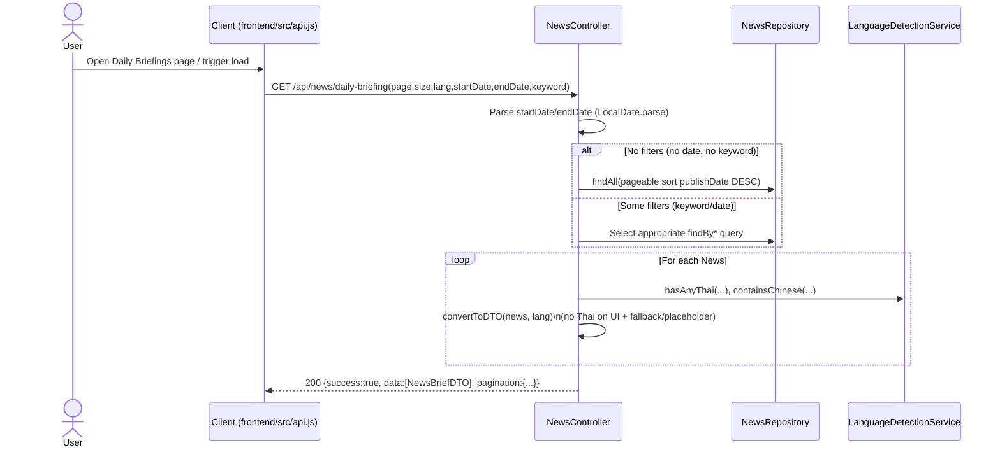
```mermaid
sequenceDiagram
  actor User as User
  participant Client as Client (frontend/src/api.js)
  participant NC as NewsController
  participant NR as NewsRepository
  participant LDS as LanguageDetectionService

  User->>Client: Open Daily Briefings page / trigger load
  Client->>NC: GET /api/news/daily-briefing(page,size,lang,startDate,endDate,keyword)
  NC->>NC: Parse startDate/endDate (LocalDate.parse)
  alt No filters (no date, no keyword)
    NC->>NR: findAll(pageable sort publishDate DESC)
  else Some filters (keyword/date)
    NC->>NR: Select appropriate findBy* query
  end
  loop For each News
    NC->>LDS: hasAnyThai(...), containsChinese(...)
    NC->>NC: convertToDTO(news, lang)\n(no Thai on UI + fallback/placeholder)
  end
  NC-->>Client: 200 {success:true, data:[NewsBriefDTO], pagination:{...}}
```

#### SD-02: View Daily Briefing News Details

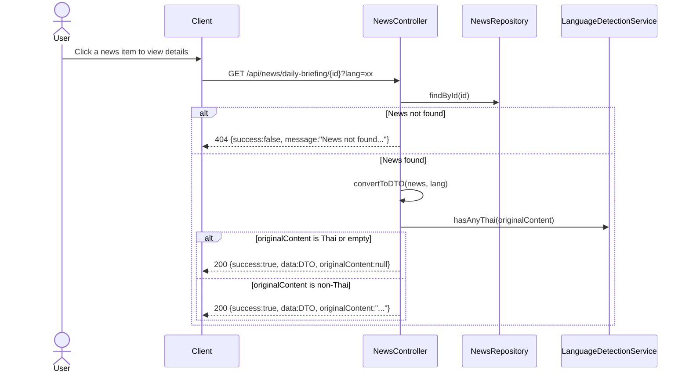
```mermaid
sequenceDiagram
  actor User as User
  participant Client as Client
  participant NC as NewsController
  participant NR as NewsRepository
  participant LDS as LanguageDetectionService

  User->>Client: Click a news item to view details
  Client->>NC: GET /api/news/daily-briefing/{id}?lang=xx
  NC->>NR: findById(id)
  alt News not found
    NC-->>Client: 404 {success:false, message:"News not found..."}
  else News found
    NC->>NC: convertToDTO(news, lang)
    NC->>LDS: hasAnyThai(originalContent)
    alt originalContent is Thai or empty
      NC-->>Client: 200 {success:true, data:DTO, originalContent:null}
    else originalContent is non-Thai
      NC-->>Client: 200 {success:true, data:DTO, originalContent:"..."}
    end
  end
```

#### SD-03: Switch Interface Language

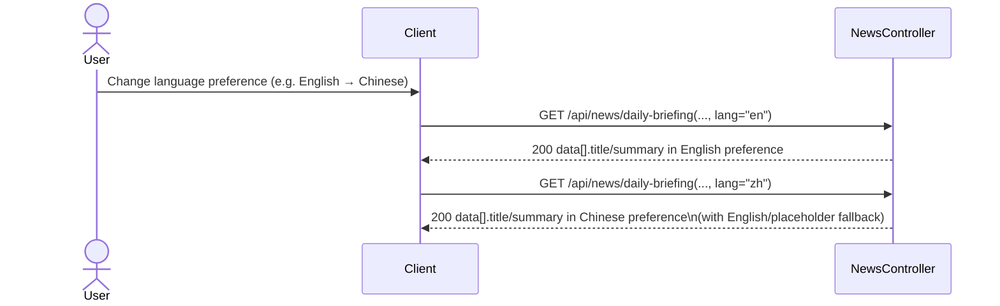
```mermaid
sequenceDiagram
  actor User as User
  participant Client as Client
  participant NC as NewsController

  User->>Client: Change language preference (e.g. English → Chinese)
  Client->>NC: GET /api/news/daily-briefing(..., lang="en")
  NC-->>Client: 200 data[].title/summary in English preference
  Client->>NC: GET /api/news/daily-briefing(..., lang="zh")
  NC-->>Client: 200 data[].title/summary in Chinese preference\n(with English/placeholder fallback)
```

#### SD-04: Jump to Original Link

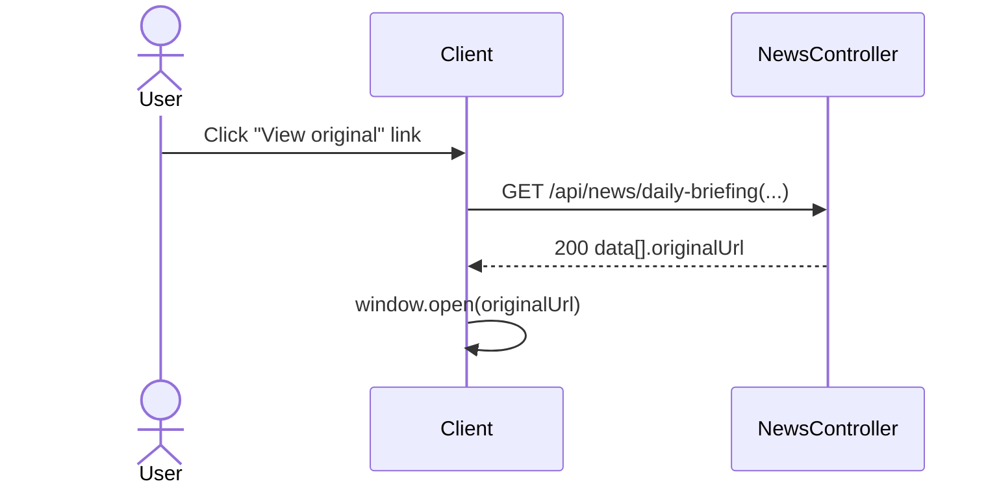
```mermaid
sequenceDiagram
  actor User as User
  participant Client as Client
  participant NC as NewsController

  User->>Client: Click "View original" link
  Client->>NC: GET /api/news/daily-briefing(...)
  NC-->>Client: 200 data[].originalUrl
  Client->>Client: window.open(originalUrl)
```

#### SD-05: Filter Daily Briefing News by Date

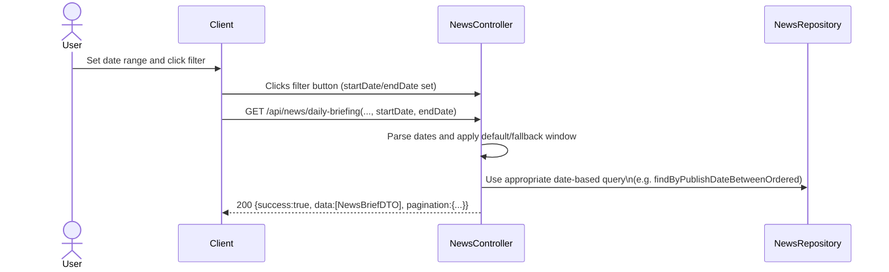
```mermaid
sequenceDiagram
  actor User as User
  participant Client as Client
  participant NC as NewsController
  participant NR as NewsRepository

  User->>Client: Set date range and click filter
  Client->>NC: Clicks filter button (startDate/endDate set)
  Client->>NC: GET /api/news/daily-briefing(..., startDate, endDate)
  NC->>NC: Parse dates and apply default/fallback window
  NC->>NR: Use appropriate date-based query\n(e.g. findByPublishDateBetweenOrdered)
  NC-->>Client: 200 {success:true, data:[NewsBriefDTO], pagination:{...}}
```

#### SD-06: Search for Daily Briefing News

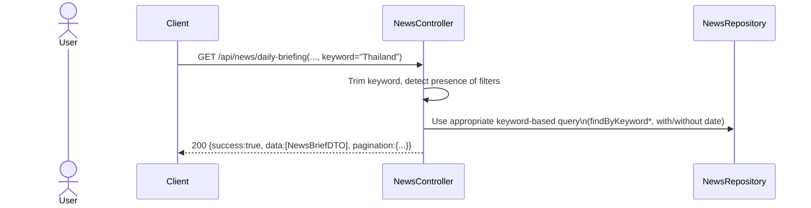
```mermaid
sequenceDiagram
  actor User as User
  participant Client as Client
  participant NC as NewsController
  participant NR as NewsRepository

  Client->>NC: GET /api/news/daily-briefing(..., keyword="Thailand")
  NC->>NC: Trim keyword, detect presence of filters
  NC->>NR: Use appropriate keyword-based query\n(findByKeyword*, with/without date)
  NC-->>Client: 200 {success:true, data:[NewsBriefDTO], pagination:{...}}
```

---

### 3.1.5 Code Reference List (Traceability)

The following files implement Feature 1: Daily Briefing System.

- **Controller**
  - `springboot-backend/src/main/java/com/globalbuddy/controller/NewsController.java`
- **Repository**
  - `springboot-backend/src/main/java/com/globalbuddy/repository/NewsRepository.java`
- **Entity and DTO**
  - `springboot-backend/src/main/java/com/globalbuddy/model/News.java`
  - `springboot-backend/src/main/java/com/globalbuddy/dto/NewsBriefDTO.java`
- **Language Detection**
  - `springboot-backend/src/main/java/com/globalbuddy/service/LanguageDetectionService.java`
- **Scheduler and News Pipeline**
  - `springboot-backend/src/main/java/com/globalbuddy/scheduler/NewsScheduler.java`
  - `springboot-backend/src/main/java/com/globalbuddy/service/NewsCrawlerService.java`
  - `springboot-backend/src/main/java/com/globalbuddy/service/NewsRelevanceService.java`
  - `springboot-backend/src/main/java/com/globalbuddy/service/AiSummaryService.java`
  - `springboot-backend/src/main/java/com/globalbuddy/service/TranslationService.java`
- **Frontend API Wrappers**
  - `frontend/src/api.js` (`fetchDailyBriefing`)
  - `frontend/vite.config.js` (dev proxy for `/api`)

---

## 3.2 Feature 2: Community Interaction Platform

The Community Interaction Platform allows users to:
- Browse Community Feed.  
- Create Publish Post.  
- Like Post.  
- Filter by Tag.  
- View Post Details.  
- Report Post/Comment.  
- Post Comment.  
- Search Posts.  
- AI Summary Comment.  
- Communicate with others (private messages with mutual follows, under the mutual-follow rules defined in Feature 3).  
- Manage Message Status (mark messages as read and delete messages in the user's own view).

Note: **Viewing and managing the mutual-follow (Friends) list itself is part of Feature 3 – Authentication and Profile System**. From the community interface, the user can still trigger follow/unfollow and open private-message entry points, but the underlying follower/friend relationships and access rules are specified in Feature 3.

All descriptions below are based on the current codebase.

---

### 3.2.1 Class Diagram

The overall class diagram for Feature 2 (Community Interaction Platform) is shown below.

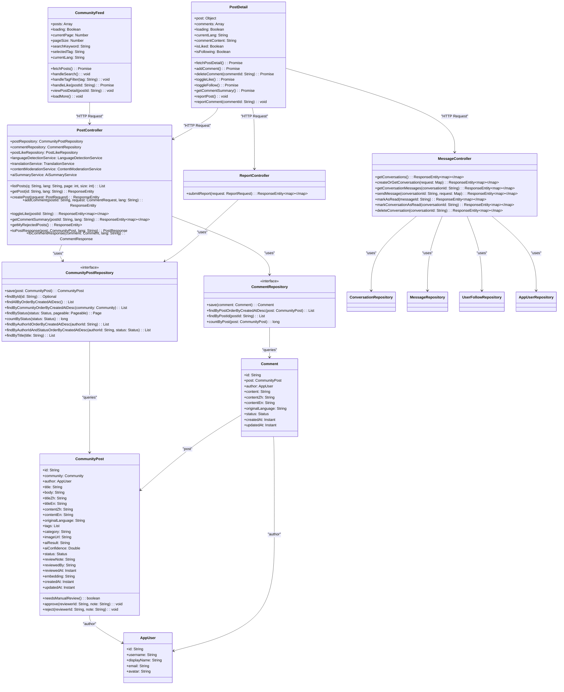
```mermaid
classDiagram
  class CommunityFeed {
    +posts: Array
    +loading: Boolean
    +currentPage: Number
    +pageSize: Number
    +searchKeyword: String
    +selectedTag: String
    +currentLang: String
    +fetchPosts(): Promise<void>
    +handleSearch(): void
    +handleTagFilter(tag: String): void
    +handleLike(postId: String): Promise<void>
    +viewPostDetail(postId: String): void
    +loadMore(): void
  }

  class PostDetail {
    +post: Object
    +comments: Array
    +loading: Boolean
    +currentLang: String
    +commentContent: String
    +isLiked: Boolean
    +isFollowing: Boolean
    +fetchPostDetail(): Promise<void>
    +addComment(): Promise<void>
    +deleteComment(commentId: String): Promise<void>
    +toggleLike(): Promise<void>
    +toggleFollow(): Promise<void>
    +getCommentSummary(): Promise<void>
    +reportPost(): void
    +reportComment(commentId: String): void
  }

  class PostController {
    +postRepository: CommunityPostRepository
    +commentRepository: CommentRepository
    +postLikeRepository: PostLikeRepository
    +languageDetectionService: LanguageDetectionService
    +translationService: TranslationService
    +contentModerationService: ContentModerationService
    +aiSummaryService: AiSummaryService
    +listPosts(q: String, lang: String, page: int, size: int): List<PostListResponse>
    +getPost(id: String, lang: String): ResponseEntity<PostDetailResponse>
    +createPost(request: PostRequest): ResponseEntity<PostResponse>
    +addComment(postId: String, request: CommentRequest, lang: String): ResponseEntity<CommentResponse>
    +toggleLike(postId: String): ResponseEntity<Map>
    +getCommentSummary(postId: String, lang: String): ResponseEntity<Map>
    +getMyRejectedPosts(): ResponseEntity<List<Map>>
    +toPostResponse(post: CommunityPost, lang: String): PostResponse
    +toCommentResponse(comment: Comment, lang: String): CommentResponse
  }

  class ReportController {
    +submitReport(request: ReportRequest): ResponseEntity<Map>
  }

  class MessageController {
    +getConversations(): ResponseEntity<Map>
    +createOrGetConversation(request: Map<String,String>): ResponseEntity<Map>
    +getConversationMessages(conversationId: String): ResponseEntity<Map>
    +sendMessage(conversationId: String, request: Map<String,String>): ResponseEntity<Map>
    +markAsRead(messageId: String): ResponseEntity<Map>
    +markConversationAsRead(conversationId: String): ResponseEntity<Map>
    +deleteConversation(conversationId: String): ResponseEntity<Map>
  }

  class CommunityPostRepository {
    <<interface>>
    +save(post: CommunityPost): CommunityPost
    +findById(id: String): Optional<CommunityPost>
    +findAllByOrderByCreatedAtDesc(): List<CommunityPost>
    +findByCommunityOrderByCreatedAtDesc(community: Community): List<CommunityPost>
    +findByStatus(status: Status, pageable: Pageable): Page<CommunityPost>
    +countByStatus(status: Status): long
    +findByAuthorIdOrderByCreatedAtDesc(authorId: String): List<CommunityPost>
    +findByAuthorIdAndStatusOrderByCreatedAtDesc(authorId: String, status: Status): List<CommunityPost>
    +findByTitle(title: String): List<CommunityPost>
  }

  class CommentRepository {
    <<interface>>
    +save(comment: Comment): Comment
    +findByPostOrderByCreatedAtDesc(post: CommunityPost): List<Comment>
    +findByPostId(postId: String): List<Comment>
    +countByPost(post: CommunityPost): long
  }

  class CommunityPost {
    +id: String
    +community: Community
    +author: AppUser
    +title: String
    +body: String
    +titleZh: String
    +titleEn: String
    +contentZh: String
    +contentEn: String
    +originalLanguage: String
    +tags: List<String>
    +category: String
    +imageUrl: String
    +aiResult: String
    +aiConfidence: Double
    +status: Status
    +reviewNote: String
    +reviewedBy: String
    +reviewedAt: Instant
    +embedding: String
    +createdAt: Instant
    +updatedAt: Instant
    +needsManualReview(): boolean
    +approve(reviewerId: String, note: String): void
    +reject(reviewerId: String, note: String): void
  }

  class Comment {
    +id: String
    +post: CommunityPost
    +author: AppUser
    +content: String
    +contentZh: String
    +contentEn: String
    +originalLanguage: String
    +status: Status
    +createdAt: Instant
    +updatedAt: Instant
  }

  class AppUser {
    +id: String
    +username: String
    +displayName: String
    +email: String
    +avatar: String
  }

  CommunityFeed --> PostController : "HTTP Request"
  PostDetail --> PostController : "HTTP Request"
  PostDetail --> ReportController : "HTTP Request"
  PostDetail --> MessageController : "HTTP Request"
  PostController --> CommunityPostRepository : "uses"
  PostController --> CommentRepository : "uses"
  ReportController --> CommunityPostRepository : "uses"
  MessageController --> ConversationRepository : "uses"
  MessageController --> MessageRepository : "uses"
  MessageController --> UserFollowRepository : "uses"
  MessageController --> AppUserRepository : "uses"
  CommunityPostRepository --> CommunityPost : "queries"
  CommentRepository --> Comment : "queries"
  CommunityPost --> AppUser : "author"
  Comment --> CommunityPost : "post"
  Comment --> AppUser : "author"
```

---

### 3.2.2 Class Diagram Description

#### 3.2.2.1 View

##### 3.2.2.1.1 CommunityFeed

Represents the community feed view in the frontend. It displays a list of posts with pagination, search, and tag filtering capabilities.

**Attributes**

| ID | Name           | Description                                                                                          | Type   |
|----|----------------|------------------------------------------------------------------------------------------------------|--------|
| 1  | posts          | Community posts currently displayed in the feed                                                     | Array  |
| 2  | loading        | Whether posts are currently being fetched                                                           | Boolean |
| 3  | currentPage    | Current page number for pagination                                                                   | Number |
| 4  | pageSize       | Number of posts to display per page                                                                 | Number |
| 5  | searchKeyword  | Keyword used to search posts                                                                        | String |
| 6  | selectedTag    | Currently selected tag filter (Study, Housing, Travel, Part-time Job, Life Services)               | String |
| 7  | currentLang    | Current interface language ("zh" for Chinese, "en" for English)                                    | String |

**Methods**

| ID | Name                | Description                                                                                           | Parameters        | Return Type    |
|----|---------------------|-------------------------------------------------------------------------------------------------------|-------------------|----------------|
| 1  | fetchPosts          | Fetches community posts from the backend API with current filters and language                      | None              | Promise\<void> |
| 2  | handleSearch        | Updates `searchKeyword` and reloads posts                                                           | None              | void           |
| 3  | handleTagFilter     | Updates `selectedTag` and reloads posts                                                             | `tag: String`     | void           |
| 4  | handleLike          | Sends like/unlike request for a post                                                                | `postId: String`  | Promise\<void> |
| 5  | viewPostDetail      | Navigates to the post detail page for a specific post                                               | `postId: String`  | void           |
| 6  | loadMore            | Loads the next page of posts and appends them to `posts`                                            | None              | void           |

##### 3.2.2.1.2 PostDetail

Represents the post detail view in the frontend. It displays a single post with its comments, allows adding comments, liking, following, and reporting.

**Attributes**

| ID | Name            | Description                                                                                   | Type   |
|----|-----------------|-----------------------------------------------------------------------------------------------|--------|
| 1  | post            | Detailed information of the selected post                                                    | Object |
| 2  | comments        | Comments for the post                                                                        | Array  |
| 3  | loading         | Whether post detail data is currently being fetched                                          | Boolean |
| 4  | currentLang     | Current interface language ("zh" for Chinese, "en" for English)                              | String |
| 5  | commentContent  | Content of a new comment being composed                                                      | String |
| 6  | isLiked         | Whether the current user has liked this post                                                 | Boolean |
| 7  | isFollowing     | Whether the current user is following the post author                                        | Boolean |

**Methods**

| ID | Name             | Description                                                                                      | Parameters          | Return Type    |
|----|------------------|--------------------------------------------------------------------------------------------------|---------------------|----------------|
| 1  | fetchPostDetail  | Fetches detailed information of the post and its comments                                       | None                | Promise\<void> |
| 2  | addComment       | Sends a request to add a new comment and refreshes the comments list                            | None                | Promise\<void> |
| 3  | deleteComment    | Sends a request to delete a comment                                                             | `commentId: String` | Promise\<void> |
| 4  | toggleLike       | Sends a like/unlike request for the post                                                        | None                | Promise\<void> |
| 5  | toggleFollow     | Sends a follow/unfollow request for the post author                                             | None                | Promise\<void> |
| 6  | getCommentSummary | Requests an AI-generated summary of all comments for the post                                  | None                | Promise\<void> |
| 7  | reportPost        | Sends a report request for the post                                                            | None                | void           |
| 8  | reportComment     | Sends a report request for a specific comment                                                  | `commentId: String` | void           |

#### 3.2.2.2 Controller

##### 3.2.2.2.1 Controller: `PostController`

File: `springboot-backend/src/main/java/com/globalbuddy/controller/PostController.java`

**Attributes**

| ID | Name                     | Description                                                                                  | Type                    |
|----|--------------------------|----------------------------------------------------------------------------------------------|-------------------------|
| 1  | postRepository           | Instance of `CommunityPostRepository` for database operations                               | CommunityPostRepository |
| 2  | commentRepository        | Instance of `CommentRepository` for comment operations                                      | CommentRepository       |
| 3  | postLikeRepository       | Instance of `PostLikeRepository` for like operations                                         | PostLikeRepository      |

| 5  | languageDetectionService | Instance of `LanguageDetectionService` for language detection                               | LanguageDetectionService |
| 6  | translationService       | Instance of `TranslationService` for content translation                                     | TranslationService      |
| 7  | contentModerationService | Instance of `ContentModerationService` for AI content moderation                            | ContentModerationService |
| 8  | aiSummaryService         | Instance of `AiSummaryService` for AI-generated summaries                                   | AiSummaryService        |

**Methods**

| ID | Name               | Description                                                                                       | Parameters                                | Return Type                          |
|----|--------------------|---------------------------------------------------------------------------------------------------|-------------------------------------------|--------------------------------------|
| 1  | listPosts          | Returns a paginated list of community posts with optional filters (keyword, tag, language)       | `q: String`, `lang: String`, `page: int`, `size: int` | `List<PostListResponse>`             |
| 2  | getPost            | Returns detailed information of a single post including comments                                 | `id: String`, `lang: String`             | `ResponseEntity<PostDetailResponse>` |
| 3  | createPost         | Creates a new community post with AI moderation and translation                                  | `request: PostRequest`                    | `ResponseEntity<PostResponse>`        |
| 4  | addComment         | Adds a new comment to the specified post with translation                                      | `postId: String`, `request: CommentRequest`, `lang: String` | `ResponseEntity<CommentResponse>`    |
| 5  | toggleLike         | Toggles like status for a post                                                                  | `postId: String`                         | `ResponseEntity<Map>`                |
| 6  | getCommentSummary  | Returns an AI-generated summary of all comments for a post                                       | `postId: String`, `lang: String`         | `ResponseEntity<Map>`                |
| 7  | getMyRejectedPosts | Returns list of rejected posts for the current user                                             | None                                      | `ResponseEntity<List<Map>>`          |
| 8  | toPostResponse     | Converts `CommunityPost` entity to `PostResponse` DTO based on language preference               | `post: CommunityPost`, `lang: String`     | `PostResponse`                       |
| 9  | toCommentResponse  | Converts `Comment` entity to `CommentResponse` DTO based on language preference                 | `comment: Comment`, `lang: String`       | `CommentResponse`                    |

##### 3.2.2.2.2 Controller: `ReportController`

File: `springboot-backend/src/main/java/com/globalbuddy/controller/ReportController.java`

**Methods**

| ID | Name               | Description                                                                                       | Parameters                  | Return Type                         |
|----|--------------------|---------------------------------------------------------------------------------------------------|-----------------------------|-------------------------------------|
| 1  | submitReport       | Submits a new report for a post or comment                                                       | `request: ReportRequest`   | `ResponseEntity<Map>`               |

##### 3.2.2.2.3 Controller: `MessageController`

File: `springboot-backend/src/main/java/com/globalbuddy/controller/MessageController.java`

**Methods**

| ID | Name                     | Description                                                                                                                                                                     | Parameters                                           | Return Type                |
|----|--------------------------|---------------------------------------------------------------------------------------------------------------------------------------------------------------------------------|------------------------------------------------------|----------------------------|
| 1  | getConversations         | Returns the list of conversations for the current user, wrapped in a map (e.g. list, pagination info, unread counts).                                                         | None                                                 | `ResponseEntity<Map>`      |
| 2  | createOrGetConversation  | Creates a new conversation with the specified user or restores an existing soft-deleted conversation. Requires the current user to follow the target user.                   | `request: Map<String, String>` (contains `userId`)   | `ResponseEntity<Map>`      |
| 3  | getConversationMessages  | Returns messages for the specified conversation, wrapped in a map (e.g. list, pagination info, unread status).                                                                 | `conversationId: String`                             | `ResponseEntity<Map>`      |
| 4  | sendMessage              | Sends a message in the specified conversation. If the users are not mutually following, the current user is limited to a single message in that conversation until followed. | `conversationId: String`, `request: Map<String,String>` | `ResponseEntity<Map>`   |
| 5  | markAsRead               | Marks a single message as read.                                                                                                                                                 | `messageId: String`                                  | `ResponseEntity<Map>`      |
| 6  | markConversationAsRead   | Marks all messages in the specified conversation as read for the current user.                                                                                                 | `conversationId: String`                             | `ResponseEntity<Map>`      |
| 7  | deleteConversation       | Soft-deletes a conversation from the current user's view without removing the underlying messages or the other user's conversation.                                           | `conversationId: String`                             | `ResponseEntity<Map>`      |

#### 3.2.2.3 Repository

##### 3.2.2.3.1 Repository: `CommunityPostRepository`

File: `springboot-backend/src/main/java/com/globalbuddy/repository/CommunityPostRepository.java`

**Methods**

| ID | Name                                      | Description                                                                                                          | Parameters                                                                                               | Return Type      |
|----|-------------------------------------------|----------------------------------------------------------------------------------------------------------------------|----------------------------------------------------------------------------------------------------------|------------------|
| 1  | save                                      | Saves a post entity (create or update).                                                                              | `post: CommunityPost`                                                                                   | CommunityPost    |
| 2  | findById                                  | Finds a post by its ID.                                                                                              | `id: String`                                                                                             | Optional\<CommunityPost> |
| 3  | findAllByOrderByCreatedAtDesc             | Finds all posts ordered by creation date descending                                                                  | None                                                                                                     | List\<CommunityPost> |
| 4  | findByCommunityOrderByCreatedAtDesc        | Finds posts by community ordered by creation date descending                                                         | `community: Community`                                                                                  | List\<CommunityPost> |
| 5  | findByStatus                               | Finds posts by status with pagination                                                                                | `status: Status`, `pageable: Pageable`                                                                  | Page\<CommunityPost> |
| 6  | countByStatus                              | Counts posts by status                                                                                               | `status: Status`                                                                                         | long             |
| 7  | findByAuthorIdOrderByCreatedAtDesc         | Finds posts by author ID ordered by creation date descending                                                         | `authorId: String`                                                                                       | List\<CommunityPost> |
| 8  | findByAuthorIdAndStatusOrderByCreatedAtDesc | Finds posts by author ID and status ordered by creation date descending                                              | `authorId: String`, `status: Status`                                                                    | List\<CommunityPost> |
| 9  | findByTitle                                | Finds posts by title (for duplicate checking)                                                                       | `title: String`                                                                                          | List\<CommunityPost> |

##### 3.2.2.3.2 Repository: `CommentRepository`

File: `springboot-backend/src/main/java/com/globalbuddy/repository/CommentRepository.java`

**Methods**

| ID | Name                                      | Description                                                                                                          | Parameters                                                                                               | Return Type      |
|----|-------------------------------------------|----------------------------------------------------------------------------------------------------------------------|----------------------------------------------------------------------------------------------------------|------------------|
| 1  | save                                      | Saves a comment entity (create or update).                                                                            | `comment: Comment`                                                                                       | Comment          |
| 2  | findByPostOrderByCreatedAtDesc            | Finds comments for a post ordered by creation date descending                                                        | `post: CommunityPost`                                                                                    | List\<Comment>   |
| 3  | findByPostId                               | Finds comments by post ID                                                                                            | `postId: String`                                                                                         | List\<Comment>   |
| 4  | countByPost                                | Counts comments for a post                                                                                           | `post: CommunityPost`                                                                                    | long             |

#### 3.2.2.4 Model

##### 3.2.2.4.1 Model: `CommunityPost`

File: `springboot-backend/src/main/java/com/globalbuddy/model/CommunityPost.java`

**Attributes**

| ID | Name           | Type    | Description                                                     |
|----|----------------|---------|-----------------------------------------------------------------|
| 1  | id             | String  | Primary key ID (UUID)                                          |
| 2  | community      | Community | Community this post belongs to (nullable)                      |
| 3  | author         | AppUser | Author of the post                                              |
| 4  | title          | String  | Post title                                                      |
| 5  | body           | String  | Post content (TEXT)                                             |
| 6  | titleZh        | String  | Chinese translation of title                                    |
| 7  | titleEn        | String  | English translation of title                                    |
| 8  | contentZh      | String  | Chinese translation of content                                  |
| 9  | contentEn      | String  | English translation of content                                  |
| 10 | originalLanguage | String | Detected original language (zh/en/th)                        |
| 11 | tags           | List\<String> | Post tags (e.g., Study, Housing, Travel)                    |
| 12 | category       | String  | Post category                                                   |
| 13 | imageUrl       | String  | Image URL if post contains images                               |
| 14 | aiResult       | String  | AI moderation result (TEXT)                                     |
| 15 | aiConfidence   | Double  | AI confidence score (0.0 - 1.0)                                 |
| 16 | status         | Status  | Post moderation status:<br/>- PENDING_REVIEW: Requires additional AI-based safety checks (no manual review)<br/>- APPROVED: Post approved (can be by AI )<br/>- REJECTED: Post rejected (can be by AI or administrator)<br/>- REPORTED_REMOVED: Removed due to user report |
| 17 | reviewNote     | String  | Review note (filled by AI system with reviewerId "AI_AUTOMOD") |
| 18 | reviewedBy     | String  | Reviewer ID ("AI_AUTOMOD" for AI-approved/rejected posts）|
| 19 | reviewedAt     | Instant | Review timestamp                                                |
| 20 | embedding      | String  | Semantic embedding for search (TEXT)                            |
| 21 | createdAt      | Instant | Time when the post was created                                 |
| 22 | updatedAt      | Instant | Time when the post was last updated                            |

**Methods**

| ID | Name           | Description                                                     | Parameters                        | Return Type |
|----|----------------|-----------------------------------------------------------------|-----------------------------------|-------------|
| 1  | needsManualReview | Indicates whether the post requires additional AI-based safety checks (no manual review). | None                              | boolean     |
| 2  | approve        | Approves the post with reviewer information                    | `reviewerId: String`, `note: String` | void        |
| 3  | reject         | Rejects the post with reviewer information                     | `reviewerId: String`, `note: String` | void        |

##### 3.2.2.4.2 Model: `Comment`

File: `springboot-backend/src/main/java/com/globalbuddy/model/Comment.java`

**Attributes**

| ID | Name           | Type    | Description                                                     |
|----|----------------|---------|-----------------------------------------------------------------|
| 1  | id             | String  | Primary key ID (UUID)                                          |
| 2  | post           | CommunityPost | Post this comment belongs to                                  |
| 3  | author         | AppUser | Author of the comment                                           |
| 4  | content        | String  | Comment content (TEXT)                                          |
| 5  | contentZh      | String  | Chinese translation of content                                  |
| 6  | contentEn      | String  | English translation of content                                  |
| 7  | originalLanguage | String | Detected original language (zh/en/th)                        |
| 8  | status         | Status  | Comment status (ACTIVE, REPORTED_REMOVED)                       |
| 9  | createdAt      | Instant | Time when the comment was created                              |
| 10 | updatedAt      | Instant | Time when the comment was last updated                         |

##### 3.2.2.4.3 Model: `AppUser`

File: `springboot-backend/src/main/java/com/globalbuddy/model/AppUser.java`

**Attributes**

| ID | Name           | Type   | Description                                                     |
|----|----------------|--------|-----------------------------------------------------------------|
| 1  | id             | String | Primary key ID (UUID)                                          |
| 2  | username       | String | Username for login                                              |
| 3  | displayName    | String | Display name shown to other users                               |
| 4  | email          | String | User email address                                              |
| 5  | avatar         | String | User avatar URL                                                 |

---

### 3.2.3 Sequence Diagrams (Mermaid)

The following sequence diagrams show key interactions in Feature 2: Community Interaction Platform.

#### SD-07: Browse Community Feed

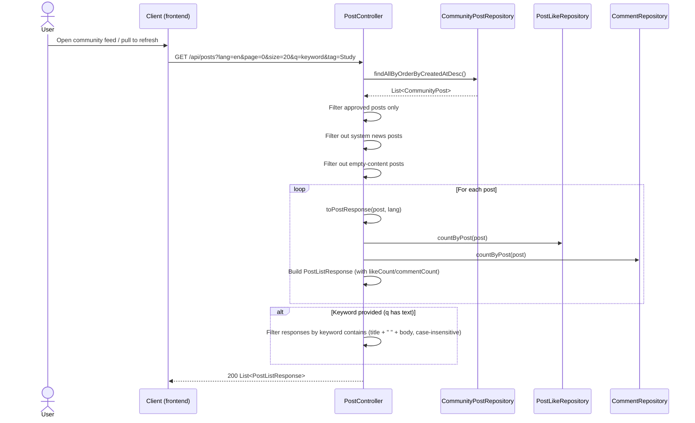
```mermaid
sequenceDiagram
  actor User as User
  participant Client as Client (frontend)
  participant PC as PostController
  participant PR as CommunityPostRepository
  participant PLR as PostLikeRepository
  participant CR as CommentRepository

  User->>Client: Open community feed / pull to refresh
  Client->>PC: GET /api/posts?lang=en&page=0&size=20&q=keyword&tag=Study
  PC->>PR: findAllByOrderByCreatedAtDesc()
  PR-->>PC: List<CommunityPost>
  PC->>PC: Filter approved posts only
  PC->>PC: Filter out system news posts
  PC->>PC: Filter out empty-content posts
  loop For each post
    PC->>PC: toPostResponse(post, lang)
    PC->>PLR: countByPost(post)
    PC->>CR: countByPost(post)
    PC->>PC: Build PostListResponse (with likeCount/commentCount)
  end
  alt Keyword provided (q has text)
    PC->>PC: Filter responses by keyword contains (title + " " + body, case-insensitive)
  end
  PC-->>Client: 200 List<PostListResponse>
```

#### SD-08: Create Publish Post

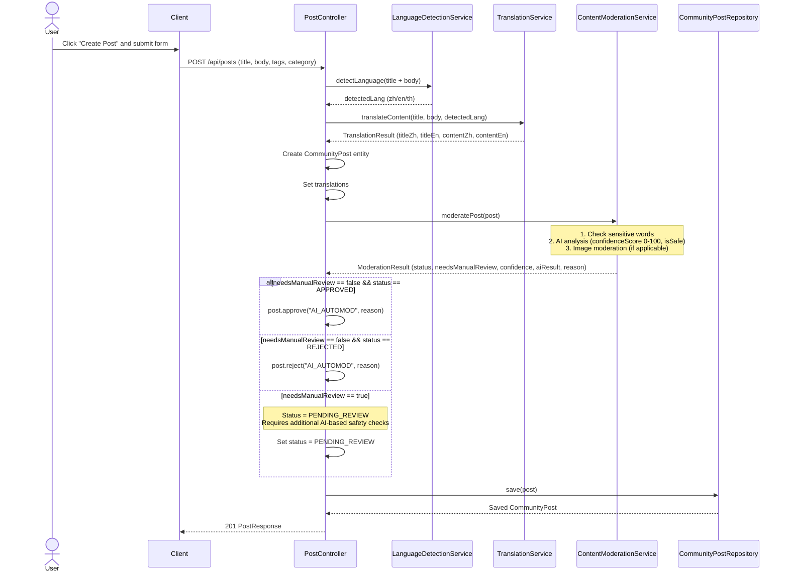
```mermaid
sequenceDiagram
  actor User as User
  participant Client as Client
  participant PC as PostController
  participant LDS as LanguageDetectionService
  participant TS as TranslationService
  participant CMS as ContentModerationService
  participant PR as CommunityPostRepository

  User->>Client: Click "Create Post" and submit form
  Client->>PC: POST /api/posts (title, body, tags, category)
  PC->>LDS: detectLanguage(title + body)
  LDS-->>PC: detectedLang (zh/en/th)
  PC->>TS: translateContent(title, body, detectedLang)
  TS-->>PC: TranslationResult (titleZh, titleEn, contentZh, contentEn)
  PC->>PC: Create CommunityPost entity
  PC->>PC: Set translations
  PC->>CMS: moderatePost(post)
  Note over CMS: 1. Check sensitive words<br/>2. AI analysis (confidenceScore 0-100, isSafe)<br/>3. Image moderation (if applicable)
  CMS-->>PC: ModerationResult (status, needsManualReview, confidence, aiResult, reason)
  alt needsManualReview == false && status == APPROVED
    PC->>PC: post.approve("AI_AUTOMOD", reason)
  else needsManualReview == false && status == REJECTED
    PC->>PC: post.reject("AI_AUTOMOD", reason)
  else needsManualReview == true
    Note over PC: Status = PENDING_REVIEW<br/>Requires additional AI-based safety checks
    PC->>PC: Set status = PENDING_REVIEW
  end
  PC->>PR: save(post)
  PR-->>PC: Saved CommunityPost
  PC-->>Client: 201 PostResponse
```

**ContentModerationService.moderatePost() Logic:**

The content moderation process follows these steps:

1. **Sensitive Word Check**: If the post content contains any predefined sensitive words, it is immediately rejected with `status = REJECTED` and `needsManualReview = false`.

2. **AI Content Analysis**: The service calls the AI model to analyze the post content. The AI returns:
   - `isSafe` (boolean): Whether the content is safe
   - `confidenceScore` (0-100): AI confidence level (raw score from AI)
   - `reason` (string): Explanation for the decision
   
   Note: The `confidenceScore` (0-100) is stored in the database as `aiConfidence` (0.0-1.0) by dividing by 100.0. The raw JSON result with the original 0-100 score is preserved in the `aiResult` field.

3. **Status Decision Based on Confidence**:
   - If `confidenceScore > 70` (CONFIDENCE_THRESHOLD):
     - `isSafe = true` → `status = APPROVED`, `needsManualReview = false`
     - `isSafe = false` → `status = REJECTED`, `needsManualReview = false`
   - If `confidenceScore ≤ 70`:
     - `status = PENDING_REVIEW`, `needsManualReview = true` (requires additional AI-based safety checks)

4. **Image Moderation** (if post contains images):
   - If image is marked as `UNSAFE` → `status = REJECTED`
   - If image is marked as `SUSPICIOUS` and text was `APPROVED` → `status = PENDING_REVIEW`, `needsManualReview = true`

5. **Exception Handling**: If AI service fails, the post is marked as `PENDING_REVIEW` with `needsManualReview = true` for additional AI-based safety checks.

**PostController Processing:**

- If `needsManualReview = false` and status is `APPROVED` or `REJECTED`: The controller automatically calls `post.approve("AI_AUTOMOD", reason)` or `post.reject("AI_AUTOMOD", reason)`.
- If `needsManualReview = true`: Only the status is set to `PENDING_REVIEW`, waiting for additional AI-based safety verification (no manual human review).

#### SD-09: Like Post

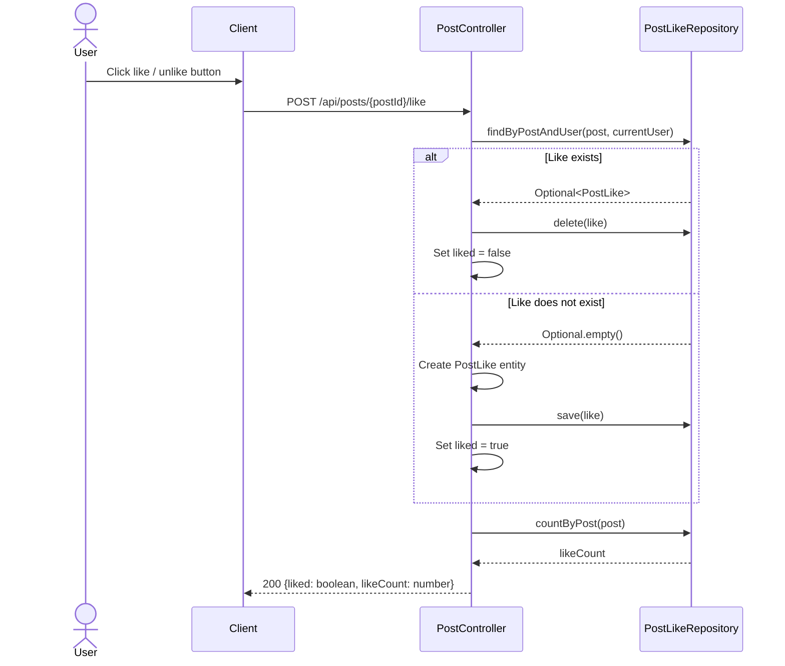
```mermaid
sequenceDiagram
  actor User as User
  participant Client as Client
  participant PC as PostController
  participant PLR as PostLikeRepository

  User->>Client: Click like / unlike button
  Client->>PC: POST /api/posts/{postId}/like
  PC->>PLR: findByPostAndUser(post, currentUser)
  alt Like exists
    PLR-->>PC: Optional<PostLike>
    PC->>PLR: delete(like)
    PC->>PC: Set liked = false
  else Like does not exist
    PLR-->>PC: Optional.empty()
    PC->>PC: Create PostLike entity
    PC->>PLR: save(like)
    PC->>PC: Set liked = true
  end
  PC->>PLR: countByPost(post)
  PLR-->>PC: likeCount
  PC-->>Client: 200 {liked: boolean, likeCount: number}
```

#### SD-10: Filter by Tag

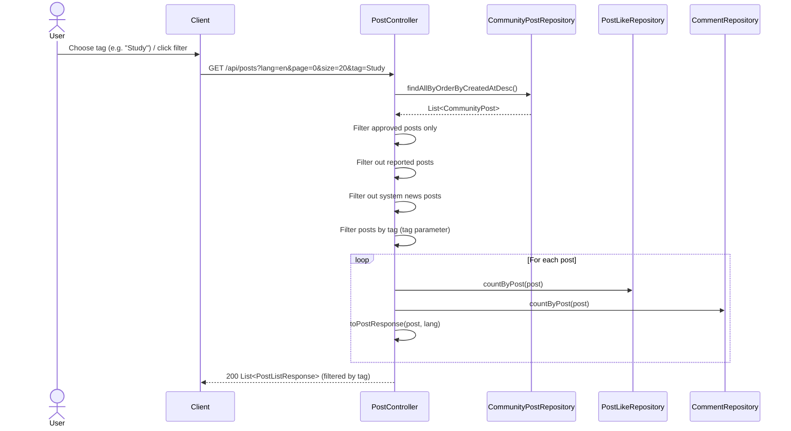
```mermaid
sequenceDiagram
  actor User as User
  participant Client as Client
  participant PC as PostController
  participant PR as CommunityPostRepository
  participant PLR as PostLikeRepository
  participant CR as CommentRepository

  User->>Client: Choose tag (e.g. "Study") / click filter
  Client->>PC: GET /api/posts?lang=en&page=0&size=20&tag=Study
  PC->>PR: findAllByOrderByCreatedAtDesc()
  PR-->>PC: List<CommunityPost>
  PC->>PC: Filter approved posts only
  PC->>PC: Filter out reported posts
  PC->>PC: Filter out system news posts
  PC->>PC: Filter posts by tag (tag parameter)
  loop For each post
    PC->>PLR: countByPost(post)
    PC->>CR: countByPost(post)
    PC->>PC: toPostResponse(post, lang)
  end
  PC-->>Client: 200 List<PostListResponse> (filtered by tag)
```

#### SD-11: View Post Details

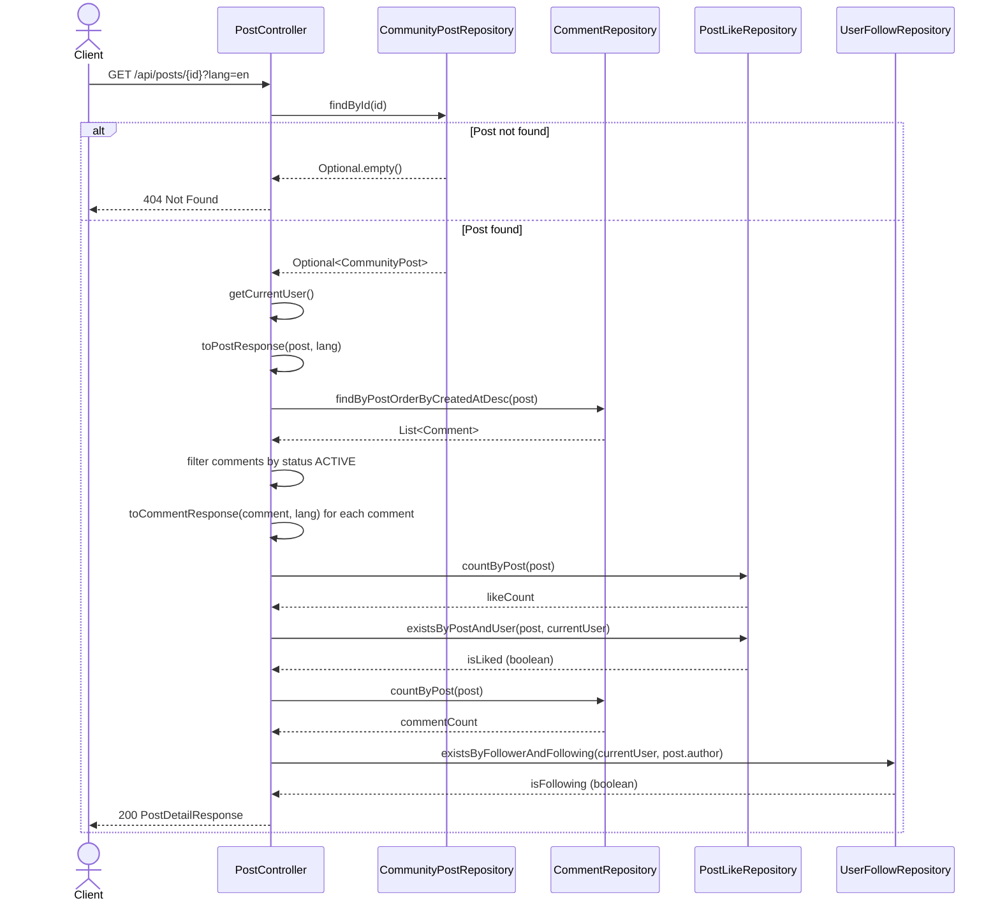
```mermaid
sequenceDiagram
  actor Client as Client
  participant PC as PostController
  participant PR as CommunityPostRepository
  participant CR as CommentRepository
  participant PLR as PostLikeRepository
  participant UFR as UserFollowRepository

  Client->>PC: GET /api/posts/{id}?lang=en
  PC->>PR: findById(id)
  alt Post not found
    PR-->>PC: Optional.empty()
    PC-->>Client: 404 Not Found
  else Post found
    PR-->>PC: Optional<CommunityPost>
    PC->>PC: getCurrentUser()
    PC->>PC: toPostResponse(post, lang)
    PC->>CR: findByPostOrderByCreatedAtDesc(post)
    CR-->>PC: List<Comment>
    PC->>PC: filter comments by status ACTIVE
    PC->>PC: toCommentResponse(comment, lang) for each comment
    PC->>PLR: countByPost(post)
    PLR-->>PC: likeCount
    PC->>PLR: existsByPostAndUser(post, currentUser)
    PLR-->>PC: isLiked (boolean)
    PC->>CR: countByPost(post)
    CR-->>PC: commentCount
    PC->>UFR: existsByFollowerAndFollowing(currentUser, post.author)
    UFR-->>PC: isFollowing (boolean)
    PC-->>Client: 200 PostDetailResponse
  end
```

#### SD-12: Report Post/Comment

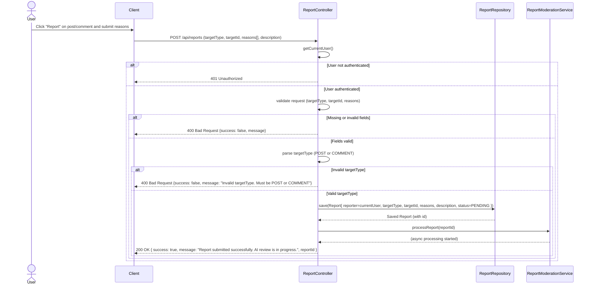
```mermaid
sequenceDiagram
  actor User as User
  participant Client as Client
  participant RC as ReportController
  participant RR as ReportRepository
  participant RMS as ReportModerationService

  User->>Client: Click "Report" on post/comment and submit reasons
  Client->>RC: POST /api/reports (targetType, targetId, reasons[], description)
  RC->>RC: getCurrentUser()
  alt User not authenticated
    RC-->>Client: 401 Unauthorized
  else User authenticated
    RC->>RC: validate request (targetType, targetId, reasons)
    alt Missing or invalid fields
      RC-->>Client: 400 Bad Request {success: false, message}
    else Fields valid
      RC->>RC: parse targetType (POST or COMMENT)
      alt Invalid targetType
        RC-->>Client: 400 Bad Request {success: false, message: "Invalid targetType. Must be POST or COMMENT"}
      else Valid targetType
        RC->>RR: save(Report{ reporter=currentUser, targetType, targetId, reasons, description, status=PENDING })
        RR-->>RC: Saved Report (with id)
        RC->>RMS: processReport(reportId)
        RMS-->>RC: (async processing started)
        RC-->>Client: 200 OK { success: true, message: "Report submitted successfully. AI review is in progress.", reportId }
      end
    end
  end
```

#### SD-13: Post Comment

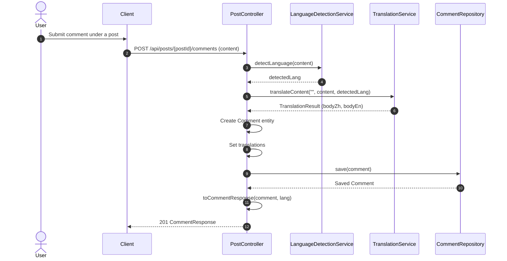
```mermaid
sequenceDiagram
  autonumber
  actor User as User
  participant Client as Client
  participant PC as PostController
  participant LDS as LanguageDetectionService
  participant TS as TranslationService
  participant CR as CommentRepository

  User->>Client: Submit comment under a post
  Client->>PC: POST /api/posts/{postId}/comments (content)
  PC->>LDS: detectLanguage(content)
  LDS-->>PC: detectedLang
  PC->>TS: translateContent("", content, detectedLang)
  TS-->>PC: TranslationResult (bodyZh, bodyEn)
  PC->>PC: Create Comment entity
  PC->>PC: Set translations
  PC->>CR: save(comment)
  CR-->>PC: Saved Comment
  PC->>PC: toCommentResponse(comment, lang)
  PC-->>Client: 201 CommentResponse
```

#### SD-14: Search Posts

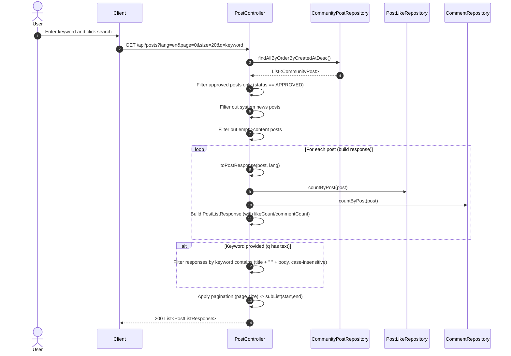
```mermaid
sequenceDiagram
  autonumber
  actor User as User
  participant Client as Client
  participant PC as PostController
  participant PR as CommunityPostRepository
  participant PLR as PostLikeRepository
  participant CR as CommentRepository

  User->>Client: Enter keyword and click search
  Client->>PC: GET /api/posts?lang=en&page=0&size=20&q=keyword
  PC->>PR: findAllByOrderByCreatedAtDesc()
  PR-->>PC: List<CommunityPost>
  PC->>PC: Filter approved posts only (status == APPROVED)
  PC->>PC: Filter out system news posts
  PC->>PC: Filter out empty-content posts
  loop For each post (build response)
    PC->>PC: toPostResponse(post, lang)
    PC->>PLR: countByPost(post)
    PC->>CR: countByPost(post)
    PC->>PC: Build PostListResponse (with likeCount/commentCount)
  end
  alt Keyword provided (q has text)
    PC->>PC: Filter responses by keyword contains (title + " " + body, case-insensitive)
  end
  PC->>PC: Apply pagination (page,size) -> subList(start,end)
  PC-->>Client: 200 List<PostListResponse>
```

#### SD-15: AI Summary Comment

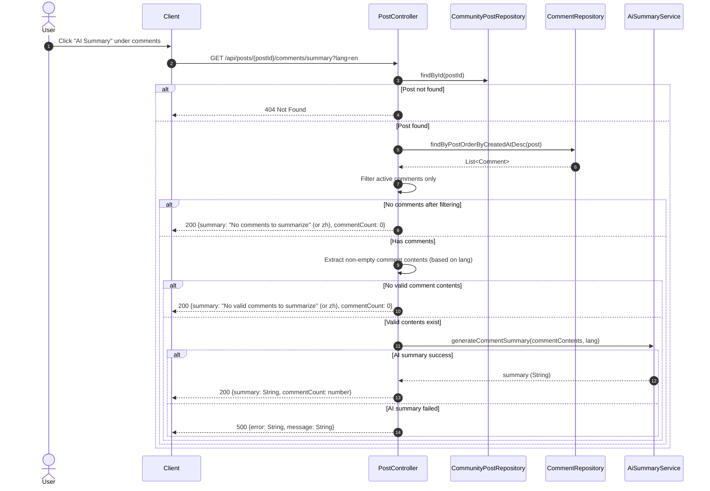
```mermaid
sequenceDiagram
  autonumber
  actor User as User
  participant Client as Client
  participant PC as PostController
  participant PR as CommunityPostRepository
  participant CR as CommentRepository
  participant AIS as AiSummaryService

  User->>Client: Click "AI Summary" under comments
  Client->>PC: GET /api/posts/{postId}/comments/summary?lang=en
  PC->>PR: findById(postId)
  alt Post not found
    PC-->>Client: 404 Not Found
  else Post found
    PC->>CR: findByPostOrderByCreatedAtDesc(post)
    CR-->>PC: List<Comment>
    PC->>PC: Filter active comments only
    alt No comments after filtering
      PC-->>Client: 200 {summary: "No comments to summarize" (or zh), commentCount: 0}
    else Has comments
      PC->>PC: Extract non-empty comment contents (based on lang)
      alt No valid comment contents
        PC-->>Client: 200 {summary: "No valid comments to summarize" (or zh), commentCount: 0}
      else Valid contents exist
        PC->>AIS: generateCommentSummary(commentContents, lang)
        alt AI summary success
          AIS-->>PC: summary (String)
          PC-->>Client: 200 {summary: String, commentCount: number}
        else AI summary failed
          PC-->>Client: 500 {error: String, message: String}
        end
      end
    end
  end
```

#### SD-16: Communicate with others

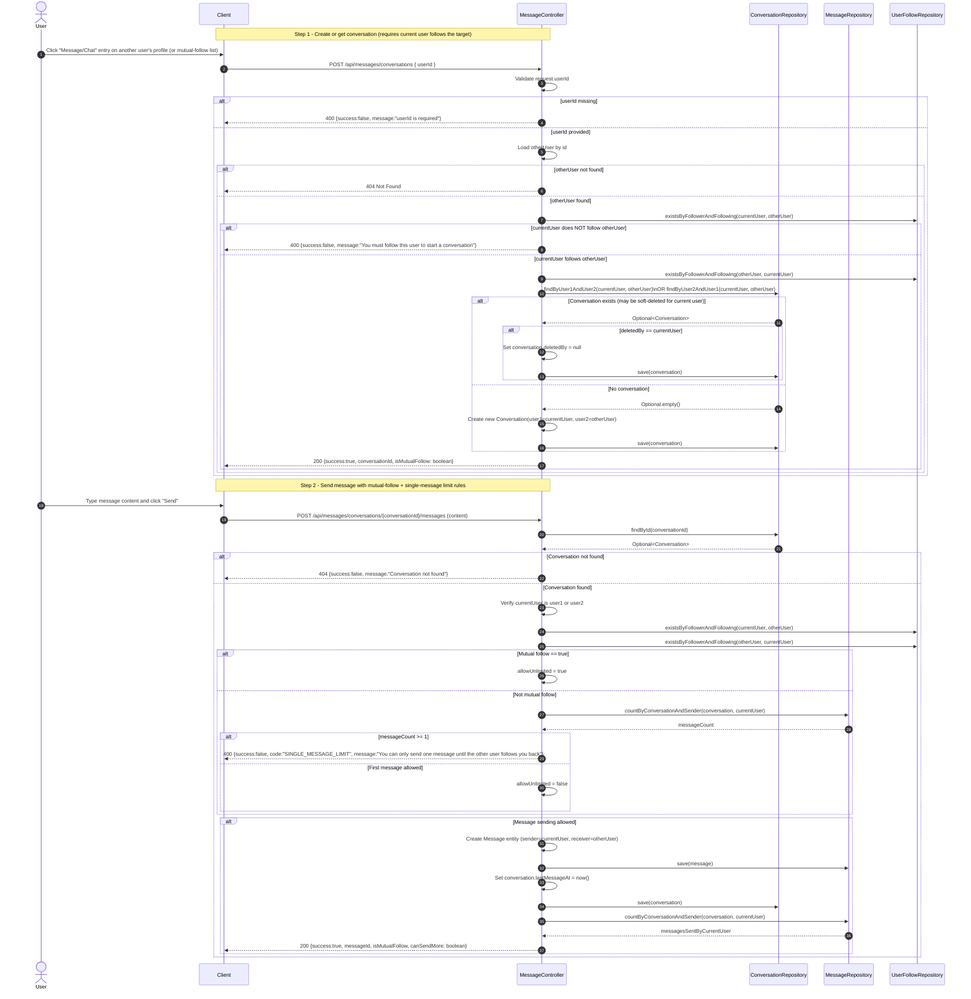
```mermaid
sequenceDiagram
  autonumber
  actor User as User
  participant Client as Client
  participant MC as MessageController
  participant CR as ConversationRepository
  participant MR as MessageRepository
  participant UFR as UserFollowRepository

  Note over Client,MC: Step 1 - Create or get conversation (requires current user follows the target)
  User->>Client: Click "Message/Chat" entry on another user's profile (or mutual-follow list)
  Client->>MC: POST /api/messages/conversations { userId }
  MC->>MC: Validate request.userId
  alt userId missing
    MC-->>Client: 400 {success:false, message:"userId is required"}
  else userId provided
    MC->>MC: Load otherUser by id
    alt otherUser not found
      MC-->>Client: 404 Not Found
    else otherUser found
      MC->>UFR: existsByFollowerAndFollowing(currentUser, otherUser)
      alt currentUser does NOT follow otherUser
        MC-->>Client: 400 {success:false, message:"You must follow this user to start a conversation"}
      else currentUser follows otherUser
        MC->>UFR: existsByFollowerAndFollowing(otherUser, currentUser)
        MC->>CR: findByUser1AndUser2(currentUser, otherUser)\nOR findByUser2AndUser1(currentUser, otherUser)
        alt Conversation exists (may be soft-deleted for current user)
          CR-->>MC: Optional<Conversation>
          alt deletedBy == currentUser
            MC->>MC: Set conversation.deletedBy = null
            MC->>CR: save(conversation)
          end
        else No conversation
          CR-->>MC: Optional.empty()
          MC->>MC: Create new Conversation(user1=currentUser, user2=otherUser)
          MC->>CR: save(conversation)
        end
        MC-->>Client: 200 {success:true, conversationId, isMutualFollow: boolean}
      end
    end
  end

  Note over Client,MC: Step 2 - Send message with mutual-follow + single-message limit rules
  User->>Client: Type message content and click "Send"
  Client->>MC: POST /api/messages/conversations/{conversationId}/messages (content)
  MC->>CR: findById(conversationId)
  CR-->>MC: Optional<Conversation>
  alt Conversation not found
    MC-->>Client: 404 {success:false, message:"Conversation not found"}
  else Conversation found
    MC->>MC: Verify currentUser is user1 or user2
    MC->>UFR: existsByFollowerAndFollowing(currentUser, otherUser)
    MC->>UFR: existsByFollowerAndFollowing(otherUser, currentUser)
    alt Mutual follow == true
      MC->>MC: allowUnlimited = true
    else Not mutual follow
      MC->>MR: countByConversationAndSender(conversation, currentUser)
      MR-->>MC: messageCount
      alt messageCount >= 1
        MC-->>Client: 400 {success:false, code:"SINGLE_MESSAGE_LIMIT", message:"You can only send one message until the other user follows you back"}
      else First message allowed
        MC->>MC: allowUnlimited = false
      end
    end

    alt Message sending allowed
      MC->>MC: Create Message entity (sender=currentUser, receiver=otherUser)
      MC->>MR: save(message)
      MC->>MC: Set conversation.lastMessageAt = now()
      MC->>CR: save(conversation)
      MC->>MR: countByConversationAndSender(conversation, currentUser)
      MR-->>MC: messagesSentByCurrentUser
      MC-->>Client: 200 {success:true, messageId, isMutualFollow, canSendMore: boolean}
    end
  end
```

#### SD-17: Manage Message Status

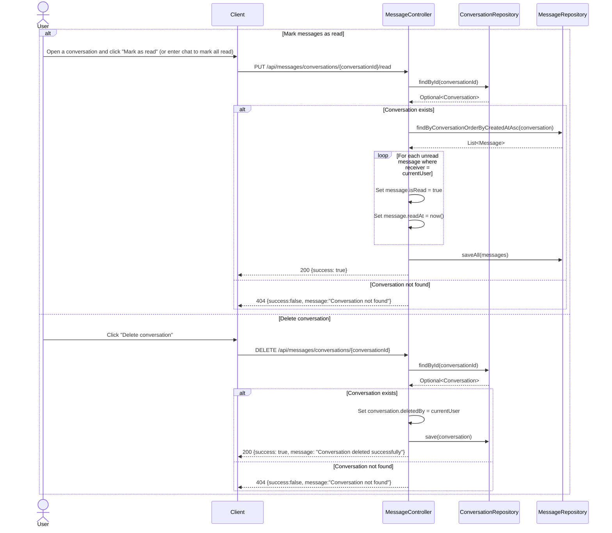
```mermaid
sequenceDiagram
  actor User as User
  participant Client as Client
  participant MC as MessageController
  participant CR as ConversationRepository
  participant MR as MessageRepository

  alt Mark messages as read
    User->>Client: Open a conversation and click "Mark as read" (or enter chat to mark all read)
    Client->>MC: PUT /api/messages/conversations/{conversationId}/read
    MC->>CR: findById(conversationId)
    CR-->>MC: Optional<Conversation>
    alt Conversation exists
      MC->>MR: findByConversationOrderByCreatedAtAsc(conversation)
      MR-->>MC: List<Message>
      loop For each unread message where receiver = currentUser
        MC->>MC: Set message.isRead = true
        MC->>MC: Set message.readAt = now()
      end
      MC->>MR: saveAll(messages)
      MC-->>Client: 200 {success: true}
    else Conversation not found
      MC-->>Client: 404 {success:false, message:"Conversation not found"}
    end
  else Delete conversation
    User->>Client: Click "Delete conversation"
    Client->>MC: DELETE /api/messages/conversations/{conversationId}
    MC->>CR: findById(conversationId)
    CR-->>MC: Optional<Conversation>
    alt Conversation exists
      MC->>MC: Set conversation.deletedBy = currentUser
      MC->>CR: save(conversation)
      MC-->>Client: 200 {success: true, message: "Conversation deleted successfully"}
    else Conversation not found
      MC-->>Client: 404 {success:false, message:"Conversation not found"}
    end
  end
```

---

### 3.2.4 Code Reference List (Traceability)

The following files implement Feature 2: Community Interaction Platform.

- **Controller**
  - `springboot-backend/src/main/java/com/globalbuddy/controller/PostController.java`
  - `springboot-backend/src/main/java/com/globalbuddy/controller/ReportController.java`
  - `springboot-backend/src/main/java/com/globalbuddy/controller/MessageController.java`
- **Repository**
  - `springboot-backend/src/main/java/com/globalbuddy/repository/CommunityPostRepository.java`
  - `springboot-backend/src/main/java/com/globalbuddy/repository/CommentRepository.java`
  - `springboot-backend/src/main/java/com/globalbuddy/repository/PostLikeRepository.java`
  - `springboot-backend/src/main/java/com/globalbuddy/repository/UserFollowRepository.java`
  - `springboot-backend/src/main/java/com/globalbuddy/repository/ConversationRepository.java`
  - `springboot-backend/src/main/java/com/globalbuddy/repository/MessageRepository.java`
  - `springboot-backend/src/main/java/com/globalbuddy/repository/ReportRepository.java`
- **Entity and DTO**
  - `springboot-backend/src/main/java/com/globalbuddy/model/CommunityPost.java`
  - `springboot-backend/src/main/java/com/globalbuddy/model/Comment.java`
  - `springboot-backend/src/main/java/com/globalbuddy/model/PostLike.java`
  - `springboot-backend/src/main/java/com/globalbuddy/model/UserFollow.java`
  - `springboot-backend/src/main/java/com/globalbuddy/model/Conversation.java`
  - `springboot-backend/src/main/java/com/globalbuddy/model/Message.java`
  - `springboot-backend/src/main/java/com/globalbuddy/model/Report.java`
- **Service**
  - `springboot-backend/src/main/java/com/globalbuddy/service/SemanticService.java` (legacy / currently unused in controllers)
  - `springboot-backend/src/main/java/com/globalbuddy/service/LanguageDetectionService.java`
  - `springboot-backend/src/main/java/com/globalbuddy/service/TranslationService.java`
  - `springboot-backend/src/main/java/com/globalbuddy/service/ContentModerationService.java`
  - `springboot-backend/src/main/java/com/globalbuddy/service/AiSummaryService.java`
  - `springboot-backend/src/main/java/com/globalbuddy/service/ReportModerationService.java`
- **Frontend API Wrappers**
  - `frontend/src/api.js` (`fetchPosts`, `createPost`, `getPost`, `addComment`, `deleteComment`, `toggleLike`, `toggleFollow`, `getCommentSummary`, `submitReport`, `getConversations`, `sendMessage`, `markAsRead`, `deleteConversation`)

---

## 3.3 Feature 3: Authentication and Profile System

The Authentication and Profile System allows users to:
- Register Account.  
- Log In.  
- Log Out.  
- Forget Password.  
- View/Edit Profile.  
- View My Community Posts.  
- View and Manage the mutual follow list.  
- View My Reports.

All descriptions below are based on the current codebase.

---

### 3.3.1 Class Diagram

The overall class diagram for Feature 3 (Authentication and Profile System) is shown below.

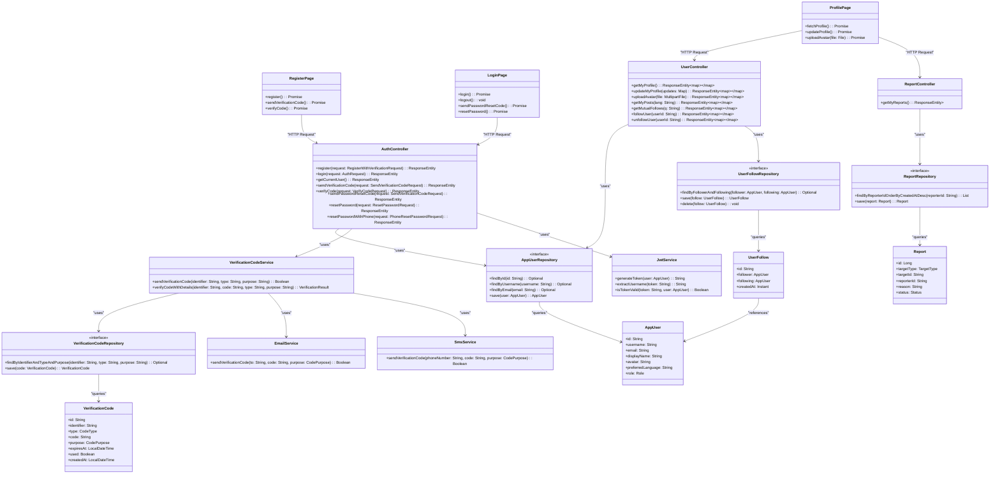
```mermaid
classDiagram
  class RegisterPage {
    +register(): Promise<void>
    +sendVerificationCode(): Promise<void>
    +verifyCode(): Promise<void>
  }

  class LoginPage {
    +login(): Promise<void>
    +logout(): void
    +sendPasswordResetCode(): Promise<void>
    +resetPassword(): Promise<void>
  }

  class ProfilePage {
    +fetchProfile(): Promise<void>
    +updateProfile(): Promise<void>
    +uploadAvatar(file: File): Promise<void>
  }

  class AuthController {
    +register(request: RegisterWithVerificationRequest): ResponseEntity<AuthResponse>
    +login(request: AuthRequest): ResponseEntity<AuthResponse>
    +getCurrentUser(): ResponseEntity<UserDTO>
    +sendVerificationCode(request: SendVerificationCodeRequest): ResponseEntity
    +verifyCode(request: VerifyCodeRequest): ResponseEntity
    +sendPasswordResetCode(request: SendVerificationCodeRequest): ResponseEntity
    +resetPassword(request: ResetPasswordRequest): ResponseEntity
    +resetPasswordWithPhone(request: PhoneResetPasswordRequest): ResponseEntity
  }

  class UserController {
    +getMyProfile(): ResponseEntity<Map>
    +updateMyProfile(updates: Map): ResponseEntity<Map>
    +uploadAvatar(file: MultipartFile): ResponseEntity<Map>
    +getMyPosts(lang: String): ResponseEntity<Map>
    +getMutualFollows(q: String): ResponseEntity<Map>
    +followUser(userId: String): ResponseEntity<Map>
    +unfollowUser(userId: String): ResponseEntity<Map>
  }

  class ReportController {
    +getMyReports(): ResponseEntity<List<Report>>
  }

  class AppUserRepository {
    <<interface>>
    +findById(id: String): Optional<AppUser>
    +findByUsername(username: String): Optional<AppUser>
    +findByEmail(email: String): Optional<AppUser>
    +save(user: AppUser): AppUser
  }

  class UserFollowRepository {
    <<interface>>
    +findByFollowerAndFollowing(follower: AppUser, following: AppUser): Optional<UserFollow>
    +save(follow: UserFollow): UserFollow
    +delete(follow: UserFollow): void
  }

  class ReportRepository {
    <<interface>>
    +findByReporterIdOrderByCreatedAtDesc(reporterId: String): List<Report>
    +save(report: Report): Report
  }

  class VerificationCodeRepository {
    <<interface>>
    +findByIdentifierAndTypeAndPurpose(identifier: String, type: String, purpose: String): Optional<VerificationCode>
    +save(code: VerificationCode): VerificationCode
  }

  class AppUser {
    +id: String
    +username: String
    +email: String
    +displayName: String
    +avatar: String
    +preferredLanguage: String
    +role: Role
  }

  class UserFollow {
    +id: String
    +follower: AppUser
    +following: AppUser
    +createdAt: Instant
  }

  class Report {
    +id: Long
    +targetType: TargetType
    +targetId: String
    +reporterId: String
    +reason: String
    +status: Status
  }

  class VerificationCode {
    +id: String
    +identifier: String
    +type: CodeType
    +code: String
    +purpose: CodePurpose
    +expiresAt: LocalDateTime
    +used: Boolean
    +createdAt: LocalDateTime
  }

  class JwtService {
    +generateToken(user: AppUser): String
    +extractUsername(token: String): String
    +isTokenValid(token: String, user: AppUser): Boolean
  }

  class VerificationCodeService {
    +sendVerificationCode(identifier: String, type: String, purpose: String): Boolean
    +verifyCodeWithDetails(identifier: String, code: String, type: String, purpose: String): VerificationResult
  }

  class EmailService {
    +sendVerificationCode(to: String, code: String, purpose: CodePurpose): Boolean
  }

  class SmsService {
    +sendVerificationCode(phoneNumber: String, code: String, purpose: CodePurpose): Boolean
  }

  RegisterPage --> AuthController : "HTTP Request"
  LoginPage --> AuthController : "HTTP Request"
  ProfilePage --> UserController : "HTTP Request"
  ProfilePage --> ReportController : "HTTP Request"
  AuthController --> AppUserRepository : "uses"
  AuthController --> VerificationCodeService : "uses"
  AuthController --> JwtService : "uses"
  UserController --> AppUserRepository : "uses"
  UserController --> UserFollowRepository : "uses"
  ReportController --> ReportRepository : "uses"
  AppUserRepository --> AppUser : "queries"
  UserFollowRepository --> UserFollow : "queries"
  UserFollow --> AppUser : "references"
  ReportRepository --> Report : "queries"
  VerificationCodeService --> VerificationCodeRepository : "uses"
  VerificationCodeService --> EmailService : "uses"
  VerificationCodeService --> SmsService : "uses"
  VerificationCodeRepository --> VerificationCode : "queries"
```

---

### 3.3.2 Class Diagram Description

#### 3.3.2.1 View

##### 3.3.2.1.1 RegisterPage

Frontend page component for user registration. Sends HTTP requests to `AuthController` for registration operations.

**Methods**

| ID | Name                | Description                                                                                      | Parameters | Return Type    |
|----|---------------------|--------------------------------------------------------------------------------------------------|------------|----------------|
| 1  | register            | Registers a new user account                                                                     | None       | Promise\<void> |
| 2  | sendVerificationCode | Sends a verification code for registration                                                      | None       | Promise\<void> |
| 3  | verifyCode          | Verifies the registration verification code                                                     | None       | Promise\<void> |

##### 3.3.2.1.2 LoginPage

Frontend page component for user authentication. Sends HTTP requests to `AuthController` for login operations. Also handles password reset functionality.

**Methods**

| ID | Name                | Description                                                                                      | Parameters | Return Type    |
|----|---------------------|--------------------------------------------------------------------------------------------------|------------|----------------|
| 1  | login               | Authenticates user and logs in                                                                  | None       | Promise\<void> |
| 2  | logout              | Logs out the current user                                                                       | None       | void           |
| 3  | sendPasswordResetCode | Sends password reset verification code (email or phone)                                        | None       | Promise\<void> |
| 4  | resetPassword       | Resets password using verification code                                                         | None       | Promise\<void> |

##### 3.3.2.1.3 ProfilePage

Frontend page component for user profile management. Sends HTTP requests to `UserController` and `ReportController` for profile operations.

**Methods**

| ID | Name                | Description                                                                                      | Parameters | Return Type    |
|----|---------------------|--------------------------------------------------------------------------------------------------|------------|----------------|
| 1  | fetchProfile        | Fetches current user's profile information                                                       | None       | Promise\<void> |
| 2  | updateProfile       | Updates user's profile information                                                               | None       | Promise\<void> |
| 3  | uploadAvatar        | Uploads a new avatar image for the user                                                         | `file: File` | Promise\<void> |

#### 3.3.2.2 Controller

##### 3.3.2.2.1 Controller: `AuthController`

File: `springboot-backend/src/main/java/com/globalbuddy/controller/AuthController.java`

Handles authentication-related HTTP requests. Uses `AppUserRepository`, `VerificationCodeService`, and `JwtService`.

**Methods**

| ID | Name               | Description                                                                                                                          | Parameters                                                                                                       | Return Type                         |
|----|--------------------|--------------------------------------------------------------------------------------------------------------------------------------|------------------------------------------------------------------------------------------------------------------|-------------------------------------|
| 1  | register            | Registers a new user account                                                                                                         | `request: RegisterWithVerificationRequest`                                                                      | `ResponseEntity<AuthResponse>`      |
| 2  | login               | Authenticates user and returns JWT token                                                                                            | `request: AuthRequest`                                                                                          | `ResponseEntity<AuthResponse>`      |
| 3  | getCurrentUser       | Retrieves current authenticated user information                                                                                    | None                                                                                                             | `ResponseEntity<UserDTO>`           |
| 4  | sendVerificationCode | Sends verification code to email or phone                                                                                           | `request: SendVerificationCodeRequest`                                                                          | `ResponseEntity`                    |
| 5  | verifyCode          | Verifies verification code                                                                                                           | `request: VerifyCodeRequest`                                                                                    | `ResponseEntity`                    |
| 6  | sendPasswordResetCode | Sends password reset verification code to email or phone                                                                            | `request: SendVerificationCodeRequest`                                                                          | `ResponseEntity`                    |
| 7  | resetPassword       | Resets password using email verification code                                                                                        | `request: ResetPasswordRequest`                                                                                 | `ResponseEntity`                    |
| 8  | resetPasswordWithPhone | Resets password using phone (Firebase verified)                                                                                      | `request: PhoneResetPasswordRequest`                                                                            | `ResponseEntity`                    |

##### 3.3.2.2.2 Controller: `UserController`

File: `springboot-backend/src/main/java/com/globalbuddy/controller/UserController.java`

Handles user profile and follow-related HTTP requests. Uses `AppUserRepository` and `UserFollowRepository`.

**Methods**

| ID | Name               | Description                                                                                                                          | Parameters                                                                                                       | Return Type                         |
|----|--------------------|--------------------------------------------------------------------------------------------------------------------------------------|------------------------------------------------------------------------------------------------------------------|-------------------------------------|
| 1  | getMyProfile        | Retrieves current user's profile information                                                                                        | None                                                                                                             | `ResponseEntity<Map>`               |
| 2  | updateMyProfile     | Updates current user's profile                                                                                                      | `updates: Map`                                                                                                  | `ResponseEntity<Map>`               |
| 3  | uploadAvatar        | Uploads avatar image for current user                                                                                               | `file: MultipartFile`                                                                                            | `ResponseEntity<Map>`               |
| 4  | getMyPosts          | Retrieves current user's posts                                                                                                      | `lang: String`                                                                                                   | `ResponseEntity<Map>`               |
| 5  | getMutualFollows    | Retrieves mutual follows list for current user                                                                                      | `q: String`                                                                                                      | `ResponseEntity<Map>`               |
| 6  | followUser          | Follows a user                                                                                                                       | `userId: String`                                                                                                 | `ResponseEntity<Map>`               |
| 7  | unfollowUser        | Unfollows a user                                                                                                                    | `userId: String`                                                                                                 | `ResponseEntity<Map>`               |

##### 3.3.2.2.3 Controller: `ReportController`

File: `springboot-backend/src/main/java/com/globalbuddy/controller/ReportController.java`

Handles report-related HTTP requests. Uses `ReportRepository`.

**Methods**

| ID | Name               | Description                                                                                                                          | Parameters                                                                                                       | Return Type                         |
|----|--------------------|--------------------------------------------------------------------------------------------------------------------------------------|------------------------------------------------------------------------------------------------------------------|-------------------------------------|
| 1  | getMyReports        | Retrieves all reports submitted by the current user                                                                                 | None                                                                                                             | `ResponseEntity<List<Report>>`      |

#### 3.3.2.3 Repository

##### 3.3.2.3.1 Repository: `AppUserRepository`

File: `springboot-backend/src/main/java/com/globalbuddy/repository/AppUserRepository.java`

Data access interface for `AppUser` entity. Queries user data from database.

**Methods**

| ID | Name                                      | Description                                                                                                          | Parameters                                                                                               | Return Type      |
|----|-------------------------------------------|----------------------------------------------------------------------------------------------------------------------|----------------------------------------------------------------------------------------------------------|------------------|
| 1  | findById                                  | Finds a user by ID                                                                                                   | `id: String`                                                                                             | Optional\<AppUser> |
| 2  | findByUsername                            | Finds a user by username                                                                                             | `username: String`                                                                                       | Optional\<AppUser> |
| 3  | findByEmail                                | Finds a user by email                                                                                                | `email: String`                                                                                          | Optional\<AppUser> |
| 4  | save                                      | Saves a user entity                                                                                                  | `user: AppUser`                                                                                           | AppUser          |

##### 3.3.2.3.2 Repository: `UserFollowRepository`

File: `springboot-backend/src/main/java/com/globalbuddy/repository/UserFollowRepository.java`

Data access interface for `UserFollow` entity. Queries follow relationship data from database.

**Methods**

| ID | Name                                      | Description                                                                                                          | Parameters                                                                                               | Return Type      |
|----|-------------------------------------------|----------------------------------------------------------------------------------------------------------------------|----------------------------------------------------------------------------------------------------------|------------------|
| 1  | findByFollowerAndFollowing                | Finds a follow relationship by follower and following users                                                         | `follower: AppUser`, `following: AppUser`                                                               | Optional\<UserFollow> |
| 2  | save                                      | Saves a follow relationship entity                                                                                   | `follow: UserFollow`                                                                                     | UserFollow       |
| 3  | delete                                    | Deletes a follow relationship                                                                                        | `follow: UserFollow`                                                                                     | void             |

##### 3.3.2.3.3 Repository: `ReportRepository`

File: `springboot-backend/src/main/java/com/globalbuddy/repository/ReportRepository.java`

Data access interface for `Report` entity. Queries report data from database.

**Methods**

| ID | Name                                      | Description                                                                                                          | Parameters                                                                                               | Return Type      |
|----|-------------------------------------------|----------------------------------------------------------------------------------------------------------------------|----------------------------------------------------------------------------------------------------------|------------------|
| 1  | findByReporterIdOrderByCreatedAtDesc      | Finds all reports submitted by a specific reporter, ordered by creation time descending                            | `reporterId: String`                                                                                     | List\<Report>    |
| 2  | save                                      | Saves a report entity                                                                                                | `report: Report`                                                                                         | Report           |

##### 3.3.2.3.4 Repository: `VerificationCodeRepository`

File: `springboot-backend/src/main/java/com/globalbuddy/repository/VerificationCodeRepository.java`

Data access interface for `VerificationCode` entity. Queries verification code data from database.

**Methods**

| ID | Name                                      | Description                                                                                                          | Parameters                                                                                               | Return Type      |
|----|-------------------------------------------|----------------------------------------------------------------------------------------------------------------------|----------------------------------------------------------------------------------------------------------|------------------|
| 1  | findByIdentifierAndTypeAndPurpose         | Finds a verification code by identifier, type, and purpose                                                          | `identifier: String`, `type: String`, `purpose: String`                                                 | Optional\<VerificationCode> |
| 2  | save                                      | Saves a verification code entity                                                                                     | `code: VerificationCode`                                                                                 | VerificationCode |

#### 3.3.2.4 Model

##### 3.3.2.4.1 Model: `AppUser`

File: `springboot-backend/src/main/java/com/globalbuddy/model/AppUser.java`

Entity representing a user account. Referenced by `UserFollow` entity.

**Attributes**

| ID | Name               | Type   | Description                                                     |
|----|--------------------|--------|-----------------------------------------------------------------|
| 1  | id                 | String | Primary key ID                                                  |
| 2  | username           | String | Username                                                        |
| 3  | email              | String | Email address                                                   |
| 4  | displayName        | String | Display name                                                    |
| 5  | avatar             | String | Avatar image URL                                                |
| 6  | preferredLanguage  | String | Preferred interface language                                     |
| 7  | role               | Role   | User role                                                       |

##### 3.3.2.4.2 Model: `UserFollow`

File: `springboot-backend/src/main/java/com/globalbuddy/model/UserFollow.java`

Entity representing a follow relationship between two users. References `AppUser` entity.

**Attributes**

| ID | Name               | Type   | Description                                                     |
|----|--------------------|--------|-----------------------------------------------------------------|
| 1  | id                 | String | Primary key ID                                                  |
| 2  | follower           | AppUser | User who is following                                          |
| 3  | following          | AppUser | User being followed                                             |
| 4  | createdAt          | Instant | When the follow relationship was created                       |

##### 3.3.2.4.3 Model: `Report`

File: `springboot-backend/src/main/java/com/globalbuddy/model/Report.java`

Entity representing a report submitted by a user.

**Attributes**

| ID | Name           | Type   | Description                                                     |
|----|----------------|--------|-----------------------------------------------------------------|
| 1  | id             | Long   | Primary key ID                                                  |
| 2  | targetType     | TargetType | Type of target being reported                                |
| 3  | targetId       | String | ID of the target being reported                                |
| 4  | reporterId     | String | ID of the user who submitted the report                         |
| 5  | reason         | String | Reason for the report                                           |
| 6  | status         | Status | Status of the report                                            |

##### 3.3.2.4.4 Model: `VerificationCode`

File: `springboot-backend/src/main/java/com/globalbuddy/model/VerificationCode.java`

Entity representing a verification code for email or phone verification.

**Attributes**

| ID | Name           | Type   | Description                                                     |
|----|----------------|--------|-----------------------------------------------------------------|
| 1  | id             | String | Primary key ID                                                  |
| 2  | identifier     | String | Email address or phone number                                   |
| 3  | type           | CodeType | Verification code type (EMAIL or SMS)                         |
| 4  | code           | String | Verification code (6 digits)                                    |
| 5  | purpose        | CodePurpose | Code purpose (REGISTER or RESET_PASSWORD)                  |
| 6  | expiresAt      | LocalDateTime | Expiration time                                          |
| 7  | used           | Boolean | Whether the code has been used                                 |
| 8  | createdAt      | LocalDateTime | Creation time                                            |

#### 3.3.2.5 Service

##### 3.3.2.5.1 Service: `JwtService`

File: `springboot-backend/src/main/java/com/globalbuddy/service/JwtService.java`

Service for JWT token generation and validation. Used by `AuthController`.

**Methods**

| ID | Name               | Description                                                                                                                          | Parameters                                                                                                       | Return Type                         |
|----|--------------------|--------------------------------------------------------------------------------------------------------------------------------------|------------------------------------------------------------------------------------------------------------------|-------------------------------------|
| 1  | generateToken      | Generates a JWT token for the given user                                                                                             | `user: AppUser`                                                                                                  | String                              |
| 2  | extractUsername    | Extracts username from JWT token                                                                                                    | `token: String`                                                                                                  | String                              |
| 3  | isTokenValid       | Validates if the JWT token is valid for the given user                                                                              | `token: String`, `user: AppUser`                                                                                | Boolean                             |

##### 3.3.2.5.2 Service: `VerificationCodeService`

File: `springboot-backend/src/main/java/com/globalbuddy/service/VerificationCodeService.java`

Service for verification code generation and validation. Uses `VerificationCodeRepository`, `EmailService`, and `SmsService`. Used by `AuthController`.

**Methods**

| ID | Name               | Description                                                                                                                          | Parameters                                                                                                       | Return Type                         |
|----|--------------------|--------------------------------------------------------------------------------------------------------------------------------------|------------------------------------------------------------------------------------------------------------------|-------------------------------------|
| 1  | sendVerificationCode | Sends a verification code to the specified identifier                                                                               | `identifier: String`, `type: String`, `purpose: String`                                                          | Boolean                             |
| 2  | verifyCodeWithDetails | Verifies a verification code with detailed result                                                                                   | `identifier: String`, `code: String`, `type: String`, `purpose: String`                                          | VerificationResult                  |

##### 3.3.2.5.3 Service: `EmailService`

File: `springboot-backend/src/main/java/com/globalbuddy/service/EmailService.java`

Service for sending verification code emails. Used by `VerificationCodeService`.

**Methods**

| ID | Name               | Description                                                                                                                          | Parameters                                                                                                       | Return Type                         |
|----|--------------------|--------------------------------------------------------------------------------------------------------------------------------------|------------------------------------------------------------------------------------------------------------------|-------------------------------------|
| 1  | sendVerificationCode | Sends a verification code email to the specified email address                                                                      | `to: String`, `code: String`, `purpose: CodePurpose`                                                             | Boolean                             |

##### 3.3.2.5.4 Service: `SmsService`

File: `springboot-backend/src/main/java/com/globalbuddy/service/SmsService.java`

Service for sending verification code SMS messages. Used by `VerificationCodeService`.

**Methods**

| ID | Name               | Description                                                                                                                          | Parameters                                                                                                       | Return Type                         |
|----|--------------------|--------------------------------------------------------------------------------------------------------------------------------------|------------------------------------------------------------------------------------------------------------------|-------------------------------------|
| 1  | sendVerificationCode | Sends a verification code SMS to the specified phone number                                                                        | `phoneNumber: String`, `code: String`, `purpose: CodePurpose`                                                    | Boolean                             |

---

### 3.3.3 Sequence Diagrams (Mermaid)

The following sequence diagrams show key interactions in Feature 3: Authentication and Profile System.

#### SD-18: View Followers/Friends List (UC-18)

```mermaid
sequenceDiagram
  autonumber
  actor User as User
  participant Client as Client
  participant UC as UserController
  participant AUR as AppUserRepository
  participant UFR as UserFollowRepository

  User->>Client: Open a profile page (own or another user's)
  Note over User,Client: Entry points: click Followers count or Friends (mutual follows) count
  alt View Followers list
    User->>Client: Click "Followers" count
    Client->>UC: GET /api/users/{userId}/followers
    UC->>UC: Get current user from SecurityContext
    alt Not logged in
      UC-->>Client: 401 Unauthorized
    else Logged in
      UC->>AUR: findById(userId)
      alt Target user not found
        UC-->>Client: 404 Not Found
      else Target user found
        UC->>UFR: Find all UserFollow where following = userId
        loop For each follower
          UC->>UFR: existsByFollowerAndFollowing(currentUser, follower)
          UC->>UC: Build userInfo {id, username, displayName, avatar, isFollowing}
        end
        UC-->>Client: 200 {success:true, data: List<UserInfo>, count:number}
        alt count == 0
          Client->>Client: Show empty-state ("No users")
        else count > 0
          User->>Client: Click a user's avatar (or row)
          Client->>Client: Close list modal and navigate to /profile/{selectedUserId}
        end
      end
    end
  else View Friends (mutual follows) list
    User->>Client: Click "Friends" (mutual follows) count
    Client->>UC: GET /api/users/{userId}/mutual-follows
    UC->>UC: Get current user from SecurityContext
    alt Not logged in
      UC-->>Client: 401 Unauthorized
    else Logged in
      UC->>AUR: findById(userId)
      alt Target user not found
        UC-->>Client: 404 Not Found
      else Target user found
        UC->>UFR: Find all UserFollow where follower = userId (followingList)
        UC->>UFR: Find all UserFollow where following = userId (followersList)
        loop For each user in followingList
          UC->>UC: Check if user also in followersList
          alt Mutual follow
            UC->>UFR: existsByFollowerAndFollowing(currentUser, mutualUser)
            UC->>UC: Build userInfo {id, username, displayName, avatar, isFollowing}
          end
        end
        UC-->>Client: 200 {success:true, data: List<UserInfo>, count:number}
        alt count == 0
          Client->>Client: Show empty-state ("No users")
        else count > 0
          User->>Client: Click a user's avatar (or row)
          Client->>Client: Close list modal and navigate to /profile/{selectedUserId}
        end
      end
    end
  end
```

#### SD-19.1: Register Account (Email)

```mermaid
sequenceDiagram
  autonumber
  actor User as User
  participant Client as Client
  participant AC as AuthController
  participant VCS as VerificationCodeService
  participant ES as EmailService
  participant AUR as AppUserRepository
  participant PE as PasswordEncoder
  participant JS as JwtService
  
  User->>Client: Enter email and request verification code
  Client->>AC: POST /api/auth/send-verification-code (identifier=email, type="email")
  AC->>AC: Validate email format (regex)
  alt Invalid email format
    AC-->>Client: 400 {error:"Invalid email format", field:"identifier"}
  else Email format OK
    AC->>AUR: existsByEmail(identifier)
    alt Email already registered
      AUR-->>AC: true
      AC-->>Client: 400 {error:"Email already registered", field:"identifier"}
    else Email not registered
      AUR-->>AC: false
      AC->>VCS: sendVerificationCode(identifier, "email", "REGISTER")
      Note over VCS: Generate code, save to DB, then send via EmailService
      VCS->>ES: sendVerificationCode(identifier, generatedCode, REGISTER)
      alt Send success
        ES-->>VCS: true
        VCS-->>AC: true
        AC-->>Client: 200 {success:true, message:"Verification code sent"}
      else Send failed / exception
        ES-->>VCS: false
        VCS-->>AC: false (or throws RuntimeException)
        AC-->>Client: 500 {error:"Failed to send verification code. Please try again later"} OR 500 {error:reason, details:exception}
      end
    end
  end
  
  User->>Client: Enter code and click "Verify"
  Client->>AC: POST /api/auth/verify-code (identifier=email, code, type="email", purpose? default REGISTER)
  AC->>VCS: verifyCodeWithDetails(identifier, code, "email", purpose)
  alt Code valid
    VCS-->>AC: VerificationResult (success:true)
    AC-->>Client: 200 {success:true, message:"Verification code verified"}
  else Code invalid/expired/used/not found
    VCS-->>AC: VerificationResult (success:false, errorMessage)
    AC-->>Client: 400 {error:errorMessage}
  else Backend error
    AC-->>Client: 500 {error:"Verification failed"}
  end
  
  User->>Client: Submit registration form (email)
  Client->>AC: POST /api/auth/register (username, password, displayName, preferredLanguage, identifier=email, code, type="email")
  AC->>VCS: verifyCodeWithDetails(identifier, code, "email", "REGISTER")
  alt Code invalid
    VCS-->>AC: VerificationResult (success:false, errorMessage)
    AC-->>Client: 400 {error:errorMessage, field:"code"}
  else Code valid
    VCS-->>AC: VerificationResult (success:true)
    AC->>VCS: markCodeAsUsed(identifier, "email", "REGISTER") (best-effort)
    AC->>AUR: existsByUsername(username)
    alt Username already in use
      AUR-->>AC: true
      AC-->>Client: 400 {error:"Username already in use", field:"username"}
    else Username available
      AUR-->>AC: false
      AC->>AUR: existsByEmail(identifier)
      alt Email already registered
        AUR-->>AC: true
        AC-->>Client: 400 {error:"Email already registered", field:"identifier"}
      else Email available
        AUR-->>AC: false
        AC->>PE: encode(password)
        PE-->>AC: hashedPassword
        AC->>AC: Create AppUser (email=identifier)
        AC->>AUR: save(user)
        AC->>JS: generateToken(user)
        JS-->>AC: jwtToken
        AC-->>Client: 201 AuthResponse {token, expiresIn, user}
      end
    end
  end
```

#### SD-19.2: Register Account (Phone)

```mermaid
sequenceDiagram
  autonumber
  actor User as User
  participant Client as Client
  participant AC as AuthController
  participant VCS as VerificationCodeService
  participant SS as SmsService
  participant AUR as AppUserRepository
  participant PE as PasswordEncoder
  participant JS as JwtService
  
  User->>Client: Enter phone number and request verification code
  Client->>AC: POST /api/auth/send-verification-code (identifier=phone, type="phone")
  AC->>AUR: existsByPhone(identifier)
  alt Phone number already registered
    AUR-->>AC: true
    AC-->>Client: 400 {error:"Phone number already registered", field:"identifier"}
  else Phone number not registered
    AUR-->>AC: false
    AC->>VCS: sendVerificationCode(identifier, "phone", "REGISTER")
    Note over VCS: Normalize type PHONE->SMS, generate code, save to DB, then send via SmsService
    VCS->>SS: sendVerificationCode(identifier, generatedCode, REGISTER)
    alt Send success
      SS-->>VCS: true
      VCS-->>AC: true
      AC-->>Client: 200 {success:true, message:"Verification code sent"}
    else Send failed / exception
      SS-->>VCS: false
      VCS-->>AC: false (or throws RuntimeException)
      AC-->>Client: 500 {error:"Failed to send verification code. Please try again later"} OR 500 {error:reason, details:exception}
    end
  end
  
  User->>Client: Enter code and click "Verify"
  Client->>AC: POST /api/auth/verify-code (identifier=phone, code, type="phone", purpose? default REGISTER)
  AC->>VCS: verifyCodeWithDetails(identifier, code, "phone", purpose)
  alt Code valid
    VCS-->>AC: VerificationResult (success:true)
    AC-->>Client: 200 {success:true, message:"Verification code verified"}
  else Code invalid/expired/used/not found
    VCS-->>AC: VerificationResult (success:false, errorMessage)
    AC-->>Client: 400 {error:errorMessage}
  else Backend error
    AC-->>Client: 500 {error:"Verification failed"}
  end
  
  User->>Client: Submit registration form (phone)
  Client->>AC: POST /api/auth/register (username, password, displayName, preferredLanguage, identifier=phone, code, type="phone")
  AC->>VCS: verifyCodeWithDetails(identifier, code, "phone", "REGISTER")
  alt Code invalid
    VCS-->>AC: VerificationResult (success:false, errorMessage)
    AC-->>Client: 400 {error:errorMessage, field:"code"}
  else Code valid
    VCS-->>AC: VerificationResult (success:true)
    AC->>VCS: markCodeAsUsed(identifier, "phone", "REGISTER") (best-effort)
    AC->>AUR: existsByUsername(username)
    alt Username already in use
      AUR-->>AC: true
      AC-->>Client: 400 {error:"Username already in use", field:"username"}
    else Username available
      AUR-->>AC: false
      AC->>AUR: existsByPhone(identifier)
      alt Phone number already registered
        AUR-->>AC: true
        AC-->>Client: 400 {error:"Phone number already registered", field:"identifier"}
      else Phone number available
        AUR-->>AC: false
        AC->>PE: encode(password)
        PE-->>AC: hashedPassword
        Note over AC: For phone register-with-verification, backend generates temp email: phone@bridgeu.local
        AC->>AC: Create AppUser (phone=identifier, email=phone@bridgeu.local)
        AC->>AUR: save(user)
        AC->>JS: generateToken(user)
        JS-->>AC: jwtToken
        AC-->>Client: 201 AuthResponse {token, expiresIn, user}
      end
    end
  end
```

#### SD-20: Log In

```mermaid
sequenceDiagram
  autonumber
  actor User as User
  participant Client as Client
  participant AC as AuthController
  participant AM as AuthenticationManager
  participant AUR as AppUserRepository
  participant JS as JwtService
  
  User->>Client: Enter username/email/phone and password, then click "Log In"
  Client->>AC: POST /api/auth/login (username, password)
  AC->>AM: authenticate(UsernamePasswordAuthenticationToken)
  alt Credentials valid
    AM-->>AC: Authentication (authenticated)
    AC->>AUR: findByUsername(username) OR findByEmail(username) OR findByPhone(username)
    AUR-->>AC: AppUser
    AC->>JS: generateToken(user)
    JS-->>AC: jwtToken
    AC-->>Client: 200 AuthResponse {token, expiresIn, user}
  else Credentials invalid
    AM-->>AC: BadCredentialsException
    AC-->>Client: 401 {error: "Invalid username or password"}
  end
```

#### SD-21: Log Out

```mermaid
sequenceDiagram
  autonumber
  actor User as User
  participant Client as Client
  participant SB as Sidebar
  participant APP as "App (App.vue)"
  
  User->>Client: Click "Log Out" (sidebar menu)
  Client->>SB: emit navigate("logout")
  SB-->>APP: navigate("logout")
  APP->>APP: handleLogout()
  APP->>APP: Set isLoggedIn = false and clear in-memory auth state
  APP->>APP: localStorage.removeItem("token") and localStorage.removeItem("user")
  APP->>APP: sessionStorage.removeItem("sessionActive")
  APP-->>Client: UI switches to LoginPage (v-if !isLoggedIn)
```

#### SD-22: View/Edit Profile

```mermaid
sequenceDiagram
  autonumber
  actor User as User
  participant Client as Client
  participant UC as UserController
  participant AUR as AppUserRepository
  
  User->>Client: Edit profile fields and click "Save"
  Client->>UC: PUT /api/users/me (updates: {displayName?, avatar?, preferredLanguage?})
  UC->>UC: Get current user from SecurityContext
  alt displayName provided and non-empty
    UC->>UC: newName = trim(displayName)
    alt username will change (currentUsername != newName)
      UC->>AUR: existsByUsername(newName)
      alt Username already in use
        AUR-->>UC: true
        UC-->>Client: 400 {success:false, message:"Username already in use"}
      else Username available
        AUR-->>UC: false
        UC->>UC: Update user.username = newName
        UC->>UC: Update user.displayName = newName
      end
    else username unchanged
      UC->>UC: Update user.displayName = newName
    end
  end
  alt avatar provided (can be null)
    UC->>UC: Update user.avatar = avatar
  end
  alt preferredLanguage provided (zh/en)
    UC->>UC: Update user.preferredLanguage = preferredLanguage
  end
  alt At least one field updated
    UC->>AUR: save(user)
    AUR-->>UC: Updated AppUser
    UC-->>Client: 200 {success:true, message:"Profile updated successfully", data: UserDTO}
  else No valid fields to update
    UC-->>Client: 400 {success:false, message:"No valid fields to update"}
  end
```

#### SD-23: View My Community Posts

```mermaid
sequenceDiagram
  autonumber
  actor User as User
  participant Client as Client
  participant UC as UserController
  participant CPR as CommunityPostRepository
  participant PLR as PostLikeRepository
  participant CR as CommentRepository
  participant PC as PostController
  
  User->>Client: Open "My Posts" page
  Client->>UC: GET /api/users/me/posts?lang=en
  UC->>UC: Get current user from SecurityContext
  alt Not logged in
    UC-->>Client: 401 Unauthorized
  else Logged in
    UC->>CPR: findByAuthorIdOrderByCreatedAtDesc(currentUserId)
    CPR-->>UC: List<CommunityPost> (all statuses)
    loop For each post
      UC->>PLR: countByPost(post)
      PLR-->>UC: likeCount
      UC->>CR: countByPost(post)
      CR-->>UC: commentCount
      UC->>PC: toPostResponse(post, lang)
      PC-->>UC: PostResponse
      UC->>UC: Build postMap + moderation fields (status, reviewNote, reviewedAt, reviewedBy)
    end
    UC-->>Client: 200 {success:true, data: List<PostMap>, count:number}
  end
```

#### SD-24: View and Manage the mutual follow list

```mermaid
sequenceDiagram
  autonumber
  actor User as User
  participant Client as Client
  participant UC as UserController
  participant UFR as UserFollowRepository
  
  User->>Client: Open Mutual Follows page / search follows
  Client->>UC: GET /api/users/mutual-follows?q=keyword
  UC->>UC: Get current user from SecurityContext
  alt Not logged in
    UC-->>Client: 401 Unauthorized
  else Logged in
    UC->>UFR: Find all UserFollow where follower = currentUser
    UFR-->>UC: List<UserFollow> (followingList)
    UC->>UFR: Find all UserFollow where following = currentUser
    UFR-->>UC: List<UserFollow> (followersList)
    loop For each user in followingList
      UC->>UC: Check if user also in followersList
      alt Mutual follow
        UC->>UC: Build userInfo {id, username, displayName, email}
        UC->>UC: Add to mutualFollows list
      end
    end
    alt Search keyword provided
      UC->>UC: Filter mutualFollows by keyword (username/displayName contains)
    end
    UC-->>Client: 200 {success:true, data: List<{id, username, displayName, email}>, count:number}
  end
```

#### SD-25: View My Reports

```mermaid
sequenceDiagram
  autonumber
  actor User as User
  participant Client as Client
  participant RC as ReportController
  participant RR as ReportRepository
  
  User->>Client: Open "My Reports" page
  Client->>RC: GET /api/reports/my
  RC->>RC: Get current user from SecurityContext
  RC->>RR: findByReporterIdOrderByCreatedAtDesc(userId)
  RR-->>RC: List<Report>
  RC-->>Client: 200 List<Report> (with status, reason, aiAnalysis, reviewNote)
```

#### SD-26: Forget Password (Email)

```mermaid
sequenceDiagram
  autonumber
  participant Client as Client
  participant AC as AuthController
  participant VCS as VerificationCodeService
  participant ES as EmailService
  participant AUR as AppUserRepository
  participant PE as PasswordEncoder

  Client->>AC: POST /api/auth/forgot-password/send-code (identifier, type="email")
  AC->>AUR: existsByEmail(identifier)
  alt User exists
    AUR-->>AC: true
    AC->>VCS: sendVerificationCode(identifier, type, "RESET_PASSWORD")
    VCS->>ES: sendVerificationCode(identifier, generatedCode, RESET_PASSWORD)
    alt Send success
      ES-->>VCS: true
      VCS-->>AC: true
      AC-->>Client: 200 {success:true, message:"Verification code sent"}
    else Send failed / exception
      ES-->>VCS: false
      VCS-->>AC: false (or throws RuntimeException)
      AC-->>Client: 500 {success:false, message:"Failed to send verification code"}
    end
  else User not exists
    AUR-->>AC: false
    Note over AC: For security, return success even if user doesn't exist
    AC-->>Client: 200 {success:true, message:"If this email is registered, a verification code has been sent"}
  end
  
  Client->>AC: POST /api/auth/verify-code (identifier, code, type, purpose="RESET_PASSWORD")
  AC->>VCS: verifyCodeWithDetails(identifier, code, type, "RESET_PASSWORD")
  alt Code valid
    VCS-->>AC: VerificationResult (success:true)
    AC-->>Client: 200 {success:true, message:"Verification code verified"}
  else Code invalid/expired/used/not found
    VCS-->>AC: VerificationResult (success:false, errorMessage)
    AC-->>Client: 400 {success:false, message:errorMessage}
  end
  
  Client->>AC: POST /api/auth/forgot-password/reset (identifier, code, newPassword, type)
  AC->>VCS: verifyCodeWithDetails(identifier, code, type, "RESET_PASSWORD")
  alt Code invalid/expired/used/not found
    VCS-->>AC: VerificationResult (success:false, errorMessage)
    AC-->>Client: 400 {success:false, message:errorMessage, field:"code"}
  else Code valid
    VCS-->>AC: VerificationResult (success:true)
    AC->>AUR: findByEmail(identifier)
    alt User not found
      AUR-->>AC: Optional.empty()
      AC-->>Client: 400 {success:false, message:"User not found"}
    else User found
      AUR-->>AC: Optional<AppUser>
      AC->>PE: encode(newPassword)
      PE-->>AC: hashedPassword
      AC->>AC: user.setPasswordHash(hashedPassword)
      AC->>AUR: save(user)
      AUR-->>AC: Updated AppUser
      AC-->>Client: 200 {success:true, message:"Password reset successfully"}
    end
  end
```

#### SD-27: Forget Password (Phone)

```mermaid
sequenceDiagram
  autonumber
  participant Client as Client
  participant LP as LoginPage
  participant FB as Firebase
  participant AC as AuthController
  participant AUR as AppUserRepository
  participant PE as PasswordEncoder

  Client->>LP: Click "Forgot Password" and select Phone method
  LP->>LP: Validate phone format (must start with "+")
  LP->>LP: Check cooldown (60 seconds)
  alt Cooldown elapsed
    LP->>FB: sendSmsCode(phoneNumber)
    FB-->>LP: confirmation object
    Note over FB: Firebase sends SMS verification code
    LP->>LP: Store confirmation object and clear previous errors
    LP-->>Client: SMS code sent
  else Cooldown not elapsed
    LP-->>Client: Error: "Too many requests. Please try again in 1 minute."
  end
  
  Client->>LP: Enter SMS code and click "Verify"
  LP->>FB: confirmSmsCode(phoneNumber, code, confirmation)
  alt Code valid
    FB-->>LP: Phone verified
    LP-->>Client: Code verified successfully
  else Code invalid or expired
    FB-->>LP: Verification failed
    LP-->>Client: Error: "Incorrect verification code, please try again"
  end
  
  Client->>LP: Enter new password and click "Reset Password"
  LP->>LP: Validate password (must contain upper/lowercase and length ≥ 6, and match confirm password)
  alt Password valid
    LP->>AC: POST /api/auth/forgot-password/reset/phone (phone, newPassword)
    AC->>AUR: findByPhone(phone)
    AUR-->>AC: Optional<AppUser>
    alt User exists
      AC->>PE: encode(newPassword)
      PE-->>AC: hashedPassword
      AC->>AC: user.setPasswordHash(hashedPassword)
      AC->>AUR: save(user)
      AUR-->>AC: Updated AppUser
      AC-->>Client: 200 {success:true, message:"Password reset successfully"}
    else User not exists
      AC-->>Client: 400 {error:"Phone number not registered"}
    end
  else Password invalid
    LP-->>Client: Error: "Password does not meet requirements"
  end
```

---

### 3.3.4 Code Reference List (Traceability)

The following files implement Feature 3: Authentication and Profile System.

- **Controller**
  - `springboot-backend/src/main/java/com/globalbuddy/controller/AuthController.java`
  - `springboot-backend/src/main/java/com/globalbuddy/controller/UserController.java`
  - `springboot-backend/src/main/java/com/globalbuddy/controller/ReportController.java`
- **Repository**
  - `springboot-backend/src/main/java/com/globalbuddy/repository/AppUserRepository.java`
  - `springboot-backend/src/main/java/com/globalbuddy/repository/VerificationCodeRepository.java`
  - `springboot-backend/src/main/java/com/globalbuddy/repository/UserFollowRepository.java`
  - `springboot-backend/src/main/java/com/globalbuddy/repository/CommunityPostRepository.java`
  - `springboot-backend/src/main/java/com/globalbuddy/repository/ReportRepository.java`
- **Entity and DTO**
  - `springboot-backend/src/main/java/com/globalbuddy/model/AppUser.java`
  - `springboot-backend/src/main/java/com/globalbuddy/model/VerificationCode.java`
  - `springboot-backend/src/main/java/com/globalbuddy/dto/UserDTO.java`
  - `springboot-backend/src/main/java/com/globalbuddy/dto/AuthResponse.java`
- **Service**
  - `springboot-backend/src/main/java/com/globalbuddy/service/VerificationCodeService.java`
  - `springboot-backend/src/main/java/com/globalbuddy/service/EmailService.java`
  - `springboot-backend/src/main/java/com/globalbuddy/service/SmsService.java`
  - `springboot-backend/src/main/java/com/globalbuddy/security/JwtService.java`
- **Frontend API Wrappers**
  - `frontend/src/api.js` (`login`, `register`, `getCurrentUser`, `sendPasswordResetCode`, `resetPassword`, `resetPasswordWithPhone`, `updateProfile`, `getMyPosts`, `getMutualFollows`, `getMyReports`)

