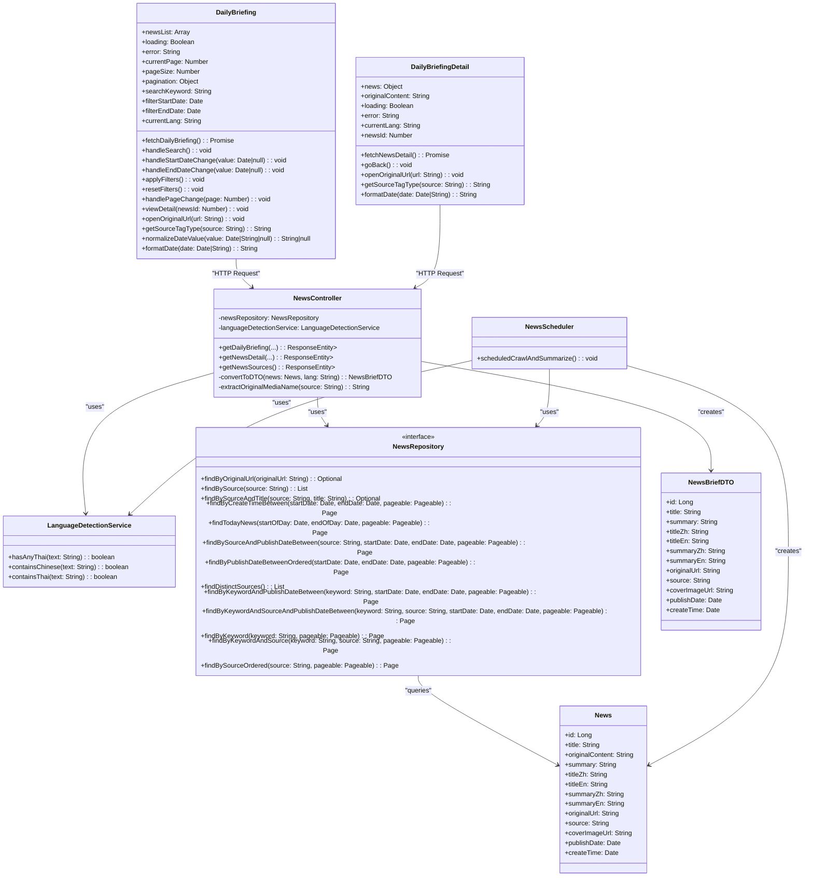
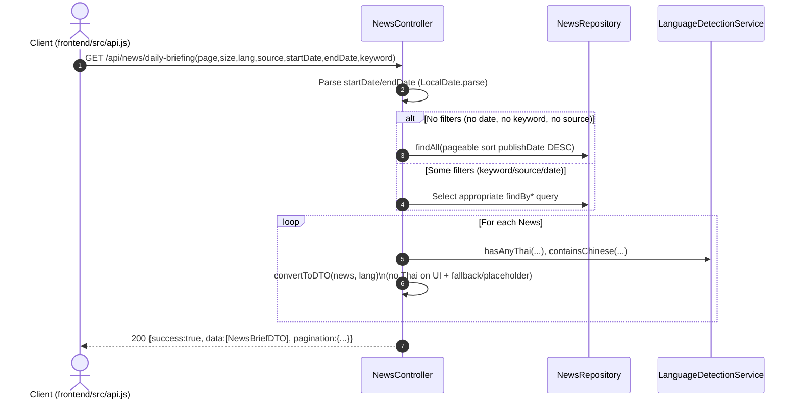
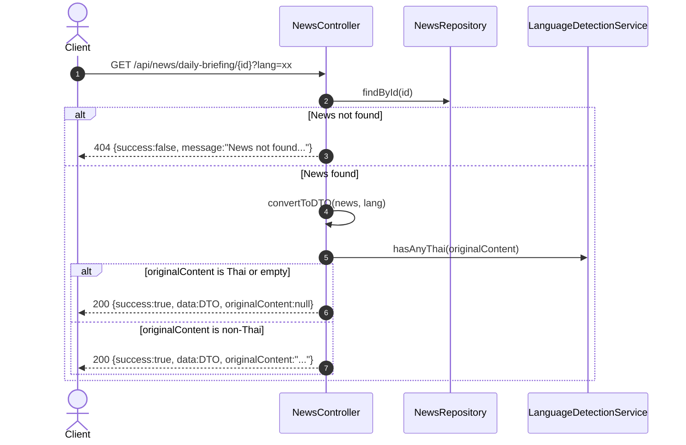
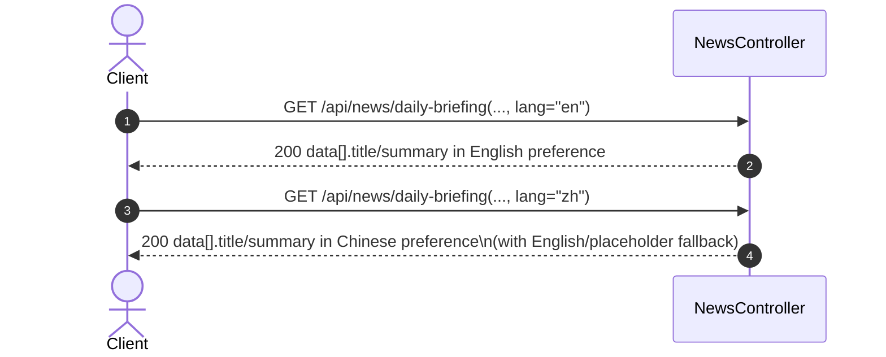
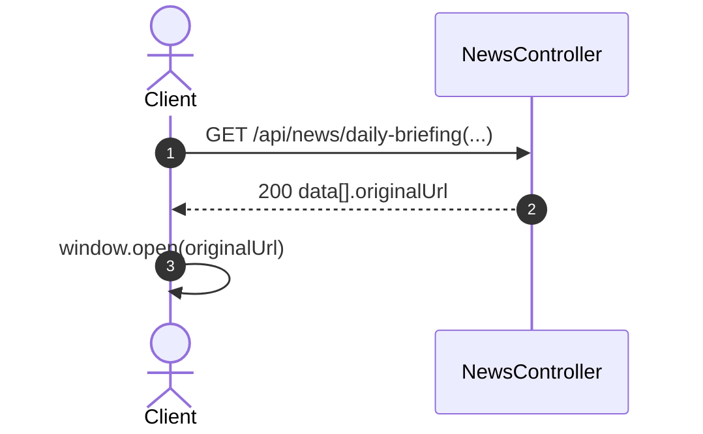
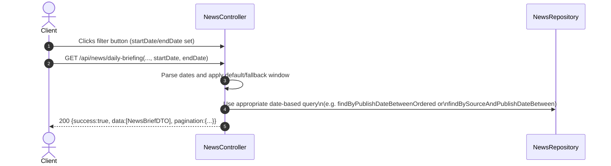
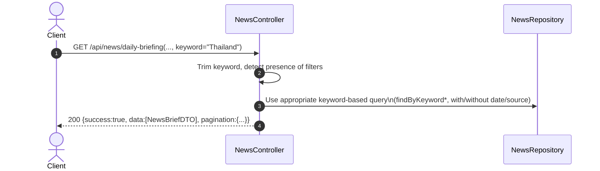
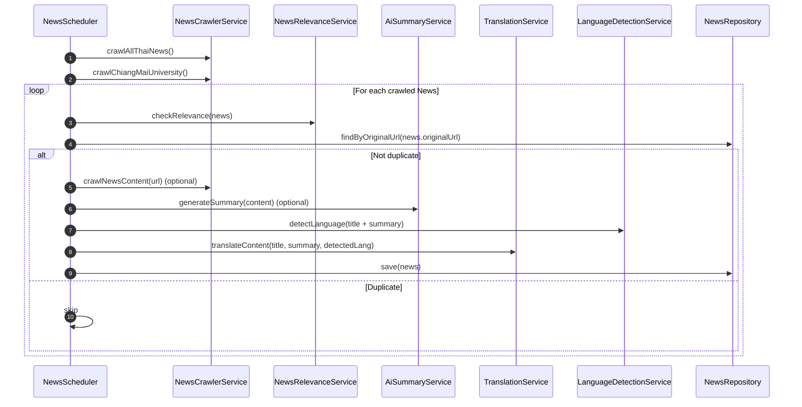

## BridgeU

**Software Design Development**

Zhiyi Pan 652115558  
Bachelor of Science, Software Engineering Program  
College of Arts, Media, and Technology, Chiang Mai University  
December 2025  
Project Advisor: Asst. Prof. Pattama Longani, Ph.D.

---

### Table of Contents

- **Chapter 1 Introduction**  
  - 1.1 Purpose and Scope  
  - 1.2 Acronyms and Definitions  
- **Chapter 2 System Architecture**  
- **Chapter 3 Detail Design**  
  - 3.1 Feature 1  
    - 3.1.1 Class Diagram  
    - 3.1.2 Class Diagram Description  
    - 3.1.3 Sequence Diagram  

---

## Chapter 1 Introduction

### 1.1 Purpose and Scope

The purpose of the Software Design Development (SDD) document is to present a complete software design of the BridgeU project.  
This document contains the outline of the software architecture, functions used, and diagrams (class, sequence, and activity) with the user interface for this project.  
BridgeU aims to eliminate language barriers through AI technology and establish a bilingual mutual assistance ecosystem connecting Chinese students, global students, and local Thai merchants.

### 1.2 Acronyms and Definitions

**Acronyms**

- **SRS**: Software Requirement Specification  
- **UI**: User Interface  
- **SDD**: Software Design Document  
- **FD**: Function Description  

**Definitions**

- **IEEE**: Institute for Electrical and Electronics Engineers. The largest global interest group for engineers of different branches and computer scientists.  
- **Plan**: A document or series of tasks required to meet an objective, typically including the associated schedule, budget, resources, organizational description and work breakdown structure.  
- **Feature**: Transformation of input parameters to output parameters based on a specified algorithm. It describes the functionality of the product in the language of the product, and is used for requirements analysis, design, coding, testing or maintenance.  
- **Project Management**: The application of knowledge, skills, tools, and techniques to project activities in order to meet or exceed stakeholder needs and expectations from a project.  
- **Project Plan**: A formal, approved document used to guide both project execution and project control. It documents planning assumptions and decisions, facilitates communication among stakeholders, and records approved scope, cost, and schedule baseline.  
- **Risk**: An uncertain event or condition that, if it occurs, has a positive or negative effect on a project’s objectives. It is a function of the probability of occurrence of a given threat’s occurrence.  
- **Risk Management**: The systematic application of management policies, procedures and practices to the tasks of identifying, analyzing, evaluating, treating and monitoring risk.  
- **System Testing**: Testing conducted on a complete and integrated system to evaluate the system’s compliance with its specified requirements.  
- **Unit Test**: A test of individual programs or modules in order to remove design or programming errors.  
- **Traceability**: The ability to trace the history, application or location of an item or activity, or work products or activities, by means of recorded identification. Horizontal traceability describes the relationship between work products of the same type (e.g., customer requirements). Vertical traceability describes the relationship between work products which build or are derived from each other (e.g., from customer requirements to qualification test cases). Bidirectional traceability allows following relationships in both directions.  
- **Use Case**: A description of a specific interaction between a system and its users to accomplish a particular goal or task. It outlines the sequence of steps or actions that a user performs in the system and describes the system's responses to those actions.  
- **Crawler**: A program that systematically browses the World Wide Web in order to create an index of data.  
- **Qwen AI**: The Large Language Model provided by Alibaba Cloud used for translation and summarization in this project.  

---

## Chapter 2 System Architecture

**Description**:  
The system architecture consists of a front-end built using Vue.js and a component library (Element UI / Element Plus), which provides a responsive user interface.  
The back-end is built with Spring Boot, a robust Java framework, handling business logic and RESTful API requests.  
MySQL 8 is used as the primary database for storing structured user and post data.  
Elasticsearch (or other search mechanisms) can be integrated to provide high-performance semantic search capabilities.  
Additionally, the system connects to the Aliyun Qwen API to perform natural language processing tasks such as summarization and translation.  
Axios is used for communication between the front-end and back-end.

---

## Chapter 3 Detail Design

### 3.1 Feature 1: Daily Briefing System

The Daily Briefing System allows users to:

- Browse a paginated list of news briefings.  
- Filter by date range and news source.  
- Search by keyword across multiple fields.  
- Switch interface language between Chinese (`zh`) and English (`en`).  
- View detailed information of a single news item and, when allowed, its original content.  
- Navigate to the original news article on the source website.

All descriptions below are based on the current codebase.

---

### 3.1.1 Class Diagram

The overall class diagram for Feature 1 (Daily Briefing) is shown below.



---

### 3.1.2 Class Diagram Description

#### 3.1.2.1 View

##### 3.1.2.1.1 DailyBriefing

Represents the Daily Briefing list view in the frontend. It is responsible for fetching, filtering, and paginating news items.

**Attributes**

| ID | Name           | Description                                                                                          | Type   |
|----|----------------|------------------------------------------------------------------------------------------------------|--------|
| 1  | newsList       | Array containing the list of Daily Briefing news items to be displayed                              | Array  |
| 2  | loading        | Boolean flag indicating if the news data is currently being fetched                                 | Boolean |
| 3  | error          | String containing error message if data fetching fails                                              | String |
| 4  | currentPage    | Current page number for pagination (1-based in UI)                                                  | Number |
| 5  | pageSize       | Number of news items to display per page                                                            | Number |
| 6  | pagination     | Object containing pagination information returned by backend (page, size, totalElements, etc.)     | Object |
| 7  | searchKeyword  | String containing the keyword entered by the user for searching news                                | String |
| 8  | filterStartDate| Date object (or null) representing the start date for filtering news by publication date           | Date \| null |
| 9  | filterEndDate  | Date object (or null) representing the end date for filtering news by publication date             | Date \| null |
| 10 | currentLang    | String representing the current interface language ("zh" for Chinese, "en" for English)            | String |

**Methods**

| ID | Name                | Description                                                                                                                                                                                                                                                                   | Parameters                         | Return Type    |
|----|---------------------|-------------------------------------------------------------------------------------------------------------------------------------------------------------------------------------------------------------------------------------------------------------------------------|------------------------------------|----------------|
| 1  | fetchDailyBriefing  | Fetches Daily Briefing news items from the backend API with pagination, search, and filter parameters. Sets `loading = true`, calculates 0-based page number, builds `params` object with `page`, `size`, `lang`, `keyword` (if provided), `startDate` and `endDate`. Sends GET request to `/api/news/daily-briefing`. On success, updates `newsList` and `pagination` object. Handles errors and sets `loading = false` in `finally` block. | None                               | Promise\<void> |
| 2  | handleSearch        | Handles search action by resetting `currentPage` to 1 and calling `fetchDailyBriefing()`. Ensures search results start from the first page.                                                                                                                                   | None                               | void           |
| 3  | handleStartDateChange | Updates the `filterStartDate` when user selects a start date.                                                                                                                                                                                                                | `value: Date \| null`              | void           |
| 4  | handleEndDateChange | Updates the `filterEndDate` when user selects an end date.                                                                                                                                                                                                                    | `value: Date \| null`              | void           |
| 5  | applyFilters        | Validates date range (checks if `filterStartDate > filterEndDate`, shows warning if invalid). If valid, resets `currentPage` to 1 and calls `fetchDailyBriefing()` to fetch filtered results. `fetchDailyBriefing()` internally calls `normalizeDateValue()` before sending dates to API. | None                               | void           |
| 6  | resetFilters        | Clears all filter conditions: sets `searchKeyword = ''`, `filterStartDate = null`, `filterEndDate = null`, resets `currentPage` to 1, and calls `fetchDailyBriefing()` to reload all news without filters.                                                                    | None                               | void           |
| 7  | handlePageChange    | Handles pagination by updating `currentPage` to the new page number and calling `fetchDailyBriefing()` to fetch the corresponding page. Scrolls to top after page change.                                                                                                     | `page: Number`                     | void           |
| 8  | viewDetail          | Emits an event to navigate to the news detail page for a specific news item.                                                                                                                                                                                                 | `newsId: Number`                   | void           |
| 9  | openOriginalUrl     | Opens the original news article URL in a new browser tab.                                                                                                                                                                                                                     | `url: String`                      | void           |
| 10 | getSourceTagType    | Returns the UI tag type (primary/success/info) based on the news source.                                                                                                                                                                                                      | `source: String`                   | String         |
| 11 | normalizeDateValue  | Normalizes date value to `DD-MM-YYYY` format string. Handles `Date` objects, string values (validates `DD-MM-YYYY` format, ignores incomplete inputs), and null values. Returns `null` for invalid inputs.                                                                    | `value: Date \| String \| null`    | String \| null |
| 12 | formatDate          | Formats a date object to `"DD-MM-YYYY HH:mm"` format string.                                                                                                                                                                                                                  | `date: Date \| String`             | String         |

##### 3.1.2.1.2 DailyBriefingDetail

Represents the Daily Briefing detail view in the frontend. It is responsible for displaying a single news item and its original content when allowed.

**Attributes**

| ID | Name            | Description                                                                                   | Type   |
|----|-----------------|-----------------------------------------------------------------------------------------------|--------|
| 1  | news            | Object containing the detailed information of a single Daily Briefing news item              | Object |
| 2  | originalContent | String containing the original content of the news article                                   | String |
| 3  | loading         | Boolean flag indicating if the news detail data is currently being fetched                   | Boolean |
| 4  | error           | String containing error message if data fetching fails                                       | String |
| 5  | currentLang     | String representing the current interface language ("zh" for Chinese, "en" for English)      | String |
| 6  | newsId          | Number representing the ID of the news item to display (passed as prop or route parameter)  | Number |

**Methods**

| ID | Name             | Description                                                                                                                                                                                                                                                                       | Parameters        | Return Type   |
|----|------------------|-----------------------------------------------------------------------------------------------------------------------------------------------------------------------------------------------------------------------------------------------------------------------------------|-------------------|--------------|
| 1  | fetchNewsDetail  | Fetches detailed information of a single news item from the backend API using `newsId`. Sets `loading = true`, `error = null`, builds `params` with `lang` (`currentLang` or `'en'`), sends GET request to `/api/news/daily-briefing/{id}`. Checks `response.status === 200` and `response.data.success`. On success, updates `news = response.data.data` and `originalContent = response.data.originalContent`. Handles errors: 404 (shows localized notFound message), 401 (login expired, handled by interceptor), 500 (shows error message from response), network errors (shows localized networkError message). Sets `loading = false` in `finally` block. | None              | Promise\<void> |
| 2  | goBack           | Emits an event to navigate back to the Daily Briefing list page.                                                                                                                                                                                                                   | None              | void         |
| 3  | openOriginalUrl  | Opens the original news article URL in a new browser tab.                                                                                                                                                                                                                         | `url: String`     | void         |
| 4  | getSourceTagType | Returns the UI tag type (primary/success/info) based on the news source.                                                                                                                                                                                                          | `source: String`  | String       |
| 5  | formatDate       | Formats a date object to `"DD-MM-YYYY HH:mm"` format string.                                                                                                                                                                                                                      | `date: Date \| String` | String   |

#### 3.1.2.2 Controller

##### 3.1.2.2.1 Controller: `NewsController`

File: `springboot-backend/src/main/java/com/globalbuddy/controller/NewsController.java`

**Attributes**

| ID | Name                     | Description                                                                                  | Type                    |
|----|--------------------------|----------------------------------------------------------------------------------------------|-------------------------|
| 1  | newsRepository           | Instance of `NewsRepository` for database operations                                        | NewsRepository          |
| 2  | languageDetectionService | Instance of `LanguageDetectionService` for detecting Thai and Chinese content              | LanguageDetectionService |

**Methods**

| ID | Name               | Description                                                                                                                          | Parameters                                                                                                       | Return Type                         |
|----|--------------------|--------------------------------------------------------------------------------------------------------------------------------------|------------------------------------------------------------------------------------------------------------------|-------------------------------------|
| 1  | getDailyBriefing   | Handles GET request to retrieve paginated Daily Briefing news list with optional filters (keyword, date range, source). Returns paginated news data. | `page: int`, `size: int`, `lang: String`, `source: String`, `startDate: String`, `endDate: String`, `keyword: String` | `ResponseEntity<Map<String,Object>>` |
| 2  | getNewsDetail      | Handles GET request to retrieve detailed information of a single news item by ID. Returns DTO data and optional original content.   | `id: Long`, `lang: String`                                                                                       | `ResponseEntity<Map<String,Object>>` |
| 3  | getNewsSources     | Handles GET request to retrieve list of distinct news sources for filter dropdown.                                                  | None                                                                                                             | `ResponseEntity<Map<String,Object>>` |
| 4  | convertToDTO       | Converts `News` entity to `NewsBriefDTO` based on language preference, enforcing “no Thai content on UI” rule.                     | `news: News`, `lang: String`                                                                                    | `NewsBriefDTO`                      |
| 5  | extractOriginalMediaName | Extracts original media name from `source` string (e.g., `"Google News (Thailand) - Bangkok Post"` → `"Bangkok Post"`).        | `source: String`                                                                                                 | `String`                            |

#### 3.1.2.3 Repository

##### 3.1.2.3.1 Repository: `NewsRepository`

File: `springboot-backend/src/main/java/com/globalbuddy/repository/NewsRepository.java`

**Methods**

| ID | Name                                      | Description                                                                                                          | Parameters                                                                                               | Return Type      |
|----|-------------------------------------------|----------------------------------------------------------------------------------------------------------------------|----------------------------------------------------------------------------------------------------------|------------------|
| 1  | findByOriginalUrl                         | Finds a news item by its original URL (used for deduplication during crawling).                                     | `originalUrl: String`                                                                                    | Optional\<News>  |
| 2  | findBySource                              | Finds all news items by source website name.                                                                        | `source: String`                                                                                         | List\<News>      |
| 3  | findBySourceAndTitle                      | Finds a news item by source website name and title.                                                                 | `source: String`, `title: String`                                                                        | Optional\<News>  |
| 4  | findByCreateTimeBetween                   | Finds news items within specified date range based on `createTime` (with pagination).                               | `startDate: Date`, `endDate: Date`, `pageable: Pageable`                                                | Page\<News>      |
| 5  | findTodayNews                             | Finds today's news items based on `publishDate` (with pagination).                                                  | `startOfDay: Date`, `endOfDay: Date`, `pageable: Pageable`                                              | Page\<News>      |
| 6  | findBySourceAndPublishDateBetween         | Finds news items by source and publish date range (with pagination).                                                | `source: String`, `startDate: Date`, `endDate: Date`, `pageable: Pageable`                              | Page\<News>      |
| 7  | findByPublishDateBetweenOrdered           | Finds news items within publish date range, ordered by `publishDate` DESC (with pagination).                        | `startDate: Date`, `endDate: Date`, `pageable: Pageable`                                                | Page\<News>      |
| 8  | findDistinctSources                       | Returns list of distinct news source names.                                                                         | None                                                                                                     | List\<String>    |
| 9  | findByKeywordAndPublishDateBetween        | Searches news items by keyword (in title, content, summary, translations) and publish date range (with pagination). | `keyword: String`, `startDate: Date`, `endDate: Date`, `pageable: Pageable`                             | Page\<News>      |
| 10 | findByKeywordAndSourceAndPublishDateBetween | Searches news items by keyword, source, and publish date range (with pagination).                                   | `keyword: String`, `source: String`, `startDate: Date`, `endDate: Date`, `pageable: Pageable`           | Page\<News>      |
| 11 | findByKeyword                             | Searches news items by keyword across all historical news (with pagination).                                        | `keyword: String`, `pageable: Pageable`                                                                  | Page\<News>      |
| 12 | findByKeywordAndSource                    | Searches news items by keyword and source across all historical news (with pagination).                             | `keyword: String`, `source: String`, `pageable: Pageable`                                                | Page\<News>      |
| 13 | findBySourceOrdered                       | Finds news items by source, ordered by `publishDate` DESC (with pagination).                                        | `source: String`, `pageable: Pageable`                                                                   | Page\<News>      |

#### 3.1.2.4 Model

##### 3.1.2.4.1 Model: `News`

File: `springboot-backend/src/main/java/com/globalbuddy/model/News.java`

**Attributes**

| ID | Name           | Type   | Description                                                     |
|----|----------------|--------|-----------------------------------------------------------------|
| 1  | id             | Long   | Primary key ID (IDENTITY auto-increment)                       |
| 2  | title          | String | Original news title                                             |
| 3  | originalContent| String | Full original article content (`TEXT`)                         |
| 4  | summary        | String | AI-generated or RSS-provided summary (`TEXT`)                  |
| 5  | titleZh        | String | Chinese translation of the title                               |
| 6  | titleEn        | String | English translation of the title                               |
| 7  | summaryZh      | String | Chinese translation of the summary (`TEXT`)                    |
| 8  | summaryEn      | String | English translation of the summary (`TEXT`)                    |
| 9  | originalUrl    | String | Original article URL (length 1000)                             |
| 10 | source         | String | Source website name (e.g. Google News feed label)             |
| 11 | coverImageUrl  | String | URL of the cover image extracted from meta tags (length 1000) |
| 12 | publishDate    | Date   | Publication time                                               |
| 13 | createTime     | Date   | Time when the record is saved in DB                           |

##### 3.1.2.4.2 Model: `NewsBriefDTO`

File: `springboot-backend/src/main/java/com/globalbuddy/dto/NewsBriefDTO.java`

**Attributes**

| ID | Name          | Type   | Description                                                                 |
|----|---------------|--------|-----------------------------------------------------------------------------|
| 1  | id            | Long   | News ID                                                                     |
| 2  | title         | String | News title (language-specific based on user preference)                    |
| 3  | summary       | String | News summary (language-specific based on user preference)                  |
| 4  | titleZh       | String | Chinese translation of the title                                           |
| 5  | titleEn       | String | English translation of the title                                           |
| 6  | summaryZh     | String | Chinese translation of the summary                                         |
| 7  | summaryEn     | String | English translation of the summary                                         |
| 8  | originalUrl   | String | Original article URL from the source website                               |
| 9  | source        | String | Source website name                                                        |
| 10 | coverImageUrl | String | Cover image URL                                                            |
| 11 | publishDate   | Date   | Publication date from the source website                                   |
| 12 | createTime    | Date   | Timestamp when the news was crawled and stored                             |

#### 3.1.2.5 Pagination Response Structure

Endpoint `GET /api/news/daily-briefing` returns a `Map<String,Object>` with:

- `success: boolean`  
- `data: List<NewsBriefDTO>`  
- `pagination`:
  - `page, size, totalElements, totalPages, hasNext, hasPrevious`  
- `date: String` – current server date (`LocalDate.now().toString()`)  
- Optional echo fields: `filterSource`, `filterStartDate`, `filterEndDate`

---

### 3.1.2 Backend Components

#### 3.1.2.1 Controller: `NewsController`

File: `springboot-backend/src/main/java/com/globalbuddy/controller/NewsController.java`

**Attributes**

| ID | Name                    | Type                    | Description                                                  |
|----|-------------------------|-------------------------|--------------------------------------------------------------|
| 1  | newsRepository          | NewsRepository          | JPA repository for `News`                                   |
| 2  | languageDetectionService| LanguageDetectionService| Detects Thai/Chinese characters and language properties     |

<!-- Detailed narrative method descriptions for NewsController have been consolidated into the Methods table above to match the required SDD format. -->

#### 3.1.2.2 Repository: `NewsRepository`

File: `springboot-backend/src/main/java/com/globalbuddy/repository/NewsRepository.java`

**Main methods used by Feature 1**:

- `Page<News> findAll(Pageable pageable)` – default, no filter.  
- `List<String> findDistinctSources()` – distinct non-null `source` values, sorted.  
- `Page<News> findByPublishDateBetweenOrdered(Date startDate, Date endDate, Pageable pageable)` – date-only filter, ordered by `publishDate DESC`.  
- `Page<News> findBySourceAndPublishDateBetween(String source, Date startDate, Date endDate, Pageable pageable)` – partial match on `source` + date range.  
- `Page<News> findBySourceOrdered(String source, Pageable pageable)` – partial match on `source`, no date filter.  
- `Page<News> findByKeywordAndPublishDateBetween(String keyword, Date startDate, Date endDate, Pageable pageable)` – keyword across multiple fields + date filter.  
- `Page<News> findByKeywordAndSourceAndPublishDateBetween(String keyword, String source, Date startDate, Date endDate, Pageable pageable)` – keyword + source + date filter.  
- `Page<News> findByKeyword(String keyword, Pageable pageable)` – keyword only (no date).  
- `Page<News> findByKeywordAndSource(String keyword, String source, Pageable pageable)` – keyword + source (no date).  
- `Optional<News> findByOriginalUrl(String originalUrl)` – used for deduplication during crawling.

#### 3.1.2.3 Scheduler: `NewsScheduler`

File: `springboot-backend/src/main/java/com/globalbuddy/scheduler/NewsScheduler.java`

**Attributes**

| ID | Name                    | Type                    | Description                                                  |
|----|-------------------------|-------------------------|--------------------------------------------------------------|
| 1  | newsCrawlerService      | NewsCrawlerService      | Crawls news from RSS and HTML                               |
| 2  | aiSummaryService        | AiSummaryService        | Generates AI summaries via Qwen                             |
| 3  | newsRepository          | NewsRepository          | Persists `News` entities                                    |
| 4  | languageDetectionService| LanguageDetectionService| Language detection utilities                                |
| 5  | translationService      | TranslationService      | Translates titles and summaries                             |
| 6  | newsRelevanceService    | NewsRelevanceService    | Filters news relevant to international students             |

<!-- Detailed narrative method description for NewsScheduler has been consolidated into the Methods table above to match the required SDD format. -->

---

### 3.1.3 API Design

#### 3.1.3.1 List Daily Briefings

- **Endpoint**: `GET /api/news/daily-briefing`  
- **Purpose**: Retrieve a paginated list of news briefings with optional filters.

**Query Parameters**:

| Name      | Type   | Default | Description                                 |
|-----------|--------|---------|---------------------------------------------|
| page      | int    | 0       | Zero-based page index                      |
| size      | int    | 10      | Page size                                  |
| lang      | string | "en"    | Language preference (`"zh"` or `"en"`)     |
| source    | string | null    | Optional source filter (partial match)     |
| startDate | string | null    | Optional start date (`yyyy-MM-dd`)         |
| endDate   | string | null    | Optional end date (`yyyy-MM-dd`)           |
| keyword   | string | null    | Optional keyword (trimmed before use)      |

**Success Response (200)**:

```json
{
  "success": true,
  "data": [ /* array of NewsBriefDTO */ ],
  "pagination": {
    "page": 0,
    "size": 10,
    "totalElements": 123,
    "totalPages": 13,
    "hasNext": true,
    "hasPrevious": false
  },
  "date": "2026-02-06",
  "filterSource": "optional",
  "filterStartDate": "optional",
  "filterEndDate": "optional"
}
```

**Error Response (500)**:

```json
{
  "success": false,
  "message": "Failed to fetch news briefing: <details>"
}
```

#### 3.1.3.2 Get News Detail

- **Endpoint**: `GET /api/news/daily-briefing/{id}`  
- **Purpose**: Retrieve a single news item and, if allowed, its original content.

**Query Parameters**:

| Name | Type   | Default | Description                            |
|------|--------|---------|----------------------------------------|
| lang | string | "en"    | Language preference for DTO selection |

**Success Response (200)**:

```json
{
  "success": true,
  "data": { /* NewsBriefDTO */ },
  "originalContent": "Full original content or null if Thai or empty"
}
```

**Not Found (404)**:

```json
{
  "success": false,
  "message": "News not found with id: 123"
}
```

**Error (500)**:

```json
{
  "success": false,
  "message": "Failed to fetch news detail: <details>"
}
```

#### 3.1.3.3 Get Available News Sources

- **Endpoint**: `GET /api/news/sources`  
- **Purpose**: Provide a list of original media names to populate the source filter dropdown.

**Success Response (200)**:

```json
{
  "success": true,
  "data": ["Bangkok Post", "The Nation Thailand", "..."]
}
```

**Error Response (500)**:

```json
{
  "success": false,
  "message": "Failed to fetch news sources: <details>"
}
```

---

### 3.1.4 Sequence Diagrams (Mermaid)

The following sequence diagrams are intentionally **simplified** to show only **method calls and key branches**, with implementation details explained in the method descriptions above.

#### SD-01: View Daily Briefings



#### SD-02: View Daily Briefing News Details



#### SD-03: Switch Interface Language



#### SD-04: Jump to Original Link



#### SD-05: Filter Daily Briefing News by Date



#### SD-06: Search Daily Briefing News



#### SD-07: Scheduled Crawl & Summarize



---

### 3.1.5 Code Reference List (Traceability)

The following files implement Feature 1: Daily Briefing System.

- **Controller**
  - `springboot-backend/src/main/java/com/globalbuddy/controller/NewsController.java`
- **Repository**
  - `springboot-backend/src/main/java/com/globalbuddy/repository/NewsRepository.java`
- **Entity and DTO**
  - `springboot-backend/src/main/java/com/globalbuddy/model/News.java`
  - `springboot-backend/src/main/java/com/globalbuddy/dto/NewsBriefDTO.java`
- **Language Detection**
  - `springboot-backend/src/main/java/com/globalbuddy/service/LanguageDetectionService.java`
- **Scheduler and News Pipeline**
  - `springboot-backend/src/main/java/com/globalbuddy/scheduler/NewsScheduler.java`
  - `springboot-backend/src/main/java/com/globalbuddy/service/NewsCrawlerService.java`
  - `springboot-backend/src/main/java/com/globalbuddy/service/NewsRelevanceService.java`
  - `springboot-backend/src/main/java/com/globalbuddy/service/AiSummaryService.java`
  - `springboot-backend/src/main/java/com/globalbuddy/service/TranslationService.java`
- **Frontend API Wrappers**
  - `frontend/src/api.js` (`fetchDailyBriefing`, `fetchNewsSources`)
  - `frontend/vite.config.js` (dev proxy for `/api`)

 