# Software Requirement Specification

## BridgeU

**Author**: Zhiyi Pan 652115558

**Degree**: Bachelor of Science

**Program**: Software Engineering Program

**Department**: College of Arts, Media, and Technology

Chiang Mai University

**Date**: December 2025

**Project Advisor**: Asst. Prof. Pattama Longani, Ph.D.

---

## Document Control

| Document Name | Version | History | Status | Date | Editable | Reviewer |
|--------------|---------|---------|--------|------|----------|-----------|
| BridgeU-SRS | BridgeU-SRS V.0.1 | Add Chapter 1 • 1.1 Purpose and Scope • 1.2 User Characteristics • 1.3 Acronyms and Definitions  Add Chapter 2 Progress 1 • Use Case Diagram • Use Case Description | Draft | 12/12/2025 | ZHIYI PAN | Asst. Prof. Pattama Longani, Ph.D. |

---

## Table of Contents

1. [Chapter 1 Introduction](#chapter-1-introduction)
   - 1.1 Purpose and Scope
   - 1.2 Scope
   - 1.3 User Characteristics
   - 1.4 Acronyms and Definitions

2. [Chapter 2 Overall Description](#chapter-2-overall-description)
   - 2.1 Product Perspective
   - 2.2 User Characteristics

3. [Chapter 3 Specification Requirement](#chapter-3-specification-requirement)
   - 3.1 Use Case Scenario
     - 3.1.1 Feature 1
     - 3.1.2 Feature 2
     - 3.2.3 Feature 3
   - 3.2 User Requirement Specification
   - 3.3 Use Case Description and Activity Diagram

---

## Chapter 1 Introduction

### 1.1 Purpose and Scope

The purpose of the software design development is to present a complete software design of the BridgeU project. This document contains the outline of the software architecture, functions used, and activity diagrams with the user interface for this project. BridgeU aims to eliminate language barriers through AI technology and establish a bilingual mutual assistance ecosystem connecting international students studying in Thailand, global students, and local Thai merchants.

BridgeU is a web-based bilingual platform designed to support international students in Thailand by providing three main features:

1. **Daily Briefing System**: An automated news aggregation system that captures and summarizes Thai news from approved government and mainstream media sources via Google News RSS (primarily including Bangkok Post, The Nation Thailand and other major Thai media) at 8:00 AM daily, providing bilingual (Chinese/English) access to daily news briefings.

2. **Community Interaction Platform**: A bilingual community where users can create, browse, and interact with posts through likes, comments, and private messaging, with Qwen AI-powered automatic translation, content moderation, and comment summarization to ensure safe and accessible communication in both Chinese and English.

3. **Authentication and Profile Management**: A secure user registration and authentication system supporting email and phone registration methods, with profile management capabilities for international students, merchants, and administrators.

The scope of this document covers the functional requirements, use cases, user requirements specifications, and system architecture for the BridgeU platform.

### 1.2 Scope

This Software Requirement Specification (SRS) document defines the requirements included in the BridgeU platform, including:

- **Use Case Diagrams**: Visual representations of system interactions between users and the platform, covering all major features and their relationships.
- **User Requirements**: Functional and non-functional requirements from the perspective of end users (international students, merchants, and administrators).
- **System Requirements**: Technical specifications, system constraints, performance requirements, and integration requirements for the platform infrastructure.

**Key Features:**

- **Feature #1: Daily Briefing System**
  
  The Daily Briefing System automatically captures and summarizes Thai news from Google News, providing bilingual (Chinese/English) access to daily news briefings for users. At 8 a.m. every day, the system captures news from Google News and saves each article as a Daily Briefing record, including original title, summary generated by the system calling Qwen AI to summarize, source website name, original URL, and publication time provided by the source. The system generates both Chinese and English versions for the title and abstract, and the interface only displays one of them in the current language. When users open the Daily Briefing page, the system returns a paginated list of Daily Briefing records from new to old according to the release time. The list card displays: title, summary, source, publication time (using only the current interface language), and provides a button to enter the detail page. Users can also click the original button to open the original URL of the news. Users can enter any keywords in the search box on the page. The system searches by keyword among Daily Briefing titles and abstracts (both Chinese and English versions) in the database, then returns Daily Briefing items related to that word in the current language. Users can set filtering conditions: start date (day-month-year), end date (day-month-year). The system applies all filtering conditions, only returns the Daily Briefing news that meets the conditions, and displays them in chronological order (new to old).

- **Feature #2: Community Interaction Platform**
  
  This community interaction platform allows users to create, browse, and interact with posts through likes, comments, and private messaging, with Qwen AI-powered automatic translation, content moderation, and comment summarization to ensure safe and accessible communication in both Chinese and English. There are five community categories (Study, Housing, Travel, Part-time Job, Life Services) in the community platform. Users can open the community page and see the stream of posts which post time from new to old. Scrolling down will load more posts. Each post card shows title, preview of the main text, selected tags (Study, Housing, Travel, Part-time Job, Life Services), number of likes, and number of comments. Users can enter Chinese/English keywords. The system will search in all post titles and body texts (in both Chinese and English versions) and only return the list of matching posts. For users who follow each other, both sides will appear in each other's mutual follow list. Open the mutual follow list, users can send a private message directly to the author. Users can search for the names of those they follow, view their profiles (name, their posts), send private messages directly from the list or unfollow those they already follow. Users can open existing one-on-one private messages or create new one-on-one private messages, send and receive messages with mutual followers, and view the history in the conversation interface. Mark the session as read/unread in the session list, or delete the entire session so that it no longer appears in the list. Users can create or edit their own posts: enter Chinese/English titles and text, upload pictures, and select tags (Study, Housing, Travel, Part-time Job, Life Services). When submitting for release, the system will call Qwen AI to automatically translate and generate another language version and conduct a content security review by Qwen AI. Users can click on a post to enter the post details page. On the post detail page, users can view the full text about this post, pictures, tags (Study, Housing, Travel, Part-time Job, Life Services), total number of likes, total number of comments. Clicking on the author's avatar can show the author's profile (avatar, name, author's posts). The detail page also supports subsequent operations: liking (click "like" button to like post), commenting (users can enter Chinese/English comments under a certain post, along with the commenter's name and timestamp. Users can also delete the comment they have already published), reporting post - in the reporting form, select one or more predefined reasons (Spam, Fraud or Scam, Illegal Service Promotion, Abusive Language, Other), and users can fill in the explanatory text. After submission, it enters the subsequent review (the Qwen AI will judge the post/comment pass or not). There is an "AI Summary" button next to the comment. After clicking it, users can view the summaries of all comments under the post in their chosen language.

- **Feature #3: Authentication and Profile System**
  
  Feature 3 provides an authentication and profile system that lets users register new accounts with different methods (email address or phone number), log in and log out securely, and manage their own profile information and community posts, including a password, a display name, an optional avatar image, and a preferred interface language (Chinese or English). When new users register, users can select email registration and enter their email address in the registration form. The system sends a verification code email to the email address. Users enter the received verification code on the page, then set a password (password must contain both uppercase and lowercase letters), fill in the display name (name only allows English characters) and select the interface language. Alternatively, users can select phone registration and enter their mobile phone number in the registration form. The system sends a text message containing a verification code to this mobile phone number. Users enter the received verification code on the page, then set a password (password must contain both uppercase and lowercase letters), fill in the display name (name only allows English characters) and select the language interface. After submission, the system creates a new account for this email address or phone number, and the user is redirected to the login page. Registered users open the login page and enter their respective name and passwords in the login form. Once the verification is successful, the user will be redirected to the community system page. When logged in, users can click the "Log Out" button to end the current session. The system clears the login status and returns to the login page. If they want to use the system again, they need to re-enter the name and password to log in. After logging in, users can open the "Profile" page to view the name, avatar and own posts saved in the current account. Users can enter the "My Community Posts" list from the profile module. The system displays all community posts published by the current account in this list. Each post shows its title, publication time, and current review status (use Qwen AI to review). Users can modify profile fields (display name, avatar, preferred language) on the page and submit the form. The system updates the account information with the new values. After refreshing the page, users can see the latest information.

### 1.3 User Characteristics

**Users:**

- All people who can log in.

**Description:**

The target users of our software are international students studying in Thailand, merchants providing services to the international student community, they share the common goal of creating a supportive bilingual community that facilitates adaptation to life in Thailand and enables seamless information sharing and communication.

### 1.4 Acronyms and Definitions

**Acronyms:**

| Acronym | Full Form |
|---------|-----------|
| SRS | Software Requirement Specification |
| URS | User Requirement Specification |
| UTC | Unit Test Case |
| STC | System Test Case |
| UC | Use Case |
| SRC | Software Requirements Specification |
| RSS | Really Simple Syndication |
| JWT | JSON Web Token |
| AI | Artificial Intelligence |
| LLM | Large Language Model |
| API | Application Programming Interface |
| REST | Representational State Transfer |
| HTTP | Hypertext Transfer Protocol |
| JSON | JavaScript Object Notation |

**Definitions:**

| Name | Definition |
|------|------------|
| IEEE | Institute for Electrical and Electronics Engineers. Biggest global interest group for engineers of different branches and computer scientists. |
| Plan | A document series of tasks requires meeting an objective, typically including the associated schedule, budget, resources, organizational description and work breakdown structure. |
| Feature | Feature Transformation of input parameters to output parameters based on a specified algorithm. It describes the functionality of the product in the language of the product. Used for requirements analysis, design, coding, testing or maintenance. |
| Project Management | The application of knowledge, skills, tools, and techniques to project activities in order to meet or exceed stakeholder needs and expectations from a project. |
| Project Plan | A formal, approved document used to guide both project execution and project control. The primary uses of the project plan are to document planning assumptions and the decision, to facilitate communication among stakeholders, and to document approved scope, cost, and schedule baseline. |
| Risk | An uncertain event or condition that, if it occurs, has a positive or negative effect on a project's objectives. It is a function of the probability of occurrence of a given threat's occurrence. |
| Risk Management | The systematic application of management policies, procedures and practices to the tasks of identifying, analyzing, evaluating, treating and monitoring risk. |
| System Testing | Testing conducted on a complete and integrated system for evaluate the system's compliance with its specified requirements. |
| Unit Test | A test of individual programs or modules in order to remove a design or programming errors. |
| Traceability | The ability to trace the history, application or location of an item or activity, or work products or activities, by means of recorded identification. The establishment and maintenance of relationships between such items. Horizontal traceability describes the relationship between work products of the same type (e.g. Customer requirements). Vertical traceability describes the relationship between work products, which build or derived from each other (e.g., from customer requirements to qualification test cases). Bidirectional traceability allows to directly following relationships in both directions. |
| Use Case | A use case is a description of a specific interaction between a system and its users to accomplish a particular goal or task. It outlines the sequence of steps or actions that a user performs in the system and describes the system's responses to those actions. Use cases help to identify and define the functional requirements of a system from the perspective of its users. |
| Activity Diagram | Activity diagram is another important behavioral diagram in UML diagram to describe dynamic aspects of the system. Activity diagram is essentially an advanced version of flow chart that modeling the flow from one activity to another activity. |
| Daily Briefing | A news aggregation feature that automatically captures and summarizes Thai news from approved media sources, providing bilingual access to daily news briefings for international students. |
| Content Moderation | The process of reviewing and filtering user-generated content to ensure it complies with platform policies, Thai laws, and university regulations using AI-powered screening and human review. |
| Mutual Follow | A relationship between two users where both users follow each other, enabling private messaging and enhanced interaction features. |
| Qwen AI | The AI service used for automatic translation, content summarization, and content security review in the BridgeU platform. |

---

## Chapter 2 Overall Description

### 2.1 Product Perspective

BridgeU is a web-based application accessible from any device supporting a modern web browser. The platform is designed to run on standard web browsers (Chrome, Firefox, Safari, Edge) and is responsive to different screen sizes, supporting desktop computers, tablets, and mobile devices. The system operates as a client-server architecture where:

- **Client Side**: Users interact with the platform through a web browser, which displays the user interface built with Vue.js and Element UI/Plus components. The frontend communicates with the backend through RESTful API calls using HTTP/HTTPS protocols.

- **Server Side**: The backend is built with Spring Boot framework, handling business logic, data processing, authentication, and database operations. The system integrates with external services including:
  - Qwen AI service for translation, summarization, and content moderation
  - Email service for sending verification codes
  - SMS service for phone verification (if applicable)
  - Google News RSS feeds for news aggregation

- **Database**: MySQL 8 database stores all persistent data including user accounts, posts, comments, messages, news articles, and system configurations.

The platform does not require any additional software installation on the user's device, as it is fully accessible through web browsers. Users can access the platform from anywhere with an internet connection, making it convenient for international students who may be using various devices and network environments.

### 2.2 User Characteristics

The BridgeU platform supports two primary user roles:

| Role | Definition |
|------|------------|
| **User** | A person who has an account in the system. Users can register using email or phone number, log in to access all platform features including Daily Briefing, Community interactions, private messaging, and profile management. Users can create posts, comment, like, follow other users, and send private messages. |

---

## Chapter 3 Specification Requirement

### 3.1 Use Case Scenario

#### 3.1.1 Feature 1: Daily Briefing System

##### 3.1.1.1 Actor

- **User**: The only actor of the system. The user can browse daily briefings, view details, search/filter news, and (if permitted) manage or manually trigger crawling tasks.

##### 3.1.1.2 Use Case Diagram

**Feature 1: Automated Information Aggregation Bot**

This use case diagram describes the core interactive functions of the automated information aggregation bot. The user, as the main participant, can access the system to browse the Daily Briefing. During browsing, the user can choose to extend operations such as View News Details, Search News, Filter News and Jump to the original text. If enabled, a user with elevated permissions can manage or manually trigger crawler tasks in the background (Manage/Trigger Crawling) to ensure the real-time nature of the data.

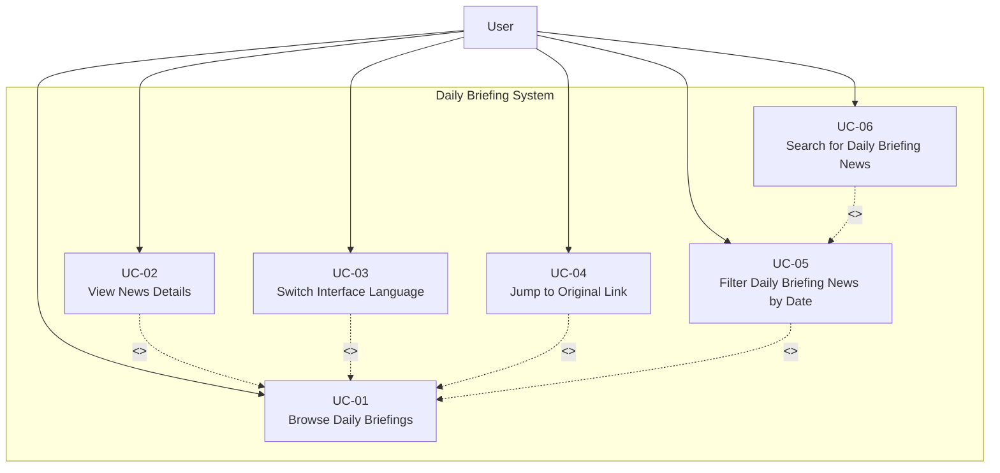

**Use Cases:**
- UC-01: Browse Daily Briefings
- UC-02: View News Details (<<extend>> UC-01)
- UC-03: Switch Interface Language (<<extend>> UC-01)
- UC-04: Jump to Original Link (<<extend>> UC-01)
- UC-05: Filter Daily Briefing News by Date (<<extend>> UC-01)
- UC-06: Search for Daily Briefing News (<<extend>> UC-05)

#### 3.1.2 Feature 2: Community Interaction Platform

##### 3.1.2.1 Actor

- **User**: The only actor of the system. The user can browse the community feed, create and interact with posts (like/comment/report), search and filter content, manage mutual follows, and communicate via private messages. (Administrative actions, if applicable, are performed by a user with elevated permissions.)

##### 3.1.2.2 Use Case Diagram

**Feature 2: Community Interaction Platform – Use Case Overview**

The Community Interaction Platform has a single actor (**User**). The user can browse the community feed, create and edit posts, like and comment on posts, search and filter content, manage mutual follows, and communicate via private messages. (If administrative moderation is enabled, it is performed by a user with elevated permissions.)

Qwen AI provides **automatic translation** and **AI comment summarization** capabilities that are reused across multiple use cases rather than exposed as a separate user-facing feature. When users create or edit posts (UC-08), the backend automatically generates bilingual (ZH/EN) content. When viewing post details (UC-11) or posting comments (UC-13), the system reuses the stored bilingual content and allows users to view content in their selected interface language. UC-18 (AI Summary Comment) allows the user to request an AI-generated summary of all comments under a post. These AI behaviors are implemented in the codebase via Qwen-based services and are reflected in the detailed UCD and activity diagrams in Section 3.3.7–3.3.18.

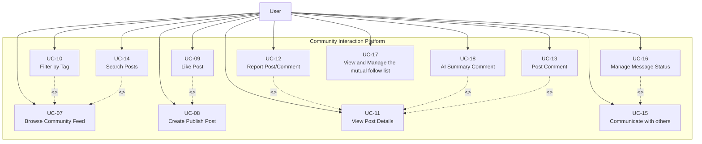

**Use Cases (aligned with Section 3.3):**
- UC-07: View Community Feed
- UC-08: Create Publish Post
- UC-09: Like Post (<<extend>> UC-08)
- UC-10: Filter by Tag (<<extend>> UC-07)
- UC-11: View Post Details
- UC-12: Report Post/Comment (<<extend>> UC-11)
- UC-13: Post Comment (<<extend>> UC-11)
- UC-14: Search Posts (<<extend>> UC-07)
- UC-15: Communicate with others
- UC-16: Manage Message Status (<<extend>> UC-15)
- UC-17: View and Manage the mutual follow list
- UC-18: AI Summary Comment (<<extend>> UC-11)

##### 3.1.2.3 Use Case Summary Table

| Use Case ID | Use Case Name | Actor | Description | Extends |
|-------------|---------------|-------|-------------|---------|
| UC-07 | Browse Community Feed | User | User opens the community feed and browses posts ordered from newest to oldest, showing title, preview, tags, like count, and comment count. | - |
| UC-08 | Create Publish Post | User | User can create or edit posts in their preferred language (Chinese, English), upload images, select a tag from predefined categories, and have the system automatically generate bilingual content using Qwen AI. | - |
| UC-09 | Like Post | User | User can like or unlike posts to express feedback, and the like count updates immediately in the interface. | UC-08 |
| UC-10 | Filter by Tag | User | User can filter posts in the community feed by selecting tags from the predefined list (Study, Housing, Travel, Part-time Job, Life Services). | UC-07 |
| UC-11 | View Post Details | User | User can view post details including full text, images, tags, engagement metrics (likes, comments), and author profile when clicking on a post, in their current interface language. | - |
| UC-12 | Report Post/Comment | User | User can report posts/comments with structured reasons (Spam, Fraud or Scam, Illegal Service Promotion, Abusive Language, Other) and provide explanatory text. | UC-11 |
| UC-13 | Post Comment | User | User can post comments to interact with other users, which will be automatically translated by the system into Chinese and English; users can delete their own comments. | UC-11 |
| UC-14 | Search Posts | User | User can search posts by keyword across bilingual content (titles and body texts in both Chinese and English). | UC-07 |
| UC-15 | Communicate with others | User | Users who follow each other mutually can send and receive private messages and view message history. | - |
| UC-16 | Manage Message Status | User | User can manage message status in conversations, including marking messages as read and deleting messages for themselves. | UC-15 |
| UC-17 | View and Manage the mutual follow list | User | User can manage mutual follow relationships: search for users, view profiles, follow/unfollow users, and view mutual follow lists. | - |
| UC-18 | AI Summary Comment | User | User can view AI-generated summaries of all comments under a post in their chosen language. | UC-11 |

#### 3.1.3 Feature 3: AI-Powered Content Moderation

##### 3.1.3.1 Actor

- **User**: The only actor of the system. The user submits content (posts/comments) that undergoes AI screening, and (if permitted) performs human review actions on pending content.

##### 3.1.3.2 Use Case Diagram

**Feature 3: AI-Powered Hybrid Content Moderation (AI + Human Loop)**

When the user submits content, it triggers the UC-19 AI real-time screening: the AI automatically makes decisions based on the confidence level - if the score is less than 60, it directly rejects and provides the reason. A score of 60≤score<80 is marked as pending review. A score of 80 or above will automatically pass. The content to be reviewed enters the UC-22 review list, and is manually reviewed in UC-20 by a user with elevated permissions. The final approval/rejection is made through UC-21 (the reasons for rejection need to be filled in and fed back to the user). The rejected content will present the reasons for rejection to users in UC-23. Users can modify it and resubmit it, entering the same review process again to achieve a closed loop of "AI efficient filtering + manual fallback decision-making + users checking the reasons and resubmitting".

**Use Cases:**
- UC-19: AI Real-time Screening
- UC-20: Human Review (Administrator)
- UC-21: Approve/Reject Content
- UC-22: View Pending Review List
- UC-23: View Rejection Reason and Resubmit

### 3.2 User Requirement Specification

#### Feature 1: Daily Briefing System

**URS-01**: The Administrator can manage or manually trigger the crawling task to ensure data real-time updates.

**URS-02**: The User can browse the Daily Briefing to view the latest news summaries ordered from newest to oldest by publication time, with pagination support.

**URS-02.1 (Implementation Alignment Note)**: The system shall use the original publication time from the source website (parsed from RSS or HTML and normalized to a unified timezone) to determine the ordering of Daily Briefing items. If the source publication time is unavailable, the system shall fall back to using the crawl timestamp for ordering.

**URS-03**: The User can view news details including title, AI-generated summary, publication time, crawl timestamp, and source information in their current interface language (Chinese or English).

**URS-04**: The User can search for specific news information within the Daily Briefing by entering keywords in Chinese or English. The system searches across both Chinese and English versions of titles and summaries.

**URS-05**: The User can jump to the original text link to read the full report from the source website when viewing news details.

**URS-06**: The User can filter news based on specific criteria (start date and end date) while browsing.

#### Feature 2: Community Interaction Platform

**URS-07 (UC-07 – View Community Feed)**: The User can browse the community feed with posts ordered from newest to oldest, showing title, preview, tags, like count, and comment count.

**URS-08 (UC-08 – Create Publish Post)**: The User can create or edit posts in their preferred language (Chinese, English), upload images, select a tag from predefined categories (Study, Housing, Travel, Part-time Job, Life Services), and have the system automatically generate bilingual (Chinese/English) content using Qwen AI for later display.

**URS-09 (UC-09 – Like Post)**: The User can like or unlike posts to express feedback, and the like count updates immediately in the interface.

**URS-10 (UC-10 – Filter by Tag)**: The User can filter posts in the community feed by selecting tags from the predefined list (Study, Housing, Travel, Part-time Job, Life Services).

**URS-11 (UC-11 – View Post Details)**: The User can view post details including full text, images, tags, engagement metrics (likes, comments), and author profile when clicking on a post, in their current interface language.

**URS-12 (UC-12 – Report Post/Comment)**: The User can report posts/comments with structured reasons (Spam, Fraud or Scam, Illegal Service Promotion, Abusive Language, Other) and provide explanatory text.

**URS-13 (UC-13 – Post Comment)**: The User can post comments to interact with other users, which will be automatically translated by the system into Chinese and English; users can delete their own comments.

**URS-14 (UC-14 – Search Posts)**: The User can search posts by keyword across bilingual content (titles and body texts in both Chinese and English).

**URS-15 (UC-15 – Communicate with others)**: Users who follow each other mutually can send and receive private messages and view message history.

**URS-16 (UC-16 – Manage Message Status)**: The User can manage message status in conversations, including marking messages as read and deleting messages for themselves.

**URS-17 (UC-17 – View and Manage the mutual follow list)**: The User can manage mutual follow relationships: search for users, view profiles, follow/unfollow users, and view mutual follow lists.

**URS-18 (UC-18 – AI Summary Comment)**: The User can view AI-generated summaries of all comments under a post in their chosen language.

#### Feature 3: AI-Powered Content Moderation

**URS-21**: The User can submit content (posts, comments), which triggers an automatic AI Real-time Screening process using Qwen AI (UC-19).

**URS-22**: The User receives immediate processing results based on the AI confidence score: Auto-Approve (score 80-100), Pending Human Review (score 60-79), or Auto-Reject (score 0-59).

**URS-23**: The User can view the specific rejection reason and edit the post to resubmit it if the content is rejected, entering the same review process again.

**URS-24**: A user with elevated permissions can access the "Pending Review List" to view items that scored between 60 and 79 and require human verification.

**URS-25**: A user with elevated permissions can perform a human review on pending posts and execute an approve or reject operation (UC-20/UC-21).

**URS-26**: A user with elevated permissions must provide a specific rejection reason when rejecting a post, which is then sent to the user for feedback.

**URS-27**: The User can view their own posts with moderation status (published, pending review, or rejected) in their profile.

### 3.3 Use Case Description and Activity Diagram

#### 3.3.1 UCD-01: Browse Daily Briefings

##### 2.3.1.1 User Requirement Specification (URS) and System Requirement Specification (SRS)

**URS-01**: The User can open the Daily Briefing page and browse a paginated list of recent Daily Briefing items ordered from newest to oldest by publication time in their current interface language.

**SRS-01**: The system shall display the "Briefing" navigation item in the sidebar navigation menu on every page.

**SRS-02**: The system shall display the Daily Briefing page [UI-01] when the "Briefing" navigation item is clicked, showing a paginated list of Daily Briefing items.

**SRS-03**: The system shall order Daily Briefing items from newest to oldest based on publication time from the source website.

**SRS-04**: The system shall display Daily Briefing items in the user's current interface language (Chinese or English), showing only the title and summary in the selected language.

**SRS-05**: Each Daily Briefing card on the list shall display: title, AI-generated summary, source website name (original or localized name), and publication time (formatted according to the current interface language).

**SRS-06**: The system shall implement pagination to display Daily Briefing items, providing pagination controls (page number, previous/next buttons) for users to navigate through pages.

**SRS-07**: The system shall provide a "View Detail" button on each Daily Briefing card to navigate to the news detail page.

##### 2.3.1.2 Use Case Description

| Use Case ID | UC01 |
|------------|------|
| Use Case Name | Browse Daily Briefings |
| Created By | ZhiYi Pan |
| Last Update By | ZhiYi Pan |
| Date Created | 04/01/2026 |
| Last Revision Date | |
| Actors | User |
| Description | User can open the Daily Briefing page and browse a paginated list of recent Daily Briefing items ordered from newest to oldest by publication time in their current interface language. |
| Trigger | User are in the "Briefing page" (UI-01: Briefing page) |
| Preconditions | 1. User is logged into the BridgeU platform. 2. User has an active internet connection. 3. The Daily Briefing system has successfully crawled news from approved sources via Google News RSS and direct crawlers (e.g., Bangkok Post). |

**Use Case Input Specification**

| Input | type | Constraint | Example |
|-------|------|------------|---------|
| Current Interface Language | String | Must be "zh" (Chinese) or "en" (English) | "en" |

**Post conditions**:
- User are in "Daily Briefing page" (UI-01: Daily Briefing page)

**Normal Flows**

| User (Actions) | System (Responses) |
|----------------|-------------------|
| 1. User clicks on the "Briefing" navigation item in the sidebar | 2. System checks if the user is logged in and the login session is valid (verifies authentication token)    • `[E2: User session expired]` |
| | 3. System retrieves the user's current interface language preference (Chinese or English) |
| | 4. System queries the database for the first page of Daily Briefing items, ordered by publication time (newest first)    • `[E1: Cannot connect to database]`    • `[E3: Network timeout]` |
| | 5. System retrieves the corresponding language version (Chinese or English) for each Daily Briefing item's title and summary |
| | 6. System displays the Daily Briefing page (UI-01) with paginated list of news items    • `[A1: No news items available]` |
| | 7. Each news card displays: title, summary, source (original or localized name), publication time (formatted according to current interface language), and "View Detail" button |

**Alternative Flow**

**`[A1: No news items available]`**
- A1.1 System show "No news available at this time" message
- A1.2 Use case end.

**Exception Flow**

**`[E1: Cannot connect to database]`**
- E1.1 System show "Unable to load news. Please try again later." message
- E1.2 System logs the error for administrator review
- E1.3 Use case end.

**`[E2: User session expired]`**
- E2.1 System redirect the user to the login page
- E2.2 System show "Your session has expired. Please log in again." message
- E2.3 Use case end.

**`[E3: Network timeout]`**
- E3.1 System show "Request timeout. Please check your internet connection and try again." message
- E3.2 User can retry the operation
- E3.3 Go to Step 4

**Note**:
- There is only one type of user of the system.

##### 2.3.1.3 Activity Diagram

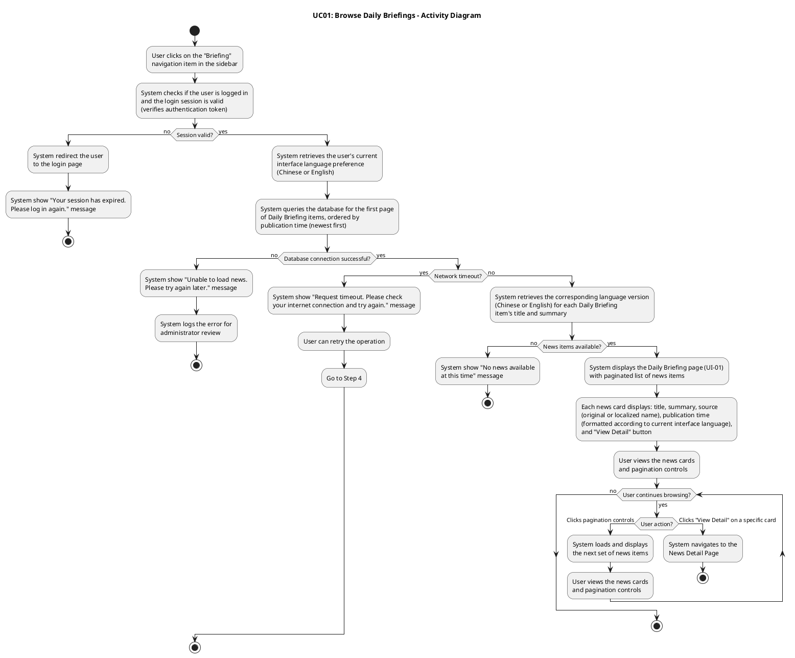

#### 3.3.2 UCD-02: View Daily Briefing News Details

##### 2.3.2.1 User Requirement Specification (URS) and System Requirement Specification (SRS)

**URS-02**: The User can select a Daily Briefing item from the list and view a news detail page that shows the complete information (title, summary, publication time, crawl time, View Original button) for that item in their current interface language (English/Chinese).

**SRS-08**: The system shall provide a "View Detail" button on each Daily Briefing card in the list page (UI-01) to navigate to the news detail page (UI-02).

**SRS-09**: The system shall display the News Detail page (UI-02) when a user clicks the "View Detail" button on a Daily Briefing card.

**SRS-10**: The system shall retrieve the selected Daily Briefing item from the database using the news item ID passed from the list page.

**SRS-11**: The system shall display the news detail page content in the user's current interface language (Chinese or English), showing the title and summary in the selected language.

**SRS-12**: The News Detail page (UI-02) shall display the following information in the user's current interface language:
- News title
- AI-generated summary
- Source website name
- Publication time (formatted)

**SRS-13**: The system shall provide a "Back" button on the News Detail page to return to the Daily Briefing list page.

**SRS-14**: The system shall provide a "View Original" button that triggers the browser to open the original news article URL in a new tab when clicked. If the original URL is missing or invalid, the button shall be disabled.

##### 2.3.2.2 Use Case Description

| Use Case ID | UC02 |
|------------|------|
| Use Case Name | View Daily Briefing News Details |
| Created By | ZhiYi Pan |
| Last Update By | ZhiYi Pan |
| Date Created | 04/01/2026 |
| Last Revision Date | |
| Actors | User |
| Description | User can select a Daily Briefing item from the list and view a news detail page that shows the complete information (title, summary, publication time, crawl time, View Original button) for that item in their current interface language (English/Chinese). |
| Trigger | User clicks the "View Detail" button on a Daily Briefing card in the Daily Briefing list page (UI-01) |
| Preconditions | 1. User has an active internet connection. 2. User is viewing the Daily Briefing list page (UI-01). 3. At least one Daily Briefing item exists in the list. |

**Use Case Input Specification**

| Input | type | Constraint | Example |
|-------|------|------------|---------|
| News Item ID | Integer | Must be a valid news item ID that exists in the database | 12345 |
| Current Interface Language | String | Must be "zh" (Chinese) or "en" (English) | "en" |

**Post conditions**:
- User is viewing the News Detail page (UI-02) displaying the complete information for the selected Daily Briefing item

**Normal Flows**

| User (Actions) | System (Responses) |
|----------------|-------------------|
| 1. User clicks the "View Detail" button on a Daily Briefing card in the list page | 2. System retrieves the news item ID from the clicked card |
| | 3. System retrieves the user's current interface language preference (Chinese or English) |
| | 4. Frontend sends HTTP request to backend API with news item ID and language parameter |
| | 5. Backend receives request (authentication not required for this endpoint) |
| | 6. Backend queries the database for the Daily Briefing item using the news item ID    • `[E1: Database error or server error]`    • `[E4: News item not found]` |
| | 7. Backend retrieves the corresponding language version (Chinese or English) for the news item's title and summary |
| | 8. Backend returns response with success status and news detail data |
| | 9. Frontend receives HTTP response from backend    • `[E2: Authentication token invalid or expired]`    • `[E3: Network timeout or connection error]` |
| | 10. Frontend checks if response.status is 200 and response.data.success is true |
| | 11. System displays the News Detail page (UI-02) with the complete information:    - News title (in current interface language)    - AI-generated summary (in current interface language)    - Source website name    - Publication time (formatted according to current interface language)    - Crawl timestamp (formatted according to current interface language)    - "View Original" button (disabled if originalUrl is invalid or missing)    - "Back" button |
| 12. User views the news details | |
| 13. User switches the interface language (Chinese/English) using the language switcher (optional) | 14. Frontend triggers a language change event and updates the current language preference 15. System re-fetches the news detail data from the API with the new language parameter 16. System updates the News Detail page display with content in the new language (title, summary, formatted dates) 17. Use case continues from Step 12 |
| 18. User clicks the "View Original" button (optional) | 19. System triggers the browser to open the original URL in a new tab    • `[E5: Original URL invalid or missing]` |
| 20. User clicks the "Back" button (optional) | 21. System navigates the user back to the Daily Briefing list page (UI-01) |

**Exception Flow**

**`[E1: Database error or server error]`**
- E1.1 Backend catches an exception while processing the request
- E1.2 Backend returns a 500 Internal Server Error response with message "Failed to fetch news detail: [error details]"
- E1.3 Backend logs the error with full details for administrator review
- E1.4 Frontend receives the 500 error response in catch block
- E1.5 Frontend checks if error.response.status === 500
- E1.6 Frontend displays the error message from error.response.data.message or default localized message 'dailyBriefingDetail.networkError'
- E1.7 Use case end.

**`[E2: Authentication token invalid or expired]`**
- E2.1 Backend returns a 401 Unauthorized response (if authentication is required for this operation)
- E2.2 Frontend detects the 401 error and clears the invalid token from localStorage
- E2.3 Frontend triggers an authentication error event and displays "登录已过期，请重新登录" / "Login expired, please log in again" message
- E2.4 System redirects the user to the login page
- E2.5 Use case ends.

**`[E3: Network timeout or connection error]`**
- E3.1 Request exceeds the configured timeout or network connection fails
- E3.2 Frontend catches the network error or timeout in catch block
- E3.3 Frontend checks if error.response exists (defensive check per code implementation)
- E3.4 If error.response exists and error.response.data.message exists, frontend displays that message
- E3.5 Otherwise, frontend displays localized error message using i18n key 'dailyBriefingDetail.networkError' or error.message
- E3.6 Use case end.

**`[E4: News item not found]`**
- E4.1 System queries the database but cannot find a news item with the provided ID
- E4.2 System returns a 404 Not Found response with message "News not found with id: [id]"
- E4.3 Frontend receives the 404 error response in catch block
- E4.4 Frontend checks if error.response.status === 404
- E4.5 Frontend displays the localized error message using i18n key 'dailyBriefingDetail.notFound'
- E4.6 System provides a "Back" button to return to the Daily Briefing list page (always displayed at top)
- E4.7 Use case end.

**`[E5: Original URL invalid or missing]`**
- E5.1 System disables the "View Original" button (rendered with `:disabled="!news.originalUrl"`). The button is visually distinct (grayed out) and non-clickable.
- E5.2 Use case continues (user can still view other details)

**Note**:
- The news detail page displays information in the user's current interface language preference.
- If the user switches language while viewing details, the page content should update accordingly.
- The "View Original" button triggers the browser to open the original article in a new tab to preserve the user's current browsing context.
- The frontend implements defensive programming checks in the error handling catch block, including handling of edge cases such as 200 status codes in catch blocks (which should not normally occur but are handled for safety).
- Error handling follows the activity diagram specification, with detailed checks for HTTP response status codes and error message availability.

##### 2.3.2.3 Activity Diagram

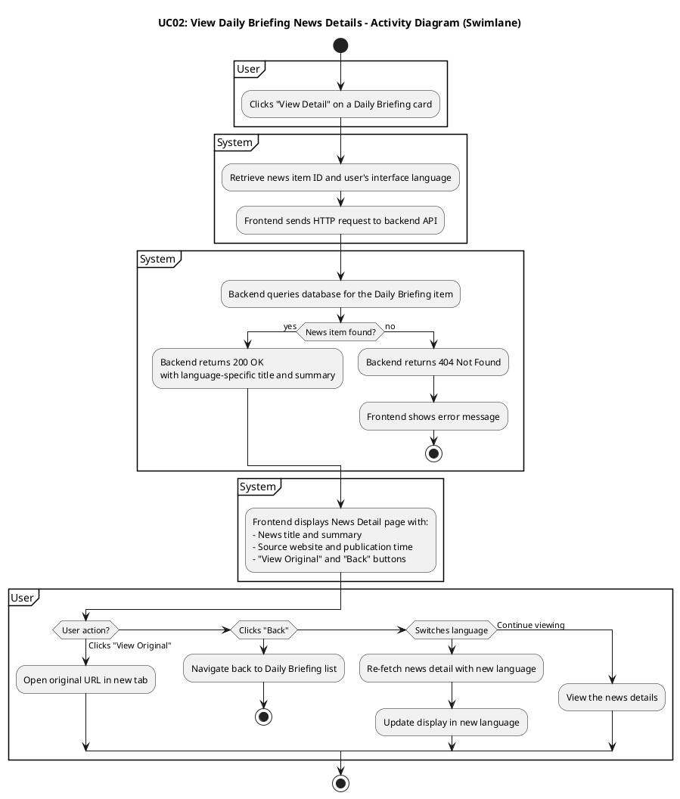

#### 3.3.3 UCD-03: Switch Interface Language

##### 2.3.3.1 User Requirement Specification (URS) and System Requirement Specification (SRS)

**URS-03**: The User can click a language switch button at any time to change the interface language between Chinese and English and continue browsing Daily Briefing items in the newly selected language.

**SRS-15**: The system shall provide a language switch button (or language selector) on every page of the application, accessible from the sidebar (for logged-in users) or login page (for non-logged-in users). The sidebar displays two separate buttons: "🇨🇳 中文" (Chinese) and "🇺🇸 EN" (English), while the login page displays a single toggle button showing "EN/中文".

**SRS-16**: The system shall display the current interface language (Chinese or English) in the language switch control, allowing users to toggle between "中文" (Chinese) and "English" (English). The active language button is visually highlighted (e.g., with a darker background and bold text).

**SRS-17**: When the user clicks the language switch button, the system shall immediately update the user's interface language preference and persist it in localStorage with the key 'userLanguage'. Note: The user profile's preferredLanguage field is only updated when the user explicitly saves their profile in the My Profile page. Language switching via the sidebar buttons only updates localStorage for the current session.

**SRS-18**: The system shall refresh the current page content immediately after the language switch, displaying all interface text, labels, buttons, and content in the newly selected language.

**SRS-19**: The system shall re-fetch any displayed content (e.g., Daily Briefing items, news details) from the backend API with the new language parameter (lang="zh" or lang="en") to ensure content is displayed in the selected language. The system triggers a 'languageChanged' custom event with detail { lang: newLang } to notify all components to refresh their content.

**SRS-20**: The system shall maintain the user's current page context (e.g., current page number, selected news item ID, filter parameters) when switching languages, so the user can continue browsing without losing their place. For example, if the user is on page 3 of the Daily Briefing list, switching language will reload page 3 in the new language.

**SRS-21**: The system shall format dates and times in the format "DD-MM-YYYY HH:mm" (day-month-year hour:minute) for both Chinese and English interfaces. The date format remains consistent across languages, but all interface labels and content text are translated according to the selected language.

#### 3.3.4 UCD-04: Jump to Original Link

##### 2.3.4.1 User Requirement Specification (URS) and System Requirement Specification (SRS)

**URS-05**: The User can jump to the original text link to read the full report from the source website when viewing news details.

**SRS-22**: The system shall display a "Read Original" button (or "阅读原文" in Chinese interface) on both the Daily Briefing list page and the News Detail page. The button shall be clearly visible and accessible to users.

**SRS-23**: The system shall display the "Read Original" button with an external link icon (e.g., "el-icon-top-right") to indicate that clicking it will open an external website in a new browser tab.

**SRS-24**: The system shall disable the "Read Original" button if the news item does not have a valid originalUrl field (i.e., originalUrl is null, undefined, or empty string). When disabled, the button shall be visually distinct (e.g., grayed out) and non-clickable.

**SRS-25**: When the user clicks the "Read Original" button, the system shall call the `openOriginalUrl(url)` method with the news item's originalUrl value. Inside the method, the system shall check if the url parameter is valid using `if (url)`. If the url is valid, the system shall execute `window.open(url, '_blank')` to open the original URL in a new browser tab, allowing the user to read the full report from the source website while maintaining their current browsing context in the BridgeU application. If the url is null, undefined, or empty (falsy), the method shall return without executing `window.open()`, and no new tab shall be opened.

**SRS-26**: The system shall handle cases where the original URL is invalid or inaccessible. If the URL fails to load in the new tab, the browser's native error handling shall be used (e.g., browser displays "This site can't be reached" or similar error message). The BridgeU application shall not display additional error messages, as the external website loading is handled by the browser.

##### 2.3.4.2 Use Case Description

| Use Case ID | UC04 |
|------------|------|
| Use Case Name | Jump to Original Link |
| Created By | ZhiYi Pan |
| Last Update By | ZhiYi Pan |
| Date Created | 05/01/2026 |
| Last Revision Date | |
| Actors | User |
| Description | User can click the "Read Original" button (or "阅读原文" in Chinese interface) on the Daily Briefing list page or News Detail page to open the original news article from the source website in a new browser tab. |
| Trigger | User clicks the "Read Original" button on a Daily Briefing card (list page) or on the News Detail page |
| Preconditions | 1. User is viewing the Daily Briefing list page (UI-01) or the News Detail page (UI-02). 2. The news item has a valid originalUrl field (not null, undefined, or empty string). 3. The user's browser supports opening new tabs (window.open API). 4. The user has internet connectivity to access external websites. |

**Use Case Input Specification**

| Input | type | Constraint | Example |
|-------|------|------------|---------|
| Original URL | String | Must be a valid HTTP/HTTPS URL | "https://www.bangkokpost.com/thailand/general/1234567/news-title" |

**Post conditions**:
- The original news article from the source website is opened in a new browser tab
- The user's current browsing context in the BridgeU application remains unchanged (user stays on the same page)
- The user can read the full report from the source website while maintaining access to the BridgeU application

**Normal Flows**

| User (Actions) | System (Responses) |
|----------------|-------------------|
| 1. User views a Daily Briefing item on the list page or News Detail page and identifies the "Read Original" button (displayed with an external link icon). The button is enabled and clickable (the news item has a valid originalUrl field).    • `[A1: News item does not have a valid originalUrl field]` | 2. System displays the "Read Original" button as enabled and clickable (rendered with `:disabled="!news.originalUrl"` evaluating to false, meaning originalUrl is valid) |
| 3. User clicks the enabled "Read Original" button    • `[A2: User clicks "Read Original" button multiple times in quick succession]` | 4. System calls the `openOriginalUrl(url)` method with the news item's originalUrl value    4a. System checks if the url parameter is valid using `if (url)` as a defensive check    4b. System executes `window.open(url, '_blank')` to open the original URL in a new browser tab    4c. The new tab opens (background or foreground depending on browser settings)    4d. The BridgeU application tab remains active and unchanged        *Note: For edge cases (invalid URL parameter, browser blocks popup, URL fails to load), see Exception Flows [E1], [E2], [E3]* |
| 5. User views the original news article in the new browser tab | 6. System maintains the user's current browsing context in the BridgeU application (user remains on the same page, same scroll position, same language setting) |

**Alternative Flow**

**`[A1: News item does not have a valid originalUrl field]`**
- A1.1 User views a Daily Briefing item on the list page or News Detail page
- A1.2 System checks if the news item has a valid originalUrl field
- A1.3 If originalUrl is null, undefined, or empty: System disables the button (rendered with `:disabled="!news.originalUrl"`)
- A1.4 Button is visually distinct (grayed out) and non-clickable
- A1.5 User cannot click the button (button is disabled)
- A1.6 Use case end.

**`[A2: User clicks "Read Original" button multiple times in quick succession]`**
- A2.1 System may open multiple tabs with the same original URL (one tab per click)
- A2.2 Each click triggers a new `window.open()` call, which may result in multiple tabs being opened
- A2.3 Use case continues from Step 5
- Note: The current implementation does not prevent multiple tabs from being opened. Browser settings may control whether multiple tabs are opened or if the existing tab is reused.

**Exception Flow**

**`[E1: URL parameter is invalid]`**
- E1.1 System calls the `openOriginalUrl(url)` method with the news item's originalUrl value
- E1.2 Inside the method, the system checks if the url parameter is valid using `if (url)`
- E1.3 If the url is null, undefined, or empty (falsy), the method returns without executing `window.open()`
- E1.4 No new tab is opened
- E1.5 System does not display an error message to the user (as this is a client-side operation)
- E1.6 Use case end.
- Note: The current implementation uses a simple `if (url)` check before calling `window.open()`. If the URL is falsy (null, undefined, or empty string), the method returns without opening a tab. This aligns with the button's disabled state when `originalUrl` is invalid. However, if the button is enabled but the url parameter passed to the method is somehow invalid, this exception flow handles that case.

**`[E2: Browser blocks popup]`**
- E2.1 Browser's popup blocker prevents `window.open()` from opening a new tab (e.g., user has popup blocker enabled, or browser security settings block the action)
- E2.2 Browser may display a notification to the user (e.g., "Pop-up blocked" message in browser UI)
- E2.3 No new tab is opened
- E2.4 User can manually allow popups for the BridgeU domain or disable popup blocker
- E2.5 Use case end.

**`[E3: URL fails to load]`**
- E3.1 New tab opens successfully, but the original URL fails to load (e.g., website is down, URL is invalid, network error, CORS issue)
- E3.2 Browser displays its native error message (e.g., "This site can't be reached", "404 Not Found", "ERR_CONNECTION_REFUSED")
- E3.3 BridgeU application does not display additional error messages (external website loading is handled by the browser)
- E3.4 User can see the browser's error message in the new tab
- E3.5 User can close the error tab and return to the BridgeU application
- E3.6 Use case end.

**Note**:
- The "Read Original" button is available on both the Daily Briefing list page and the News Detail page, providing consistent functionality across different views.
- The button text is localized: "Read Original" in English interface and "阅读原文" in Chinese interface, with an external link icon (e.g., "el-icon-top-right") to indicate it opens an external website.
- The button is automatically disabled if the news item does not have a valid originalUrl, preventing user confusion and unnecessary clicks.
- Opening the original URL in a new tab allows users to read the full report from the source website while maintaining their browsing context in the BridgeU application. Users can easily switch between tabs to compare information or return to the BridgeU application.
- The system does not track or log when users click the "Read Original" button, as this is a simple navigation action to an external website.
- If the original URL is accessible, the user can read the full article, view images, and access additional content that may not be available in the Daily Briefing summary.

##### 2.3.4.3 Activity Diagram

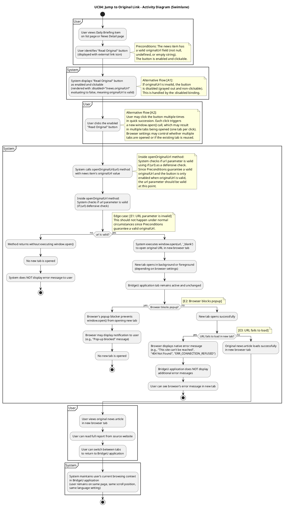

##### 2.3.4.4 Activity Diagram Description

**The Activity Diagram for Jump to Original Link** illustrates the interaction between the **User** and the **System** when the user wants to read the original news article from the source website:

- **User** views a Daily Briefing item on the list page or News Detail page and identifies the "Read Original" button (displayed with an external link icon, e.g., "el-icon-top-right").
- **System** checks if the news item has a valid originalUrl field. If the originalUrl is null, undefined, or empty, the system disables the button (rendered with `:disabled="!news.originalUrl"`), making it visually distinct (grayed out) and non-clickable, and the use case ends (see `[A1: News item does not have a valid originalUrl field]`). If the originalUrl is valid, the system enables the button and displays it as clickable, and the normal flow continues.
- **User** clicks the enabled "Read Original" button (normal flow assumes the button is enabled). Note: If the user clicks the button multiple times in quick succession, each click triggers a new `window.open()` call, which may result in multiple tabs being opened (one tab per click). Browser settings may control whether multiple tabs are opened or if the existing tab is reused (see `[A2: User clicks "Read Original" button multiple times in quick succession]`).
- **System** calls the `openOriginalUrl(url)` method with the news item's originalUrl value. Inside the method, the system checks if the url parameter is valid using `if (url)` as a defensive check. Since the Preconditions guarantee a valid originalUrl and the button is only enabled when originalUrl is valid, the url parameter should be valid at this point. The system executes `window.open(url, '_blank')` to open the original URL in a new browser tab. The new tab opens in the background or foreground (depending on browser settings), and the BridgeU application tab remains active and unchanged. Note: If the url parameter is somehow invalid (edge case), the method returns without executing `window.open()`, and no new tab is opened (see `[E1: URL parameter is invalid]`). If the browser's popup blocker prevents the new tab from opening, the browser may display a notification to the user (e.g., "Pop-up blocked" message), and no new tab is opened (see `[E2: Browser blocks popup]`).
- If the new tab opens successfully, **System** attempts to load the original URL. If the URL fails to load (e.g., website is down, URL is invalid, network error), the browser displays its native error message (e.g., "This site can't be reached", "404 Not Found"), and the BridgeU application does not display additional error messages (see `[E3: URL fails to load]`).
- If the original news article loads successfully, **User** can view the original news article in the new browser tab, read the full report from the source website, and switch between tabs to return to the BridgeU application.
- **System** maintains the user's current browsing context in the BridgeU application (user remains on the same page, same scroll position, same language setting), allowing seamless navigation between the BridgeU application and the external source website.

##### 2.3.3.4 Activity Diagram Description

**The Activity Diagram for Switch Interface Language** illustrates the interaction between the **User** and the **System** when the user changes the interface language:

- **User** clicks the language switch button (e.g., "🇨🇳 中文" or "🇺🇸 EN" buttons in sidebar, or "EN/中文" toggle on login page) on any page of the application.
- **System** calls the setLanguage(newLang) function, which validates the language code ("zh" or "en"), updates the current language state, and stores the preference in localStorage (key: 'userLanguage'). Note: The user profile's preferredLanguage field is not automatically updated during language switching; it is only updated when the user explicitly saves their profile in the My Profile page.
- **System** triggers a 'languageChanged' custom event with detail { lang: newLang } to notify all components.
- **System** retrieves the current page context (page number, selected item ID, filter parameters) from component state to maintain the user's browsing position.
- **System** components (e.g., DailyBriefing, DailyBriefingDetail) that are listening to 'languageChanged' events receive the notification and automatically re-fetch their content from the backend API with the new language parameter (params.lang = newLang).
- If the request succeeds, **System** refreshes the current page display with all interface text (via i18n translation system), content (from API response), and formatted dates (format: "DD-MM-YYYY HH:mm") in the newly selected language, while maintaining the current page context (same page number, same selected item ID, same filter parameters).
- **User** continues browsing in the newly selected language without losing their place.

If a **network timeout or connection error** occurs, the system displays a localized timeout message, and the user can retry the language switch operation. If an **API request fails** (e.g., 500 error), the system displays an error message to the user, but keeps the new language setting (localStorage and UI language have already been updated). The user can retry by refreshing the page or switching language again.

##### 2.3.5 UCD-05: Filter Daily Briefing News by Date

###### 2.3.5.1 User Requirement Specification (URS) and System Requirement Specification (SRS)

**URS-06**: The User can filter news based on specific criteria (start date and end date) while browsing.

> Note: In some course materials this requirement is referenced as **URS‑05 – Filter Daily Briefings News**; in this SRS it is recorded as **URS‑06**.

**SRS-27**: The system shall provide a filter panel on the Daily Briefing list page (UI-01) containing:
- A **Start Date** picker (optional).
- An **End Date** picker (optional).
- A **"Filter"** action button.
- A **"Reset"** action button that clears both date fields.

**SRS-28**: When the user clicks the "Filter" button, the system shall validate that:
- If both dates are provided, **Start Date ≤ End Date**.
If validation fails, the system shall display an appropriate error message and shall not send a filter request to the backend.

**SRS-29**: When validation succeeds, the system shall send a filter request to the backend including the provided filter parameters:
- `startDate` (optional)
- `endDate` (optional)
> Note: The frontend also includes `lang` (interface language) in the request. These parameters do not change the date filtering rules defined in this use case.

**SRS-30**: The backend shall query the Daily Briefing data such that:
- If `startDate` and/or `endDate` is provided, only news items whose **publication date** (`publishDate`) falls within the date range (inclusive) are returned.
  - If only `startDate` is provided, the backend shall set `endDate` to **today**.
  - If only `endDate` is provided, the backend shall set `startDate` to **30 days before** the provided end date.
- Results shall be **paginated** and ordered from newest to oldest by **publication date** (`publishDate` descending).

**SRS-31**: The system shall update the Daily Briefing list page (UI-01) to display only the filtered news items, **resetting the results view to the first page** while preserving pagination controls for navigating through multiple result pages. When no filter conditions are provided (no Start Date, no End Date, and no keyword), the system shall show all news items with pagination (no implicit default date window).

**SRS-32**: If no news items match the filter conditions, the system shall display an empty list and a user-friendly message "No news data available" (zh: "暂无新闻数据") while keeping the filter panel visible so that the user can adjust conditions and retry.

###### 2.3.5.2 Use Case Description

| Use Case ID | UC-05 |
|------------|------|
| Use Case Name | Filter Daily Briefing News by Date |
| Created By | ZhiYi Pan |
| Last Update By | ZhiYi Pan |
| Date Created | 08/01/2026 |
| Last Revision Date | 14/01/2026 |
| Actors | User |
| Description | User can filter Daily Briefing items by choosing an optional start date and an optional end date, and then browse only the items that meet these filter conditions. |
| Trigger | User is on the Daily Briefing list page (UI-01) and interacts with the filter panel (selects dates, then clicks the "Filter" button). |
| Preconditions | 1. User is logged into the BridgeU platform. 2. User has an active internet connection. 3. The Daily Briefing system has successfully crawled news from approved sources and stored publication dates. 4. The filter panel (date pickers) is visible on the Daily Briefing list page (UI-01). |

**Use Case Input Specification**

| Input | type | Constraint | Example |
|-------|------|------------|---------|
| Start Date | Date | Must be a valid calendar date; must not be later than End Date | 01-01-2026 |
| End Date | Date | Must be a valid calendar date; must not be earlier than Start Date | 03-01-2026 |
<!-- Source selection for filtering has been removed; filtering is now based only on date range. -->

**Post conditions**:
- The Daily Briefing list page (UI-01) displays only news items that match the provided date conditions (if any), ordered from newest to oldest by publication date, with pagination.

**Normal Flows**

| User (Actions) | System (Responses) |
|----------------|-------------------|
| 1. User opens the Daily Briefing list page (UI-01) and sees the filter panel with date pickers. | 2. System displays the filter panel with empty (optional) fields and shows the current news list (unfiltered), with pagination controls when multiple pages exist. |
| 3. User sets filter criteria (**Start Date** and/or **End Date**). | 4. System updates the filter model accordingly. |
| 5. (Optional) User clicks the **"Reset"** button. | 6. System clears Start Date and End Date and refreshes the list as unfiltered (page reset to 1). |
| 7. User clicks the **"Filter"** button. | 8. System validates the filter inputs (if both dates are provided, Start Date ≤ End Date).    • `[E1: Invalid date range]` |
| | 9. If validation passes, the system sends a filter request to the backend API including any provided parameters (`startDate`, `endDate`) and the current UI language (`lang`).    • `[E2: Authentication token invalid or expired]`    • `[E3: Network timeout or connection error]` |
| | 10. Backend queries the database for Daily Briefing items matching the provided conditions (date range on `publishDate`), orders results from newest to oldest by `publishDate`, and applies pagination.    • `[E4: Database error or server error]` |
| | 11. Backend returns the filtered news list (with pagination data) to the frontend. |
| | 12. System updates the Daily Briefing list on UI-01 to show only filtered items (page reset to 1) and updates pagination controls accordingly.    • `[A1: No news match filter conditions]` |
| 13. User browses the filtered news list and can navigate between pages using pagination controls. | 14. System loads and displays the corresponding page of filtered results while preserving the current filter conditions. |
| 15. User may adjust filter criteria and click "Filter" again (or reset). | 16. System repeats the validation-and-query flow with the new conditions. |

**Alternative Flow**

**`[A1: No news match filter conditions]`**
- A1.1 Backend returns an empty result set for the specified Filter (no records match date range conditions).
- A1.2 System displays an empty list on the Daily Briefing page and shows a message "No news data available" (zh: "暂无新闻数据").
- A1.3 Filter panel remains visible and retains the user's selected dates (if any) so that the user can easily adjust them.
- A1.4 Use case ends or continues when the user modifies filter conditions and clicks "Filter" again.

**Exception Flows**

**`[E1: Invalid date range]`**
- E1.1 System detects that Start Date is later than End Date during validation.
- E1.2 System displays an inline validation error message (e.g., "Start date cannot be later than end date") near the date fields.
- E1.3 System does not send a request to the backend.
- E1.4 User can correct the dates and click "Filter" again (return to step 7).

**`[E2: Authentication token invalid or expired]`**
- E2.1 System returns a 401 Unauthorized response (if authentication is required for this operation).
- E2.2 Frontend detects the 401 error and clears the invalid token from localStorage.
- E2.3 Frontend triggers an authentication error event and displays "登录已过期，请重新登录" / "Login expired, please log in again" message.
- E2.4 System redirects the user to the login page.
- E2.5 Use case ends.

**`[E3: Network timeout or connection error]`**
- E3.1 The request to the backend times out or fails due to network issues.
- E3.2 System displays an error message "Network request failed, please try again later" (zh: "网络请求失败，请稍后重试").
- E3.3 User may retry the operation by clicking a "Retry" button or by clicking "Filter" again; the system re-sends the request with the same filter parameters (return to step 9).

**`[E4: Database error or server error]`**
- E4.1 Backend encounters an error while querying the database and returns a 500 Internal Server Error.
- E4.2 Frontend displays an error message "Failed to fetch news" (zh: "获取新闻失败").
- E4.3 Backend logs the error details for administrator review.
- E4.4 User may retry by clicking "Filter" again after adjusting conditions, or retry later.

**Note**:
- The filter panel allows users to set optional Start Date and/or End Date. When only one date is provided, the backend applies default date range logic (if only Start Date is provided, End Date defaults to today; if only End Date is provided, Start Date defaults to 30 days before the End Date).
- Filtered results are displayed in chronological order (newest to oldest by publication date) and reset to page 1 when filter conditions are applied.
- The filter panel remains visible after filtering, allowing users to adjust conditions and re-filter without losing their filter settings.
- When the user clicks "Reset", all filter fields are cleared and the list is refreshed to show unfiltered results, resetting pagination to page 1.

###### 2.3.5.3 Activity Diagram
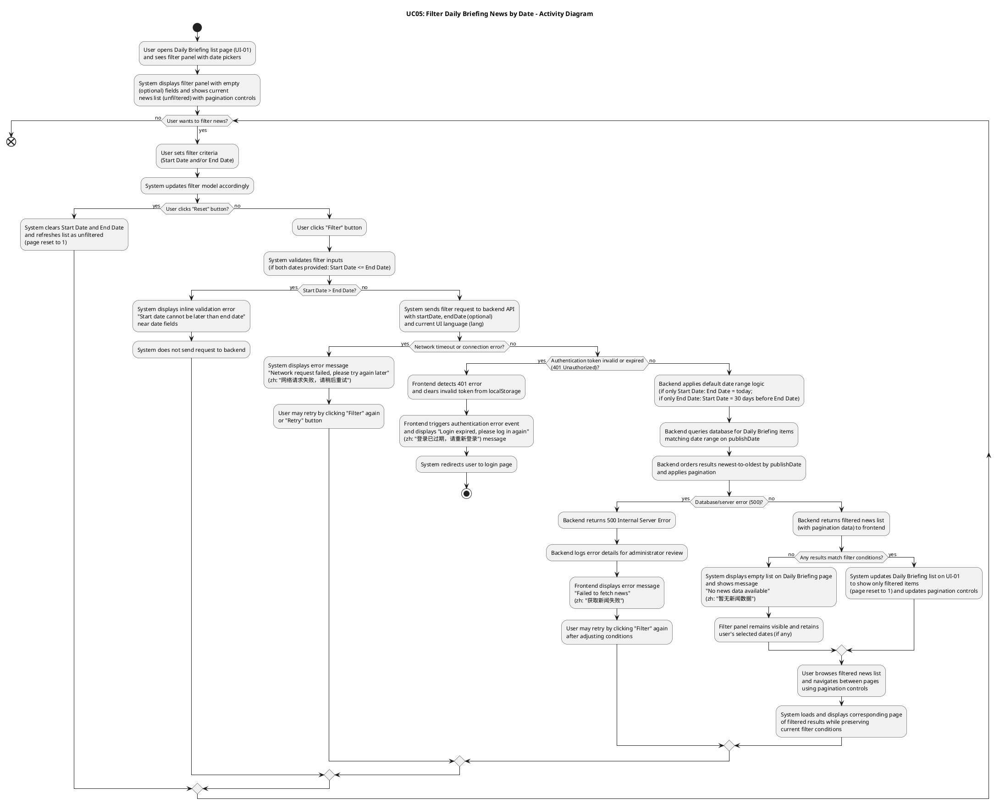
##### 2.3.5.4 Activity Diagram Description
**The Activity Diagram for Filter Daily Briefing News by Date** illustrates the interaction between the **User** and the **System** when the user filters Daily Briefing items by date range:

- The activity diagram starts when the **User** opens the Daily Briefing list page (UI-01) and sees the filter panel with date pickers. The **System** displays the filter panel with empty (optional) fields and shows the current news list (unfiltered), with pagination controls when multiple pages exist.
- **User** sets filter criteria (**Start Date** and/or **End Date**), and the **System** updates the filter model accordingly.
- The diagram includes an optional **"Reset"** action: when the user clicks the **"Reset"** button, the system clears Start Date and End Date and refreshes the list as unfiltered (page reset to 1), allowing the user to start over.
- When the **User** clicks the **"Filter"** button, the **System** first performs **client-side validation** on the input values. If both dates are provided and the start date is later than the end date, the system shows an inline validation error message (e.g., "Start date cannot be later than end date") near the date fields and does not send any request to the backend. The user can then correct the dates and click "Filter" again.
- When validation passes, the **System** sends a filter request to the backend API, including any provided parameters (`startDate`, `endDate`) and the current UI language (`lang`). If a **network timeout or connection error** occurs, the system displays an error message "Network request failed, please try again later" (zh: "网络请求失败，请稍后重试"). The user may retry the operation by clicking a "Retry" button or by clicking "Filter" again; the system re-sends the request with the same filter parameters. If the **authentication token is invalid or expired** (401 Unauthorized), the frontend detects the 401 error, clears the invalid token from localStorage, triggers an authentication error event, displays "登录已过期，请重新登录" / "Login expired, please log in again" message, and redirects the user to the login page, ending the use case.
- On the backend, the system first applies **default date range logic** when only one date is provided: if only `startDate` is provided, the backend sets `endDate` to today; if only `endDate` is provided, the backend sets `startDate` to 30 days before the provided end date. The system then queries the database for Daily Briefing items matching the provided conditions (date range on `publishDate`), orders results from newest to oldest by `publishDate`, and applies pagination. If a **database/server error** occurs, the backend encounters an error while querying the database and returns a 500 Internal Server Error. The frontend displays an error message "Failed to fetch news" (zh: "获取新闻失败"), while the backend logs the error details for administrator review. The user may retry by clicking "Filter" again after adjusting conditions, or retry later.
- If the query succeeds, the **Backend** returns the filtered news list (with pagination data) to the frontend. **System** receives either an empty result set or a list of matching news items. When no items match the filter conditions, the system displays an empty list on the Daily Briefing page and shows a message "No news data available" (zh: "暂无新闻数据"). The filter panel remains visible and retains the user's selected dates (if any) so that the user can easily adjust them. When items are found, the system updates the Daily Briefing list on UI-01 to show only filtered items (page reset to 1) and updates pagination controls accordingly.
- **User** can then browse the filtered news list and navigate between pages using pagination controls. The **System** loads and displays the corresponding page of filtered results while preserving the current filter conditions. The user may adjust filter criteria and click "Filter" again (or reset), which causes the system to repeat the validation-and-query flow with the new conditions, as shown in the activity diagram's repeat loop.

##### 2.3.6 UCD-06: Search for Daily Briefing News

###### 2.3.6.1 User Requirement Specification (URS) and System Requirement Specification (SRS)

**URS-06**: User can type Chinese or English keywords into a search box on the Daily Briefing page and view only Daily Briefing items that match the entered keywords.

**SRS-33**: The system shall provide a search box on the Daily Briefing list page (UI-01) that allows users to enter keywords in Chinese or English. The search box shall have (as implemented in `DailyBriefing.vue`):
- A text input field with placeholder text "Search by keywords (Chinese/English)..." (zh: "输入关键词搜索（中英文）...").
- A search button (icon: "el-icon-search") that triggers the search when clicked.
- Support for triggering search by pressing the Enter key.
- A clear button that appears when the search box contains text, allowing users to clear the search keyword and trigger a new search.

**SRS-34**: When the user enters keywords and triggers the search (by clicking the search button or pressing Enter), the system shall:
- Trim whitespace from the keyword input.
- Reset the current page to page 1.
- Send a search request to the backend API including the keyword parameter (`keyword`) and the current UI language (`lang`).
- If the user has also set date filter conditions (Start Date and/or End Date), the system shall include those parameters in the same request, allowing combined search and date filtering.

**SRS-35**: The backend shall search for Daily Briefing items where the keyword matches any of the following fields (case-insensitive partial match):
- `title` (original title)
- `originalContent` (original content)
- `summary` (AI-generated summary)
- `titleZh` (Chinese translated title)
- `titleEn` (English translated title)
- `summaryZh` (Chinese translated summary)
- `summaryEn` (English translated summary)

**SRS-36**: The backend shall apply the search logic as follows:
- If only a keyword is provided (no date filter), the system shall search across **all historical news** in the database.
- If both keyword and date range are provided, the system shall search only within news items whose publication date (`publishDate`) falls within the specified date range (inclusive).
- Results shall be **paginated** and ordered from newest to oldest by **publication date** (`publishDate` descending).

**SRS-37**: The system shall update the Daily Briefing list page (UI-01) to display only the news items that match the search keyword, **resetting the results view to the first page** while preserving pagination controls for navigating through multiple result pages.

**SRS-38**: If no news items match the search keyword (and any date filter conditions), the system shall display an empty list and a user-friendly message "No news data available" (zh: "暂无新闻数据") while keeping the search box visible and retaining the entered keyword so that the user can modify it and retry.

**SRS-39**: When the user clears the search keyword (by clicking the clear button), the system shall:
- Clear the search keyword from the input field.
- Reset the current page to page 1.
- Send a new request to the backend without the keyword parameter, effectively showing all news (or filtered by date range if date filters are active).

###### 2.3.6.2 Use Case Description

| Use Case ID | UC-06 |
|------------|------|
| Use Case Name | Search for Daily Briefing News |
| Created By | ZhiYi Pan |
| Last Update By | ZhiYi Pan |
| Date Created | 14/01/2026 |
| Last Revision Date | 14/01/2026 |
| Actors | User |
| Description | User can type Chinese or English keywords into a search box on the Daily Briefing page and view only Daily Briefing items that match the entered keywords. The search can be combined with date filtering to narrow down results. |
| Trigger | User is on the Daily Briefing list page (UI-01) and enters keywords into the search box, then clicks the search button or presses Enter. |
| Preconditions | 1. User is logged into the BridgeU platform. 2. User has an active internet connection. 3. The Daily Briefing system has successfully crawled news from approved sources and stored publication dates and content. 4. The search box is visible on the Daily Briefing list page (UI-01). |

**Use Case Input Specification**

| Input | type | Constraint | Example |
|-------|------|------------|---------|
| Keyword | String | Can be Chinese or English characters; can contain spaces; will be trimmed of leading/trailing whitespace | "泰国" or "Thailand" or "travel" |

**Post conditions**:
- The Daily Briefing list page (UI-01) displays only news items that match the entered keyword (and any date filter conditions if set), ordered from newest to oldest by publication date, with pagination.

**Normal Flows**

| User (Actions) | System (Responses) |
|----------------|-------------------|
| 1. User opens the Daily Briefing list page (UI-01) and sees the search box. | 2. System displays the search box with placeholder text and shows the current news list (unfiltered), with pagination controls when multiple pages exist. |
| 3. User types keywords (Chinese or English) into the search box. | 4. System updates the search keyword model accordingly. |
| 5. User clicks the **"Search"** button or presses **Enter**. | 6. System trims whitespace from the keyword input.    • `[E1: Invalid keyword input]` 7. System resets the current page to page 1. 8. System sends a search request to the backend API including the keyword parameter (`keyword`), any date filter parameters (if set), and the current UI language (`lang`).    • `[E2: Authentication token invalid or expired]`    • `[E3: Network timeout or connection error]` |
| | 9. Backend searches the database for Daily Briefing items where the keyword matches any of the searchable fields (title, originalContent, summary, and all translation fields). If date filters are provided, the search is limited to items within the date range. Results are ordered from newest to oldest by `publishDate` and paginated.    • `[E4: Database error or server error]` |
| | 10. Backend returns the search results (with pagination data) to the frontend. |
| | 11. System updates the Daily Briefing list on UI-01 to show only matching items (page reset to 1) and updates pagination controls accordingly.    • `[A1: No news match search keyword]` |
| 12. User browses the search results and can navigate between pages using pagination controls. | 13. System loads and displays the corresponding page of search results while preserving the current search keyword and any date filter conditions. |
| 14. User may modify the search keyword and click "Search" again (or clear the keyword). | 15. System repeats the search flow with the new keyword. |
| 16. (Optional) User clicks the **clear button** in the search box. | 17. System clears the search keyword, resets the current page to page 1, and sends a new request without the keyword parameter (showing all news or filtered by date range if date filters are active). |

**Alternative Flow**

**`[A1: No news match search keyword]`**
- A1.1 Backend returns an empty result set for the specified search keyword (and any date filter conditions).
- A1.2 System displays an empty list on the Daily Briefing page and shows a message "No news data available" (zh: "暂无新闻数据").
- A1.3 Search box remains visible and retains the user's entered keyword so that the user can easily modify it and retry.
- A1.4 Use case ends or continues when the user modifies the keyword and clicks "Search" again.

**Exception Flows**

**`[E1: Invalid keyword input]`**
- E1.1 System detects that the keyword input exceeds the maximum allowed length (e.g., more than 200 characters) or contains invalid characters after trimming whitespace.
- E1.2 System displays an inline validation error message near the search box (e.g., "Keyword is too long" or "Invalid characters in keyword").
- E1.3 System does not send a request to the backend.
- E1.4 User can correct the keyword and click "Search" again (return to step 5).

**`[E2: Authentication token invalid or expired]`**
- E2.1 System returns a 401 Unauthorized response (if authentication is required for this operation).
- E2.2 Frontend detects the 401 error and clears the invalid token from localStorage.
- E2.3 Frontend triggers an authentication error event and displays "登录已过期，请重新登录" / "Login expired, please log in again" message.
- E2.4 System redirects the user to the login page.
- E2.5 Use case ends.

**`[E3: Network timeout or connection error]`**
- E3.1 The request to the backend times out or fails due to network issues.
- E3.2 System displays an error message "Network request failed, please try again later" (zh: "网络请求失败，请稍后重试").
- E3.3 User may retry the operation by clicking the "Search" button again; the system re-sends the request with the same search parameters (return to step 8).

**`[E4: Database error or server error]`**
- E4.1 Backend encounters an error while querying the database and returns a 500 Internal Server Error.
- E4.2 Frontend displays an error message "Failed to fetch news" (zh: "获取新闻失败").
- E4.3 Backend logs the error details for administrator review.
- E4.4 User may retry by clicking "Search" again after modifying the keyword, or retry later.

**Note**:
- The search functionality can be combined with date filtering. When both keyword and date filters are provided, the system searches only within news items that match both the keyword and the date range.
- If only a keyword is provided (no date filter), the system searches across all historical news in the database.
- Search results are displayed in chronological order (newest to oldest by publication date) and reset to page 1 when a new search is performed.
- The search box remains visible after searching, allowing users to modify keywords and re-search without losing their search context.
- When the user clears the search keyword, the system removes the keyword filter and shows all news (or filtered by date range if date filters are active), resetting pagination to page 1.

###### 2.3.6.3 Activity Diagram
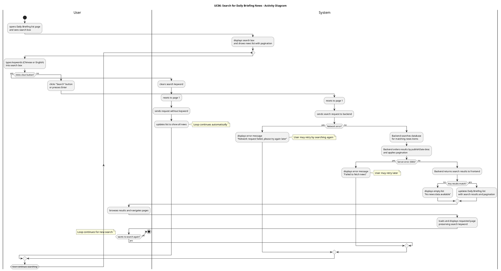
##### 2.3.6.4 Activity Diagram Description

**The Activity Diagram for Search for Daily Briefing News** illustrates the interaction between the **User** and the **System** when the user searches for Daily Briefing items by entering keywords:

- The activity diagram starts when the **User** opens the Daily Briefing list page (UI-01) and sees the search box. The **System** displays the search box with placeholder text "Search by keywords (Chinese/English)..." (zh: "输入关键词搜索（中英文）...") and shows the current news list (unfiltered), with pagination controls when multiple pages exist.
- **User** types keywords (Chinese or English) into the search box, and the **System** updates the search keyword model accordingly.
- The diagram includes a **clear button** action: when the user clicks the clear button in the search box, Element UI's `clearable` feature automatically clears the search keyword from the input field and triggers the `@clear` event, which calls the `handleSearch()` method. The `handleSearch()` method resets the current page to page 1 and calls `fetchDailyBriefing()`. Inside `fetchDailyBriefing()`, the system builds request parameters. Since the keyword is now empty (cleared by Element UI), it is not included in the request parameters. The system then sends a new request to the backend without the keyword parameter, effectively showing all news (or filtered by date range if date filters are active). The system updates the Daily Briefing list to show all news (or date-filtered results).
- When the **User** clicks the **"Search"** button or presses **Enter**, the **System** calls the `handleSearch()` method, which resets the current page to page 1 and calls `fetchDailyBriefing()`. Inside `fetchDailyBriefing()`, the system trims whitespace from the keyword input (if the keyword exists) and builds request parameters. The request includes the following parameters: `page` (0-based page index), `size` (page size), `keyword` (only included if not empty after trimming), `startDate` and `endDate` (if date filters are set), and `lang` (current UI language). The system then sends the search request to the backend API. If a **network timeout or connection error** occurs, the system displays an error message "Network request failed, please try again later" (zh: "网络请求失败，请稍后重试"). The user may retry the operation by clicking the "Search" button again; the system re-sends the request with the same search parameters. If the **authentication token is invalid or expired** (401 Unauthorized), the axios response interceptor in `api.js` detects the 401 error, clears the invalid token from localStorage, dispatches an `auth:unauthorized` custom event, which is handled by `App.vue` to log out the user, displays "登录已过期，请重新登录" / "Login expired, please log in again" message, and redirects the user to the login page, ending the use case.
- On the backend, the system searches the database for Daily Briefing items where the keyword matches any of the searchable fields: `title`, `originalContent`, `summary`, `titleZh`, `titleEn`, `summaryZh`, and `summaryEn` (case-insensitive partial match). If date filters are provided, the backend limits the search to items within the specified date range on `publishDate`. If no date filters are provided, the backend searches across all historical news in the database (no date restriction). The system then orders results from newest to oldest by `publishDate` and applies pagination. If a **database/server error** occurs, the backend encounters an error while querying the database and returns a 500 Internal Server Error. The frontend displays an error message "Failed to fetch news" (zh: "获取新闻失败"), while the backend logs the error details for administrator review. The user may retry by clicking "Search" again after modifying the keyword, or retry later.
- If the query succeeds, the **Backend** returns the search results (with pagination data) to the frontend. **System** receives either an empty result set or a list of matching news items. When no items match the search keyword (and any date filter conditions), the system displays an empty list on the Daily Briefing page and shows a message "No news data available" (zh: "暂无新闻数据"). The search box remains visible and retains the user's entered keyword so that the user can easily modify it and retry. When items are found, the system updates the Daily Briefing list on UI-01 to show only matching items (page reset to 1) and updates pagination controls accordingly.
- **User** can then browse the search results and navigate between pages using pagination controls. The **System** loads and displays the corresponding page of search results while preserving the current search keyword and any date filter conditions. The user may modify the search keyword and click "Search" again (or clear the keyword), which causes the system to repeat the search flow with the new keyword, as shown in the activity diagram's repeat loop.

#### 3.3.7 UCD-07: View Community Feed

##### 2.3.7.1 User Requirement Specification (URS) and System Requirement Specification (SRS)

**URS-07**: The User can browse the community feed with posts ordered from newest to oldest, showing title, preview, tags, like count, and comment count.

**SRS-40**: The system shall provide a Community Feed page (UI-Community-Feed) that lists posts ordered from newest to oldest by creation time.

**SRS-41**: Each post card on UI-Community-Feed shall display: author name/avatar, post title, a short preview, tags, like count, comment count, and publish time (localized by current interface language).

**SRS-42**: The system shall support pagination or infinite scrolling on UI-Community-Feed. In the implemented version, the feed uses **infinite scrolling** with a search box (`PostList.vue`), where scrolling loads additional posts based on the current search keyword (keyword-based matching) and language; there is no separate page number selector in the UI.

##### 2.3.7.2 Use Case Description

| Use Case ID | UC-07 |
|------------|------|
| Use Case Name | View Community Feed |
| Created By | ZhiYi Pan |
| Last Update By | ZhiYi Pan |
| Date Created | 23/01/2026 |
| Last Revision Date | |
| Actors | User |
| Description | User opens the community feed and browses posts ordered from newest to oldest. |
| Trigger | User clicks "Community" entry in navigation. |
| Preconditions | 1. User is logged into the platform. 2. Network connection is available. |

**Post conditions**:
- User is viewing UI-Community-Feed with a list of posts (or an empty-state message).

**Normal Flows**

| User (Actions) | System (Responses) |
|----------------|-------------------|
| 1. User clicks "Community" in navigation. | 2. System opens UI-Community-Feed and requests latest posts (page 1).    • `[E1: Network timeout or connection error]` |
| | 3. Backend returns post list (newest to oldest) with pagination metadata.    • `[A1: No posts data]`    • `[E2: Server error]` |
| 4. User browses posts and changes page/scrolls. | 5. System loads corresponding page and renders post cards. |

**Alternative Flow**

**`[A1: No posts data]`**
- A1.1 Backend returns an empty list.
- A1.2 System displays an empty-state message on UI-Community-Feed.
- A1.3 Use case end.

**Exception Flows**

**`[E1: Network timeout or connection error]`**
- E1.1 Request fails due to network issues.
- E1.2 System displays a localized error message and provides a retry action.
- E1.3 Use case end.

**`[E2: Server error]`**
- E2.1 Backend returns 5xx due to internal error.
- E2.2 System displays an error message and provides a retry action.
- E2.3 Use case end.

##### 2.3.7.3 Activity Diagram

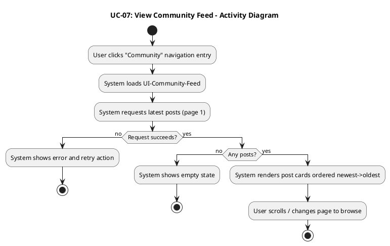

#### 3.3.8 UCD-08: Create Publish Post

##### 2.3.8.1 User Requirement Specification (URS) and System Requirement Specification (SRS)

**URS-08**: The User can create or edit posts in their preferred language (Chinese, English), upload images, select a tag from predefined categories (Study, Housing, Travel, Part-time Job, Life Services), and have the system automatically generate bilingual (Chinese/English) content using Qwen AI for later display.

**SRS-43**: The system shall provide a "Create Post" entry on UI-Community-Feed that opens a post editor (UI-Community-PostEditor). This is implemented as the `NewPostForm.vue` component, which can be opened from the sidebar or community feed.

**SRS-44**: UI-Community-PostEditor shall support entering title/body text, selecting **exactly one** predefined tag from the list (Study, Housing, Travel, Part-time Job, Life Services), and uploading **at most one** image; these are implemented as a single-select tag pill group and a single-image upload with preview in `NewPostForm.vue`.

**SRS-45**: When the user submits a post, the backend shall persist the post, run AI moderation and generate bilingual copies (ZH/EN) via Qwen AI translation, storing both language versions for retrieval. Only posts with status `APPROVED` are returned in the community feed (`PostController.listPosts`).

##### 2.3.8.2 Use Case Description

| Use Case ID | UC-08 |
|------------|------|
| Use Case Name | Create Publish Post |
| Created By | ZhiYi Pan |
| Last Update By | ZhiYi Pan |
| Date Created | 23/01/2026 |
| Last Revision Date | |
| Actors | User |
| Description | User creates a post with text/tags/images and publishes it to the community feed; the system stores bilingual content. |
| Trigger | User clicks "Create Post". |
| Preconditions | 1. User is logged in. 2. Network connection is available. |

**Post conditions**:
- A new post is published and visible in the feed (and/or Post Detail page) in the selected language, with bilingual content stored on backend.

**Normal Flows**

| User (Actions) | System (Responses) |
|----------------|-------------------|
| 1. User opens UI-Community-PostEditor. | 2. System displays editor with title/body/tag/image inputs. |
| 3. User fills title/body, selects tag(s), uploads images. | 4. System updates editor model and shows previews. |
| 5. User clicks "Publish". | 6. System validates required fields and, if validation passes, frontend sends create-post request.    • `[A1: Validation failed]`    • `[E1: Network timeout or connection error]` |
| | 7. Backend saves post and invokes Qwen AI translation to generate ZH/EN fields.    • `[E2: Translation/Server error]` |
| | 8. Backend returns success with created post ID. |
| 9. User views created post. | 10. System navigates to feed or Post Detail and renders the post. |

**Alternative Flow**

**`[A1: Validation failed]`**
- A1.1 System validates required fields (e.g., title/body not empty).
- A1.2 System shows validation errors; user edits and resubmits.

**Exception Flows**

**`[E1: Network timeout or connection error]`**
- E1.1 Create-post request fails due to network issues.
- E1.2 System displays a localized error message and allows retry.
- E1.3 Use case end.

**`[E2: Translation/Server error]`**
- E2.1 Backend returns 5xx due to AI service failure or internal error.
- E2.2 System displays an error message and allows retry.
- E2.3 Use case end.

##### 2.3.8.3 Activity Diagram

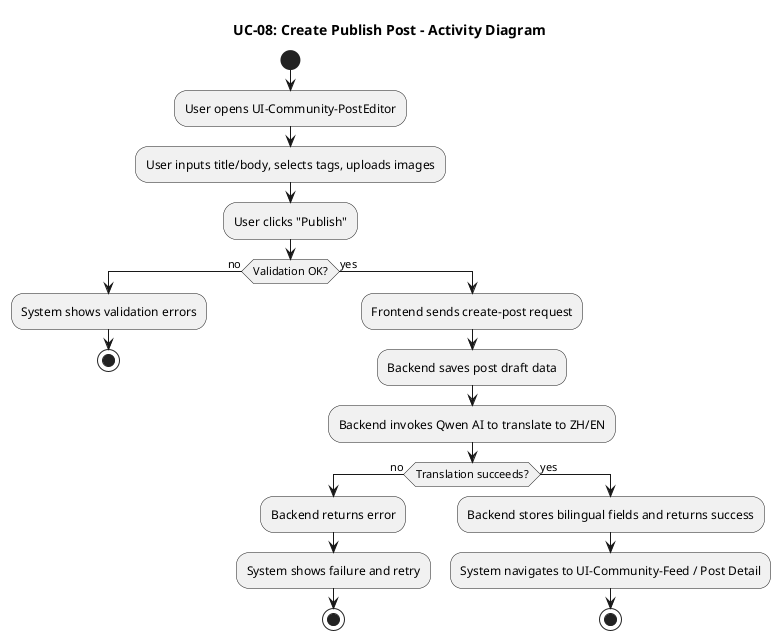

#### 3.3.9 UCD-09: Like Post

##### 2.3.9.1 User Requirement Specification (URS) and System Requirement Specification (SRS)

**URS-09**: The User can like posts to express positive feedback, and the like count updates immediately.

**SRS-52**: The system shall allow a user to like/unlike a post from UI-Community-Feed and UI-Community-PostDetail.

**SRS-53**: The system shall update the like state and like count optimistically in the UI, and reconcile with backend response.

**SRS-54**: The backend shall prevent duplicate likes by the same user for the same post (idempotent like).

##### 2.3.9.2 Use Case Description

| Use Case ID | UC-09 |
|------------|------|
| Use Case Name | Like Post |
| Created By | ZhiYi Pan |
| Last Update By | ZhiYi Pan |
| Date Created | 23/01/2026 |
| Last Revision Date | |
| Actors | User |
| Description | User likes (or unlikes) a post and sees the like count update. |
| Trigger | User clicks the like icon/button on a post. |
| Preconditions | 1. User is logged in. 2. Post is visible in feed or post detail. |

**Post conditions**:
- The post like state is updated for the user, and the like count is updated in UI.

**Normal Flows**

| User (Actions) | System (Responses) |
|----------------|-------------------|
| 1. User clicks Like on a post. | 2. System toggles like state and updates like count optimistically.    • `[A1: Unlike a liked post]` |
| | 3. Frontend sends like/unlike request to backend.    • `[E1: Network timeout or connection error]` |
| | 4. Backend records like/unlike (idempotent) and returns updated counts/state.    • `[E2: Server error]` |
| 5. User continues browsing. | 6. System reconciles UI with backend response. |

**Alternative Flow**

**`[A1: Unlike a liked post]`**
- A1.1 User clicks Like again on an already-liked post.
- A1.2 System toggles to unlike state and sends unlike request.
- A1.3 Backend removes like (or toggles state) and returns updated counts.

**Exception Flows**

**`[E1: Network timeout or connection error]`**
- E1.1 Like/unlike request fails due to network issues.
- E1.2 System rolls back optimistic UI and shows error message.
- E1.3 Use case end.

**`[E2: Server error]`**
- E2.1 Backend returns 5xx.
- E2.2 System rolls back optimistic UI and shows error message.
- E2.3 Use case end.

##### 2.3.9.3 Activity Diagram

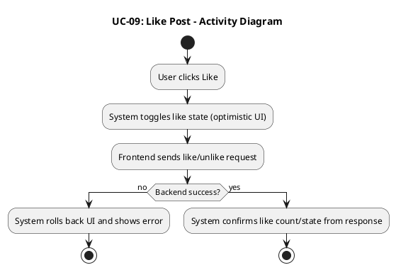

#### 3.3.10 UCD-10: Filter by Tag

##### 2.3.10.1 User Requirement Specification (URS) and System Requirement Specification (SRS)

**URS-10**: The User can filter posts by selecting tags from the predefined list (Study, Housing, Travel, Part-time Job, Life Services).

**SRS-55**: UI-Community-Feed shall provide a tag filter control with the predefined tag list.

**SRS-56**: When a user applies a tag filter, the system shall reload the feed results limited to the selected tag(s), and reset pagination to the first page.

##### 2.3.10.2 Use Case Description

| Use Case ID | UC-10 |
|------------|------|
| Use Case Name | Filter by Tag |
| Created By | ZhiYi Pan |
| Last Update By | ZhiYi Pan |
| Date Created | 23/01/2026 |
| Last Revision Date | |
| Actors | User |
| Description | User filters the community feed by tag(s). |
| Trigger | User selects one or more tags and applies filter. |
| Preconditions | 1. User is on UI-Community-Feed. |

**Post conditions**:
- Feed displays only posts matching selected tag(s) (or an empty-state message).

**Normal Flows**

| User (Actions) | System (Responses) |
|----------------|-------------------|
| 1. User selects tag(s) in tag filter. | 2. System updates selected tag filter state. |
| 3. User applies filter. | 4. System resets page to 1 and requests filtered posts.    • `[E1: Network timeout or connection error]` |
| | 5. Backend returns filtered post list ordered newest->oldest.    • `[A1: No posts match the tag filter]`    • `[E2: Server error]` |
| 6. User browses filtered results. | 7. System renders filtered feed and pagination. |

**Alternative Flow**

**`[A1: No posts match the tag filter]`**
- A1.1 Backend returns an empty list.
- A1.2 System shows empty-state message and keeps tag filter visible.
- A1.3 Use case end.

**Exception Flows**

**`[E1: Network timeout or connection error]`**
- E1.1 Filter request fails due to network issues.
- E1.2 System shows error and retry action; selected tag(s) remain.
- E1.3 Use case end.

**`[E2: Server error]`**
- E2.1 Backend returns 5xx.
- E2.2 System shows error and retry action.
- E2.3 Use case end.

##### 2.3.10.3 Activity Diagram

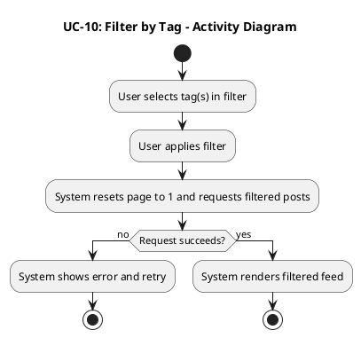

#### 3.3.11 UCD-11: View Post Details

##### 2.3.11.1 User Requirement Specification (URS) and System Requirement Specification (SRS)

**URS-11**: The User can view post details including full text, images, tags, engagement metrics (likes, comments), and author profile when clicking on a post, with content displayed in the current interface language using the stored bilingual fields.

**SRS-57**: When a user clicks a post card on UI-Community-Feed, the system shall navigate to UI-Community-PostDetail for that post ID.

**SRS-58**: UI-Community-PostDetail shall display post content in the current interface language, loading the corresponding bilingual field (ZH/EN).

**SRS-59**: UI-Community-PostDetail shall display: full body text, images, tags, like count, comment count, and author profile entry.

##### 2.3.11.2 Use Case Description

| Use Case ID | UC-11 |
|------------|------|
| Use Case Name | View Post Details |
| Created By | ZhiYi Pan |
| Last Update By | ZhiYi Pan |
| Date Created | 23/01/2026 |
| Last Revision Date | |
| Actors | User |
| Description | User opens a post detail page and reads the post and its comments in selected language. |
| Trigger | User clicks a post card from feed/search results. |
| Preconditions | 1. User is logged in. 2. Post exists and is accessible. |

**Post conditions**:
- User is viewing UI-Community-PostDetail with post content and comment list displayed in current interface language.

**Normal Flows**

| User (Actions) | System (Responses) |
|----------------|-------------------|
| 1. User clicks a post card. | 2. System navigates to UI-Community-PostDetail and requests post details + comments.    • `[E1: Network timeout or connection error]` |
| | 3. Backend returns post data (ZH/EN fields), images/tags/metrics, and comment list.    • `[A1: Post has no comments]`    • `[E2: Post not found / access denied]` |
| 4. User reads post and scrolls comments. | 5. System renders post body in selected language and displays comments/metrics. |

**Alternative Flow**

**`[A1: Post has no comments]`**
- A1.1 Backend returns empty comment list.
- A1.2 System displays "No comments yet" empty state in comments section.
- A1.3 Use case end.

**Exception Flows**

**`[E1: Network timeout or connection error]`**
- E1.1 Request fails due to network issues.
- E1.2 System shows error and retry action.
- E1.3 Use case end.

**`[E2: Post not found / access denied]`**
- E2.1 Backend returns 404 (not found) or 403 (forbidden).
- E2.2 System shows a user-friendly message and navigates back to feed.
- E2.3 Use case end.

##### 2.3.11.3 Activity Diagram

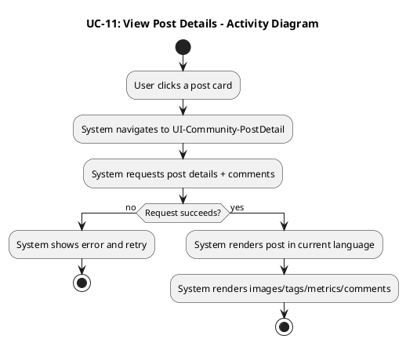

#### 3.3.12 UCD-12: Report Post/Comment

##### 2.3.12.1 User Requirement Specification (URS) and System Requirement Specification (SRS)

**URS-12**: The User can report posts/comments with structured reasons (Spam, Fraud or Scam, Illegal Service Promotion, Abusive Language, Other) and provide explanatory text.

**SRS-60**: The system shall provide a "Report" action for posts and comments on UI-Community-Feed and UI-Community-PostDetail.

**SRS-61**: The system shall show a report dialog that requires selecting a reason and optionally entering additional description text.

**SRS-62**: The backend shall store the report record with reporter ID, target type (post/comment), target ID, reason, description, and timestamp.

##### 2.3.12.2 Use Case Description

| Use Case ID | UC-12 |
|------------|------|
| Use Case Name | Report Post/Comment |
| Created By | ZhiYi Pan |
| Last Update By | ZhiYi Pan |
| Date Created | 23/01/2026 |
| Last Revision Date | |
| Actors | User |
| Description | User reports inappropriate content with a structured reason and optional description. |
| Trigger | User clicks "Report" on a post or comment. |
| Preconditions | 1. User is logged in. 2. Target post/comment is visible. |

**Use Case Input Specification**

| Input | type | Constraint | Example |
|-------|------|------------|---------|
| Target Type | String | Must be "post" or "comment" | "comment" |
| Target ID | String/Number | Must be a valid ID | "321" |
| Reason | String | Must be one of predefined reasons | "Spam" |
| Description (optional) | String | Max length (implementation-defined) | "Repeated ads" |

**Post conditions**:
- A report record is created, and user sees confirmation feedback.

**Normal Flows**

| User (Actions) | System (Responses) |
|----------------|-------------------|
| 1. User clicks "Report" on a post/comment. | 2. System opens report dialog.    • `[A1: User cancels reporting]` |
| 3. User selects a reason and enters optional description. | 4. System validates inputs.    • `[E1: Validation failed]` |
| 5. User submits report. | 6. Frontend sends report request to backend.    • `[E2: Network/server error]` |
| | 7. Backend stores report record and returns success. |
| 8. User sees confirmation. | 9. System shows "Report submitted" message and closes dialog. |

**Alternative Flow**

**`[A1: User cancels reporting]`**
- A1.1 User closes the report dialog without submitting.
- A1.2 System discards input and returns to previous view.
- A1.3 Use case end.

**Exception Flows**

**`[E1: Validation failed]`**
- E1.1 Reason is not selected (or required fields missing).
- E1.2 System shows validation提示 and prevents submit.
- E1.3 Use case end.

**`[E2: Network/server error]`**
- E2.1 Request fails due to network issues or backend returns 5xx.
- E2.2 System shows error message and allows retry.
- E2.3 Use case end.

##### 2.3.12.3 Activity Diagram

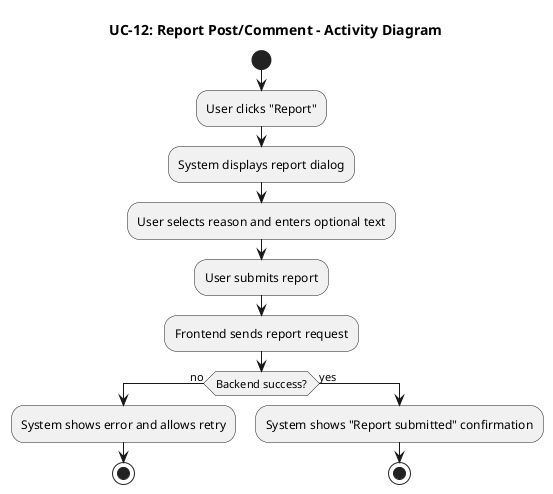

#### 3.3.13 UCD-13: Post Comment

##### 2.3.13.1 User Requirement Specification (URS) and System Requirement Specification (SRS)

**URS-13**: The User can post comments to interact with other users, which will be automatically translated by the system into Chinese and English; users can delete their own comments.

**SRS-63**: UI-Community-PostDetail shall provide a comment input box for logged-in users to post a comment.

**SRS-64**: When a comment is submitted, the backend shall store the comment and generate bilingual copies (ZH/EN) via Qwen AI translation.

**SRS-65**: The system shall allow the comment author to delete their own comment; deleting shall remove it from display and update comment count.

##### 2.3.13.2 Use Case Description

| Use Case ID | UC-13 |
|------------|------|
| Use Case Name | Post Comment |
| Created By | ZhiYi Pan |
| Last Update By | ZhiYi Pan |
| Date Created | 23/01/2026 |
| Last Revision Date | |
| Actors | User |
| Description | User posts a comment under a post; the system translates and displays it. |
| Trigger | User submits comment on Post Detail page. |
| Preconditions | 1. User is logged in. 2. Post Detail page is loaded. |

**Post conditions**:
- A new comment is displayed under the post in current interface language, and backend stores bilingual comment content.

**Normal Flows**

| User (Actions) | System (Responses) |
|----------------|-------------------|
| 1. User enters comment text. | 2. System updates comment input model. |
| 3. User clicks "Submit". | 4. System validates the comment and, if valid, frontend sends create-comment request.    • `[A1: Comment is empty]`    • `[E1: Network timeout or connection error]` |
| | 5. Backend stores comment and invokes Qwen AI translation to generate ZH/EN fields.    • `[E2: Translation/Server error]` |
| | 6. Backend returns success with new comment. |
| 7. User views the new comment. | 8. System appends comment to list and updates comment count. |

**Alternative Flow**

**`[A1: Comment is empty]`**
- A1.1 User submits without entering text.
- A1.2 System shows validation message and does not send request.
- A1.3 Use case end.

**Exception Flows**

**`[E1: Network timeout or connection error]`**
- E1.1 Create-comment request fails due to network issues.
- E1.2 System shows error message and allows retry.
- E1.3 Use case end.

**`[E2: Translation/Server error]`**
- E2.1 Backend returns 5xx due to AI service failure or internal error.
- E2.2 System shows error message and allows retry.
- E2.3 Use case end.

##### 2.3.13.3 Activity Diagram

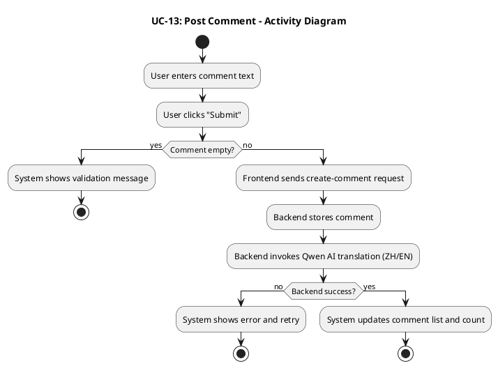

#### 3.3.14 UCD-14: Search Posts

##### 2.3.14.1 User Requirement Specification (URS) and System Requirement Specification (SRS)

**URS-14**: The User can search posts by keyword across bilingual content (titles and body texts in both Chinese and English), and view posts ordered by relevance score (highest match score first) in the search results.

**SRS-66**: UI-Community-Feed shall provide a search box for post search. In the implemented version (`PostList.vue`), the search box sends the query as `q` to the `/api/posts` endpoint when the user presses Enter or clicks the search button.

**SRS-67**: When a keyword is provided, the backend shall perform **keyword-based matching** using `SemanticService.calculateScore()` on the bilingual post fields (title and body in Chinese and English). The service uses tokenization, synonym expansion, and match score calculation. Posts with a positive match score (> 0) are returned, **ordered by descending match score** (highest relevance first), not by creation time.

**SRS-68**: When no keyword is provided, the backend shall return posts ordered from newest to oldest by creation time, filtered to only `APPROVED` posts and excluding system-generated news posts; the frontend shall display a user-friendly empty-state when no results match the search keyword or when there are no posts.

##### 2.3.14.2 Use Case Description

| Use Case ID | UC-14 |
|------------|------|
| Use Case Name | Search Posts |
| Created By | ZhiYi Pan |
| Last Update By | ZhiYi Pan |
| Date Created | 23/01/2026 |
| Last Revision Date | |
| Actors | User |
| Description | User searches posts by keyword across bilingual content. |
| Trigger | User submits keyword in search box. |
| Preconditions | 1. User is on UI-Community-Feed. |

**Use Case Input Specification**

| Input | type | Constraint | Example |
|-------|------|------------|---------|
| Keyword | String | Not empty after trimming | "housing" |
| Selected Tag(s) (optional) | String[] | Must be predefined tags | ["Housing"] |

**Post conditions**:
- Feed shows search result posts ordered by relevance score (highest match score first, or empty-state).

**Normal Flows**

| User (Actions) | System (Responses) |
|----------------|-------------------|
| 1. User enters keyword and triggers search (Enter/Search). | 2. System trims keyword, resets page to 1, and requests search results (keyword + tag filter).    • `[E1: Network timeout or connection error]` |
| | 3. Backend performs keyword-based matching using SemanticService on bilingual titles/bodies and returns results ordered by descending match score (highest relevance first).    • `[A1: No results]`    • `[E2: Server error]` |
| 4. User browses results. | 5. System renders results list and pagination; keyword remains in search box. |

**Alternative Flow**

**`[A1: No results]`**
- A1.1 Backend returns empty list.
- A1.2 System shows empty-state message and keeps search box visible.
- A1.3 Use case end.

**Exception Flows**

**`[E1: Network timeout or connection error]`**
- E1.1 Search request fails due to network issues.
- E1.2 System shows error and retry action; keyword remains.
- E1.3 Use case end.

**`[E2: Server error]`**
- E2.1 Backend returns 5xx.
- E2.2 System shows error and retry action.
- E2.3 Use case end.

##### 2.3.14.3 Activity Diagram

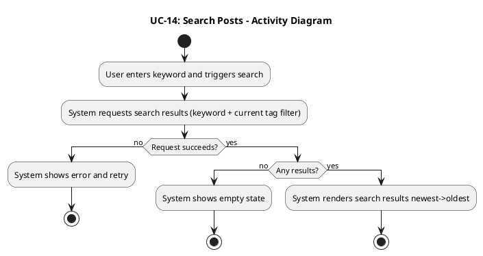

#### 3.3.15 UCD-15: Communicate with others

##### 2.3.15.1 User Requirement Specification (URS) and System Requirement Specification (SRS)

**URS-15**: Users who follow each other mutually can send and receive private messages, view message history, and (when allowed) send an initial invite message even before mutual follow is established.

**SRS-69**: The system shall allow mutually-following users to start a private chat from a user profile or mutual-follow list. In the implemented version (`UserProfile.vue`, `MutualFollowList.vue`, `ChatWindow.vue`), opening a chat loads history via `/api/messages/conversations/{conversationId}` and shows whether the relationship is mutual follow (`isMutualFollow`) and whether the user can send more messages (`canSendMore`).

**SRS-70**: The system shall display message history ordered by time and allow sending new messages in the current interface language. When the users are not mutually following, the backend (`MessageController`) enforces a **single-message limit** per conversation, returning an error with code `"SINGLE_MESSAGE_LIMIT"` and setting `canSendMore = false` once the limit is reached; the frontend disables further sending accordingly.

**SRS-71**: The backend shall persist messages with sender/receiver IDs, content, timestamps, and status flags (read/unread); marking as read is supported at both single-message and per-conversation level (`/api/messages/{messageId}/read`, `/api/messages/conversations/{conversationId}/read`), and the frontend updates read indicators (✓✓) in `ChatWindow.vue`.

##### 2.3.15.2 Use Case Description

| Use Case ID | UC-15 |
|------------|------|
| Use Case Name | Communicate with others |
| Created By | ZhiYi Pan |
| Last Update By | ZhiYi Pan |
| Date Created | 23/01/2026 |
| Last Revision Date | |
| Actors | User |
| Description | Mutually-following users start a chat, view history, and send messages. |
| Trigger | User opens a chat with another user. |
| Preconditions | 1. Users are mutually following. 2. User is logged in. |

**Use Case Input Specification**

| Input | type | Constraint | Example |
|-------|------|------------|---------|
| Peer User ID | String/Number | Must be a valid user ID and mutually following | "88" |
| Message Content | String | Not empty after trimming | "Hi!" |

**Post conditions**:
- User can view message history and newly sent messages appear in the conversation.

**Normal Flows**

| User (Actions) | System (Responses) |
|----------------|-------------------|
| 1. User opens a chat with a mutually-following user. | 2. System loads chat UI and requests message history.    • `[E1: Not mutually following]`    • `[E2: Network/server error]` |
| | 3. Backend returns ordered message history.    • `[A1: No message history]` |
| 4. User types a message and clicks send. | 5. Frontend sends message to backend.    • `[E1: Not mutually following]`    • `[E2: Network/server error]` |
| | 6. Backend persists message and returns success. |
| 7. User sees message delivered. | 8. System appends the message to chat view. |

**Alternative Flow**

**`[A1: No message history]`**
- A1.1 Backend returns empty history for a new conversation.
- A1.2 System displays empty chat state.
- A1.3 Use case continues (user can still send new messages).

**Exception Flows**

**`[E1: Not mutually following]`**
- E1.1 Backend rejects the chat open/send request (403).
- E1.2 System shows a user-friendly message and prevents sending.
- E1.3 Use case end.

**`[E2: Network/server error]`**
- E2.1 Load/send request fails due to network issues or backend returns 5xx.
- E2.2 System shows error message and allows retry.
- E2.3 Use case end.

##### 2.3.15.3 Activity Diagram

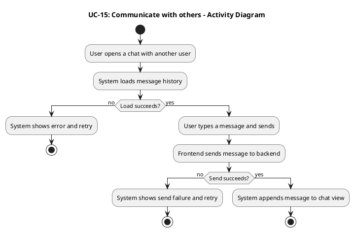

#### 3.3.16 UCD-16: Manage Message Status

##### 2.3.16.1 User Requirement Specification (URS) and System Requirement Specification (SRS)

**URS-16**: Users can manage message status (read/unread/delete).

**SRS-72**: The system shall allow a user to mark messages as read when opening a conversation, and show read/unread indicators in the conversation list.

**SRS-73**: The system shall allow a user to delete a message (soft-delete per user) without deleting it for the other participant.

##### 2.3.16.2 Use Case Description

| Use Case ID | UC-16 |
|------------|------|
| Use Case Name | Manage Message Status |
| Created By | ZhiYi Pan |
| Last Update By | ZhiYi Pan |
| Date Created | 23/01/2026 |
| Last Revision Date | |
| Actors | User |
| Description | User marks messages as read and deletes messages for themselves. |
| Trigger | User opens a conversation or uses delete action on a message. |
| Preconditions | 1. User is logged in. 2. Conversation exists. |

**Post conditions**:
- Messages are marked read when appropriate; deleted messages are removed from the user's view; unread indicators update accordingly.

**Normal Flows**

| User (Actions) | System (Responses) |
|----------------|-------------------|
| 1. User opens a conversation. | 2. System marks incoming messages as read and updates unread indicators. |
| 3. User clicks delete on a message. | 4. System asks for confirmation (optional) and, if confirmed, sends delete request.    • `[A1: User cancels delete]` |
| | 5. Backend soft-deletes the message for the user and returns success.    • `[E1: Network/server error]` |
| 6. User continues chatting. | 7. System removes deleted message from view and refreshes status badges. |

**Alternative Flow**

**`[A1: User cancels delete]`**
- A1.1 User cancels delete confirmation.
- A1.2 System keeps the message visible and does not send request.
- A1.3 Use case end.

**Exception Flows**

**`[E1: Network/server error]`**
- E1.1 Delete/status update request fails due to network issues or backend returns 5xx.
- E1.2 System shows error message and keeps UI unchanged.
- E1.3 Use case end.

##### 2.3.16.3 Activity Diagram

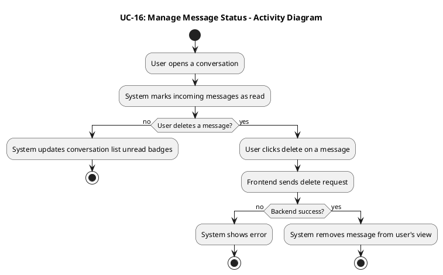

#### 3.3.17 UCD-17: View and Manage the mutual follow list

##### 2.3.17.1 User Requirement Specification (URS) and System Requirement Specification (SRS)

**URS-17**: The User can manage mutual follow relationships: search for users, view profiles, follow/unfollow users, and view mutual follow lists.

**SRS-74**: The system shall provide a Mutual Follow list page (UI-Community-MutualFollow) showing users who mutually follow the current user. In the implemented version (`MutualFollowList.vue`), this list is loaded from `/api/users/mutual-follows` and can be filtered by a search keyword (`q`), with an empty-state when there are no mutual follows.

**SRS-75**: The system shall support follow/unfollow actions from user profile and update mutual-follow status accordingly. The implemented mutual follow list supports **unfollow** via `DELETE /api/users/{userId}/follow`, and provides a "Send Message" action to open a chat; follow operations are primarily triggered from `UserProfile.vue` using `/api/posts/users/{userId}/follow`.

##### 2.3.17.2 Use Case Description

| Use Case ID | UC-17 |
|------------|------|
| Use Case Name | View and Manage the mutual follow list |
| Created By | ZhiYi Pan |
| Last Update By | ZhiYi Pan |
| Date Created | 23/01/2026 |
| Last Revision Date | |
| Actors | User |
| Description | User views mutual follow list, navigates profiles, and performs follow/unfollow actions. |
| Trigger | User opens mutual follow list page. |
| Preconditions | 1. User is logged in. |

**Post conditions**:
- Mutual follow list is displayed; follow/unfollow actions update relationship status in UI.

**Normal Flows**

| User (Actions) | System (Responses) |
|----------------|-------------------|
| 1. User opens UI-Community-MutualFollow. | 2. System requests mutual follow list from backend.    • `[E1: Network timeout or connection error]`    • `[E2: Server error]` |
| | 3. Backend returns mutual follow user list.    • `[A1: No mutual follows]` |
| 4. User selects a user to view profile. | 5. System navigates to user profile page. |
| 6. User clicks follow/unfollow. | 7. System sends follow/unfollow request and updates UI on success.    • `[E1: Network timeout or connection error]`    • `[E2: Server error]` |

**Alternative Flow**

**`[A1: No mutual follows]`**
- A1.1 Backend returns empty list.
- A1.2 System shows empty-state message on UI-Community-MutualFollow.
- A1.3 Use case end.

**Exception Flows**

**`[E1: Network timeout or connection error]`**
- E1.1 List/follow request fails due to network issues.
- E1.2 System shows error and retry action.
- E1.3 Use case end.

**`[E2: Server error]`**
- E2.1 Backend returns 5xx.
- E2.2 System shows error and retry action.
- E2.3 Use case end.

##### 2.3.17.3 Activity Diagram

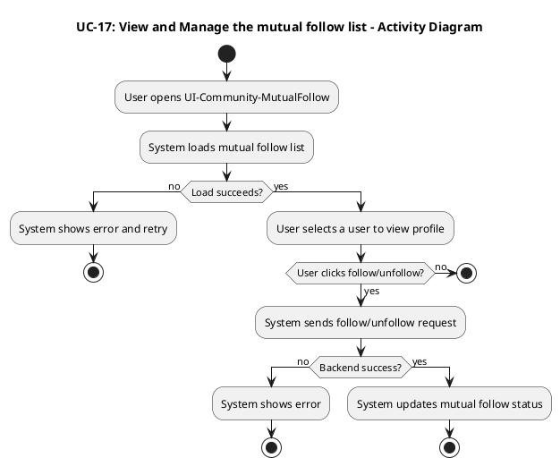

#### 3.3.18 UCD-18: AI Summary Comment

##### 2.3.18.1 User Requirement Specification (URS) and System Requirement Specification (SRS)

**URS-18**: The User can view AI-generated summaries of all comments under a post in their chosen language.

**SRS-46**: The system shall provide an entry point on the Post Detail page (UI-Community-PostDetail) to request/view an AI-generated comment summary (e.g., a "Summarize Comments" button).

**SRS-47**: When the user triggers comment summarization, the system shall send a request to the backend comment summary API for the current post, including the current interface language (`lang`).

**SRS-48**: The backend shall generate (or retrieve cached) AI summary text for the post's comments using Qwen AI and return the summary in the requested language.

**SRS-49**: The system shall display the returned summary text in the Post Detail page, and clearly indicate it is AI-generated content.

**SRS-50**: If there are no comments under the post, the system shall disable the summarization action or show a user-friendly message indicating there is nothing to summarize.

**SRS-51**: If the summarization request fails (network/server/timeout), the system shall display a localized error message and allow the user to retry.

##### 2.3.18.2 Use Case Description

| Use Case ID | UC-18 |
|------------|------|
| Use Case Name | AI Summary Comment |
| Created By | ZhiYi Pan |
| Last Update By | ZhiYi Pan |
| Date Created | 23/01/2026 |
| Last Revision Date | |
| Actors | User |
| Description | User requests an AI-generated summary of all comments under a post and views the summary in their current interface language. |
| Trigger | User clicks the "Summarize Comments" action on the Post Detail page. |
| Preconditions | 1. User is viewing a Post Detail page. 2. Post data is loaded successfully. 3. There is at least one comment under the post (otherwise see Alternative Flow [A1]). 4. User has an active internet connection. |

**Use Case Input Specification**

| Input | type | Constraint | Example |
|-------|------|------------|---------|
| Post ID | String/Number | Must be a valid post ID | "123" |
| Current Interface Language | String | Must be "zh" (Chinese) or "en" (English) | "zh" |

**Post conditions**:
- A comment summary is displayed on the Post Detail page in the user's selected language.

**Normal Flows**

| User (Actions) | System (Responses) |
|----------------|-------------------|
| 1. User opens the Post Detail page and scrolls to the comments section. | 2. System shows the comment list and a "Summarize Comments" action.    • `[A1: No comments to summarize]` |
| 3. User clicks "Summarize Comments". | 4. Frontend sends HTTP request to backend comment summary API with Post ID and `lang`.    • `[E1: Network timeout or connection error]` |
| | 5. Backend collects comments of the post and invokes Qwen AI summarization (or returns cached summary).    • `[E2: Server error]` |
| | 6. Backend returns 200 OK with summary text. |
| 7. User views the summary. | 8. Frontend renders the summary in the UI and marks it as AI-generated. |

**Alternative Flow**

**`[A1: No comments to summarize]`**
- A1.1 System detects comment count is 0.
- A1.2 System disables the "Summarize Comments" action or shows message "No comments to summarize" (zh: "暂无评论可总结").
- A1.3 Use case end.

**Exception Flows**

**`[E1: Network timeout or connection error]`**
- E1.1 Request times out or fails due to network issues.
- E1.2 Frontend displays a localized error message and provides a retry action.
- E1.3 Use case end.

**`[E2: Server error]`**
- E2.1 Backend returns 5xx error due to AI service failure or internal error.
- E2.2 Frontend displays an error message and provides a retry action.
- E2.3 Use case end.

##### 2.3.18.3 Activity Diagram

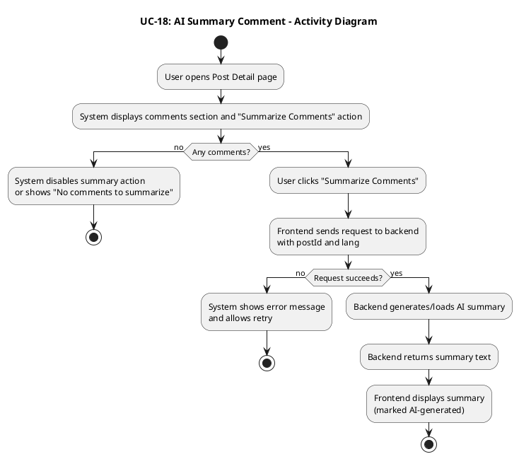

